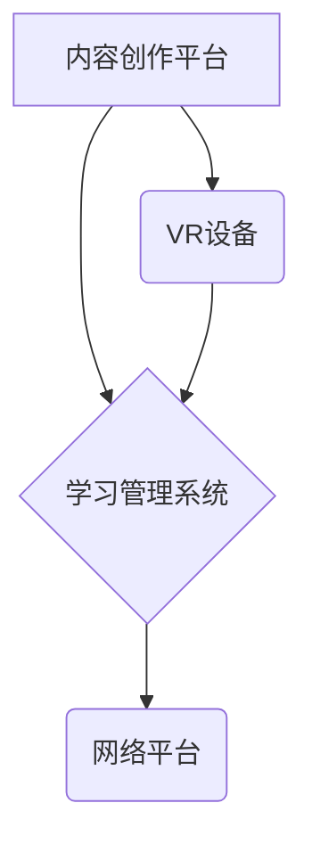

                 

## 虚拟现实教育创业：沉浸式学习体验

> 关键词：虚拟现实、教育科技、沉浸式学习、交互式体验、游戏化学习、元宇宙教育

## 1. 背景介绍

教育领域正在经历一场前所未有的变革，科技的进步为学习方式带来了新的可能性。虚拟现实（VR）技术作为一项颠覆性的创新，正在逐渐改变着教育的形态。VR技术能够创造出逼真的虚拟环境，让用户身临其境地体验不同的场景和内容，为学习者提供更加沉浸式、交互式和个性化的学习体验。

传统的教育模式往往局限于课堂教学和静态的学习材料，难以激发学生的学习兴趣和参与度。而VR技术则能够打破这些局限，通过模拟真实场景、提供互动游戏化体验，激发学生的学习热情，提升学习效率。

## 2. 核心概念与联系

### 2.1 虚拟现实（VR）

虚拟现实是指利用计算机技术模拟真实环境或虚构环境，并通过头戴式显示器、手柄等设备，让用户沉浸其中，体验身临其境的感觉。VR技术主要包含以下几个核心概念：

* **3D图形渲染:** 创建逼真的虚拟环境和物体。
* **头戴式显示器:** 提供立体视觉效果，让用户沉浸在虚拟世界中。
* **传感器追踪:** 跟踪用户的动作和位置，实现虚拟环境的交互。
* **音频反馈:** 提供逼真的声音效果，增强用户的沉浸感。

### 2.2 沉浸式学习

沉浸式学习是指通过创造逼真的虚拟环境，让学习者身临其境地体验学习内容，从而提高学习兴趣、参与度和记忆效果。沉浸式学习的核心在于：

* **身临其境:** 通过VR技术，让学习者仿佛置身于虚拟环境中，体验真实感。
* **互动性:** 学习者可以与虚拟环境和内容进行交互，主动参与学习过程。
* **个性化:** 沉浸式学习可以根据学习者的个体差异，提供定制化的学习内容和体验。

### 2.3  VR教育架构

VR教育的架构通常包含以下几个主要部分：

* **内容创作平台:** 用于创建VR学习内容，包括3D模型、场景设计、交互逻辑等。
* **VR设备:** 包括头戴式显示器、手柄、传感器等，用于呈现虚拟环境和实现用户交互。
* **学习管理系统:** 用于管理学习者账号、学习进度、成绩等，并提供学习分析和评估功能。
* **网络平台:** 用于连接VR设备、学习内容和学习管理系统，实现内容的共享和传播。



## 3. 核心算法原理 & 具体操作步骤

### 3.1 算法原理概述

VR教育的核心算法主要涉及以下几个方面：

* **3D图形渲染算法:** 用于生成逼真的虚拟环境和物体，常见的算法包括OpenGL、DirectX等。
* **传感器追踪算法:** 用于跟踪用户的动作和位置，常见的算法包括惯性测量单元（IMU）、磁力传感器、摄像头追踪等。
* **交互算法:** 用于实现用户与虚拟环境的交互，常见的算法包括手势识别、语音识别、按钮控制等。

### 3.2 算法步骤详解

以3D图形渲染算法为例，其具体操作步骤如下：

1. **建模:** 使用3D建模软件创建虚拟环境和物体模型。
2. **纹理贴图:** 为模型添加纹理贴图，使其更加逼真。
3. **光照计算:** 计算模型在虚拟环境中的光照效果，使其更加真实。
4. **场景构建:** 将模型、纹理贴图和光照效果组合在一起，构建完整的虚拟场景。
5. **渲染:** 将虚拟场景渲染到头戴式显示器上，呈现给用户。

### 3.3 算法优缺点

**优点:**

* 能够创建逼真的虚拟环境，提供身临其境的学习体验。
* 能够实现用户与虚拟环境的交互，提高学习参与度。
* 能够根据学习者的个体差异，提供个性化的学习内容和体验。

**缺点:**

* 硬件成本较高，普及率相对较低。
* 内容创作成本较高，需要专业人员进行设计和制作。
* 存在晕动症等潜在风险。

### 3.4 算法应用领域

VR教育算法广泛应用于以下领域：

* **科学教育:** 模拟实验室环境，让学生进行虚拟实验。
* **历史教育:** 重现历史场景，让学生身临其境地体验历史事件。
* **艺术教育:** 提供虚拟创作工具，让学生进行虚拟艺术创作。
* **职业技能培训:** 模拟真实工作环境，让学生进行虚拟技能培训。

## 4. 数学模型和公式 & 详细讲解 & 举例说明

### 4.1 数学模型构建

VR教育中，数学模型主要用于描述虚拟环境的物理特性、用户交互行为以及学习效果评估等方面。

* **虚拟环境建模:** 使用三维几何模型和物理引擎，描述虚拟环境的形状、材质、光照等属性。
* **用户交互建模:** 使用状态机、行为树等模型，描述用户与虚拟环境的交互行为，例如手势识别、语音识别等。
* **学习效果评估模型:** 使用统计学模型和机器学习算法，评估学习者的学习效果，例如知识掌握度、技能熟练度等。

### 4.2 公式推导过程

以虚拟环境建模为例，常用的数学模型包括：

* **向量空间模型:** 用于描述虚拟环境中的物体位置、方向和运动轨迹。
* **矩阵变换模型:** 用于实现物体在虚拟环境中的旋转、缩放、平移等操作。
* **光线追踪模型:** 用于计算光线在虚拟环境中的传播路径，实现逼真的光照效果。

这些模型的公式推导过程涉及线性代数、微积分、几何学等数学知识。

### 4.3 案例分析与讲解

例如，在模拟虚拟实验室场景中，可以使用向量空间模型描述实验仪器的位置和方向，使用矩阵变换模型实现实验仪器的操作，使用光线追踪模型实现实验仪器的光照效果。

## 5. 项目实践：代码实例和详细解释说明

### 5.1 开发环境搭建

VR教育项目的开发环境通常包含以下软件：

* **Unity3D:** 一款流行的跨平台游戏引擎，支持VR开发。
* **Unreal Engine:** 另一款强大的游戏引擎，也支持VR开发。
* **Blender:** 一款开源的3D建模软件，用于创建虚拟环境和物体模型。
* **Visual Studio:** 一款常用的C#集成开发环境，用于开发Unity3D项目。

### 5.2 源代码详细实现

以下是一个简单的Unity3D VR教育项目代码示例，用于展示虚拟球体的交互：

```csharp
using UnityEngine;
using UnityEngine.VR;

public class VRInteraction : MonoBehaviour
{
    public GameObject sphere;

    void Update()
    {
        // 获取用户的控制器位置
        Vector3 controllerPosition = InputTracking.GetLocalPosition(VRNode.RightHand);

        // 将控制器位置转换为世界坐标
        Vector3 worldPosition = Camera.main.transform.position + Camera.main.transform.rotation * controllerPosition;

        // 将球体移动到控制器位置
        sphere.transform.position = worldPosition;
    }
}
```

### 5.3 代码解读与分析

这段代码实现了用户使用右手控制器控制虚拟球体的移动。

* `InputTracking.GetLocalPosition(VRNode.RightHand)`获取用户的右手控制器在虚拟空间中的位置。
* `Camera.main.transform.position + Camera.main.transform.rotation * controllerPosition`将控制器位置转换为世界坐标，以便与球体进行交互。
* `sphere.transform.position = worldPosition`将球体的坐标设置为控制器位置，实现球体的移动。

### 5.4 运行结果展示

运行这段代码后，用户可以使用右手控制器控制虚拟球体的移动，体验简单的VR交互。

## 6. 实际应用场景

VR教育技术已经开始在各个教育领域得到应用，例如：

* **医疗教育:** 虚拟解剖学、手术模拟、疾病模拟等。
* **工程教育:** 建筑设计、机械设计、电路设计等。
* **艺术教育:** 绘画、雕塑、音乐创作等。
* **语言学习:** 沉浸式语言环境、虚拟角色对话等。

### 6.4 未来应用展望

未来，VR教育技术将更加成熟和普及，应用场景也将更加广泛。例如：

* **元宇宙教育:** 将VR教育融入到元宇宙环境中，提供更加沉浸式和交互式的学习体验。
* **个性化学习:** 利用AI技术，根据学生的学习进度和需求，提供个性化的学习内容和体验。
* **跨文化交流:** 利用VR技术，实现不同文化背景的学生之间的虚拟交流和合作。

## 7. 工具和资源推荐

### 7.1 学习资源推荐

* **Unity Learn:** Unity官方的学习平台，提供丰富的VR开发教程。
* **Unreal Engine Learning:** Unreal Engine官方的学习平台，提供VR开发教程和示例项目。
* **VR/AR Association:** VR/AR行业协会，提供行业资讯、资源和社区支持。

### 7.2 开发工具推荐

* **Unity3D:** 一款流行的跨平台游戏引擎，支持VR开发。
* **Unreal Engine:** 另一款强大的游戏引擎，也支持VR开发。
* **Blender:** 一款开源的3D建模软件，用于创建虚拟环境和物体模型。

### 7.3 相关论文推荐

* **Immersive Virtual Reality for Education: A Systematic Review**
* **The Impact of Virtual Reality on Learning and Education**
* **A Framework for Designing Effective VR Learning Experiences**

## 8. 总结：未来发展趋势与挑战

### 8.1 研究成果总结

VR教育技术已经取得了显著的进展，能够为学习者提供更加沉浸式、交互式和个性化的学习体验。

### 8.2 未来发展趋势

未来，VR教育技术将朝着以下方向发展：

* **更加逼真的虚拟环境:** 利用更先进的渲染技术和传感器追踪技术，创造更加逼真的虚拟环境。
* **更加智能的交互体验:** 利用AI技术，实现更加智能的交互体验，例如个性化学习路径、虚拟角色陪伴等。
* **更加广泛的应用场景:** 将VR教育技术应用到更多教育领域，例如职业技能培训、远程教育等。

### 8.3 面临的挑战

VR教育技术也面临着一些挑战：

* **硬件成本:** VR设备的成本仍然较高，普及率相对较低。
* **内容创作成本:** 创建高质量的VR学习内容需要专业人员和技术支持，成本较高。
* **伦理问题:** VR教育技术可能带来一些伦理问题，例如虚拟现实中的欺骗、虚拟角色的道德规范等。

### 8.4 研究展望

未来，需要进一步研究VR教育技术的应用效果、伦理问题以及社会影响，推动VR教育技术更加健康、可持续地发展。

## 9. 附录：常见问题与解答

* **VR设备需要哪些配置？**

VR设备的配置要求根据不同的设备和应用场景而有所不同。一般来说，需要配备高性能的CPU、GPU、内存和显示器。

* **如何创建VR学习内容？**

创建VR学习内容需要使用专业的3D建模软件、游戏引擎和交互设计工具。

* **VR教育技术有哪些潜在风险？**

VR教育技术存在一些潜在风险，例如晕动症、视觉疲劳、心理依赖等。

* **VR教育技术如何保障学习者的隐私安全？**

VR教育平台需要采取相应的技术措施和政策措施，保障学习者的隐私安全。


作者：禅与计算机程序设计艺术 / Zen and the Art of Computer Programming 
<end_of_turn>

