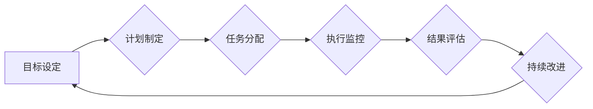

                 

## 行动体系对管理执行力的影响

> 关键词：行动体系、管理执行力、流程优化、决策效率、团队协作、自动化、数据驱动、敏捷开发、持续改进

## 1. 背景介绍

在当今瞬息万变的商业环境中，管理执行力已成为企业竞争力的关键因素。高效的执行力意味着能够将战略目标转化为实际成果，快速响应市场变化，并持续保持领先优势。然而，许多企业在执行力方面面临着诸多挑战，例如决策效率低下、沟通不畅、流程冗长、资源配置不合理等。

行动体系作为一种管理方法，旨在通过构建清晰的流程、明确的角色职责和有效的沟通机制，提升团队的协作效率和执行力。它强调以行动为导向，通过不断迭代和优化，实现持续改进的目标。

## 2. 核心概念与联系

### 2.1 行动体系的概念

行动体系是指企业为了实现战略目标而建立的一套完整的行动流程，包括目标设定、计划制定、任务分配、执行监控、结果评估等环节。它是一个以行动为中心的管理框架，旨在将战略目标分解成具体的行动步骤，并通过有效的执行机制确保目标的实现。

### 2.2 行动体系与管理执行力的关系

行动体系是提升管理执行力的关键基础。它通过以下方式影响管理执行力：

* **明确目标和方向：** 行动体系清晰地定义了企业的战略目标和行动计划，为团队成员提供明确的方向和目标，避免方向不明确和行动无序。
* **优化流程和效率：** 行动体系通过流程优化，简化了工作流程，提高了工作效率，减少了重复劳动和资源浪费。
* **明确责任和授权：** 行动体系明确了每个团队成员的职责和权限，避免了责任不清和决策迟缓。
* **加强沟通和协作：** 行动体系建立了有效的沟通机制，促进了团队成员之间的信息共享和协作，提高了团队的凝聚力和执行力。
* **持续改进和优化：** 行动体系强调持续改进，通过对执行结果的评估和反馈，不断优化流程和机制，提升管理执行力。

**Mermaid 流程图**



## 3. 核心算法原理 & 具体操作步骤

### 3.1 算法原理概述

行动体系的构建和实施并非简单的流程图绘制，而是需要结合具体的算法原理和操作步骤，才能真正实现高效的执行力提升。

核心算法原理主要包括：

* **目标分解算法：** 将宏观的战略目标分解成具体的、可实现的行动目标，并设定相应的指标和时间节点。
* **任务分配算法：** 根据团队成员的技能和职责，合理分配任务，确保任务的有效执行。
* **流程优化算法：** 通过分析现有流程，识别冗余环节和瓶颈点，并提出优化方案，提高流程效率。
* **沟通协作算法：** 建立有效的沟通机制，确保团队成员之间信息畅通，并协同完成任务。
* **数据驱动算法：** 利用数据分析和监控，及时了解执行情况，并根据数据反馈进行调整和优化。

### 3.2 算法步骤详解

**目标分解算法：**

1. **确定战略目标：** 企业首先需要明确自身的战略目标，并将其转化为具体的行动目标。
2. **分解目标层次：** 将战略目标分解成多个层次的目标，每个层次的目标都应具有明确的指标和时间节点。
3. **设定目标权重：** 根据目标的重要性，设定相应的权重，以便在资源分配和执行过程中进行优先级排序。

**任务分配算法：**

1. **分析任务需求：** 详细分析每个行动目标所需的具体任务，包括任务内容、时间节点、资源需求等。
2. **评估团队成员能力：** 评估每个团队成员的技能、经验和能力，并将其与任务需求进行匹配。
3. **合理分配任务：** 根据任务需求和团队成员能力，合理分配任务，确保任务的有效执行。

**流程优化算法：**

1. **流程建模：** 建立现有流程的模型，并进行分析，识别冗余环节和瓶颈点。
2. **优化方案设计：** 根据流程分析结果，设计相应的优化方案，例如简化流程、自动化环节、优化资源配置等。
3. **流程测试和实施：** 对优化方案进行测试，并根据测试结果进行调整，最终实施优化后的流程。

### 3.3 算法优缺点

**优点：**

* **提高执行效率：** 通过流程优化和任务分配，提高了团队的执行效率，减少了资源浪费。
* **明确责任和目标：** 明确了每个团队成员的职责和目标，避免了责任不清和行动无序。
* **加强沟通协作：** 建立了有效的沟通机制，促进了团队成员之间的信息共享和协作。
* **持续改进和优化：** 通过数据分析和反馈，不断优化流程和机制，提升管理执行力。

**缺点：**

* **实施难度：** 行动体系的构建和实施需要投入大量的时间和精力，并需要克服组织文化和人员习惯的阻碍。
* **流程僵化：** 如果流程设计过于严格，可能会导致流程僵化，难以适应变化的市场环境。
* **数据依赖：** 行动体系需要依赖数据分析和监控，如果数据质量不高，可能会导致决策失误。

### 3.4 算法应用领域

行动体系的应用领域非常广泛，包括：

* **项目管理：** 帮助项目团队明确目标、分配任务、监控进度、控制风险，提高项目执行效率。
* **产品开发：** 帮助产品团队快速迭代产品，并根据用户反馈进行改进，提升产品质量和用户体验。
* **运营管理：** 帮助企业优化运营流程，提高资源利用率，降低运营成本。
* **人力资源管理：** 帮助企业制定人才发展计划，提升员工技能和绩效。

## 4. 数学模型和公式 & 详细讲解 & 举例说明

### 4.1 数学模型构建

行动体系的构建可以抽象为一个数学模型，其中：

* **目标函数：**  表示企业想要达成的目标，例如利润最大化、市场份额提升等。
* **决策变量：** 表示企业可以控制的因素，例如资源分配、流程优化、人员培训等。
* **约束条件：** 表示企业在决策过程中需要满足的条件，例如预算限制、时间限制、法律法规等。

### 4.2 公式推导过程

通过数学模型，我们可以建立目标函数和决策变量之间的关系，并利用优化算法求解最优的决策方案。例如，我们可以使用线性规划算法来求解资源分配的最优方案，或者使用动态规划算法来优化流程设计。

### 4.3 案例分析与讲解

假设一家企业想要提高产品开发效率，可以通过以下数学模型进行分析：

* **目标函数：**  产品开发周期最小化。
* **决策变量：**  开发人员数量、测试时间、迭代次数等。
* **约束条件：**  预算限制、产品质量要求、市场发布时间等。

通过建立数学模型，企业可以利用优化算法求解最优的开发方案，例如确定最佳的开发人员数量、测试时间和迭代次数，从而实现产品开发周期最小化。

## 5. 项目实践：代码实例和详细解释说明

### 5.1 开发环境搭建

为了演示行动体系的实践应用，我们可以使用Python语言开发一个简单的项目管理工具。

开发环境搭建步骤如下：

1. 安装Python语言环境。
2. 安装必要的Python库，例如Flask框架、SQLAlchemy数据库操作库等。
3. 创建项目目录并初始化项目。

### 5.2 源代码详细实现

以下是一个简单的项目管理工具的源代码示例：

```python
from flask import Flask, render_template, request
from sqlalchemy import create_engine, Column, Integer, String
from sqlalchemy.ext.declarative import declarative_base
from sqlalchemy.orm import sessionmaker

app = Flask(__name__)
engine = create_engine('sqlite:///project.db')
Base = declarative_base()

class Project(Base):
    __tablename__ = 'projects'
    id = Column(Integer, primary_key=True)
    name = Column(String)
    description = Column(String)
    status = Column(String)

Base.metadata.create_all(engine)
Session = sessionmaker(bind=engine)
session = Session()

@app.route('/')
def index():
    projects = session.query(Project).all()
    return render_template('index.html', projects=projects)

@app.route('/add', methods=['POST'])
def add_project():
    name = request.form['name']
    description = request.form['description']
    status = '未开始'
    project = Project(name=name, description=description, status=status)
    session.add(project)
    session.commit()
    return redirect('/')

if __name__ == '__main__':
    app.run(debug=True)
```

### 5.3 代码解读与分析

这段代码实现了以下功能：

* 创建了一个简单的项目管理数据库，存储项目名称、描述和状态。
* 使用Flask框架构建了一个简单的Web应用程序，可以展示项目列表和添加新项目。
* 使用SQLAlchemy库进行数据库操作，例如添加、查询和更新项目数据。

### 5.4 运行结果展示

运行这段代码后，可以访问http://127.0.0.1:5000/，看到一个简单的项目管理界面，可以添加新的项目，并查看已添加的项目列表。

## 6. 实际应用场景

### 6.1 行动体系在项目管理中的应用

在项目管理领域，行动体系可以帮助项目团队明确项目目标、分解任务、分配资源、监控进度、控制风险，从而提高项目执行效率。例如，可以使用行动体系来管理软件开发项目、营销活动项目、建设项目等。

### 6.2 行动体系在产品开发中的应用

在产品开发领域，行动体系可以帮助产品团队快速迭代产品，并根据用户反馈进行改进，提升产品质量和用户体验。例如，可以使用行动体系来管理移动应用开发、网站开发、硬件产品开发等。

### 6.3 行动体系在运营管理中的应用

在运营管理领域，行动体系可以帮助企业优化运营流程，提高资源利用率，降低运营成本。例如，可以使用行动体系来管理供应链管理、客户服务、销售运营等。

### 6.4 未来应用展望

随着人工智能、大数据等技术的不断发展，行动体系的应用场景将会更加广泛，并更加智能化和自动化。例如，我们可以利用人工智能技术自动生成行动计划、分析执行情况、提供优化建议，从而进一步提升管理执行力。

## 7. 工具和资源推荐

### 7.1 学习资源推荐

* **书籍：** 《行动力：从目标到成果的指南》、《高效能人士的七个习惯》
* **在线课程：** Coursera、Udemy等平台上的项目管理、产品开发、运营管理课程
* **博客和网站：** Harvard Business Review、McKinsey & Company等机构的博客和网站

### 7.2 开发工具推荐

* **项目管理工具：** Asana、Trello、Jira等
* **流程自动化工具：** Zapier、Integromat等
* **数据分析工具：** Tableau、Power BI等

### 7.3 相关论文推荐

* **行动力与执行力的关系：** "The Relationship Between Action Orientation and Performance"
* **行动体系的构建与实施：** "Building and Implementing an Action System for Improved Organizational Performance"
* **人工智能在行动体系中的应用：** "The Role of Artificial Intelligence in Action Systems"

## 8. 总结：未来发展趋势与挑战

### 8.1 研究成果总结

行动体系作为一种管理方法，已经取得了一定的成果，能够有效提升管理执行力。

### 8.2 未来发展趋势

未来，行动体系的发展趋势包括：

* **更加智能化：** 利用人工智能技术，实现行动计划的自动生成、执行情况的自动分析、优化建议的自动提供。
* **更加个性化：** 根据不同企业的特点和需求，定制化的行动体系解决方案。
* **更加协同化：** 打破部门之间的信息孤岛，实现全组织协同执行。

### 8.3 面临的挑战

行动体系的实施也面临着一些挑战，例如：

* **组织文化阻碍：** 一些企业文化传统保守，难以接受新的管理方法。
* **人员习惯阻碍：** 一些员工习惯于传统的管理方式，难以适应行动体系的运作模式。
* **数据质量问题：** 行动体系需要依赖数据分析，如果数据质量不高，可能会导致决策失误。

### 8.4 研究展望

未来，我们需要继续深入研究行动体系的理论和实践，探索其在不同领域和场景的应用，并解决其面临的挑战，使其更好地服务于企业发展。

## 9. 附录：常见问题与解答

### 9.1 如何构建行动体系？

构建行动体系需要以下步骤：

1. 明确企业战略目标。
2. 将战略目标分解成具体的行动目标。
3. 分析现有流程，识别冗余环节和瓶颈点。
4. 设计优化方案，例如简化流程、自动化环节、优化资源配置等。
5. 建立有效的沟通机制，确保团队成员之间信息畅通。
6. 利用数据分析和监控，及时了解执行情况，并根据数据反馈进行调整和优化。

### 9.2 行动体系的实施需要投入哪些资源？

行动体系的实施需要投入以下资源：

* 人力资源：项目经理、流程优化专家、数据分析师等。
* 时间资源：构建和实施行动体系需要一定的时间。
* 资金资源：需要用于购买软件、培训人员等。

### 9.3 行动体系的评估指标有哪些？

行动体系的评估指标可以包括：

* 项目完成率
* 项目周期
* 资源利用率
* 团队满意度
* 组织绩效


作者：禅与计算机程序设计艺术 / Zen and the Art of Computer Programming


<end_of_turn>

