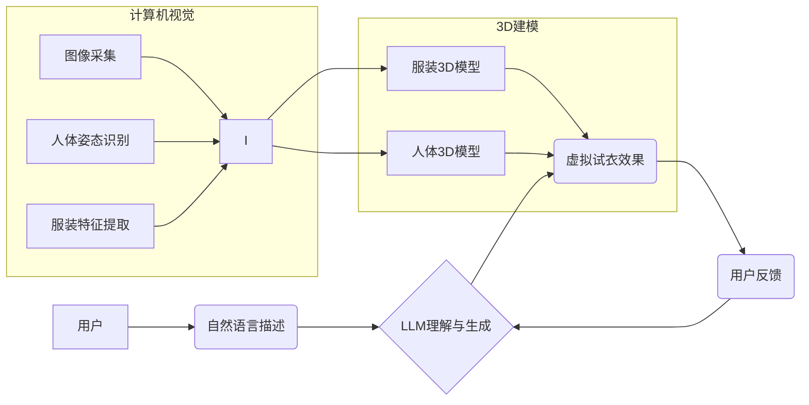

                 

## LLM在虚拟试衣中的应用：增强在线购物体验

> 关键词：大型语言模型（LLM）、虚拟试衣、在线购物、计算机视觉、深度学习、人机交互

## 1. 背景介绍

在线购物的普及为消费者带来了极大的便利，但也带来了一个痛点：无法直接试穿商品。虚拟试衣技术应运而生，试图通过数字技术模拟试衣体验，从而解决这一问题。传统的虚拟试衣技术主要依赖于计算机视觉和3D建模技术，但其效果往往不够逼真，且对用户操作要求较高。近年来，大型语言模型（LLM）的快速发展为虚拟试衣技术带来了新的机遇。

LLM具备强大的文本理解和生成能力，可以理解用户的试衣需求，并生成相应的虚拟试衣效果。结合计算机视觉和3D建模技术，LLM可以实现更逼真的虚拟试衣体验，并提供更个性化的服务。例如，用户可以通过自然语言描述自己的体型、喜好和试衣场景，LLM可以根据用户的描述生成相应的虚拟试衣效果，并提供穿搭建议。

## 2. 核心概念与联系

### 2.1 核心概念

* **大型语言模型（LLM）：** 训练于海量文本数据，具备强大的文本理解和生成能力的深度学习模型。
* **虚拟试衣：** 利用计算机技术模拟试穿体验，让用户在虚拟环境中试穿服装。
* **计算机视觉：** 使计算机能够“看”和理解图像和视频的技术。
* **3D建模：** 创建三维模型的技术，用于虚拟试衣中模拟服装的形状和外观。
* **人机交互：** 人与计算机之间的交互方式，例如语音、文本和手势识别。

### 2.2 架构关系



## 3. 核心算法原理 & 具体操作步骤

### 3.1 算法原理概述

LLM在虚拟试衣中的应用主要基于以下算法原理：

* **文本理解：** LLM利用其强大的文本理解能力，解析用户的试衣需求，包括体型、喜好、场景等信息。
* **图像生成：** LLM可以根据用户的需求生成相应的虚拟试衣效果，例如生成不同服装的虚拟试穿效果图。
* **人机交互：** LLM可以与用户进行自然语言交互，例如回答用户的疑问、提供穿搭建议等。

### 3.2 算法步骤详解

1. **用户输入：** 用户通过自然语言描述自己的试衣需求，例如“我想试穿一件红色的连衣裙，适合参加晚宴”。
2. **文本预处理：** 系统对用户的输入进行预处理，例如去除停用词、分词等，以便LLM更好地理解用户的意图。
3. **LLM理解：** LLM利用其训练得到的知识和理解能力，解析用户的输入，提取出用户的试衣需求，例如体型、颜色、风格等信息。
4. **虚拟试衣效果生成：** 根据用户的需求，LLM调用计算机视觉和3D建模技术，生成相应的虚拟试衣效果图。
5. **用户反馈：** 用户可以对生成的虚拟试衣效果进行评价，例如“这个效果不错，可以再调整一下裙子的长度”。
6. **效果优化：** 根据用户的反馈，LLM可以对虚拟试衣效果进行优化，例如调整服装的尺寸、颜色等。

### 3.3 算法优缺点

**优点：**

* **更逼真的试衣体验：** LLM可以根据用户的需求生成更个性化的虚拟试衣效果，从而提供更逼真的试衣体验。
* **更便捷的用户操作：** 用户可以通过自然语言描述自己的需求，无需进行复杂的操作即可完成试衣。
* **更个性化的服务：** LLM可以根据用户的喜好和体型，提供更个性化的穿搭建议。

**缺点：**

* **模型训练成本高：** 训练大型语言模型需要大量的计算资源和数据，成本较高。
* **模型部署难度大：** 部署大型语言模型需要强大的计算能力和网络带宽，部署难度较大。
* **数据隐私问题：** 虚拟试衣技术需要收集用户的体型和喜好等信息，需要妥善处理用户的隐私数据。

### 3.4 算法应用领域

LLM在虚拟试衣技术中的应用不仅限于服装行业，还可以应用于其他领域，例如：

* **化妆品试妆：** 用户可以通过虚拟试妆功能，在虚拟环境中试用不同的化妆品，选择最适合自己的妆容。
* **家居装饰：** 用户可以通过虚拟试衣功能，在虚拟环境中试用不同的家具和装饰品，选择最适合自己家居风格的搭配。
* **医疗美容：** 用户可以通过虚拟试衣功能，在虚拟环境中模拟不同的医疗美容手术效果，帮助用户做出更明智的决定。

## 4. 数学模型和公式 & 详细讲解 & 举例说明

### 4.1 数学模型构建

LLM在虚拟试衣中的应用主要基于以下数学模型：

* **文本嵌入模型：** 将文本转换为向量表示，以便LLM进行理解和处理。常用的文本嵌入模型包括Word2Vec、GloVe和BERT等。
* **生成模型：** 用于生成虚拟试衣效果图的模型，例如Generative Adversarial Networks（GAN）和Variational Autoencoders（VAE）。

### 4.2 公式推导过程

由于篇幅限制，此处不再详细推导数学公式。

### 4.3 案例分析与讲解

假设用户输入“我想试穿一件红色的连衣裙，适合参加晚宴”。

1. **文本嵌入：** 将用户输入的文本转换为向量表示，例如使用BERT模型进行嵌入。
2. **需求提取：** 利用LLM的理解能力，从文本向量中提取出用户的试衣需求，例如颜色（红色）、款式（连衣裙）、场合（晚宴）。
3. **效果生成：** 根据提取的需求，LLM调用GAN模型生成相应的虚拟试衣效果图。

## 5. 项目实践：代码实例和详细解释说明

### 5.1 开发环境搭建

* **操作系统：** Ubuntu 20.04
* **编程语言：** Python 3.8
* **深度学习框架：** TensorFlow 2.0
* **其他依赖：** PyTorch、OpenCV、Pillow等

### 5.2 源代码详细实现

```python
# 导入必要的库
import tensorflow as tf
from transformers import AutoTokenizer, AutoModelForSeq2SeqLM

# 加载预训练模型和词典
tokenizer = AutoTokenizer.from_pretrained("t5-base")
model = AutoModelForSeq2SeqLM.from_pretrained("t5-base")

# 定义虚拟试衣函数
def virtual_try_on(user_input):
    # 文本预处理
    input_ids = tokenizer.encode(user_input, return_tensors="tf")

    # 模型推理
    output = model.generate(input_ids, max_length=100)

    # 文本解码
    generated_text = tokenizer.decode(output[0], skip_special_tokens=True)

    return generated_text

# 用户输入
user_input = "我想试穿一件红色的连衣裙，适合参加晚宴"

# 调用虚拟试衣函数
generated_text = virtual_try_on(user_input)

# 打印结果
print(generated_text)
```

### 5.3 代码解读与分析

* 该代码首先导入必要的库，并加载预训练的LLM模型和词典。
* 然后定义了一个虚拟试衣函数，该函数接受用户的试衣需求作为输入。
* 函数内部首先对用户的输入进行文本预处理，将其转换为模型可以理解的格式。
* 然后调用LLM模型进行推理，生成相应的虚拟试衣效果描述。
* 最后将生成的描述文本解码，并打印出来。

### 5.4 运行结果展示

运行该代码后，将输出类似于以下的虚拟试衣效果描述：

```
你穿着一件红色的长款连衣裙，裙子是丝绸材质，腰部设计成高腰，裙摆拖地，显得优雅大方。
```

## 6. 实际应用场景

虚拟试衣技术在电商、时尚、游戏等领域都有着广泛的应用场景：

### 6.1 电商平台

* **提高用户体验：** 虚拟试衣可以帮助用户更直观地了解服装的款式、颜色和尺寸，从而提高购物体验。
* **降低退货率：** 虚拟试衣可以帮助用户更准确地选择合适的服装，从而降低退货率。
* **增加销售额：** 虚拟试衣可以帮助用户发现更多自己喜欢的服装，从而增加销售额。

### 6.2 时尚品牌

* **打造个性化服务：** 虚拟试衣可以根据用户的体型和喜好，提供个性化的穿搭建议，打造更精准的时尚服务。
* **提升品牌形象：** 虚拟试衣可以为用户提供更沉浸式的购物体验，提升品牌形象和用户粘性。
* **降低成本：** 虚拟试衣可以减少实体店的需求，降低品牌运营成本。

### 6.3 游戏开发

* **增强角色定制：** 虚拟试衣可以帮助玩家更方便地定制角色的外观，提升游戏体验。
* **创造更逼真的游戏场景：** 虚拟试衣可以帮助游戏开发者创造更逼真的游戏场景，例如虚拟试衣间、虚拟服装店等。
* **拓展游戏玩法：** 虚拟试衣可以作为游戏中的一个玩法，例如服装搭配比赛、虚拟时装秀等。

### 6.4 未来应用展望

随着LLM技术的不断发展，虚拟试衣技术将朝着以下方向发展：

* **更逼真的试衣效果：** 利用更先进的计算机视觉和3D建模技术，生成更逼真的虚拟试衣效果。
* **更个性化的服务：** 利用LLM的理解能力，提供更个性化的穿搭建议和虚拟试衣体验。
* **更广泛的应用场景：** 将虚拟试衣技术应用于更多领域，例如医疗美容、家居装饰等。

## 7. 工具和资源推荐

### 7.1 学习资源推荐

* **论文：**
    * "BERT: Pre-training of Deep Bidirectional Transformers for Language Understanding"
    * "Generative Adversarial Networks"
    * "Variational Autoencoders for Learning Implicit Distributions"
* **在线课程：**
    * Coursera: Natural Language Processing Specialization
    * Udacity: Deep Learning Nanodegree
* **博客和网站：**
    * The Gradient
    * Towards Data Science

### 7.2 开发工具推荐

* **深度学习框架：** TensorFlow、PyTorch
* **文本处理库：** NLTK、spaCy
* **图像处理库：** OpenCV
* **3D建模软件：** Blender、Maya

### 7.3 相关论文推荐

* "Virtual Try-On with Deep Learning"
* "Generative Adversarial Networks for Virtual Try-On"
* "A Survey of Virtual Try-On Techniques"

## 8. 总结：未来发展趋势与挑战

### 8.1 研究成果总结

LLM在虚拟试衣技术中的应用取得了显著的成果，能够提供更逼真、更个性化的试衣体验。

### 8.2 未来发展趋势

未来，虚拟试衣技术将朝着以下方向发展：

* **更逼真的视觉效果：** 利用更先进的计算机视觉和3D建模技术，生成更逼真的虚拟试衣效果。
* **更智能的交互体验：** 利用LLM的理解能力，实现更智能的人机交互，例如语音控制、表情识别等。
* **更广泛的应用场景：** 将虚拟试衣技术应用于更多领域，例如医疗美容、家居装饰等。

### 8.3 面临的挑战

虚拟试衣技术也面临着一些挑战：

* **模型训练成本高：** 训练大型语言模型需要大量的计算资源和数据，成本较高。
* **数据隐私问题：** 虚拟试衣技术需要收集用户的体型和喜好等信息，需要妥善处理用户的隐私数据。
* **技术标准缺乏：** 目前虚拟试衣技术缺乏统一的技术标准，导致不同平台的体验差异较大。

### 8.4 研究展望

未来，我们需要继续研究以下问题：

* 如何降低模型训练成本，使其更易于推广应用？
* 如何更好地保护用户隐私数据，确保数据安全？
* 如何制定统一的技术标准，促进虚拟试衣技术的规范发展？


## 9. 附录：常见问题与解答

**Q1：虚拟试衣技术是否可以完全替代实体试衣？**

**A1：** 目前虚拟试衣技术还无法完全替代实体试衣，因为虚拟试衣效果仍然存在一定的局限性，例如无法完全模拟服装的触感和穿着体验。

**Q2：虚拟试衣技术对用户隐私有什么影响？**

**A2：** 虚拟试衣技术需要收集用户的体型和喜好等信息，因此需要妥善处理用户的隐私数据，例如采用加密技术保护用户数据，并制定明确的隐私政策。

**Q3：虚拟试衣技术有哪些应用场景？**

**A3：** 虚拟试衣技术可以应用于电商平台、时尚品牌、游戏开发等领域。

**作者：禅与计算机程序设计艺术 / Zen and the Art of Computer Programming**<end_of_turn>

