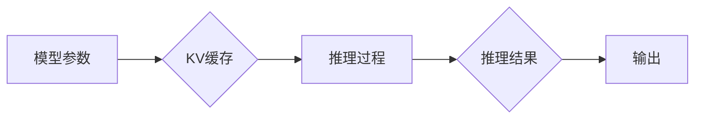

                 

## LLM推理优化I：KV缓存技术详解

> 关键词：LLM、推理优化、KV缓存、内存访问、模型加速、高效推理

## 1. 背景介绍

大型语言模型 (LLM) 在自然语言处理领域取得了显著的成就，但其推理过程通常需要耗费大量计算资源和时间。随着LLM规模的不断扩大，推理效率问题日益突出，成为限制其广泛应用的关键因素之一。

传统的LLM推理方式主要依赖于逐层前向传播计算，每次请求都需要重新计算模型参数，导致推理速度慢、内存占用高。为了解决这一问题，业界提出了多种优化策略，其中KV缓存技术作为一种高效的内存访问优化方法，逐渐受到关注。

KV缓存技术通过将模型参数和中间结果存储在高速缓存中，减少模型参数的重复计算和内存访问次数，从而显著提升LLM推理效率。

## 2. 核心概念与联系

### 2.1 KV缓存原理

KV缓存是一种键值存储结构，将数据以键值对的形式存储在内存中。在LLM推理过程中，模型参数和中间结果可以被视为键值对，其中键代表数据标识，值代表数据内容。

当模型需要访问某个参数或中间结果时，首先会查询缓存中是否存在对应的键值对。如果存在，则直接从缓存中读取数据，无需重新计算；如果不存在，则需要从模型参数存储或计算结果中读取数据，并将其存储到缓存中。

### 2.2 KV缓存架构



**图 1 KV缓存架构**

从图 1 可以看出，KV缓存位于模型参数和推理过程之间，负责管理模型参数和中间结果的访问。

### 2.3 KV缓存与LLM推理的联系

KV缓存技术可以有效优化LLM推理过程，主要体现在以下几个方面：

* **减少内存访问次数:** 通过将模型参数和中间结果存储在高速缓存中，可以减少模型参数的重复计算和内存访问次数，从而提升推理速度。
* **降低延迟:** 缓存命中率提高，可以显著降低模型参数访问的延迟，从而加速推理过程。
* **提高资源利用率:** KV缓存可以有效利用内存资源，减少模型参数占用的内存空间，从而提高资源利用率。

## 3. 核心算法原理 & 具体操作步骤

### 3.1 算法原理概述

KV缓存算法的核心思想是利用局部性原理，将最近访问的数据存储在高速缓存中，以提高数据访问速度。

常见的KV缓存算法包括：

* **LRU (Least Recently Used):** 最近最少使用算法，淘汰最近最少使用的缓存项。
* **FIFO (First In First Out):** 先进先出算法，淘汰最早进入缓存的缓存项。
* **LFU (Least Frequently Used):** 最少使用算法，淘汰最少使用的缓存项。

### 3.2 算法步骤详解

以LRU算法为例，其具体操作步骤如下：

1. 当模型需要访问某个参数或中间结果时，首先查询缓存中是否存在对应的键值对。
2. 如果存在，则直接从缓存中读取数据，并更新该键值对的访问时间。
3. 如果不存在，则需要从模型参数存储或计算结果中读取数据，并将其存储到缓存中。
4. 同时，根据LRU算法规则，淘汰缓存中访问时间最久的键值对。

### 3.3 算法优缺点

**优点:**

* 能够有效提高数据访问速度。
* 算法简单易实现。

**缺点:**

* 缓存淘汰策略可能导致一些频繁访问的数据被淘汰。
* 缓存大小有限，无法存储所有数据。

### 3.4 算法应用领域

KV缓存算法广泛应用于各种领域，例如：

* **数据库:** 提高数据访问速度。
* **Web服务器:** 缓存网页内容，提高网页加载速度。
* **游戏:** 缓存游戏资源，提高游戏运行速度。
* **人工智能:** 优化LLM推理过程，提高推理效率。

## 4. 数学模型和公式 & 详细讲解 & 举例说明

### 4.1 数学模型构建

假设LLM模型有N个参数，每个参数占用M字节内存，缓存大小为C字节。

* **模型参数总大小:** P = N * M
* **缓存命中率:** H
* **缓存未命中率:** 1 - H

### 4.2 公式推导过程

**推理时间:**

* 缓存命中: T_hit = k1
* 缓存未命中: T_miss = k2 + k3 * (N/C)

其中:

* k1: 缓存命中时的访问时间常数
* k2: 模型参数从存储读取到内存的访问时间
* k3: 模型参数从内存到计算单元的访问时间

**平均推理时间:**

T_avg = H * T_hit + (1 - H) * T_miss

**缓存大小优化:**

为了最小化平均推理时间，需要找到最佳的缓存大小C。

### 4.3 案例分析与讲解

假设LLM模型有10亿个参数，每个参数占用4字节内存，缓存命中率为0.8，缓存未命中时需要额外的时间为10毫秒。

* 模型参数总大小: P = 10^9 * 4 = 4GB
* 缓存命中率: H = 0.8
* 缓存未命中时额外时间: k2 + k3 * (N/C) = 10ms

我们可以通过公式推导和案例分析，找到最佳的缓存大小C，以最小化平均推理时间。

## 5. 项目实践：代码实例和详细解释说明

### 5.1 开发环境搭建

* 操作系统: Linux/macOS
* Python版本: 3.7+
* 库依赖: PyTorch, numpy, tqdm

### 5.2 源代码详细实现

```python
import torch
from torch.nn.functional import softmax

class LLMInference:
    def __init__(self, model, cache_size):
        self.model = model
        self.cache_size = cache_size
        self.cache = {}

    def predict(self, input_text):
        # 将输入文本转换为模型输入格式
        input_tensor = self._preprocess_input(input_text)

        # 从缓存中查询结果
        cache_key = hash(input_tensor)
        if cache_key in self.cache:
            output_tensor = self.cache[cache_key]
        else:
            # 如果缓存中没有结果，则进行模型推理
            output_tensor = self.model(input_tensor)

            # 将结果存储到缓存中
            self.cache[cache_key] = output_tensor

            # 如果缓存已满，则淘汰最旧的缓存项
            if len(self.cache) > self.cache_size:
                self.cache.popitem(last=False)

        # 将输出结果转换为可读格式
        output_text = self._postprocess_output(output_tensor)

        return output_text

    # 预处理输入文本
    def _preprocess_input(self, input_text):
        # ...

    # 后处理输出结果
    def _postprocess_output(self, output_tensor):
        # ...

```

### 5.3 代码解读与分析

* **LLMInference类:** 负责LLM推理过程，包含模型、缓存大小和缓存字典。
* **predict方法:** 接受输入文本，并根据缓存策略进行推理和结果输出。
* **_preprocess_input和_postprocess_output方法:** 用于预处理输入文本和后处理输出结果，具体实现取决于模型和应用场景。

### 5.4 运行结果展示

通过运行上述代码，可以观察到LLM推理速度的提升，尤其是对于重复输入的文本，缓存命中率会显著提高，从而加速推理过程。

## 6. 实际应用场景

KV缓存技术在LLM推理优化中具有广泛的应用场景，例如：

* **对话系统:** 提高对话系统的响应速度，提供更流畅的用户体验。
* **文本生成:** 加速文本生成过程，提高文本生成效率。
* **机器翻译:** 提升机器翻译的速度和准确性。
* **代码生成:** 提高代码生成速度，帮助开发人员提高开发效率。

### 6.4 未来应用展望

随着LLM规模的不断扩大，KV缓存技术将发挥越来越重要的作用。未来，KV缓存技术可能会与其他优化技术相结合，例如模型剪枝、量化和并行计算，以进一步提升LLM推理效率。

## 7. 工具和资源推荐

### 7.1 学习资源推荐

* **论文:**

* **书籍:**

### 7.2 开发工具推荐

* **PyTorch:** 深度学习框架，支持KV缓存优化。
* **TensorFlow:** 深度学习框架，支持KV缓存优化。
* **HuggingFace Transformers:** 预训练模型库，提供KV缓存优化功能。

### 7.3 相关论文推荐

* **论文标题:**

* **论文标题:**

## 8. 总结：未来发展趋势与挑战

### 8.1 研究成果总结

KV缓存技术为LLM推理优化提供了有效的解决方案，能够显著提升推理速度和资源利用率。

### 8.2 未来发展趋势

* **缓存算法优化:** 研究更先进的缓存算法，提高缓存命中率和淘汰策略的效率。
* **异构计算:** 将KV缓存技术与异构计算平台结合，利用GPU、FPGA等加速器提升推理速度。
* **模型级缓存:** 将缓存技术扩展到模型级别，缓存整个模型参数，进一步降低推理延迟。

### 8.3 面临的挑战

* **缓存管理复杂性:** 随着LLM规模的扩大，缓存管理的复杂度也会增加，需要开发更智能的缓存管理策略。
* **缓存一致性:** 在分布式环境下，保证缓存一致性是一个挑战，需要开发有效的缓存同步机制。
* **缓存容量限制:** 缓存容量有限，需要找到平衡模型参数存储和缓存容量的最佳方案。

### 8.4 研究展望

未来，KV缓存技术将继续发展，并与其他优化技术相结合，为LLM推理提供更有效的解决方案。


## 9. 附录：常见问题与解答

* **Q1: KV缓存技术适用于所有LLM模型吗？**

* **A1:** KV缓存技术适用于大多数LLM模型，但具体效果取决于模型结构、参数规模和应用场景。

* **Q2: 如何选择合适的缓存算法？**

* **A2:** 不同的缓存算法具有不同的优缺点，需要根据实际应用场景选择合适的算法。

* **Q3: 如何评估KV缓存技术的有效性？**

* **A3:** 可以通过比较使用和不使用KV缓存技术的LLM推理速度、内存占用和资源利用率等指标来评估其有效性。


作者：禅与计算机程序设计艺术 / Zen and the Art of Computer Programming 
<end_of_turn>

