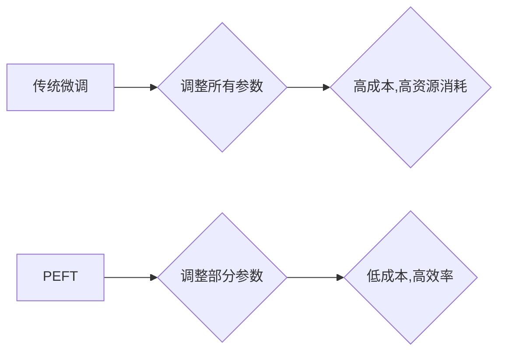

                 

## PEFT：性能和效率的平衡

> 关键词：大型语言模型、参数效率、微调、PEFT、性能优化、效率提升

### 1. 背景介绍

近年来，大型语言模型（LLM）在自然语言处理领域取得了显著的突破，展现出强大的文本生成、翻译、问答等能力。然而，这些模型通常拥有数十亿甚至数千亿的参数，训练和部署成本极高，对硬件资源要求也十分苛刻。如何平衡 LLMs 的性能和效率，使其能够更广泛地应用于实际场景，成为一个重要的研究方向。

PEFT（Parameter-Efficient Fine-Tuning）技术应运而生，旨在通过精细调整模型的一部分参数，而不是整个模型，来实现高效的模型微调。这种方法能够显著降低微调成本，同时保持模型性能的优势。

### 2. 核心概念与联系

PEFT 的核心概念是将模型参数划分为不同的组，并针对特定任务进行微调。通过只调整部分参数，可以有效减少计算量和内存占用，从而提高微调效率。

**PEFT 的主要技术路线包括：**

* **参数共享:** 将模型的不同部分共享相同的参数，减少参数数量。
* **低秩分解:** 将模型参数分解成低秩矩阵，降低参数维度。
* **注意力机制:** 通过调整注意力机制的参数，引导模型关注与特定任务相关的文本信息。
* **提示学习:** 使用特殊的提示符引导模型生成特定类型的输出。

**PEFT 与传统微调方法的对比:**



### 3. 核心算法原理 & 具体操作步骤

#### 3.1  算法原理概述

PEFT 的核心算法原理是通过对模型参数进行局部调整，来实现高效的模型微调。

**主要方法包括：**

* **Adapter:** 在模型的特定层插入小型可训练模块（Adapter），用于捕捉任务相关的知识。
* **Prompt Tuning:** 通过微调输入文本的提示符，引导模型生成特定类型的输出。
* **LoRA (Low-Rank Adaptation):** 将模型参数分解成低秩矩阵，只微调低秩矩阵，从而减少参数数量。

#### 3.2  算法步骤详解

以 LoRA 为例，详细说明 PEFT 的算法步骤：

1. **冻结预训练模型:** 将预训练模型的参数冻结，防止其在微调过程中发生变化。
2. **添加低秩矩阵:** 在每个需要微调的层中，添加两个低秩矩阵，分别为 A 和 B。
3. **计算低秩表示:** 将预训练模型的权重矩阵分解成 A 和 B 的乘积，即 W = A * B。
4. **微调低秩矩阵:** 只微调 A 和 B 的参数，保持预训练模型的权重不变。
5. **更新模型权重:** 将微调后的 A 和 B 乘积作为新的模型权重。

#### 3.3  算法优缺点

**优点:**

* **参数效率:** 只微调部分参数，显著降低了模型参数量。
* **训练效率:** 训练速度更快，所需的计算资源更少。
* **性能保持:** 在保持模型性能的同时，实现了高效的微调。

**缺点:**

* **适用性:** 不适用于所有类型的模型和任务。
* **超参数调优:** 需要对低秩矩阵的秩等超参数进行调优。

#### 3.4  算法应用领域

PEFT 广泛应用于各种自然语言处理任务，例如：

* **文本分类:** 微调模型对特定领域的文本进行分类。
* **情感分析:** 微调模型识别文本的情感倾向。
* **机器翻译:** 微调模型提高翻译质量。
* **问答系统:** 微调模型回答特定领域的提问。

### 4. 数学模型和公式 & 详细讲解 & 举例说明

#### 4.1  数学模型构建

假设预训练模型的权重矩阵为 W，需要微调的层数为 L，每个层的权重矩阵维度为 D。

**LoRA 的数学模型可以表示为：**

*  W = A * B

其中：

* A 是 L 个低秩矩阵，每个矩阵维度为 (D, r)，r 是低秩矩阵的秩。
* B 是 L 个低秩矩阵，每个矩阵维度为 (r, D)。

#### 4.2  公式推导过程

在微调过程中，只更新 A 和 B 的参数，保持预训练模型的权重不变。

**损失函数可以定义为：**

* L = Σ(y_i - ŷ_i)^2

其中：

* y_i 是真实标签。
* ŷ_i 是模型预测的标签。

**梯度下降算法用于更新 A 和 B 的参数：**

* ΔA = -α * ∂L/∂A
* ΔB = -α * ∂L/∂B

其中：

* α 是学习率。

#### 4.3  案例分析与讲解

假设我们使用 LoRA 微调一个文本分类模型，模型有 10 层，每层的权重矩阵维度为 512。

我们可以设置低秩矩阵的秩为 64，即 r = 64。

在微调过程中，只更新 A 和 B 的 64 个参数，而预训练模型的 512 * 512 的权重矩阵保持不变。

通过这种方式，我们可以显著降低微调成本，同时保持模型性能。

### 5. 项目实践：代码实例和详细解释说明

#### 5.1  开发环境搭建

* Python 3.7+
* PyTorch 1.7+
* Transformers 库

#### 5.2  源代码详细实现

```python
from transformers import AutoModelForSequenceClassification, AutoTokenizer
from peft import LoraConfig, get_peft_model

# 加载预训练模型和词典
model_name = "bert-base-uncased"
tokenizer = AutoTokenizer.from_pretrained(model_name)
model = AutoModelForSequenceClassification.from_pretrained(model_name)

# 配置 LoRA 参数
lora_config = LoraConfig(
    r=64,  # 低秩矩阵的秩
    lora_alpha=16,  # 缩放因子
    target_modules=["query", "key", "value"],  # 微调的模块
)

# 获取 PEFT 模型
peft_model = get_peft_model(model, lora_config)

# 训练模型
# ...

# 保存模型
peft_model.save_pretrained("lora_model")
```

#### 5.3  代码解读与分析

* 使用 `transformers` 库加载预训练模型和词典。
* 使用 `peft` 库配置 LoRA 参数，包括低秩矩阵的秩、缩放因子和微调的模块。
* 使用 `get_peft_model` 函数获取 PEFT 模型，将 LoRA 配置应用于预训练模型。
* 训练模型并保存微调后的模型。

#### 5.4  运行结果展示

通过微调后的模型，可以观察到在目标任务上的性能提升，同时计算资源消耗降低。

### 6. 实际应用场景

PEFT 技术在实际应用场景中展现出强大的潜力，例如：

* **个性化推荐:** 微调模型根据用户的偏好进行个性化推荐。
* **医疗诊断:** 微调模型辅助医生进行疾病诊断。
* **法律文本分析:** 微调模型分析法律文本，提取关键信息。

#### 6.4  未来应用展望

随着 LLMs 的不断发展，PEFT 技术将发挥越来越重要的作用，推动 LLMs 在更多领域得到应用。

### 7. 工具和资源推荐

#### 7.1  学习资源推荐

* **PEFT 官方文档:** https://huggingface.co/docs/peft/index
* **PEFT GitHub 仓库:** https://github.com/huggingface/peft

#### 7.2  开发工具推荐

* **Transformers 库:** https://huggingface.co/docs/transformers/index
* **PyTorch 库:** https://pytorch.org/

#### 7.3  相关论文推荐

* **Parameter-Efficient Fine-Tuning for Large Language Models**
* **LoRA: Low-Rank Adaptation of Large Language Models**

### 8. 总结：未来发展趋势与挑战

#### 8.1  研究成果总结

PEFT 技术为高效微调 LLMs 提供了一种有效的方法，显著降低了微调成本，提高了模型的实用性。

#### 8.2  未来发展趋势

* **更有效的参数效率方法:** 研究更有效的参数效率方法，例如动态参数调整、知识蒸馏等。
* **多模态 PEFT:** 将 PEFT 技术扩展到多模态模型，例如文本-图像、文本-音频等。
* **自动化 PEFT:** 开发自动化 PEFT 工具，简化模型微调流程。

#### 8.3  面临的挑战

* **通用性:** 寻找适用于各种模型和任务的通用 PEFT 方法。
* **可解释性:** 提高 PEFT 方法的可解释性，帮助用户理解模型的微调过程。
* **安全性和鲁棒性:** 确保 PEFT 方法的安全性，防止模型被恶意攻击。

#### 8.4  研究展望

PEFT 技术仍处于发展阶段，未来将会有更多研究成果涌现，推动 LLMs 在更多领域得到应用。


### 9. 附录：常见问题与解答

* **什么是 PEFT？**

PEFT（Parameter-Efficient Fine-Tuning）是一种高效微调大型语言模型的技术，通过调整模型的一部分参数，而不是整个模型，来实现高效的模型微调。

* **PEFT 的优势是什么？**

PEFT 的优势在于参数效率、训练效率和性能保持。

* **PEFT 的应用场景有哪些？**

PEFT 广泛应用于各种自然语言处理任务，例如文本分类、情感分析、机器翻译和问答系统。

* **如何使用 PEFT 微调模型？**

可以使用 `peft` 库和 `transformers` 库轻松实现 PEFT 微调。

* **PEFT 的未来发展趋势是什么？**

PEFT 的未来发展趋势包括更有效的参数效率方法、多模态 PEFT 和自动化 PEFT。


作者：禅与计算机程序设计艺术 / Zen and the Art of Computer Programming 
<end_of_turn>

