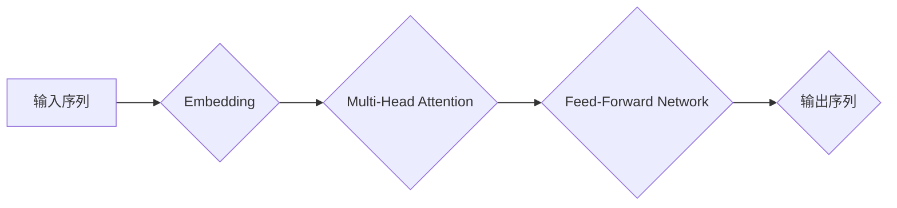

                 

## Self-Attention机制：NLP革命的关键

> 关键词：Self-Attention, Transformer, NLP, 自然语言处理, 机器学习, 深度学习, 序列模型

## 1. 背景介绍

自然语言处理 (NLP) 领域一直致力于让计算机理解和处理人类语言。传统的循环神经网络 (RNN) 和卷积神经网络 (CNN) 在 NLP 任务中取得了不错的成绩，但它们在处理长序列数据时存在一些瓶颈，例如梯度消失和计算效率问题。

2017 年，Google 发布了基于 Transformer 架构的论文《Attention Is All You Need》，彻底改变了 NLP 的发展方向。Transformer 引入了 Self-Attention 机制，有效解决了 RNN 和 CNN 在处理长序列数据时的难题，并取得了显著的性能提升。自此，Self-Attention 成为 NLP 领域最核心的技术之一，广泛应用于机器翻译、文本摘要、问答系统、文本生成等各种任务。

## 2. 核心概念与联系

Self-Attention 机制的核心思想是让模型能够关注输入序列中不同位置的词语之间的关系，从而更好地理解上下文信息。

**2.1  Attention 机制**

Attention 机制是一种用于加权不同输入元素重要性的机制。它可以将多个输入元素映射到一个输出向量，其中每个元素的权重代表其对输出的影响程度。

**2.2  Self-Attention 机制**

Self-Attention 机制是 Attention 机制的特殊形式，它将输入序列中的每个词语都与其他所有词语进行比较，并计算出它们之间的相关性。

**2.3  Transformer 架构**

Transformer 架构将 Self-Attention 机制应用于整个编码器和解码器中，并通过多头注意力机制 (Multi-Head Attention) 和前馈神经网络 (Feed-Forward Network) 进一步提升模型的性能。

**Mermaid 流程图**



## 3. 核心算法原理 & 具体操作步骤

### 3.1  算法原理概述

Self-Attention 机制的核心思想是通过计算词语之间的相关性来理解上下文信息。具体来说，它会将每个词语映射到三个向量：Query (Q)、Key (K) 和 Value (V)。然后，它会计算 Q 与所有 K 之间的相似度，并根据相似度对 V 进行加权求和，得到每个词语的上下文表示。

### 3.2  算法步骤详解

1. **词嵌入:** 将输入序列中的每个词语映射到一个低维向量空间，称为词嵌入。

2. **线性变换:** 对每个词语的嵌入向量进行线性变换，得到 Query (Q)、Key (K) 和 Value (V) 向量。

3. **注意力计算:** 计算 Q 与所有 K 之间的相似度，通常使用点积作为相似度函数。

4. **软最大归一化:** 对相似度进行软最大归一化，得到每个词语对其他词语的注意力权重。

5. **加权求和:** 根据注意力权重对 V 进行加权求和，得到每个词语的上下文表示。

6. **输出:** 将每个词语的上下文表示拼接起来，得到最终的输出序列。

### 3.3  算法优缺点

**优点:**

* 可以有效地处理长序列数据，克服了 RNN 和 CNN 的瓶颈。
* 可以捕捉到词语之间的长距离依赖关系。
* 并行计算能力强，训练速度快。

**缺点:**

* 计算复杂度较高，参数量大。
* 对训练数据要求较高，需要大量的训练数据才能达到最佳性能。

### 3.4  算法应用领域

Self-Attention 机制广泛应用于各种 NLP 任务，例如：

* 机器翻译
* 文本摘要
* 问答系统
* 文本生成
* 情感分析
* 语义理解

## 4. 数学模型和公式 & 详细讲解 & 举例说明

### 4.1  数学模型构建

Self-Attention 机制可以看作是一个函数，它将输入序列映射到输出序列。

**输入:**

* X: 输入序列，长度为 n，每个词语为一个词嵌入向量。

**输出:**

* Y: 输出序列，长度为 n，每个词语为一个上下文表示向量。

**公式:**

```
Y = Attention(X)
```

### 4.2  公式推导过程

Self-Attention 机制的核心是计算每个词语与其他词语之间的相关性。

**步骤:**

1. **线性变换:** 将每个词语的嵌入向量 X_i (i = 1, 2, ..., n) 分别线性变换为 Query (Q_i), Key (K_i) 和 Value (V_i) 向量。

```
Q_i = W_Q * X_i
K_i = W_K * X_i
V_i = W_V * X_i
```

其中，W_Q, W_K 和 W_V 是三个不同的权重矩阵。

2. **注意力计算:** 计算每个词语 Q_i 与所有词语 K_j 之间的相似度，通常使用点积作为相似度函数。

```
Score(Q_i, K_j) = Q_i^T * K_j
```

3. **软最大归一化:** 对相似度进行软最大归一化，得到每个词语对其他词语的注意力权重。

```
Attention(Q_i, K_j) = softmax(Score(Q_i, K_j))
```

4. **加权求和:** 根据注意力权重对所有词语的 Value 向量进行加权求和，得到每个词语的上下文表示。

```
Context(X_i) = Σ Attention(Q_i, K_j) * V_j
```

### 4.3  案例分析与讲解

假设我们有一个输入序列 "The cat sat on the mat"，每个词语的嵌入向量为一个 10 维向量。

1. 我们使用三个不同的权重矩阵对每个词语的嵌入向量进行线性变换，得到 Query、Key 和 Value 向量。

2. 然后，我们计算每个词语的 Query 向量与所有词语的 Key 向量之间的点积，得到一个相似度矩阵。

3. 对相似度矩阵进行软最大归一化，得到每个词语对其他词语的注意力权重。

4. 最后，我们根据注意力权重对所有词语的 Value 向量进行加权求和，得到每个词语的上下文表示。

通过这种方式，Self-Attention 机制可以捕捉到每个词语与其他词语之间的关系，从而更好地理解整个句子。

## 5. 项目实践：代码实例和详细解释说明

### 5.1  开发环境搭建

* Python 3.6+
* TensorFlow 或 PyTorch

### 5.2  源代码详细实现

```python
import tensorflow as tf

# 定义 Self-Attention 层
class SelfAttention(tf.keras.layers.Layer):
    def __init__(self, embed_dim, num_heads):
        super(SelfAttention, self).__init__()
        self.embed_dim = embed_dim
        self.num_heads = num_heads
        self.head_dim = embed_dim // num_heads

        # 线性变换矩阵
        self.W_Q = tf.keras.layers.Dense(embed_dim)
        self.W_K = tf.keras.layers.Dense(embed_dim)
        self.W_V = tf.keras.layers.Dense(embed_dim)

    def call(self, inputs):
        # 获取输入序列
        X = inputs

        # 线性变换
        Q = self.W_Q(X)
        K = self.W_K(X)
        V = self.W_V(X)

        # 分割成多个头
        Q = tf.reshape(Q, shape=(-1, tf.shape(Q)[1], self.num_heads, self.head_dim))
        K = tf.reshape(K, shape=(-1, tf.shape(K)[1], self.num_heads, self.head_dim))
        V = tf.reshape(V, shape=(-1, tf.shape(V)[1], self.num_heads, self.head_dim))

        # 计算注意力权重
        attention_scores = tf.matmul(Q, K, transpose_b=True) / tf.math.sqrt(tf.cast(self.head_dim, tf.float32))
        attention_weights = tf.nn.softmax(attention_scores, axis=-1)

        # 加权求和
        context = tf.matmul(attention_weights, V)

        # 合并多个头
        context = tf.reshape(context, shape=(-1, tf.shape(context)[1], self.embed_dim))

        return context
```

### 5.3  代码解读与分析

* `SelfAttention` 类定义了一个 Self-Attention 层。
* `__init__` 方法初始化层参数，包括嵌入维度、头数等。
* `call` 方法实现 Self-Attention 机制，包括线性变换、注意力计算和加权求和等步骤。
* 代码使用 TensorFlow 库实现，并使用 `tf.keras.layers` API 定义层结构。

### 5.4  运行结果展示

运行上述代码，可以得到每个词语的上下文表示向量。

## 6. 实际应用场景

Self-Attention 机制在各种 NLP 任务中取得了显著的成果，例如：

### 6.1  机器翻译

Self-Attention 可以帮助机器翻译模型更好地捕捉源语言和目标语言之间的语义关系，从而提高翻译质量。

### 6.2  文本摘要

Self-Attention 可以帮助文本摘要模型识别重要信息，并生成简洁准确的摘要。

### 6.3  问答系统

Self-Attention 可以帮助问答系统理解问题和上下文信息，并找到最合适的答案。

### 6.4  未来应用展望

随着 Self-Attention 机制的不断发展，它将在更多 NLP 任务中发挥重要作用，例如：

* 代码生成
* 聊天机器人
* 文本创作

## 7. 工具和资源推荐

### 7.1  学习资源推荐

* **论文:** Attention Is All You Need
* **博客:** The Illustrated Transformer
* **课程:** Stanford CS224N: Natural Language Processing with Deep Learning

### 7.2  开发工具推荐

* **TensorFlow:** https://www.tensorflow.org/
* **PyTorch:** https://pytorch.org/

### 7.3  相关论文推荐

* BERT: Pre-training of Deep Bidirectional Transformers for Language Understanding
* GPT-3: Language Models are Few-Shot Learners
* T5: Text-to-Text Transfer Transformer

## 8. 总结：未来发展趋势与挑战

### 8.1  研究成果总结

Self-Attention 机制彻底改变了 NLP 的发展方向，并取得了显著的成果。它有效解决了 RNN 和 CNN 在处理长序列数据时的难题，并能够捕捉到词语之间的长距离依赖关系。

### 8.2  未来发展趋势

* **效率提升:** 研究更高效的 Self-Attention 变体，例如局部注意力机制和稀疏注意力机制。
* **多模态融合:** 将 Self-Attention 应用于多模态数据，例如文本、图像和音频。
* **可解释性增强:** 研究如何提高 Self-Attention 模型的可解释性，以便更好地理解模型的决策过程。

### 8.3  面临的挑战

* **计算复杂度:** Self-Attention 的计算复杂度较高，难以应用于大型模型和资源有限的设备。
* **数据依赖性:** Self-Attention 模型对训练数据要求较高，需要大量的训练数据才能达到最佳性能。
* **泛化能力:** Self-Attention 模型在某些情况下可能存在过拟合问题，难以泛化到新的数据。

### 8.4  研究展望

未来，Self-Attention 机制将继续在 NLP 领域发挥重要作用，并与其他技术相结合，推动 NLP 的发展。


## 9. 附录：常见问题与解答

**Q1: Self-Attention 和 Attention 机制有什么区别？**

**A1:** Self-Attention 是 Attention 机制的特殊形式，它将输入序列中的每个词语都与其他所有词语进行比较，而 Attention 机制可以应用于任意两个序列。

**Q2: Self-Attention 的计算复杂度很高吗？**

**A2:** 是的，Self-Attention 的计算复杂度较高，与序列长度的平方成正比。

**Q3: 如何降低 Self-Attention 的计算复杂度？**

**A3:** 可以使用局部注意力机制或稀疏注意力机制来降低计算复杂度。

**Q4: Self-Attention 模型的数据依赖性高吗？**

**A4:** 是的，Self-Attention 模型对训练数据要求较高，需要大量的训练数据才能达到最佳性能。

**Q5: Self-Attention 模型的未来发展趋势是什么？**

**A5:** 未来，Self-Attention 机制将继续在 NLP 领域发挥重要作用，并与其他技术相结合，推动 NLP 的发展。


作者：禅与计算机程序设计艺术 / Zen and the Art of Computer Programming 
<end_of_turn>

