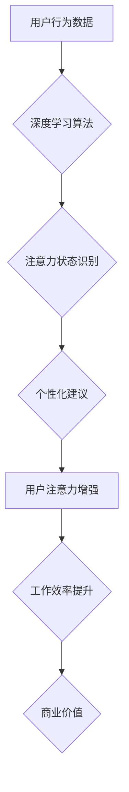

                 

## 人类注意力增强：提升专注力和注意力在商业中的未来发展机遇分析机遇挑战预测

> 关键词：注意力增强、专注力、深度学习、脑机接口、商业应用、未来趋势、挑战

## 1. 背景介绍

在当今信息爆炸的时代，人类的注意力面临着前所未有的挑战。来自社交媒体、电子邮件、新闻推送等各种信息源的干扰，使得人们难以集中精力完成任务，效率低下，认知能力受损。注意力力的下降不仅影响个人生活，也对商业发展造成严重影响。

商业领域对专注力的需求日益增长。从销售人员与客户沟通、市场营销人员制定策略、研发人员进行创新，到管理人员决策执行，都需要高度的集中力和持续的注意力。注意力不足会导致决策错误、工作效率低下、客户满意度降低，最终损害企业利益。

因此，如何提升人类注意力，增强专注力，成为一个亟待解决的课题。近年来，随着人工智能、脑科学等领域的快速发展，人类注意力增强技术逐渐成为现实，为商业领域带来了新的机遇。

## 2. 核心概念与联系

**2.1  注意力增强**

注意力增强是指通过技术手段，帮助人们提高注意力集中度、延长注意力持续时间、增强对目标信息的感知和记忆能力。

**2.2  专注力**

专注力是指能够将注意力集中在特定目标上，排除干扰，持续进行思考和行动的能力。

**2.3  商业应用**

注意力增强技术在商业领域有着广泛的应用前景，例如：

* **提升员工工作效率:** 通过注意力增强工具，帮助员工集中注意力，提高工作效率，减少错误率。
* **增强客户体验:** 通过注意力增强技术，帮助销售人员更好地理解客户需求，提供更精准的服务，提升客户满意度。
* **促进创新:** 通过注意力增强技术，帮助研发人员集中精力进行创新研究，加速产品开发周期。
* **优化营销策略:** 通过注意力增强技术，帮助市场营销人员精准定位目标客户，提高广告投放效果。

**2.4  技术架构**

注意力增强技术的实现需要结合多种技术，包括：

* **人工智能:** 利用深度学习算法，分析用户行为数据，识别注意力状态，并提供个性化的注意力增强建议。
* **脑机接口:** 通过脑电波监测，实时了解用户的注意力状态，并根据反馈进行调整。
* **生物反馈技术:** 通过监测用户的生理指标，例如心率、呼吸频率等，提供注意力调节的生物反馈信息。
* **交互设计:** 设计人性化的用户界面，引导用户使用注意力增强工具，并提供有效的反馈机制。

**Mermaid 流程图**



## 3. 核心算法原理 & 具体操作步骤

### 3.1  算法原理概述

注意力增强算法的核心原理是通过分析用户行为数据，识别用户的注意力状态，并根据状态提供个性化的干预措施，帮助用户集中注意力。常用的算法包括：

* **Recurrent Neural Networks (RNN):** RNN能够处理序列数据，例如用户的浏览历史、键盘输入等，并学习用户的注意力模式。
* **Convolutional Neural Networks (CNN):** CNN擅长提取图像特征，可以用于分析用户的眼动轨迹、面部表情等，识别用户的注意力状态。
* **Transformer:** Transformer是一种新型的深度学习模型，能够捕捉长距离依赖关系，更有效地分析用户的注意力模式。

### 3.2  算法步骤详解

1. **数据收集:** 收集用户的行为数据，例如浏览历史、键盘输入、眼动轨迹、心率等。
2. **数据预处理:** 对收集到的数据进行清洗、转换、特征提取等预处理操作。
3. **模型训练:** 利用深度学习算法，训练注意力增强模型，使其能够识别用户的注意力状态。
4. **注意力状态预测:** 将用户的行为数据输入到训练好的模型中，预测用户的注意力状态。
5. **个性化干预:** 根据预测的注意力状态，提供个性化的干预措施，例如：
    * **提示用户休息:** 当用户注意力下降时，提示用户休息片刻，恢复注意力。
    * **调整环境:** 根据用户的注意力状态，调整环境音、灯光等，帮助用户集中注意力。
    * **提供激励:** 当用户注意力集中时，提供奖励或激励，增强用户的注意力。

### 3.3  算法优缺点

**优点:**

* **精准识别:** 深度学习算法能够精准识别用户的注意力状态，提供个性化的干预措施。
* **持续优化:** 通过不断收集用户数据，模型能够持续优化，提高注意力增强效果。
* **多平台应用:** 注意力增强算法可以应用于多种平台，例如电脑、手机、VR设备等。

**缺点:**

* **数据依赖:** 深度学习算法需要大量的数据进行训练，数据质量直接影响模型性能。
* **隐私问题:** 收集用户的行为数据可能会涉及隐私问题，需要妥善处理。
* **技术复杂:** 开发注意力增强算法需要专业的技术人员和资源。

### 3.4  算法应用领域

注意力增强算法在以下领域有着广泛的应用前景：

* **教育:** 帮助学生集中注意力，提高学习效率。
* **医疗:** 帮助患者治疗注意力缺陷多动障碍 (ADHD) 等注意力问题。
* **游戏:** 增强玩家的游戏体验，提高游戏沉浸感。
* **交通安全:** 帮助驾驶员集中注意力，预防交通事故。

## 4. 数学模型和公式 & 详细讲解 & 举例说明

### 4.1  数学模型构建

注意力增强算法通常采用基于神经网络的数学模型，例如 RNN、CNN、Transformer 等。这些模型通过多层神经元网络，学习用户行为数据中的复杂模式，并预测用户的注意力状态。

### 4.2  公式推导过程

由于篇幅限制，这里不再详细推导神经网络的数学公式。感兴趣的读者可以参考相关深度学习书籍和论文。

### 4.3  案例分析与讲解

例如，在使用 RNN 模型进行注意力状态预测时，可以将用户的浏览历史作为输入序列，模型会学习每个浏览页面的重要程度，并预测用户当前的注意力状态。

假设用户浏览了三个网页，分别为 A、B、C，模型学习到的每个网页的重要性权重分别为：

* A: 0.4
* B: 0.5
* C: 0.1

根据这些权重，模型可以预测用户当前注意力集中在网页 B 上。

## 5. 项目实践：代码实例和详细解释说明

### 5.1  开发环境搭建

注意力增强项目开发环境通常需要以下软件：

* Python 编程语言
* TensorFlow 或 PyTorch 深度学习框架
* Jupyter Notebook 或 VS Code 代码编辑器
* GPU 加速器

### 5.2  源代码详细实现

由于篇幅限制，这里不再提供完整的源代码。但可以提供一些关键代码片段，例如 RNN 模型的定义和训练代码：

```python
# 使用 TensorFlow 定义 RNN 模型
model = tf.keras.Sequential([
    tf.keras.layers.Embedding(input_dim=vocab_size, output_dim=embedding_dim),
    tf.keras.layers.LSTM(units=128),
    tf.keras.layers.Dense(units=1, activation='sigmoid')
])

# 编译模型
model.compile(optimizer='adam', loss='binary_crossentropy', metrics=['accuracy'])

# 训练模型
model.fit(x_train, y_train, epochs=10)
```

### 5.3  代码解读与分析

这段代码定义了一个简单的 RNN 模型，用于预测用户的注意力状态。

* `Embedding` 层将用户的文本输入转换为向量表示。
* `LSTM` 层是一个循环神经网络层，能够处理序列数据，学习用户的注意力模式。
* `Dense` 层是一个全连接层，输出用户的注意力状态预测值。

### 5.4  运行结果展示

训练完成后，可以将模型应用于新的用户数据，预测用户的注意力状态。

## 6. 实际应用场景

### 6.1  商业应用案例

* **在线教育平台:** 利用注意力增强技术，帮助学生集中注意力，提高学习效率。例如，当学生注意力下降时，平台会提示学生休息，或者提供一些互动游戏，帮助学生恢复注意力。
* **远程办公软件:** 利用注意力增强技术，帮助远程办公人员集中注意力，提高工作效率。例如，软件可以根据用户的注意力状态，自动屏蔽无关的通知，或者调整工作环境，帮助用户集中注意力。
* **营销推广平台:** 利用注意力增强技术，帮助广告投放更精准，提高广告效果。例如，平台可以根据用户的注意力状态，选择合适的广告内容和投放时机，提高用户点击率和转化率。

### 6.2  未来应用展望

随着人工智能、脑科学等领域的持续发展，注意力增强技术将有更广泛的应用场景：

* **个性化学习:** 根据用户的注意力特点，提供个性化的学习方案，提高学习效率。
* **脑机交互:** 通过脑机接口，直接控制注意力，实现更精准的脑机交互。
* **虚拟现实体验:** 利用注意力增强技术，增强虚拟现实体验，提高用户沉浸感。

## 7. 工具和资源推荐

### 7.1  学习资源推荐

* **书籍:**
    * 《深度学习》 by Ian Goodfellow, Yoshua Bengio, Aaron Courville
    * 《神经网络与深度学习》 by Michael Nielsen
* **在线课程:**
    * Coursera: Deep Learning Specialization
    * Udacity: Deep Learning Nanodegree
* **博客和网站:**
    * Towards Data Science
    * Machine Learning Mastery

### 7.2  开发工具推荐

* **TensorFlow:** https://www.tensorflow.org/
* **PyTorch:** https://pytorch.org/
* **Jupyter Notebook:** https://jupyter.org/
* **VS Code:** https://code.visualstudio.com/

### 7.3  相关论文推荐

* **Attention Is All You Need:** https://arxiv.org/abs/1706.03762
* **Recurrent Neural Networks for Sequence Learning:** https://arxiv.org/abs/1409.2329

## 8. 总结：未来发展趋势与挑战

### 8.1  研究成果总结

近年来，注意力增强技术取得了显著进展，例如：

* 深度学习算法能够精准识别用户的注意力状态。
* 脑机接口技术能够实时监测用户的注意力状态。
* 各种注意力增强工具和应用已经开始应用于商业领域。

### 8.2  未来发展趋势

未来，注意力增强技术将朝着以下方向发展：

* **更精准的注意力识别:** 利用更先进的算法和传感器，实现更精准的注意力识别。
* **更个性化的干预措施:** 根据用户的不同注意力特点，提供更个性化的干预措施。
* **更广泛的应用场景:** 将注意力增强技术应用于更多领域，例如医疗、教育、娱乐等。

### 8.3  面临的挑战

注意力增强技术也面临着一些挑战：

* **数据隐私问题:** 收集用户的行为数据可能会涉及隐私问题，需要妥善处理。
* **算法解释性问题:** 深度学习算法的决策过程难以解释，需要提高算法的透明度和可解释性。
* **技术成本问题:** 开发和部署注意力增强技术需要一定的技术成本，需要降低技术门槛。

### 8.4  研究展望

未来，需要加强对注意力增强技术的研发和应用，探索其在商业领域的更多应用场景，并解决其面临的挑战，推动注意力增强技术更好地服务于人类社会。

## 9. 附录：常见问题与解答

**Q1: 注意力增强技术是否会让人变得过度依赖？**

A1: 注意力增强技术应该被视为一种辅助工具，而不是替代人类自身注意力能力的工具。过度依赖注意力增强技术可能会导致用户失去自主控制注意力能力，因此需要合理使用，并注重培养自身的注意力能力。

**Q2: 注意力增强技术是否会侵犯用户的隐私？**

A2: 收集用户的行为数据确实可能会涉及隐私问题，因此需要采取措施保护用户的隐私，例如：

* 明确告知用户数据收集的目的和方式。
* 获取用户的同意后才收集数据。
* 对收集到的数据进行匿名化处理。
* 加强数据安全防护措施。

**Q3: 注意力增强技术是否适用于所有人？**

A3: 注意力增强技术可能对不同的人群效果不同，例如：

* 对注意力缺陷多动障碍 (ADHD) 患者来说，注意力增强技术可能会有帮助。
* 对注意力集中能力较强的人来说，注意力增强技术可能效果不明显。

因此，需要根据个人的实际情况选择合适的注意力增强方法。


作者：禅与计算机程序设计艺术 / Zen and the Art of Computer Programming 
<end_of_turn>

