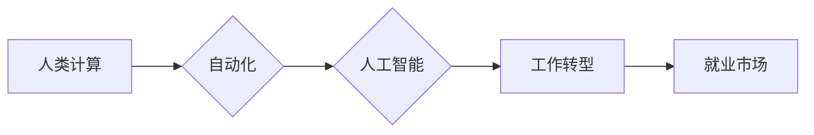

                 

## 人类计算：未来的工作和就业市场

> 关键词：人工智能、自动化、人类计算、工作转型、就业市场、未来趋势、技术发展

### 1. 背景介绍

近年来，人工智能（AI）技术飞速发展，其应用领域不断拓展，深刻地改变着人类社会各方面。从自动驾驶汽车到智能语音助手，从医疗诊断到金融交易，AI正在无处不在地改变着我们的生活方式和工作模式。然而，AI的发展也引发了人们对未来工作和就业市场的影响的担忧。

一方面，AI技术的自动化能力将替代一些传统工作岗位，例如数据录入、客服服务等。另一方面，AI技术也创造了新的工作机会，例如AI开发工程师、数据科学家、AI伦理专家等。因此，我们需要深入探讨AI对未来工作和就业市场的影响，并积极应对挑战，把握机遇。

### 2. 核心概念与联系

**2.1 人类计算**

人类计算是指利用人类的认知能力、创造力、判断力和解决问题的能力来完成计算任务。它强调人类在计算过程中发挥的主观能动性和智慧作用。

**2.2 自动化**

自动化是指利用机器或计算机程序自动执行重复性、规则性或危险性任务，以提高效率、降低成本和减少人为错误。

**2.3 人工智能**

人工智能是指模拟人类智能行为的计算机系统，例如学习、推理、决策、语言理解和生成等。

**2.4 关系图**



**2.5 核心概念联系**

人类计算、自动化和人工智能是相互关联、相互促进的三个概念。自动化技术可以解放人类从重复性劳动中解放出来，使人类能够专注于更复杂、更具创造性的工作。人工智能技术可以进一步提高自动化的效率和智能化水平，使机器能够完成更复杂的计算任务。而人类计算则在人工智能发展过程中发挥着至关重要的作用，例如在数据标注、算法设计和伦理决策等方面。

### 3. 核心算法原理 & 具体操作步骤

**3.1 算法原理概述**

人类计算的核心算法原理是基于人类认知能力的模拟和增强。例如，在自然语言处理领域，人类计算算法可以利用人类的语言理解和生成能力，训练机器模型更好地理解和生成自然语言。

**3.2 算法步骤详解**

1. **数据收集和预处理:** 收集与目标任务相关的原始数据，并进行清洗、格式化和转换等预处理操作。
2. **特征提取:** 从原始数据中提取与目标任务相关的特征，例如文本中的关键词、图像中的物体等。
3. **模型训练:** 利用训练数据和提取的特征，训练机器学习模型，例如深度神经网络。
4. **模型评估:** 使用测试数据评估模型的性能，并进行调优。
5. **模型部署:** 将训练好的模型部署到实际应用场景中，例如聊天机器人、语音助手等。

**3.3 算法优缺点**

**优点:**

* 能够处理复杂、非结构化数据。
* 具有较强的泛化能力，能够适应不同的应用场景。
* 可以不断学习和改进，提高模型性能。

**缺点:**

* 需要大量的数据进行训练。
* 训练过程耗时和耗能。
* 模型解释性较差，难以理解模型的决策过程。

**3.4 算法应用领域**

* 自然语言处理
* 图像识别
* 语音识别
* 机器翻译
* 医疗诊断
* 金融分析

### 4. 数学模型和公式 & 详细讲解 & 举例说明

**4.1 数学模型构建**

在人类计算中，常用的数学模型包括概率模型、统计模型和神经网络模型。

* **概率模型:** 用于描述随机事件的概率分布，例如贝叶斯网络、隐马尔可夫模型等。
* **统计模型:** 用于分析数据中的模式和趋势，例如线性回归、逻辑回归等。
* **神经网络模型:** 仿照人类大脑神经网络结构，用于学习和处理复杂数据，例如卷积神经网络、循环神经网络等。

**4.2 公式推导过程**

例如，在自然语言处理中，可以使用词嵌入模型来表示单词的语义信息。词嵌入模型通常使用神经网络进行训练，目标是学习一个词向量空间，使得相似的单词在该空间中的距离更近。

**4.3 案例分析与讲解**

例如，在图像识别领域，可以使用卷积神经网络模型来识别图像中的物体。卷积神经网络模型通过多个卷积层和池化层来提取图像特征，最终将特征映射到分类器中，进行物体分类。

### 5. 项目实践：代码实例和详细解释说明

**5.1 开发环境搭建**

可以使用Python语言和相关的机器学习库，例如TensorFlow、PyTorch等，来开发人类计算项目。

**5.2 源代码详细实现**

以下是一个简单的自然语言处理项目代码示例，使用Python和NLTK库实现文本分类任务：

```python
import nltk
from nltk.corpus import stopwords
from nltk.tokenize import word_tokenize
from sklearn.feature_extraction.text import TfidfVectorizer
from sklearn.naive_bayes import MultinomialNB
from sklearn.model_selection import train_test_split

# 下载NLTK资源
nltk.download('stopwords')
nltk.download('punkt')

# 数据集
train_data = [
    ("This is a positive review.", "positive"),
    ("This movie is terrible.", "negative"),
    ("I love this product.", "positive"),
    ("The service was awful.", "negative"),
]

# 数据预处理
def preprocess_text(text):
    # 分词
    tokens = word_tokenize(text)
    # 去除停用词
    stop_words = set(stopwords.words('english'))
    tokens = [word for word in tokens if word.lower() not in stop_words]
    return " ".join(tokens)

# 预处理训练数据
processed_train_data = [preprocess_text(text) for text, label in train_data]

# 特征提取
vectorizer = TfidfVectorizer()
X_train = vectorizer.fit_transform(processed_train_data)

# 模型训练
model = MultinomialNB()
model.fit(X_train, [label for text, label in train_data])

# 测试数据
test_data = [("This is a great product.", "positive")]
processed_test_data = [preprocess_text(text) for text, label in test_data]
X_test = vectorizer.transform(processed_test_data)

# 模型预测
prediction = model.predict(X_test)
print(prediction)
```

**5.3 代码解读与分析**

这段代码首先使用NLTK库对文本进行预处理，包括分词和去除停用词。然后使用TfidfVectorizer将文本转换为数字特征向量。最后使用MultinomialNB模型训练分类器，并对测试数据进行预测。

**5.4 运行结果展示**

运行这段代码后，会输出预测结果，例如：

```
['positive']
```

这表明模型预测测试数据属于“positive”类别。

### 6. 实际应用场景

**6.1 医疗诊断**

人类计算可以帮助医生更快、更准确地诊断疾病。例如，可以使用AI算法分析患者的病历、影像学检查结果和基因信息，辅助医生做出诊断。

**6.2 金融分析**

人类计算可以帮助金融机构识别欺诈交易、评估风险和预测市场趋势。例如，可以使用AI算法分析海量金融数据，识别异常交易行为。

**6.3 教育培训**

人类计算可以个性化教育培训，根据学生的学习进度和需求提供定制化的学习内容和辅导。例如，可以使用AI算法分析学生的学习数据，推荐合适的学习资源和学习路径。

**6.4 未来应用展望**

随着人工智能技术的不断发展，人类计算将在更多领域得到应用，例如：

* 自动驾驶汽车
* 智能家居
* 人机交互
* 创意设计

### 7. 工具和资源推荐

**7.1 学习资源推荐**

* **在线课程:** Coursera、edX、Udacity等平台提供丰富的AI和机器学习课程。
* **书籍:** 《深度学习》、《机器学习实战》等书籍是学习AI和机器学习的经典教材。
* **开源项目:** TensorFlow、PyTorch等开源项目提供了丰富的代码示例和学习资源。

**7.2 开发工具推荐**

* **Python:** Python是AI和机器学习开发的常用语言。
* **Jupyter Notebook:** Jupyter Notebook是一个交互式编程环境，方便进行AI和机器学习的实验和开发。
* **TensorFlow:** TensorFlow是一个开源的机器学习框架，支持多种深度学习模型的训练和部署。

**7.3 相关论文推荐**

* **《ImageNet Classification with Deep Convolutional Neural Networks》**
* **《Attention Is All You Need》**
* **《BERT: Pre-training of Deep Bidirectional Transformers for Language Understanding》**

### 8. 总结：未来发展趋势与挑战

**8.1 研究成果总结**

近年来，人类计算取得了显著进展，在自然语言处理、图像识别、语音识别等领域取得了突破性成果。

**8.2 未来发展趋势**

* **模型规模和能力的提升:** 未来的人类计算模型将更加强大，能够处理更加复杂的数据和任务。
* **模型解释性和可信度的增强:** 研究人员将致力于提高人类计算模型的解释性和可信度，使其能够更好地被人类理解和信任。
* **边缘计算和分布式计算:** 人类计算将更加广泛地应用于边缘设备和分布式计算环境，实现更加高效和灵活的计算。

**8.3 面临的挑战**

* **数据隐私和安全:** 人类计算需要处理大量的数据，如何保护数据隐私和安全是一个重要的挑战。
* **算法偏见和公平性:** 人类计算算法可能存在偏见，导致不公平的结果。如何解决算法偏见和确保公平性是一个重要的研究方向。
* **伦理和社会影响:** 人类计算的应用可能带来伦理和社会问题，例如工作岗位的替代、算法决策的透明度等。需要认真思考和应对这些挑战。

**8.4 研究展望**

未来，人类计算将继续朝着更加智能、高效、安全和可信的方向发展。研究人员将继续探索新的算法、模型和应用场景，推动人类计算技术的发展，并积极应对其带来的挑战，为人类社会创造更多价值。

### 9. 附录：常见问题与解答

**9.1 如何学习人类计算？**

学习人类计算可以从以下几个方面入手：

* 学习基础的计算机科学知识，例如算法、数据结构、编程语言等。
* 学习人工智能和机器学习的基础知识，例如监督学习、无监督学习、深度学习等。
* 学习相关的工具和技术，例如Python、TensorFlow、PyTorch等。
* 阅读相关的书籍、论文和博客文章，了解最新的研究成果和应用案例。

**9.2 人类计算会取代人类工作吗？**

人类计算不会完全取代人类工作，而是会改变工作方式，创造新的工作机会。

**9.3 如何应对人类计算带来的挑战？**

应对人类计算带来的挑战需要多方面的努力：

* 加强教育和培训，提升人们对人工智能和机器学习的理解和技能。
* 制定相关政策法规，规范人工智能的应用，保护数据隐私和安全。
* 促进社会对话，探讨人工智能的伦理和社会影响，寻求共识和解决方案。


作者：禅与计算机程序设计艺术 / Zen and the Art of Computer Programming 
<end_of_turn>

