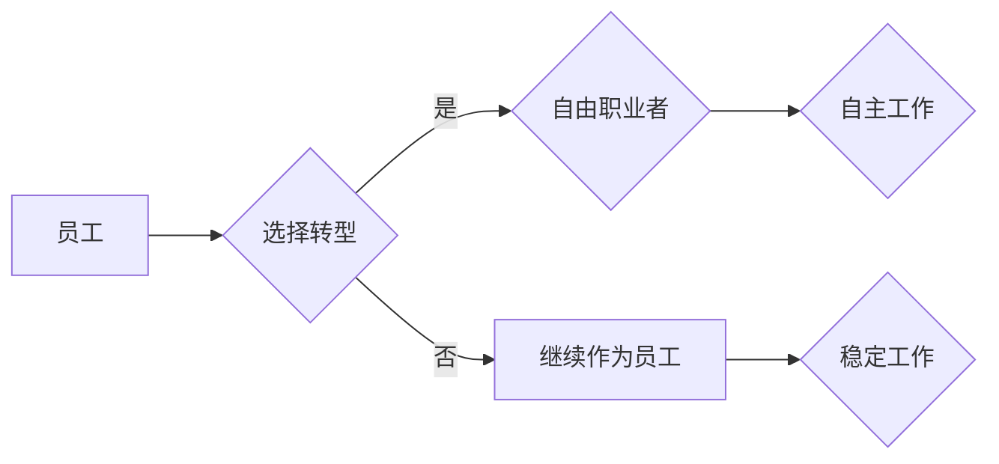

                 

## 从员工到自由职业者的转型指南

> 关键词：自由职业、转型、软件开发、项目管理、时间管理、职业发展、远程工作

### 1. 背景介绍

在当今科技飞速发展的时代，传统的雇佣模式正在逐渐被打破，自由职业者群体正在迅速壮大。软件开发、设计、写作、营销等领域，越来越多的专业人士选择成为自由职业者，享受自主工作、灵活时间和更高收入的自由。

对于许多技术人才来说，从员工到自由职业者的转型是一个充满机遇和挑战的旅程。它意味着告别稳定的工作环境和薪资保障，迎接更大的自由和责任。

### 2. 核心概念与联系

**2.1 自由职业者的定义**

自由职业者是指以个人身份，为多个客户提供服务，不受特定雇主的约束，拥有自主选择工作内容、时间和地点的独立工作者。

**2.2 自由职业与传统雇佣模式的对比**

| 特征 | 自由职业者 | 员工 |
|---|---|---|
| 工作关系 | 与多个客户合作 | 与单一雇主合作 |
| 工作时间 | 自主安排 | 固定工作时间 |
| 工作地点 | 可远程办公 | 固定办公地点 |
| 收入来源 | 项目付费 | 固定薪资 |
| 职业发展 | 自主学习和提升 | 公司培训和晋升 |

**2.3 自由职业者的优势**

* **自主性:** 自由选择工作内容、时间和地点，拥有更大的工作自由度。
* **灵活性:** 能够根据个人需求调整工作时间和节奏，更好地平衡工作与生活。
* **收入潜力:** 通过接单和项目管理，可以获得更高的收入回报。
* **职业发展:** 可以接触到更多不同的项目和客户，积累更丰富的经验和技能。

**2.4 自由职业者的挑战**

* **收入不稳定:** 收入取决于项目数量和客户支付能力，可能存在收入波动。
* **缺乏福利保障:** 没有员工的福利待遇，需要自己承担医疗、养老等方面的保障。
* **工作压力:** 需要自己管理时间和项目，承担更大的工作责任和压力。
* **孤独感:** 工作方式相对独立，可能缺乏团队合作和社交互动。

**2.5  Mermaid 流程图**



### 3. 核心算法原理 & 具体操作步骤

**3.1 算法原理概述**

从员工到自由职业者的转型是一个复杂的决策过程，需要综合考虑个人技能、经验、风险承受能力、市场需求等因素。

**3.2 算法步骤详解**

1. **自我评估:** 评估自身技能、经验、兴趣、职业目标和风险承受能力。
2. **市场调研:** 研究目标行业的市场需求、竞争情况、收入水平和发展趋势。
3. **技能提升:** 针对目标行业的需求，提升自身技能和知识，例如学习新的编程语言、掌握项目管理工具等。
4. **建立个人品牌:** 创建个人网站、博客或社交媒体账号，展示自己的技能和作品，建立个人品牌形象。
5. **寻找客户:** 通过网络平台、人脉关系或线下活动寻找潜在客户，并积极进行项目提案和谈判。
6. **项目管理:** 掌握项目管理工具和方法，有效管理项目进度、预算和质量。
7. **财务管理:** 建立合理的财务管理体系，包括收入记录、支出控制、税务申报等。
8. **持续学习:** 保持学习新知识和技能，适应市场变化和行业发展趋势。

**3.3 算法优缺点**

* **优点:** 能够帮助个人做出更理性的转型决策，提高转型成功率。
* **缺点:** 算法依赖于数据准确性和个人自我评估的真实性，存在一定的局限性。

**3.4 算法应用领域**

* **职业规划:** 帮助个人选择适合自己的职业发展路径。
* **人才招聘:** 帮助企业筛选和招聘符合需求的自由职业者。
* **项目管理:** 帮助自由职业者高效管理项目，提高工作效率。

### 4. 数学模型和公式 & 详细讲解 & 举例说明

**4.1 数学模型构建**

我们可以使用一个简单的数学模型来评估自由职业者的潜在收入：

```latex
潜在收入 = 项目数量 * 平均项目收入
```

其中：

* 项目数量：指自由职业者在一段时间内能够完成的项目数量。
* 平均项目收入：指每个项目的平均收入。

**4.2 公式推导过程**

这个公式的推导过程非常简单，它基于以下假设：

* 自由职业者的收入主要来自于完成项目。
* 每个项目的收入是固定的。

**4.3 案例分析与讲解**

假设一个自由职业者能够在一年内完成 10 个项目，每个项目的平均收入为 5000 美元，那么其潜在收入为：

```latex
潜在收入 = 10 * 5000 = 50000 美元
```

**4.4 举例说明**

这个模型可以帮助自由职业者评估其潜在收入，并根据实际情况调整项目数量和收入目标。

### 5. 项目实践：代码实例和详细解释说明

**5.1 开发环境搭建**

自由职业者需要搭建一个适合自己工作需求的开发环境。这可能包括：

* **电脑硬件:** 性能强大的电脑，能够满足开发和测试需求。
* **软件工具:** 各种开发工具，例如代码编辑器、版本控制系统、调试工具等。
* **网络连接:** 稳定可靠的网络连接，方便远程办公和与客户沟通。

**5.2 源代码详细实现**

以下是一个简单的 Python 代码实例，用于计算自由职业者的潜在收入：

```python
def calculate_potential_income(project_count, average_project_income):
  """
  计算自由职业者的潜在收入。

  Args:
    project_count: 项目数量。
    average_project_income: 平均项目收入。

  Returns:
    潜在收入。
  """
  potential_income = project_count * average_project_income
  return potential_income

# 获取用户输入
project_count = int(input("请输入项目数量: "))
average_project_income = float(input("请输入平均项目收入: "))

# 计算潜在收入
potential_income = calculate_potential_income(project_count, average_project_income)

# 输出结果
print("您的潜在收入为:", potential_income)
```

**5.3 代码解读与分析**

这个代码定义了一个名为 `calculate_potential_income` 的函数，它接受项目数量和平均项目收入作为参数，并返回潜在收入。

**5.4 运行结果展示**

当用户输入项目数量和平均项目收入后，程序会计算并输出潜在收入。

### 6. 实际应用场景

**6.1 软件开发**

自由职业的软件开发人员可以为各种企业和个人提供定制软件开发、网站开发、移动应用开发等服务。

**6.2 设计**

自由职业的设计师可以为企业提供品牌设计、网站设计、产品设计等服务。

**6.3 写作**

自由职业的作家可以为网站、杂志、书籍等平台提供文章、博客、文案等写作服务。

**6.4 市场营销**

自由职业的市场营销人员可以为企业提供社交媒体营销、搜索引擎优化、内容营销等服务。

**6.5 未来应用展望**

随着人工智能、云计算等技术的不断发展，自由职业的应用场景将会更加广泛，例如：

* **虚拟现实/增强现实开发:** 为游戏、教育、医疗等领域提供虚拟现实和增强现实应用开发服务。
* **数据分析:** 为企业提供数据分析、机器学习等服务，帮助企业洞察市场趋势和客户需求。
* **远程医疗:** 为医生提供远程医疗平台和服务，方便患者获得医疗服务。

### 7. 工具和资源推荐

**7.1 学习资源推荐**

* **在线课程平台:** Coursera、Udemy、edX 等平台提供各种技术相关的在线课程。
* **技术博客和论坛:** Hacker News、Stack Overflow、Medium 等平台提供丰富的技术资讯和讨论。
* **开源项目:** GitHub、GitLab 等平台提供大量的开源项目，可以帮助学习和实践技术。

**7.2 开发工具推荐**

* **代码编辑器:** Visual Studio Code、Sublime Text、Atom 等。
* **版本控制系统:** Git、GitHub 等。
* **项目管理工具:** Trello、Asana、Jira 等。

**7.3 相关论文推荐**

* **The Gig Economy: An Overview**
* **The Future of Work: How Technology is Transforming the Workplace**
* **The Rise of the Freelancer: A Global Perspective**

### 8. 总结：未来发展趋势与挑战

**8.1 研究成果总结**

从员工到自由职业者的转型是一个复杂的决策过程，需要综合考虑个人技能、经验、风险承受能力、市场需求等因素。

**8.2 未来发展趋势**

随着科技发展和经济全球化，自由职业者群体将会继续壮大，自由职业模式将会更加普及。

**8.3 面临的挑战**

自由职业者需要面对收入不稳定、缺乏福利保障、工作压力等挑战。

**8.4 研究展望**

未来研究可以关注以下方面：

* 如何帮助自由职业者更好地管理时间和项目，提高工作效率。
* 如何为自由职业者提供更完善的社会保障和职业发展支持。
* 如何促进自由职业者之间的合作和交流，构建更加完善的自由职业生态系统。

### 9. 附录：常见问题与解答

**9.1 如何找到自由职业项目？**

可以通过网络平台、人脉关系、线下活动等方式寻找自由职业项目。

**9.2 如何管理自由职业者的时间和项目？**

可以使用项目管理工具和方法，例如番茄工作法、看板法等，有效管理时间和项目。

**9.3 如何保障自由职业者的权益？**

可以通过签订合同、建立良好的客户关系、加入自由职业者协会等方式保障权益。


作者：禅与计算机程序设计艺术 / Zen and the Art of Computer Programming 
<end_of_turn>

