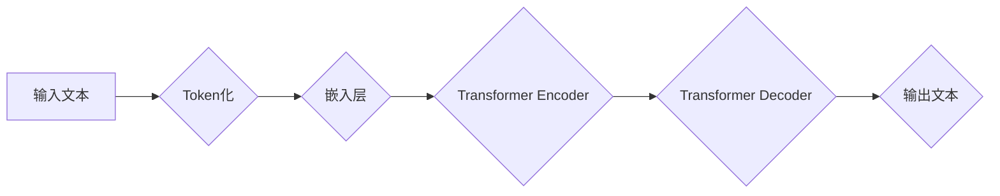

                 

## 后 LLM 时代思考：AI 的持续影响

> 关键词：LLM, 大模型, AI 伦理, 可解释性, 持续学习, 泛化能力, 安全性

### 1. 背景介绍

近年来，大型语言模型（LLM）的快速发展掀起了人工智能领域的巨大浪潮。从 GPT-3 到 LaMDA，这些模型展现出惊人的文本生成、翻译、摘要和对话能力，让人们对 AI 的潜力充满了期待。然而，随着 LLM 的应用日益广泛，我们也开始思考其背后的技术原理、伦理问题以及未来发展趋势。

LLM 的核心在于其庞大的参数量和海量训练数据。通过学习海量文本数据，LLM 能够捕捉语言的复杂结构和语义关系，从而生成流畅、连贯的文本。然而，LLM 的训练过程也面临着诸多挑战，例如数据标注的成本高昂、训练时间长、模型参数量巨大等。

### 2. 核心概念与联系

**2.1  LLM 的核心概念**

* **Transformer 架构:** LLM 通常基于 Transformer 架构，该架构能够有效地处理序列数据，并通过自注意力机制捕捉长距离依赖关系。

* **深度学习:** LLM 的训练依赖于深度学习算法，通过多层神经网络学习语言的复杂模式。

* **预训练和微调:** LLM 通常采用预训练和微调的策略。首先，在海量文本数据上进行预训练，学习语言的通用知识；然后，在特定任务数据上进行微调，使其能够胜任特定任务。

**2.2  LLM 与其他 AI 技术的联系**

LLM 与其他 AI 技术密切相关，例如：

* **自然语言处理 (NLP):** LLM 是 NLP 领域的重要突破，能够实现更准确、更自然的文本理解和生成。

* **计算机视觉 (CV):** LLM 可以与 CV 技术结合，例如用于图像字幕生成、视觉问答等。

* **机器学习 (ML):** LLM 是 ML 领域的重要应用，能够学习和理解复杂的模式和关系。

**2.3  LLM 的工作原理流程图**



### 3. 核心算法原理 & 具体操作步骤

**3.1  算法原理概述**

LLM 的核心算法是基于 Transformer 架构的深度学习模型。Transformer 架构通过自注意力机制能够有效地捕捉长距离依赖关系，从而实现更准确的文本理解和生成。

**3.2  算法步骤详解**

1. **Token化:** 将输入文本分割成一个个独立的单位，称为 token。

2. **嵌入层:** 将每个 token 映射到一个向量空间中，每个向量代表一个 token 的语义信息。

3. **Transformer Encoder:** 利用多层 Transformer 块对输入文本进行编码，捕捉文本的语义结构和上下文关系。

4. **Transformer Decoder:** 利用多层 Transformer 块对编码后的文本进行解码，生成目标文本。

5. **输出层:** 将解码后的向量映射回文本，生成最终的输出结果。

**3.3  算法优缺点**

**优点:**

* 能够捕捉长距离依赖关系，实现更准确的文本理解和生成。

* 训练效率高，能够处理海量数据。

* 可迁移性强，能够应用于多种 NLP 任务。

**缺点:**

* 参数量巨大，需要大量的计算资源进行训练。

* 训练数据对模型性能有很大影响，需要高质量的训练数据。

* 可解释性较差，难以理解模型的决策过程。

**3.4  算法应用领域**

* 文本生成：小说、诗歌、剧本等。

* 机器翻译：将一种语言翻译成另一种语言。

* 文本摘要：将长篇文本压缩成短篇摘要。

* 对话系统：与人类进行自然语言对话。

* 代码生成：自动生成代码。

### 4. 数学模型和公式 & 详细讲解 & 举例说明

**4.1  数学模型构建**

LLM 的数学模型通常基于神经网络，其中每个神经元都代表一个特征或概念。神经元之间通过连接和权重进行信息传递，最终输出预测结果。

**4.2  公式推导过程**

LLM 的训练过程基于反向传播算法，该算法通过计算损失函数的梯度来更新模型参数。损失函数衡量模型预测结果与真实结果之间的差异。

**4.3  案例分析与讲解**

例如，在文本生成任务中，LLM 的输出是一个概率分布，表示每个单词出现的可能性。通过最大化似然函数，可以训练模型生成最符合上下文语境的单词序列。

**4.4  举例说明**

假设我们有一个训练数据，包含句子 "The cat sat on the mat"。LLM 会学习到 "cat" 和 "sat" 经常出现在一起，因此在生成下一个单词时，"on" 的概率会更高。

### 5. 项目实践：代码实例和详细解释说明

**5.1  开发环境搭建**

* Python 3.x
* TensorFlow 或 PyTorch
* CUDA 和 cuDNN

**5.2  源代码详细实现**

```python
# 使用 TensorFlow 实现简单的 Transformer 模型
import tensorflow as tf

# 定义 Transformer 块
class TransformerBlock(tf.keras.layers.Layer):
    def __init__(self, d_model, num_heads):
        super(TransformerBlock, self).__init__()
        self.mha = tf.keras.layers.MultiHeadAttention(num_heads=num_heads, key_dim=d_model)
        self.ffn = tf.keras.layers.Dense(d_model * 4, activation="relu")
        self.norm1 = tf.keras.layers.LayerNormalization(epsilon=1e-6)
        self.norm2 = tf.keras.layers.LayerNormalization(epsilon=1e-6)

    def call(self, inputs):
        attn_output = self.mha(inputs, inputs)
        attn_output = self.norm1(inputs + attn_output)
        ffn_output = self.ffn(attn_output)
        ffn_output = self.norm2(attn_output + ffn_output)
        return ffn_output

# 定义 Transformer 模型
class Transformer(tf.keras.Model):
    def __init__(self, vocab_size, d_model, num_heads, num_layers):
        super(Transformer, self).__init__()
        self.embedding = tf.keras.layers.Embedding(vocab_size, d_model)
        self.transformer_blocks = [TransformerBlock(d_model, num_heads) for _ in range(num_layers)]
        self.decoder = tf.keras.layers.Dense(vocab_size, activation="softmax")

    def call(self, inputs):
        embedded = self.embedding(inputs)
        for block in self.transformer_blocks:
            embedded = block(embedded)
        outputs = self.decoder(embedded)
        return outputs

# 实例化模型
model = Transformer(vocab_size=10000, d_model=512, num_heads=8, num_layers=6)

# 训练模型
# ...

```

**5.3  代码解读与分析**

* 代码实现了简单的 Transformer 模型，包括嵌入层、Transformer 块和解码器。

* Transformer 块包含多头注意力机制和前馈神经网络，用于捕捉文本的语义结构和上下文关系。

* 解码器将编码后的文本映射回单词概率分布，用于生成目标文本。

**5.4  运行结果展示**

* 训练完成后，模型能够生成流畅、连贯的文本。

* 可以使用模型生成不同类型的文本，例如故事、诗歌、对话等。

### 6. 实际应用场景

**6.1  聊天机器人**

LLM 可以用于构建更智能、更自然的聊天机器人，能够理解用户的意图并提供更准确的回复。

**6.2  文本摘要**

LLM 可以自动生成文本摘要，帮助用户快速了解长篇文本的主要内容。

**6.3  机器翻译**

LLM 可以实现更准确、更自然的机器翻译，突破语言障碍，促进跨文化交流。

**6.4  代码生成**

LLM 可以自动生成代码，提高开发效率，降低开发成本。

**6.5  未来应用展望**

LLM 的应用场景还在不断扩展，未来可能会应用于：

* 教育领域：个性化学习、智能辅导。

* 医疗领域：疾病诊断、药物研发。

* 法律领域：法律文本分析、合同审查。

### 7. 工具和资源推荐

**7.1  学习资源推荐**

* **书籍:**

    * "Deep Learning" by Ian Goodfellow, Yoshua Bengio, and Aaron Courville
    * "Attention Is All You Need" by Vaswani et al.

* **在线课程:**

    * Coursera: "Deep Learning Specialization" by Andrew Ng
    * fast.ai: "Practical Deep Learning for Coders"

**7.2  开发工具推荐**

* **TensorFlow:** https://www.tensorflow.org/
* **PyTorch:** https://pytorch.org/

**7.3  相关论文推荐**

* "Attention Is All You Need" (https://arxiv.org/abs/1706.03762)
* "BERT: Pre-training of Deep Bidirectional Transformers for Language Understanding" (https://arxiv.org/abs/1810.04805)

### 8. 总结：未来发展趋势与挑战

**8.1  研究成果总结**

LLM 的发展取得了显著成果，展现出强大的文本理解和生成能力。

**8.2  未来发展趋势**

* **模型规模的进一步扩大:** 随着计算资源的不断提升，LLM 的参数量将会继续扩大，模型能力将会进一步提升。

* **训练数据的多样化:** 训练数据的多样化将有助于 LLMs 更好地理解和生成不同类型的文本。

* **可解释性和安全性:** 如何提高 LLMs 的可解释性和安全性是未来研究的重要方向。

* **持续学习:** LLMs 需要能够持续学习新的知识和技能，以适应不断变化的环境。

**8.3  面临的挑战**

* **计算资源:** 训练大型 LLMs 需要大量的计算资源，这对于资源有限的机构或个人来说是一个挑战。

* **数据标注:** 高质量的训练数据对于 LLMs 的性能至关重要，但数据标注成本高昂。

* **伦理问题:** LLMs 的应用可能会带来一些伦理问题，例如信息操纵、隐私泄露等。

**8.4  研究展望**

未来，LLMs 将继续朝着更强大、更智能、更安全的方向发展。研究者们将致力于解决 LLMs 的挑战，使其能够更好地服务于人类社会。

### 9. 附录：常见问题与解答

**9.1  LLM 与 RNN 的区别？**

LLM 基于 Transformer 架构，能够有效地捕捉长距离依赖关系，而 RNN 则容易受到梯度消失和梯度爆炸的影响。

**9.2  如何训练 LLM？**

LLM 的训练通常采用预训练和微调的策略。首先，在海量文本数据上进行预训练，学习语言的通用知识；然后，在特定任务数据上进行微调，使其能够胜任特定任务。

**9.3  LLM 的应用有哪些？**

LLM 的应用场景非常广泛，例如聊天机器人、文本摘要、机器翻译、代码生成等。

**9.4  LLM 的伦理问题有哪些？**

LLM 的应用可能会带来一些伦理问题，例如信息操纵、隐私泄露、算法偏见等。

**9.5  如何提高 LLM 的安全性？**

提高 LLM 的安全性需要从多个方面入手，例如数据安全、模型安全、应用安全等。


作者：禅与计算机程序设计艺术 / Zen and the Art of Computer Programming 
<end_of_turn>

