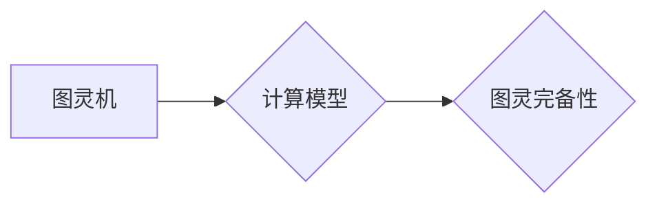

                 

## 图灵完备性:衡量计算系统能力的标准

> 关键词：图灵完备性、计算模型、算法、逻辑、计算机科学、人工智能

## 1. 背景介绍

在计算机科学领域，我们常常需要评估不同计算系统的能力。一个计算系统是否强大，是否能够解决复杂问题，取决于其所能执行的计算任务的范围。为了衡量计算系统的能力，我们引入了“图灵完备性”的概念。

图灵完备性是一个重要的理论概念，它描述了一个计算系统是否能够模拟任何图灵机。图灵机是一种抽象的计算模型，被认为是所有可能的算法的通用模型。如果一个计算系统是图灵完备的，就意味着它能够执行任何图灵机能够执行的任务。

图灵完备性是计算机科学领域的一个核心概念，它对我们理解计算能力、算法复杂性和人工智能的发展有着深远的影响。

## 2. 核心概念与联系

### 2.1 图灵机

图灵机是一种抽象的计算模型，由以下几个部分组成：

* **无限长的带**: 用于存储数据，带上的每个位置可以存储一个符号。
* **一个读写头**: 可以读取和写入带上的符号。
* **一个状态机**: 控制读写头的动作，并根据当前状态和读取到的符号决定下一步的操作。

图灵机通过一系列有限状态的转换和符号的读写来执行计算。

### 2.2 计算模型

计算模型是指用来描述和分析计算过程的抽象框架。不同的计算模型具有不同的特点和能力，例如：

* **图灵机**: 理论上最强大的计算模型，能够模拟任何算法。
* **有限状态机**: 只能执行有限数量的计算，适用于简单的任务。
* **概率图模型**: 用于处理不确定性问题，例如人工智能中的决策和推理。

### 2.3 图灵完备性

图灵完备性是指一个计算模型能够模拟任何图灵机。如果一个计算模型是图灵完备的，就意味着它能够执行任何图灵机能够执行的任务。

**Mermaid 流程图**



## 3. 核心算法原理 & 具体操作步骤

### 3.1 算法原理概述

图灵完备性是一个理论概念，它并不依赖于具体的算法。任何能够模拟图灵机的算法都是图灵完备的。

### 3.2 算法步骤详解

由于图灵完备性是一个理论概念，它没有具体的算法步骤。

### 3.3 算法优缺点

图灵完备性本身没有优缺点，因为它是一个描述计算能力的性质，而不是一个具体的算法。

### 3.4 算法应用领域

图灵完备性在计算机科学领域有着广泛的应用，例如：

* **人工智能**: 许多人工智能算法，例如深度学习，都是基于图灵完备的计算模型。
* **编程语言**: 许多编程语言，例如Python和Java，都是图灵完备的。
* **理论计算机科学**: 图灵完备性是理论计算机科学研究的核心概念之一。

## 4. 数学模型和公式 & 详细讲解 & 举例说明

### 4.1 数学模型构建

图灵完备性的数学模型是基于图灵机的形式化定义。图灵机可以被描述为一个五元组：

* **Q**: 有限状态集
* **Σ**: 输入符号集
* **Γ**: 带符号集
* **δ**: 转移函数
* **q0**: 初始状态

其中，转移函数δ定义了图灵机在每个状态下，根据读取到的符号，如何移动读写头，改变状态，并写入新的符号。

### 4.2 公式推导过程

图灵完备性的证明是一个复杂的数学证明，涉及到逻辑、集合论和计算理论等多个领域。

### 4.3 案例分析与讲解

一个著名的例子是证明编程语言Lambda演算是图灵完备的。Lambda演算是一种简单的函数式编程语言，它只包含了变量、函数定义和函数应用等基本操作。通过证明Lambda演算能够模拟任何图灵机，我们就证明了Lambda演算是图灵完备的。

## 5. 项目实践：代码实例和详细解释说明

### 5.1 开发环境搭建

为了实现图灵机的模拟，我们可以使用Python语言和相应的库。

### 5.2 源代码详细实现

```python
class TuringMachine:
    def __init__(self, states, alphabet, tape, transition_function, initial_state):
        self.states = states
        self.alphabet = alphabet
        self.tape = tape
        self.transition_function = transition_function
        self.current_state = initial_state
        self.head_position = 0

    def step(self):
        current_symbol = self.tape[self.head_position]
        next_state, new_symbol, direction = self.transition_function[(self.current_state, current_symbol)]
        self.tape[self.head_position] = new_symbol
        self.current_state = next_state
        if direction == 'R':
            self.head_position += 1
        elif direction == 'L':
            self.head_position -= 1

    def run(self):
        while self.current_state != 'halt':
            self.step()

# 示例代码
states = {'q0', 'q1', 'q2', 'halt'}
alphabet = {'0', '1'}
tape = ['0'] * 100
transition_function = {
    ('q0', '0'): ('q1', '1', 'R'),
    ('q0', '1'): ('q2', '0', 'R'),
    ('q1', '0'): ('q2', '1', 'R'),
    ('q1', '1'): ('q0', '0', 'L'),
    ('q2', '0'): ('halt', '0', 'R'),
    ('q2', '1'): ('halt', '1', 'R')
}
initial_state = 'q0'
tm = TuringMachine(states, alphabet, tape, transition_function, initial_state)
tm.run()
```

### 5.3 代码解读与分析

这段代码实现了图灵机的基本功能，包括状态转移、符号读写和读写头移动。

### 5.4 运行结果展示

运行这段代码后，图灵机会按照预定义的规则进行计算，最终停机。

## 6. 实际应用场景

### 6.1 编程语言设计

图灵完备性是编程语言设计的重要标准。一个图灵完备的编程语言能够表达任何可计算的算法，因此它能够解决各种复杂问题。

### 6.2 计算机科学研究

图灵完备性是计算机科学研究的核心概念之一。它帮助我们理解计算能力的本质，并探索计算的边界。

### 6.3 人工智能开发

许多人工智能算法，例如深度学习，都是基于图灵完备的计算模型。图灵完备性使得人工智能能够学习和解决复杂问题。

### 6.4 未来应用展望

随着计算技术的不断发展，图灵完备性将继续在计算机科学、人工智能和相关领域发挥重要作用。

## 7. 工具和资源推荐

### 7.1 学习资源推荐

* **《图灵完备性》**: 这本书详细介绍了图灵完备性的概念和证明。
* **《计算机科学导论》**: 这本书介绍了计算机科学的基本概念，包括图灵完备性。
* **在线课程**: 许多在线平台提供关于图灵完备性的课程。

### 7.2 开发工具推荐

* **Python**: Python是一种流行的编程语言，它可以用来实现图灵机的模拟。
* **Java**: Java也是一种流行的编程语言，它可以用来实现图灵机的模拟。

### 7.3 相关论文推荐

* **Alan Turing, "On Computable Numbers, with an Application to the Entscheidungsproblem"**: 这篇论文提出了图灵机的概念。
* **Stephen Wolfram, "A New Kind of Science"**: 这本书探讨了图灵完备性和复杂系统的性质。

## 8. 总结：未来发展趋势与挑战

### 8.1 研究成果总结

图灵完备性是计算机科学领域的一个重要理论概念，它帮助我们理解计算能力的本质，并探索计算的边界。

### 8.2 未来发展趋势

随着计算技术的不断发展，图灵完备性将继续在计算机科学、人工智能和相关领域发挥重要作用。

### 8.3 面临的挑战

图灵完备性是一个理论概念，它并不意味着我们可以轻松地实现任何算法。许多算法的实现仍然面临着巨大的挑战。

### 8.4 研究展望

未来，我们将继续探索图灵完备性的性质，并将其应用于新的领域。


## 9. 附录：常见问题与解答

### 9.1 什么是图灵机？

图灵机是一种抽象的计算模型，它由一个无限长的带、一个读写头和一个状态机组成。

### 9.2 为什么图灵完备性很重要？

图灵完备性是一个重要的理论概念，它描述了一个计算系统是否能够模拟任何图灵机。如果一个计算系统是图灵完备的，就意味着它能够执行任何图灵机能够执行的任务。

### 9.3 所有编程语言都是图灵完备的吗？

不是所有编程语言都是图灵完备的。一些简单的编程语言，例如有限状态机，不是图灵完备的。

### 9.4 图灵完备性与人工智能有什么关系？

许多人工智能算法，例如深度学习，都是基于图灵完备的计算模型。图灵完备性使得人工智能能够学习和解决复杂问题。


作者：禅与计算机程序设计艺术 / Zen and the Art of Computer Programming 
<end_of_turn>

