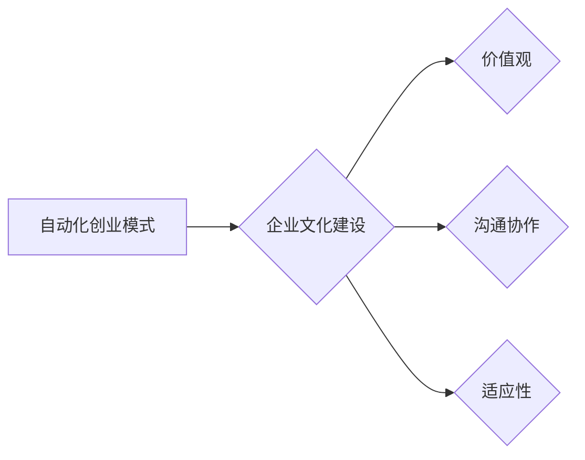

                 

## 如何在自动化创业中建立企业文化

> 关键词：自动化创业、企业文化、价值观、团队建设、远程办公、流程自动化、数据驱动、创新文化、适应性

### 1. 背景介绍

在当今科技飞速发展的时代，自动化创业模式正日益成为主流。自动化创业的核心在于利用技术手段，构建高效、可扩展的商业模式，减少人力成本，提高运营效率。然而，在追求技术效率的同时，企业文化建设却不容忽视。企业文化是企业灵魂，它凝聚着团队的价值观、行为准则和共同目标，是企业长期发展的基石。

自动化创业的特点，例如远程办公、扁平化组织结构、数据驱动决策等，对企业文化建设提出了新的挑战和机遇。如何建立适应自动化创业模式的企业文化，成为企业家和管理者需要认真思考的问题。

### 2. 核心概念与联系

#### 2.1 企业文化

企业文化是指企业成员共同认同的价值观、信念、行为规范、习俗和氛围。它潜移默化地影响着员工的行为、决策和工作方式，最终塑造企业的形象和竞争力。

#### 2.2 自动化创业

自动化创业是指利用自动化技术，构建高效、可扩展的商业模式，减少人力成本，提高运营效率。其核心特征包括：

* **远程办公:** 员工可以不受地域限制，通过网络远程协作。
* **扁平化组织结构:** 层级结构扁平化，决策流程简化。
* **数据驱动决策:** 利用数据分析，为决策提供依据。
* **流程自动化:** 利用技术手段，自动化重复性工作流程。

#### 2.3 企业文化与自动化创业的关系

自动化创业模式对企业文化提出了新的要求：

* **价值观:** 自动化创业强调效率、创新和数据驱动，企业文化应体现这些价值观。
* **沟通协作:** 远程办公模式下，高效的沟通协作至关重要，企业文化应鼓励团队合作和信息共享。
* **适应性:** 自动化创业环境瞬息万变，企业文化应具备高度的适应性，能够快速响应变化。

**Mermaid 流程图**



### 3. 核心算法原理 & 具体操作步骤

#### 3.1 算法原理概述

建立企业文化并非一个简单的算法，它需要综合考虑多种因素，并通过持续的实践和调整来实现。

#### 3.2 算法步骤详解

1. **明确企业愿景和价值观:** 企业领导需要清晰地定义企业的愿景、使命和价值观，并将其传达给全体员工。
2. **建立沟通协作机制:** 远程办公模式下，需要建立高效的沟通协作机制，例如使用协作工具、定期线上会议等。
3. **培养创新文化:** 自动化创业强调创新，企业文化应鼓励员工提出新想法，并为其提供支持和资源。
4. **注重员工成长:** 企业应提供员工培训和发展机会，帮助员工提升技能和知识，实现个人成长。
5. **持续评估和改进:** 企业文化建设是一个持续的过程，需要定期评估和改进，以适应不断变化的市场环境和企业发展需求。

#### 3.3 算法优缺点

* **优点:** 建立企业文化可以提升员工士气、增强团队凝聚力、提高企业竞争力。
* **缺点:** 企业文化建设是一个复杂的过程，需要时间和精力投入，并可能面临文化冲突等挑战。

#### 3.4 算法应用领域

企业文化建设适用于所有类型的企业，尤其是在自动化创业模式下，它更具重要性。

### 4. 数学模型和公式 & 详细讲解 & 举例说明

#### 4.1 数学模型构建

企业文化可以抽象为一个多维度的向量空间，每个维度代表一个特定的文化要素，例如价值观、行为规范、团队合作等。每个员工在该空间中都拥有一个独特的文化向量，代表其对企业文化的理解和认同程度。

#### 4.2 公式推导过程

由于企业文化是一个复杂的概念，难以用简单的数学公式精确描述。但我们可以通过一些统计方法，例如聚类分析、主成分分析等，来量化企业文化要素，并分析员工对企业文化的认同程度。

#### 4.3 案例分析与讲解

例如，我们可以通过问卷调查，收集员工对企业价值观的理解和认同程度，并将其转化为数值数据。然后，利用聚类分析算法，将员工分为不同的文化群体，分析不同文化群体的特征和差异。

### 5. 项目实践：代码实例和详细解释说明

#### 5.1 开发环境搭建

* 语言：Python
* 库：Pandas、Scikit-learn
* 工具：Jupyter Notebook

#### 5.2 源代码详细实现

```python
import pandas as pd
from sklearn.cluster import KMeans

# 加载问卷调查数据
data = pd.read_csv("employee_survey.csv")

# 选择与企业文化相关的特征
features = data[['value1', 'value2', 'value3']]

# 使用KMeans算法进行聚类
kmeans = KMeans(n_clusters=3)
kmeans.fit(features)

# 将聚类结果添加到数据中
data['cluster'] = kmeans.labels_

# 分析不同文化群体的特征
for cluster in range(3):
    cluster_data = data[data['cluster'] == cluster]
    print(f"Cluster {cluster} characteristics:")
    print(cluster_data.describe())
```

#### 5.3 代码解读与分析

这段代码首先加载问卷调查数据，然后选择与企业文化相关的特征进行聚类分析。使用KMeans算法将员工分为3个文化群体，并分析每个群体的特征。

#### 5.4 运行结果展示

运行结果将显示每个文化群体的特征描述，例如平均值、标准差等，帮助企业领导了解不同文化群体的特点，并制定相应的文化建设策略。

### 6. 实际应用场景

#### 6.1 远程办公团队文化建设

自动化创业模式下，远程办公成为常态。如何建立远程办公团队的文化，保持团队凝聚力和协作效率，是企业面临的挑战。可以通过线上团队建设活动、虚拟办公空间等方式，增强团队成员之间的互动和沟通，建立共同的价值观和目标。

#### 6.2 数据驱动决策文化

自动化创业强调数据驱动决策。企业文化应鼓励员工收集、分析和利用数据，为决策提供依据。可以通过建立数据共享平台、提供数据分析培训等方式，培养员工的数据分析能力和数据驱动决策意识。

#### 6.3 创新文化建设

自动化创业需要不断创新，企业文化应鼓励员工提出新想法，并为其提供支持和资源。可以通过设立创新奖项、组织hackathon等活动，激发员工的创新热情，并为创新项目提供资金和资源支持。

#### 6.4 未来应用展望

随着自动化技术的不断发展，企业文化建设将更加注重人工智能、大数据等技术的应用。例如，可以通过人工智能分析员工行为数据，识别潜在的文化问题，并提供相应的解决方案。

### 7. 工具和资源推荐

#### 7.1 学习资源推荐

* 书籍：《企业文化》
* 网站：Harvard Business Review

#### 7.2 开发工具推荐

* 协作工具：Slack、Microsoft Teams
* 数据分析工具：Tableau、Power BI

#### 7.3 相关论文推荐

* "The Impact of Organizational Culture on Employee Performance"
* "Building a Strong Organizational Culture in the Digital Age"

### 8. 总结：未来发展趋势与挑战

#### 8.1 研究成果总结

自动化创业模式对企业文化建设提出了新的挑战和机遇。建立适应自动化创业模式的企业文化，需要明确企业愿景和价值观，建立高效的沟通协作机制，培养创新文化，注重员工成长，并持续评估和改进。

#### 8.2 未来发展趋势

未来，企业文化建设将更加注重人工智能、大数据等技术的应用，利用数据分析和预测模型，更好地理解员工需求，并提供个性化的文化建设方案。

#### 8.3 面临的挑战

* 如何在远程办公环境下，建立和维护企业文化？
* 如何平衡自动化效率和员工人性化需求？
* 如何应对文化冲突和差异？

#### 8.4 研究展望

未来研究将重点关注以下几个方面：

* 自动化创业模式下，企业文化建设的最佳实践。
* 人工智能在企业文化建设中的应用。
* 如何构建适应未来变化的企业文化。

### 9. 附录：常见问题与解答

#### 9.1 如何建立远程办公团队的文化？

可以通过线上团队建设活动、虚拟办公空间等方式，增强团队成员之间的互动和沟通，建立共同的价值观和目标。

#### 9.2 如何平衡自动化效率和员工人性化需求？

企业应在追求自动化效率的同时，关注员工的职业发展、心理健康等需求，提供人性化的工作环境和福利待遇。

#### 9.3 如何应对文化冲突和差异？

企业应建立多元文化包容的氛围，尊重不同文化背景的员工，并通过沟通和协商，化解文化冲突。


作者：禅与计算机程序设计艺术 / Zen and the Art of Computer Programming 
<end_of_turn>

