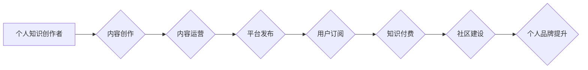

                 

## 如何打造个人知识付费订阅模式

> 关键词：知识付费、订阅模式、个人品牌、内容运营、社区建设、技术博客、在线课程、会员体系

### 1. 背景介绍

在互联网时代，知识成为最宝贵的资源。个人知识付费订阅模式的兴起，为知识创作者提供了新的盈利方式，也为知识渴求者提供了便捷高效的学习途径。 

随着互联网技术的不断发展，人们对知识的需求日益增长，而传统教育模式的局限性也越来越明显。个人知识付费订阅模式的出现，填补了这一空白，为个人知识创作者提供了展示自我、分享知识、获取收益的平台。

### 2. 核心概念与联系

**2.1 知识付费**

知识付费是指知识创作者将自己的知识、技能、经验等打包成产品或服务，通过线上平台向付费用户提供。

**2.2 订阅模式**

订阅模式是指用户支付一定的费用，定期获得指定内容或服务。

**2.3 个人品牌**

个人品牌是指个人在特定领域积累的声誉、认知度和影响力。

**2.4 内容运营**

内容运营是指围绕目标用户，策划、创作、发布、推广和运营优质内容，以吸引用户关注和互动。

**2.5 社区建设**

社区建设是指围绕共同兴趣或目标，建立线上或线下的互动平台，促进用户之间的交流和分享。

**2.6 流程图**



### 3. 核心算法原理 & 具体操作步骤

**3.1 算法原理概述**

个人知识付费订阅模式的核心算法原理在于用户价值最大化和内容价值持续提升。

* **用户价值最大化:** 通过精准定位目标用户，提供个性化内容和服务，满足用户需求，提升用户粘性。
* **内容价值持续提升:**  持续创作优质内容，不断更新和迭代，保持用户新鲜感，提升内容价值。

**3.2 算法步骤详解**

1. **目标用户定位:** 分析目标用户的需求、兴趣、痛点等，精准定位目标用户群体。
2. **内容规划:** 根据目标用户需求，规划内容主题、内容形式、内容节奏等，确保内容价值和用户需求匹配。
3. **内容创作:**  创作高质量、有价值的内容，例如文章、视频、音频、直播等，满足用户学习和娱乐需求。
4. **内容运营:**  通过社交媒体、邮件营销、搜索引擎优化等方式，推广和运营内容，提升内容曝光率和用户粘性。
5. **社区建设:**  建立线上或线下社区，促进用户之间的交流和分享，增强用户粘性和品牌忠诚度。
6. **会员体系:**  建立会员体系，提供不同等级的会员服务，例如独家内容、线下活动、专家咨询等，提升用户付费意愿。
7. **数据分析:**  收集用户数据，分析用户行为和反馈，不断优化内容和运营策略，提升用户价值和内容价值。

**3.3 算法优缺点**

* **优点:** 
    * 能够有效地将知识转化为价值，为知识创作者提供新的盈利模式。
    * 能够满足用户个性化学习需求，提升用户学习体验。
    * 能够建立用户粘性和品牌忠诚度，促进知识传播和价值传递。
* **缺点:** 
    * 需要持续创作优质内容，才能保持用户粘性和付费意愿。
    * 需要投入时间和精力进行内容运营和社区建设。
    * 需要掌握一定的市场营销和用户运营技巧。

**3.4 算法应用领域**

个人知识付费订阅模式广泛应用于各个领域，例如：

* **技术领域:**  程序员、设计师、数据科学家等技术人员可以分享自己的技术经验和技能，通过在线课程、视频教程、代码库等形式提供付费服务。
* **商业领域:**  企业家、管理者、营销专家等商业人士可以分享自己的商业经验和案例，通过线上课程、咨询服务、商业分析等形式提供付费服务。
* **生活领域:**  作家、艺术家、美食家等生活领域的专家可以分享自己的生活经验和技巧，通过线上课程、写作指导、生活方式分享等形式提供付费服务。

### 4. 数学模型和公式 & 详细讲解 & 举例说明

**4.1 数学模型构建**

我们可以用一个简单的数学模型来描述个人知识付费订阅模式的收益：

```latex
收益 = 用户数量 * 平均付费金额 * 续订率
```

其中：

* 用户数量：订阅模式的用户总数。
* 平均付费金额：每个用户平均支付的金额。
* 续订率：用户续订订阅的比例。

**4.2 公式推导过程**

这个公式的推导过程很简单，就是将订阅模式的收入分解成三个关键因素：用户数量、付费金额和续订率。

* 用户数量： 更多用户意味着更多的潜在收入。
* 平均付费金额：更高的付费金额意味着更高的收入。
* 续订率：更高的续订率意味着更稳定的收入流。

**4.3 案例分析与讲解**

假设一个技术博客拥有 1000 个订阅用户，每个用户平均每月支付 10 美元，续订率为 80%。那么，该博客的每月收益为：

```latex
收益 = 1000 * 10 * 0.8 = 8000 美元
```

从这个例子可以看出，用户数量、付费金额和续订率对知识付费订阅模式的收益都有很大的影响。

### 5. 项目实践：代码实例和详细解释说明

**5.1 开发环境搭建**

* **操作系统:**  Windows, macOS, Linux
* **编程语言:**  Python, JavaScript, Go
* **框架:**  Django, Flask, React, Vue.js
* **数据库:**  MySQL, PostgreSQL, MongoDB

**5.2 源代码详细实现**

由于篇幅限制，这里只提供一个简单的 Python 代码示例，用于演示知识付费订阅模式的基本逻辑：

```python
class Subscription:
    def __init__(self, user_id, plan_id, start_date, end_date):
        self.user_id = user_id
        self.plan_id = plan_id
        self.start_date = start_date
        self.end_date = end_date

    def is_active(self):
        return datetime.now() < self.end_date

# 用户订阅计划
class Plan:
    def __init__(self, id, name, price, duration):
        self.id = id
        self.name = name
        self.price = price
        self.duration = duration

# 用户订阅管理
class SubscriptionManager:
    def __init__(self):
        self.subscriptions = []

    def create_subscription(self, user_id, plan_id):
        # 创建订阅记录
        subscription = Subscription(user_id, plan_id, datetime.now(), datetime.now() + timedelta(days=plan.duration))
        self.subscriptions.append(subscription)
        return subscription

    def get_active_subscriptions(self, user_id):
        # 获取用户活跃订阅
        return [s for s in self.subscriptions if s.user_id == user_id and s.is_active()]

# 示例代码
subscription_manager = SubscriptionManager()
plan = Plan(1, "Basic", 10, 30)
subscription = subscription_manager.create_subscription(1, 1)
print(subscription_manager.get_active_subscriptions(1))
```

**5.3 代码解读与分析**

这段代码定义了三个类：

* `Subscription`: 代表用户订阅记录，包含用户 ID、计划 ID、开始日期和结束日期。
* `Plan`: 代表订阅计划，包含计划 ID、名称、价格和时长。
* `SubscriptionManager`: 管理用户订阅记录，提供创建订阅和获取活跃订阅的功能。

**5.4 运行结果展示**

运行这段代码后，会输出用户 1 的活跃订阅记录。

### 6. 实际应用场景

**6.1 技术博客**

技术博客可以提供付费订阅服务，例如：

* 独家文章和教程
* 代码库和工具
* 线上社区和交流
* 专家咨询和指导

**6.2 在线课程平台**

在线课程平台可以提供付费订阅服务，例如：

* 不同主题的课程
* 不同等级的会员
* 独家直播和互动

**6.3 会员网站**

会员网站可以提供付费订阅服务，例如：

* 独家内容和资源
* 线上社区和交流
* 会员折扣和优惠

**6.4 未来应用展望**

个人知识付费订阅模式的未来应用前景广阔，例如：

* **个性化学习:**  根据用户的学习进度和需求，提供个性化的学习内容和服务。
* **沉浸式体验:**  利用虚拟现实和增强现实技术，提供更沉浸式的学习体验。
* **人工智能辅助:**  利用人工智能技术，提供更智能化的学习建议和个性化辅导。

### 7. 工具和资源推荐

**7.1 学习资源推荐**

* **书籍:**  《零基础学编程》、《Python编程入门》、《数据结构与算法》
* **网站:**  Coursera, edX, Udemy
* **博客:**  Hacker News, Stack Overflow

**7.2 开发工具推荐**

* **代码编辑器:**  VS Code, Sublime Text, Atom
* **数据库管理工具:**  MySQL Workbench, pgAdmin
* **版本控制系统:**  Git, GitHub

**7.3 相关论文推荐**

* **知识付费模式的构建与发展**
* **在线教育平台的商业模式创新**
* **人工智能技术在知识付费领域的应用**

### 8. 总结：未来发展趋势与挑战

**8.1 研究成果总结**

个人知识付费订阅模式已经成为一种成熟的商业模式，为知识创作者和用户提供了新的价值创造和获取途径。

**8.2 未来发展趋势**

未来，个人知识付费订阅模式将朝着以下方向发展：

* **个性化定制:**  根据用户的学习需求和习惯，提供更个性化的学习内容和服务。
* **沉浸式体验:**  利用虚拟现实和增强现实技术，提供更沉浸式的学习体验。
* **人工智能辅助:**  利用人工智能技术，提供更智能化的学习建议和个性化辅导。

**8.3 面临的挑战**

个人知识付费订阅模式也面临一些挑战：

* **内容质量:**  需要持续创作高质量、有价值的内容，才能吸引和留住用户。
* **用户粘性:**  需要不断提升用户体验，才能提高用户粘性和付费意愿。
* **市场竞争:**  市场竞争激烈，需要不断创新和优化，才能脱颖而出。

**8.4 研究展望**

未来，我们需要进一步研究个人知识付费订阅模式的商业模式、技术架构、用户运营等方面，探索更有效的知识传播和价值创造模式。

### 9. 附录：常见问题与解答

**9.1 如何选择合适的知识付费平台？**

选择知识付费平台需要考虑以下因素：

* 平台的用户规模和活跃度
* 平台的收费模式和分成比例
* 平台的技术支持和运营服务

**9.2 如何提升知识付费内容的质量？**

提升知识付费内容的质量需要：

* 深入研究目标用户需求
* 创作原创、有价值的内容
* 采用多种形式呈现内容
* 持续更新和迭代内容

**9.3 如何提高知识付费内容的曝光率？**

提高知识付费内容的曝光率需要：

* 利用社交媒体推广
* 优化搜索引擎排名
* 与其他平台合作推广
* 举办线上线下活动


作者：禅与计算机程序设计艺术 / Zen and the Art of Computer Programming 
<end_of_turn>

