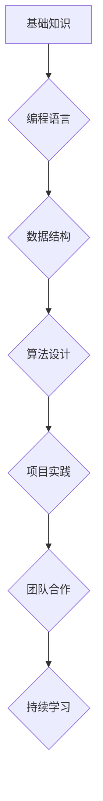

                 

## 如何打造高质量的程序员知识课程

> 关键词：程序员培训，知识课程，教学设计，编程技能，实践项目，在线学习，课程评估

### 1. 背景介绍

在当今科技飞速发展的时代，程序员的需求量持续增长，而高质量的程序员人才却显得尤为稀缺。传统的程序员培训模式往往注重理论知识的灌输，缺乏实践操作和项目经验的积累，导致毕业生难以适应实际工作需求。因此，打造高质量的程序员知识课程，培养具备扎实基础、实践能力和创新精神的程序员人才，成为当务之急。

### 2. 核心概念与联系

高质量的程序员知识课程应遵循以下核心概念：

* **以实践为导向:** 课程内容应以实际项目为核心，引导学员通过动手实践，逐步掌握编程技能和解决问题的能力。
* **循序渐进:** 课程内容应按照一定的逻辑顺序设计，从基础知识到高级概念，逐步深入，避免学员学习过程中产生困惑和迷茫。
* **注重深度理解:** 课程不仅要传授编程语言语法和知识点，更要引导学员理解编程背后的逻辑思维和算法设计思想。
* **强调团队合作:** 鼓励学员在项目实践中进行团队合作，学习沟通协作、分工合作和共同解决问题的能力。
* **注重持续学习:** 鼓励学员保持学习热情，关注行业发展趋势，不断学习新技术和知识。

**Mermaid 流程图:**



### 3. 核心算法原理 & 具体操作步骤

#### 3.1  算法原理概述

算法是解决特定问题的一系列步骤或规则，是程序员思维的核心。掌握算法设计思想，能够帮助程序员更高效地解决问题，编写更优良的代码。常见的算法类型包括：

* **排序算法:** 将数据按照特定规则进行排列，例如冒泡排序、插入排序、快速排序等。
* **搜索算法:** 在数据集合中查找特定元素，例如线性搜索、二分搜索等。
* **图算法:** 处理图结构的数据，例如深度优先搜索、广度优先搜索等。
* **动态规划:** 解决复杂问题，通过将问题分解成子问题，并存储子问题的解，避免重复计算。

#### 3.2  算法步骤详解

以快速排序为例，详细说明其算法步骤：

1. 选择一个基准元素。
2. 将小于基准元素的元素放在其左边，大于基准元素的元素放在其右边。
3. 对基准元素左边和右边的子数组分别进行快速排序。

#### 3.3  算法优缺点

**快速排序:**

* **优点:** 时间复杂度平均为 O(n log n)，效率较高。
* **缺点:** 最坏情况下时间复杂度为 O(n^2)，不稳定。

#### 3.4  算法应用领域

算法广泛应用于各个领域，例如：

* **搜索引擎:** 使用排序算法和搜索算法，快速检索海量数据。
* **人工智能:** 使用图算法和动态规划，实现机器学习和深度学习。
* **游戏开发:** 使用排序算法和搜索算法，优化游戏逻辑和人工智能。

### 4. 数学模型和公式 & 详细讲解 & 举例说明

#### 4.1  数学模型构建

在程序员知识课程中，数学模型可以帮助学员理解算法的原理和复杂度。例如，可以使用时间复杂度和空间复杂度来衡量算法的效率。

* **时间复杂度:** 指算法执行所需的时间，通常用大 O 符号表示。例如，O(n)表示算法执行时间与输入数据量成正比。
* **空间复杂度:** 指算法执行所需内存空间，也通常用大 O 符号表示。例如，O(1)表示算法所需的内存空间与输入数据量无关。

#### 4.2  公式推导过程

以冒泡排序为例，推导其时间复杂度：

* 算法执行 n-1 次循环。
* 每一次循环比较 n-i 个元素，其中 i 为循环次数。
* 因此，总共比较次数为 (n-1)+(n-2)+...+1 = n(n-1)/2。
* 时间复杂度为 O(n^2)。

#### 4.3  案例分析与讲解

通过分析不同算法的时间复杂度和空间复杂度，可以帮助学员选择最合适的算法解决特定问题。例如，对于需要快速检索大量数据的场景，可以使用二分搜索算法，其时间复杂度为 O(log n)，效率远高于线性搜索算法 (O(n))。

### 5. 项目实践：代码实例和详细解释说明

#### 5.1  开发环境搭建

选择合适的编程语言和开发环境，例如 Python 和 VS Code。

#### 5.2  源代码详细实现

以实现一个简单的文本分析程序为例，展示代码实现过程：

```python
def count_words(text):
  """
  统计文本中单词数量。
  """
  words = text.split()
  return len(words)

text = "This is a sample text for word counting."
word_count = count_words(text)
print(f"Text contains {word_count} words.")
```

#### 5.3  代码解读与分析

* `count_words(text)` 函数接受文本作为输入参数。
* `text.split()` 将文本分割成单词列表。
* `len(words)` 计算单词列表长度，即单词数量。
* `print(f"Text contains {word_count} words.")` 打印结果。

#### 5.4  运行结果展示

运行代码后，输出结果为：

```
Text contains 10 words.
```

### 6. 实际应用场景

高质量的程序员知识课程可以应用于以下场景：

* **高校教育:** 培养计算机专业人才，为学生提供扎实的编程基础和实践经验。
* **企业培训:** 提升员工编程技能，满足企业数字化转型需求。
* **在线学习平台:** 提供面向大众的编程课程，普及编程知识，激发学习兴趣。

#### 6.4  未来应用展望

随着人工智能、大数据等技术的快速发展，程序员的需求将更加多元化，高质量的程序员知识课程将更加重要。未来，程序员知识课程将更加注重：

* **个性化学习:** 根据学员的学习进度和需求，提供定制化的学习路径。
* **沉浸式体验:** 通过虚拟现实、增强现实等技术，提供更加沉浸式的学习体验。
* **跨学科融合:** 将编程知识与其他学科融合，培养更加全面的人才。

### 7. 工具和资源推荐

#### 7.1  学习资源推荐

* **在线学习平台:** Coursera, edX, Udemy, Codecademy
* **编程书籍:** 《编程之美》、《算法导论》、《深入理解Python》
* **开源项目:** GitHub, GitLab

#### 7.2  开发工具推荐

* **代码编辑器:** VS Code, Sublime Text, Atom
* **调试工具:** GDB, PyCharm Debugger
* **版本控制系统:** Git, SVN

#### 7.3  相关论文推荐

* 《The Elements of Programming Style》
* 《Introduction to Algorithms》
* 《Software Engineering》

### 8. 总结：未来发展趋势与挑战

#### 8.1  研究成果总结

高质量的程序员知识课程能够有效提升学员的编程技能和解决问题的能力，为培养优秀程序员人才奠定基础。

#### 8.2  未来发展趋势

未来程序员知识课程将更加注重个性化、沉浸式体验和跨学科融合，并与人工智能、大数据等新技术相结合。

#### 8.3  面临的挑战

* 如何设计更加高效、个性化的学习路径。
* 如何利用新技术，提供更加沉浸式的学习体验。
* 如何培养学员的创新精神和实践能力。

#### 8.4  研究展望

未来将继续探索新的教学方法和技术，打造更加高质量的程序员知识课程，为推动软件行业发展贡献力量。

### 9. 附录：常见问题与解答

* **Q1: 如何选择合适的编程语言学习？**

A1: 选择编程语言应根据个人兴趣和职业目标。Python 语言易于学习，应用广泛，适合初学者。Java 语言性能强，应用于企业级开发，适合追求稳定性和可靠性的开发者。

* **Q2: 如何提高编程效率？**

A2: 掌握算法设计思想，选择合适的算法，编写简洁高效的代码，并善于利用工具和资源，例如代码库、调试工具等。

* **Q3: 如何培养创新精神？**

A3: 鼓励学员参与开源项目，解决实际问题，并不断学习新技术，拓展思维边界。


作者：禅与计算机程序设计艺术 / Zen and the Art of Computer Programming 
<end_of_turn>

