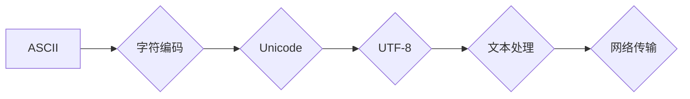

                 

## 字符串和字符编码：ASCII、Unicode 和 UTF-8

> 关键词：字符串、字符编码、ASCII、Unicode、UTF-8、字符集、字节序、文本处理、网络传输

## 1. 背景介绍

在计算机世界中，一切都是由0和1组成的二进制数据。为了让人类能够理解和操作这些数据，我们需要一种机制将二进制数据映射到可读的字符。这就是字符编码的作用。

字符编码是一种将字符映射到数字代码的系统。每个字符都有一个唯一的数字代码，计算机可以根据这个代码来存储和处理字符。不同的字符编码系统使用不同的数字范围和映射规则，从而支持不同的字符集。

早期，ASCII（American Standard Code for Information Interchange）是广泛使用的字符编码标准。ASCII只支持7位编码，能够表示128个字符，包括英文字母、数字、标点符号等。随着计算机技术的发展，人们需要表示更多的字符，例如来自其他语言的字符。因此，Unicode应运而生。

Unicode是一个统一的字符编码标准，旨在涵盖世界上所有语言的字符。它使用更长的编码长度，能够表示数百万个字符，包括文字、符号、表情符号等。

为了在实际应用中更有效地存储和传输Unicode字符，UTF-8（Unicode Transformation Format - 8-bit）应运而生。UTF-8是一种变长编码方案，能够使用1到4个字节来表示Unicode字符。它与ASCII兼容，并且能够高效地处理各种语言的文本。

## 2. 核心概念与联系

### 2.1 字符集

字符集是指包含所有可表示字符的集合。不同的字符集支持不同的字符，例如ASCII只支持英文字母、数字和标点符号，而Unicode则支持世界上所有语言的字符。

### 2.2 字符编码

字符编码是指将字符映射到数字代码的系统。不同的字符编码系统使用不同的数字范围和映射规则，例如ASCII使用7位编码，而Unicode使用更长的编码长度。

### 2.3 字节序

字节序是指计算机存储多字节数据时，字节的排列顺序。常见的字节序有大端序和小端序。大端序是指高字节存储在内存地址的低位，小端序则相反。

### 2.4 UTF-8

UTF-8是一种变长编码方案，能够使用1到4个字节来表示Unicode字符。它与ASCII兼容，并且能够高效地处理各种语言的文本。

**Mermaid 流程图**



## 3. 核心算法原理 & 具体操作步骤

### 3.1 算法原理概述

UTF-8 是一种变长编码方案，其核心原理是使用不同的字节数来表示不同的 Unicode 字符。

* **ASCII兼容性:** UTF-8 兼容 ASCII，这意味着 ASCII 字符可以使用单个字节表示。
* **变长编码:** UTF-8 使用 1 到 4 个字节来表示 Unicode 字符。
* **多字节编码:** Unicode 字符超过 ASCII 范围的，需要使用多个字节来表示。

### 3.2 算法步骤详解

1. **判断字符范围:** 根据 Unicode 字符的编码范围，确定需要使用多少个字节来表示它。
2. **编码:** 使用特定的编码规则将 Unicode 字符转换为字节序列。
3. **拼接字节:** 将多个字节拼接在一起，形成完整的 UTF-8 字节序列。

**具体编码规则:**

* **1 字节:** 表示 ASCII 字符 (0x00 - 0x7F)
* **2 字节:** 表示 Unicode 字符 (0x080 - 0x7FF)
* **3 字节:** 表示 Unicode 字符 (0x800 - 0xFFFF)
* **4 字节:** 表示 Unicode 字符 (0x10000 - 0x10FFFF)

### 3.3 算法优缺点

**优点:**

* **兼容性:** 与 ASCII 兼容，可以处理 ASCII 字符。
* **效率:** 对于 ASCII 字符，只需要使用单个字节，效率高。
* **可扩展性:** 可以表示数百万个 Unicode 字符。

**缺点:**

* **变长编码:** 编码长度不固定，需要额外的处理。
* **内存占用:** 对于某些 Unicode 字符，需要使用多个字节，内存占用较高。

### 3.4 算法应用领域

UTF-8 广泛应用于各种领域，例如：

* **文本处理:** 处理各种语言的文本。
* **网络传输:** 传输文本数据，例如网页、电子邮件等。
* **数据库:** 存储和检索文本数据。
* **软件开发:** 开发支持多种语言的软件。

## 4. 数学模型和公式 & 详细讲解 & 举例说明

### 4.1 数学模型构建

UTF-8 使用变长编码，其核心数学模型是基于二进制位表示的。

* **字节掩码:** 每个字节都有一个掩码，用于标识该字节是否为多字节编码的一部分。
* **起始位:** 多字节编码的第一个字节通常包含一个起始位，用于标识编码长度。

### 4.2 公式推导过程

**1 字节编码:**

* 如果字符的 Unicode 编码值在 0x00 到 0x7F 之间，则使用单个字节表示。

**2 字节编码:**

* 如果字符的 Unicode 编码值在 0x080 到 0x7FF 之间，则使用两个字节表示。
* 第一个字节的最高位为 10，表示多字节编码。
* 第二个字节的最高位为 10，表示多字节编码。

**3 字节编码:**

* 如果字符的 Unicode 编码值在 0x800 到 0xFFFF 之间，则使用三个字节表示。
* 第一个字节的最高位为 110，表示多字节编码。
* 第二个字节的最高位为 10，表示多字节编码。
* 第三个字节的最高位为 10，表示多字节编码。

**4 字节编码:**

* 如果字符的 Unicode 编码值在 0x10000 到 0x10FFFF 之间，则使用四个字节表示。
* 第一个字节的最高位为 1110，表示多字节编码。
* 第二个字节的最高位为 10，表示多字节编码。
* 第三个字节的最高位为 10，表示多字节编码。
* 第四个字节的最高位为 10，表示多字节编码。

### 4.3 案例分析与讲解

**示例:**

* Unicode 字符 "你好" 的编码值分别为 0x4F60 和 0x4E1D。

**UTF-8 编码:**

* "你好" 的 UTF-8 编码为: 0xE4 0xBD 0xA0 0xE5 0xA5 0xBD

**分析:**

* "你好" 的 UTF-8 编码使用了四个字节。
* 每个字节的最高位都符合多字节编码规则。

## 5. 项目实践：代码实例和详细解释说明

### 5.1 开发环境搭建

* 操作系统: Windows/macOS/Linux
* 编程语言: Python
* 库: `chardet`

### 5.2 源代码详细实现

```python
import chardet

# 读取文本文件
with open('text.txt', 'rb') as f:
    raw_data = f.read()

# 自动检测编码
result = chardet.detect(raw_data)
encoding = result['encoding']

# 使用检测到的编码解码文本
decoded_text = raw_data.decode(encoding)

# 打印解码后的文本
print(decoded_text)
```

### 5.3 代码解读与分析

* `chardet` 库用于自动检测文本文件的编码。
* `detect()` 函数分析文本数据并返回编码信息。
* `decode()` 函数使用检测到的编码解码二进制数据为字符串。

### 5.4 运行结果展示

运行代码后，将输出解码后的文本内容。

## 6. 实际应用场景

### 6.1 网络传输

在网络传输中，UTF-8 广泛用于传输文本数据，例如网页、电子邮件、聊天消息等。

### 6.2 数据库

许多数据库系统使用 UTF-8 作为文本数据存储的默认编码。

### 6.3 软件开发

许多编程语言和软件框架支持 UTF-8 编码，例如 Python、Java、JavaScript 等。

### 6.4 未来应用展望

随着互联网的全球化发展，UTF-8 将继续作为文本数据传输和存储的标准编码方案。

## 7. 工具和资源推荐

### 7.1 学习资源推荐

* Unicode Consortium 网站: https://www.unicode.org/
* UTF-8 编码规范: https://en.wikipedia.org/wiki/UTF-8

### 7.2 开发工具推荐

* `chardet` 库 (Python): https://pypi.org/project/chardet/

### 7.3 相关论文推荐

* The Unicode Standard: https://www.unicode.org/reports/tr1/

## 8. 总结：未来发展趋势与挑战

### 8.1 研究成果总结

UTF-8 作为一种高效、兼容且可扩展的字符编码方案，在文本处理、网络传输、数据库等领域得到了广泛应用。

### 8.2 未来发展趋势

* 随着互联网的不断发展，UTF-8 将继续作为文本数据传输和存储的标准编码方案。
* 研究人员将继续探索新的字符编码方案，以满足未来更复杂的文本处理需求。

### 8.3 面临的挑战

* 对于某些特殊字符，UTF-8 的编码长度可能较长，导致内存占用较高。
* 不同平台和软件可能对 UTF-8 的处理方式略有不同，需要进行兼容性测试。

### 8.4 研究展望

* 研究更紧凑的字符编码方案，以降低内存占用。
* 开发更完善的 UTF-8 处理工具和库，提高文本处理效率。


## 9. 附录：常见问题与解答

### 9.1 为什么 UTF-8 比 ASCII 更复杂？

UTF-8 比 ASCII 更复杂，因为它需要使用变长编码来表示 Unicode 字符集，而 ASCII 只使用 7 位编码。

### 9.2 UTF-8 和 Unicode 是同一个东西吗？

UTF-8 是一种具体的 Unicode 编码方案，而 Unicode 是一个字符标准，定义了字符的编码范围和映射规则。

### 9.3 如何判断文本文件的编码？

可以使用 `chardet` 库等工具自动检测文本文件的编码。

### 9.4 如何转换文本文件的编码？

可以使用编程语言或文本编辑器中的编码转换功能来转换文本文件的编码。

### 9.5 UTF-8 是否支持所有语言的字符？

理论上，UTF-8 可以表示 Unicode 字符集中的所有字符，包括所有语言的字符。

作者：禅与计算机程序设计艺术 / Zen and the Art of Computer Programming


<end_of_turn>

