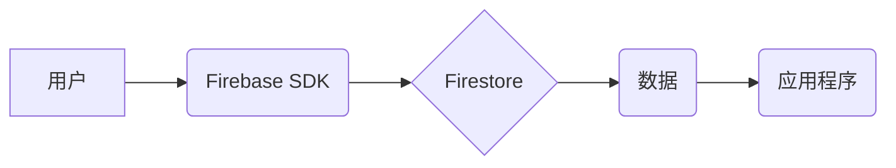
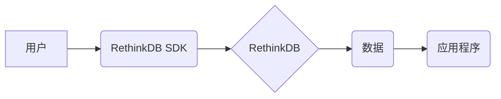

                 

## 实时数据库：Firebase与RethinkDB

> 关键词：实时数据库、Firebase、RethinkDB、NoSQL、云数据库、数据同步、应用程序开发

## 1. 背景介绍

随着移动互联网和云计算的蓬勃发展，对实时数据处理的需求日益增长。传统的关系型数据库难以满足这种需求，因为它通常以批处理方式更新数据，导致数据延迟较大。为了解决这个问题，实时数据库应运而生。实时数据库能够提供低延迟的数据更新和同步，使得应用程序能够实时地反映数据变化。

Firebase和RethinkDB是两种流行的实时数据库解决方案。Firebase是由Google开发的移动应用程序开发平台，其中包含一个名为Firestore的NoSQL实时数据库。RethinkDB是一个开源的分布式实时数据库，支持多种编程语言。

## 2. 核心概念与联系

### 2.1  实时数据库的概念

实时数据库是一种能够提供低延迟数据更新和同步的数据库系统。它允许应用程序实时地获取到最新的数据，从而实现实时应用的功能，例如聊天、游戏、社交媒体等。

### 2.2  Firebase与RethinkDB的联系

Firebase和RethinkDB都是实时数据库解决方案，它们都提供了以下核心功能：

* **低延迟数据更新:** 能够快速地将数据更新到所有连接的客户端。
* **数据同步:** 能够确保所有客户端都拥有最新的数据。
* **离线支持:** 能够在网络连接中断的情况下，仍然允许应用程序访问和更新数据。
* **丰富的API:** 提供多种API接口，方便应用程序开发人员进行数据操作。

### 2.3  架构对比

**Firebase**



**RethinkDB**



## 3. 核心算法原理 & 具体操作步骤

### 3.1  算法原理概述

实时数据库的核心算法原理是基于**数据复制和同步**。数据库服务器会将数据复制到多个节点，并通过**冲突检测和解决机制**来确保数据的一致性。

**数据复制:** 数据库服务器会将数据复制到多个节点，以提高数据可用性和容错性。

**冲突检测:** 当多个客户端同时更新同一数据时，可能会发生数据冲突。数据库系统需要检测这些冲突，并采取措施解决冲突。

**冲突解决:** 数据库系统可以使用不同的冲突解决机制，例如**最后一次写入胜利**、**乐观锁**等。

### 3.2  算法步骤详解

1. **数据写入:** 当客户端写入数据时，数据会首先被写入到本地缓存中。
2. **数据同步:** 客户端会将本地缓存中的数据同步到数据库服务器。
3. **数据复制:** 数据库服务器会将数据复制到其他节点。
4. **冲突检测:** 当多个客户端同时更新同一数据时，数据库系统会检测冲突。
5. **冲突解决:** 数据库系统会根据冲突解决机制，选择一个版本的更新数据。
6. **数据更新:** 数据库系统会将更新后的数据同步到所有客户端。

### 3.3  算法优缺点

**优点:**

* **低延迟数据更新:** 能够快速地将数据更新到所有连接的客户端。
* **数据同步:** 能够确保所有客户端都拥有最新的数据。
* **高可用性:** 数据复制机制可以提高数据库的可用性。

**缺点:**

* **复杂性:** 数据复制和冲突解决机制的实现比较复杂。
* **性能瓶颈:** 当数据量很大时，数据同步可能会成为性能瓶颈。

### 3.4  算法应用领域

实时数据库的应用领域非常广泛，例如：

* **聊天应用:** 实时聊天需要低延迟的数据更新，实时数据库可以满足这种需求。
* **游戏应用:** 游戏应用需要实时的数据同步，实时数据库可以确保所有玩家都能看到最新的游戏状态。
* **社交媒体应用:** 社交媒体应用需要实时地更新用户动态和消息，实时数据库可以满足这种需求。
* **实时数据分析:** 实时数据库可以用于实时地分析数据，例如股票价格、网站流量等。

## 4. 数学模型和公式 & 详细讲解 & 举例说明

### 4.1  数学模型构建

实时数据库的数学模型可以抽象为一个**状态机**，其中每个状态代表数据库的当前状态，每个状态转换代表数据更新操作。

**状态机模型:**

```
状态 = {数据, 版本号}
转换 = {操作, 数据, 版本号}
```

其中：

* **数据:** 数据库中的数据内容。
* **版本号:** 数据的版本号，用于标识数据更新的顺序。

### 4.2  公式推导过程

**冲突检测公式:**

```
冲突 = (版本号1 != 版本号2) && (操作1 影响 数据) && (操作2 影响 数据)
```

其中：

* **版本号1, 版本号2:** 操作1和操作2的版本号。
* **操作1, 操作2:** 操作1和操作2的内容。
* **数据:** 操作1和操作2影响的数据内容。

**冲突解决公式:**

```
更新数据 = 选择(操作1, 操作2)
```

其中：

* **更新数据:** 冲突解决后的数据内容。
* **选择:** 冲突解决机制，例如最后一次写入胜利、乐观锁等。

### 4.3  案例分析与讲解

假设有两个客户端同时更新同一个数据，客户端A先更新数据，版本号为1，客户端B后更新数据，版本号为2。

**冲突检测:**

```
冲突 = (1 != 2) && (操作A 影响 数据) && (操作B 影响 数据)
```

**冲突解决:**

如果采用最后一次写入胜利的机制，则更新数据为客户端B的更新内容。

## 5. 项目实践：代码实例和详细解释说明

### 5.1  开发环境搭建

* **Firebase:** 需要创建一个Firebase项目，并安装Firebase SDK。
* **RethinkDB:** 需要下载并安装RethinkDB服务器，并安装RethinkDB SDK。

### 5.2  源代码详细实现

**Firebase示例代码:**

```javascript
// 初始化Firebase SDK
firebase.initializeApp(config);

// 获取Firestore数据库实例
const db = firebase.firestore();

// 写入数据
db.collection('users').doc('user1').set({
  name: 'John Doe',
  age: 30
});

// 读取数据
db.collection('users').doc('user1').get()
  .then(doc => {
    if (doc.exists) {
      console.log('Document data:', doc.data());
    } else {
      console.log('No such document!');
    }
  })
  .catch(error => {
    console.log('Error getting document:', error);
  });
```

**RethinkDB示例代码:**

```javascript
// 连接到RethinkDB服务器
const r = require('rethinkdb');

r.connect({ host: 'localhost', port: 28015 })
  .then(conn => {
    // 创建数据库
    return r.dbCreate('myDatabase').run(conn);
  })
  .then(result => {
    // 创建表
    return r.db('myDatabase').tableCreate('users').run(conn);
  })
  .then(result => {
    // 写入数据
    return r.table('users').insert({ name: 'John Doe', age: 30 }).run(conn);
  })
  .then(result => {
    // 读取数据
    return r.table('users').filter({ name: 'John Doe' }).run(conn);
  })
  .then(cursor => {
    return cursor.toArray();
  })
  .then(docs => {
    console.log('Document data:', docs);
  })
  .catch(error => {
    console.log('Error:', error);
  });
```

### 5.3  代码解读与分析

* Firebase示例代码演示了如何使用Firebase SDK写入和读取数据。
* RethinkDB示例代码演示了如何使用RethinkDB SDK连接到服务器、创建数据库和表、写入和读取数据。

### 5.4  运行结果展示

运行上述代码后，将会在Firebase和RethinkDB数据库中创建用户数据。

## 6. 实际应用场景

### 6.1  实时聊天应用

实时数据库可以用于构建实时聊天应用，例如微信、QQ等。当用户发送消息时，数据库会立即将消息更新到所有连接的客户端，从而实现实时聊天功能。

### 6.2  实时游戏应用

实时数据库可以用于构建实时游戏应用，例如王者荣耀、和平精英等。当玩家进行操作时，数据库会立即将操作信息更新到所有玩家的客户端，从而实现游戏状态的实时同步。

### 6.3  实时数据分析

实时数据库可以用于实时分析数据，例如股票价格、网站流量等。当数据更新时，数据库会立即将数据更新到分析引擎，从而实现实时的数据分析。

### 6.4  未来应用展望

随着云计算和物联网的发展，实时数据库的应用场景将会更加广泛。例如，可以用于构建智能家居、自动驾驶汽车等应用。

## 7. 工具和资源推荐

### 7.1  学习资源推荐

* **Firebase官方文档:** https://firebase.google.com/docs/
* **RethinkDB官方文档:** https://rethinkdb.com/docs/

### 7.2  开发工具推荐

* **Firebase CLI:** https://firebase.google.com/docs/cli
* **RethinkDB CLI:** https://rethinkdb.com/docs/cli/

### 7.3  相关论文推荐

* **The Design and Implementation of RethinkDB:** https://www.usenix.org/system/files/conference/osdi14/osdi14-paper-rethinkdb.pdf

## 8. 总结：未来发展趋势与挑战

### 8.1  研究成果总结

Firebase和RethinkDB都是成熟的实时数据库解决方案，它们提供了丰富的功能和强大的性能。

### 8.2  未来发展趋势

* **更低延迟的数据更新:** 未来实时数据库将会更加注重低延迟数据更新，以满足更苛刻的应用需求。
* **更强大的数据分析功能:** 未来实时数据库将会集成更强大的数据分析功能，以支持更复杂的实时数据分析应用。
* **更完善的安全性:** 未来实时数据库将会更加注重安全性，以保护用户数据免受攻击。

### 8.3  面临的挑战

* **数据一致性:** 在分布式环境下，保证数据的一致性仍然是一个挑战。
* **数据规模:** 当数据量很大时，数据同步可能会成为性能瓶颈。
* **成本:** 实时数据库的部署和维护成本较高。

### 8.4  研究展望

未来研究方向包括：

* **更高效的数据同步算法:** 研究更低延迟、更高效的数据同步算法。
* **更强大的冲突解决机制:** 研究更智能、更灵活的冲突解决机制。
* **更经济的实时数据库架构:** 研究更经济、更易于部署的实时数据库架构。

## 9. 附录：常见问题与解答

* **Q: Firebase和RethinkDB哪个更好？**

A: Firebase和RethinkDB各有优缺点，选择哪个取决于具体的应用需求。Firebase更易于使用，并且提供更丰富的云服务，而RethinkDB更灵活，并且支持多种编程语言。

* **Q: 实时数据库的安全性如何？**

A: 实时数据库通常提供多种安全机制，例如身份验证、授权、数据加密等，以保护用户数据免受攻击。

* **Q: 实时数据库的成本如何？**

A: 实时数据库的成本取决于数据量、使用频率等因素。Firebase和RethinkDB都提供免费和付费套餐，可以根据实际需求选择。


作者：禅与计算机程序设计艺术 / Zen and the Art of Computer Programming 
<end_of_turn>

