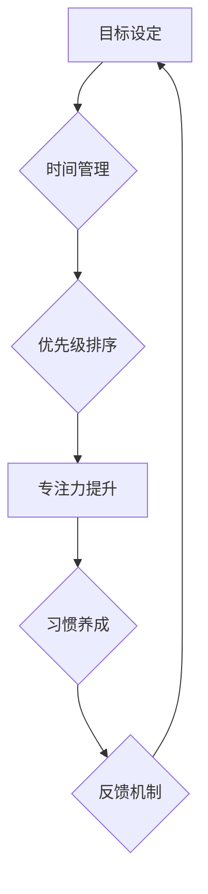

                 

## 建立高效行动体系的步骤

> 关键词：行动力、效率、目标设定、时间管理、执行力、优先级、专注力、习惯养成

### 1. 背景介绍

在当今快节奏的社会，高效地行动是取得成功和实现目标的关键。然而，许多人往往在行动力、效率和执行力方面遇到困难，难以将计划付诸实践。建立一个高效的行动体系，能够帮助我们更好地规划、执行和管理我们的行动，从而提高效率，达成目标。

### 2. 核心概念与联系

高效行动体系的核心概念包括：目标设定、时间管理、优先级排序、专注力提升、习惯养成和反馈机制。这些概念相互关联，共同构成了一个完整的行动框架。

**Mermaid 流程图**



**核心概念原理和架构**

* **目标设定:** 明确的目标是行动的驱动力。设定 SMART 目标 (Specific, Measurable, Achievable, Relevant, Time-bound) 可以帮助我们更好地聚焦行动方向。
* **时间管理:**  有效地管理时间是高效行动的关键。通过时间规划、番茄工作法等方法，我们可以合理分配时间，提高工作效率。
* **优先级排序:**  并非所有任务都具有同等重要性。通过优先级排序，我们可以集中精力完成最重要的任务，避免精力分散。
* **专注力提升:**  专注力是高效行动的基石。通过冥想、番茄工作法等方法，我们可以提高专注力，减少干扰，提升工作效率。
* **习惯养成:**  将目标分解成小的步骤，并将其转化为习惯，可以帮助我们持续行动，最终实现目标。
* **反馈机制:**  定期回顾和评估行动效果，及时调整策略，可以帮助我们不断优化行动体系，提高效率。

### 3. 核心算法原理 & 具体操作步骤

高效行动体系的构建并非简单的算法，而是需要结合个人情况和目标进行定制化的设计。然而，我们可以借鉴一些常用的方法和技巧，帮助我们建立高效的行动体系。

#### 3.1 算法原理概述

高效行动体系的构建遵循以下原则：

* **目标导向:**  所有行动都应该围绕着明确的目标进行。
* **分解与迭代:**  将大目标分解成小的、可实现的步骤，并逐步迭代完成。
* **优先级排序:**  根据任务的重要性进行排序，集中精力完成最重要的任务。
* **时间管理:**  合理分配时间，避免拖延和浪费。
* **专注力提升:**  减少干扰，提高专注力，提升工作效率。
* **习惯养成:**  将目标分解成小的步骤，并将其转化为习惯，可以帮助我们持续行动，最终实现目标。
* **反馈机制:**  定期回顾和评估行动效果，及时调整策略，可以帮助我们不断优化行动体系，提高效率。

#### 3.2 算法步骤详解

1. **明确目标:**  首先，我们需要明确自己的目标是什么。目标应该具体、可衡量、可实现、相关和有时间限制 (SMART)。
2. **分解目标:** 将大目标分解成小的、可实现的步骤。每个步骤都应该是一个独立的任务，可以被量化和衡量。
3. **制定行动计划:**  为每个步骤制定具体的行动计划，包括需要完成的任务、所需的时间、所需资源等。
4. **优先级排序:**  根据任务的重要性进行排序，确定每天需要完成的优先级任务。
5. **时间管理:**  合理分配时间，使用番茄工作法等方法提高工作效率。
6. **专注力提升:**  减少干扰，提高专注力，避免分心。
7. **习惯养成:**  将目标分解成小的步骤，并将其转化为习惯，可以帮助我们持续行动，最终实现目标。
8. **反馈机制:**  定期回顾和评估行动效果，及时调整策略，不断优化行动体系。

#### 3.3 算法优缺点

**优点:**

* **提高效率:**  通过明确目标、分解任务、优先级排序等方法，可以帮助我们更高效地完成工作。
* **增强执行力:**  将目标分解成小的步骤，并将其转化为习惯，可以帮助我们克服拖延，增强执行力。
* **实现目标:**  通过持续行动和反馈机制，可以帮助我们最终实现目标。

**缺点:**

* **需要时间和精力:**  建立高效行动体系需要投入时间和精力进行规划和执行。
* **需要不断调整:**  随着目标和环境的变化，我们需要不断调整行动体系，使其保持有效性。
* **需要自律性:**  高效行动体系需要我们保持自律性，才能持续执行。

#### 3.4 算法应用领域

高效行动体系的应用领域非常广泛，包括：

* **个人生活:**  提高学习效率、管理时间、达成个人目标等。
* **工作职场:**  提高工作效率、完成项目目标、提升职业发展等。
* **创业创新:**  快速执行计划、克服挑战、实现创业目标等。

### 4. 数学模型和公式 & 详细讲解 & 举例说明

高效行动体系的构建可以借鉴一些数学模型和公式，例如：

#### 4.1 数学模型构建

我们可以使用 **任务分解树** 模型来构建高效行动体系。任务分解树将目标分解成多个子目标，每个子目标又可以分解成更小的任务，直到达到可执行的程度。

#### 4.2 公式推导过程

**任务分解树的构建公式:**

```
目标 = 子目标1 + 子目标2 + ... + 子目标n
子目标i = 任务1i + 任务2i + ... + 任务mi
```

其中，目标表示最终的目标，子目标表示目标的子目标，任务表示子目标的可执行任务。

#### 4.3 案例分析与讲解

例如，假设我们的目标是“写一本技术书籍”。我们可以使用任务分解树模型将其分解如下：

* **目标:** 写一本技术书籍
* **子目标1:**  确定书籍主题和目标读者
* **子目标2:**  收集和整理相关资料
* **子目标3:**  撰写书籍草稿
* **子目标4:**  修改和完善书籍内容
* **子目标5:**  排版和设计书籍
* **子目标6:**  出版和推广书籍

每个子目标都可以进一步分解成更小的任务，例如，子目标1可以分解成“调研市场需求”、“确定书籍内容框架”等任务。

### 5. 项目实践：代码实例和详细解释说明

#### 5.1 开发环境搭建

为了更好地实践高效行动体系，我们可以使用一些工具和软件来辅助我们。例如：

* **任务管理工具:**  Trello、Asana、Todoist 等工具可以帮助我们管理任务、设定优先级、跟踪进度等。
* **时间管理工具:**  番茄工作法计时器、时间追踪软件等工具可以帮助我们合理分配时间、提高专注力。
* **笔记软件:**  Evernote、Notion 等笔记软件可以帮助我们记录想法、整理资料、管理知识等。

#### 5.2 源代码详细实现

由于高效行动体系的构建并非简单的代码实现，因此这里不再提供具体的源代码示例。

#### 5.3 代码解读与分析

高效行动体系的构建需要结合个人情况和目标进行定制化设计，因此没有通用的代码实现方案。

#### 5.4 运行结果展示

高效行动体系的构建是一个持续的过程，需要不断地调整和优化。最终的运行结果是实现目标，提高效率，提升生活质量。

### 6. 实际应用场景

#### 6.1 个人学习

我们可以使用高效行动体系来提高学习效率，例如：

* **设定 SMART 目标:**  例如，目标是“在三个月内掌握 Python 编程语言”。
* **分解目标:** 将目标分解成多个子目标，例如“学习 Python 基础语法”、“练习 Python 编程题”、“完成一个简单的 Python 项目”。
* **制定行动计划:**  为每个子目标制定具体的行动计划，例如每天学习 Python 基础语法两个小时，每周练习 Python 编程题三个小时。
* **优先级排序:**  根据任务的重要性进行排序，例如，学习 Python 基础语法比练习 Python 编程题更重要。
* **时间管理:**  合理分配时间，使用番茄工作法等方法提高学习效率。

#### 6.2 工作项目

我们可以使用高效行动体系来提高工作效率，例如：

* **设定 SMART 目标:**  例如，目标是“在两个月内完成项目 A 的开发”。
* **分解目标:** 将目标分解成多个子目标，例如“完成项目 A 的需求分析”、“设计项目 A 的架构”、“开发项目 A 的核心功能”、“测试项目 A 的功能”。
* **制定行动计划:**  为每个子目标制定具体的行动计划，例如，需求分析需要一周时间，设计架构需要两天时间。
* **优先级排序:**  根据任务的重要性进行排序，例如，完成项目 A 的需求分析比设计项目 A 的架构更重要。
* **时间管理:**  合理分配时间，使用番茄工作法等方法提高工作效率。

#### 6.3 创业项目

我们可以使用高效行动体系来提高创业效率，例如：

* **设定 SMART 目标:**  例如，目标是“在半年内完成产品 MVP 的开发”。
* **分解目标:** 将目标分解成多个子目标，例如“确定产品功能”、“设计产品原型”、“开发产品核心功能”、“进行用户测试”。
* **制定行动计划:**  为每个子目标制定具体的行动计划，例如，确定产品功能需要两周时间，设计产品原型需要一周时间。
* **优先级排序:**  根据任务的重要性进行排序，例如，确定产品功能比设计产品原型更重要。
* **时间管理:**  合理分配时间，使用番茄工作法等方法提高工作效率。

#### 6.4 未来应用展望

随着人工智能技术的不断发展，高效行动体系的应用场景将会更加广泛，例如：

* **个性化行动计划:**  人工智能可以根据用户的个人情况和目标，生成个性化的行动计划。
* **智能提醒和反馈:**  人工智能可以智能提醒用户完成任务，并根据用户的行动效果提供反馈，帮助用户不断优化行动体系。
* **协同行动:**  人工智能可以帮助团队成员协同行动，提高团队效率。

### 7. 工具和资源推荐

#### 7.1 学习资源推荐

* **书籍:**  《Getting Things Done》、《Atomic Habits》、《The 7 Habits of Highly Effective People》
* **博客:**  Zen Habits、James Clear、Lifehacker
* **课程:**  Coursera、Udemy、edX

#### 7.2 开发工具推荐

* **任务管理工具:**  Trello、Asana、Todoist
* **时间管理工具:**  番茄工作法计时器、TimeCamp、Toggl Track
* **笔记软件:**  Evernote、Notion、Google Keep

#### 7.3 相关论文推荐

* **Getting Things Done: The Art of Stress-Free Productivity** by David Allen
* **Atomic Habits: An Easy & Proven Way to Build Good Habits & Break Bad Ones** by James Clear
* **The 7 Habits of Highly Effective People** by Stephen R. Covey

### 8. 总结：未来发展趋势与挑战

#### 8.1 研究成果总结

高效行动体系的研究成果表明，通过明确目标、分解任务、优先级排序、时间管理、专注力提升、习惯养成和反馈机制，我们可以提高效率、增强执行力，最终实现目标。

#### 8.2 未来发展趋势

未来，高效行动体系的研究将更加注重个性化、智能化和协同化。

* **个性化:**  人工智能将能够根据用户的个人情况和目标，生成个性化的行动计划。
* **智能化:**  人工智能将能够智能提醒用户完成任务，并根据用户的行动效果提供反馈，帮助用户不断优化行动体系。
* **协同化:**  人工智能将能够帮助团队成员协同行动，提高团队效率。

#### 8.3 面临的挑战

高效行动体系的构建和应用也面临一些挑战，例如：

* **用户习惯:**  许多人习惯于拖延和碎片化工作，需要克服这些习惯才能有效地应用高效行动体系。
* **技术复杂性:**  构建个性化、智能化的行动体系需要复杂的算法和技术，需要不断进行研究和开发。
* **数据隐私:**  高效行动体系需要收集用户的个人数据，需要确保数据的安全和隐私。

#### 8.4 研究展望

未来，我们将继续研究高效行动体系的构建和应用，努力解决上述挑战，为用户提供更加个性化、智能化和协同化的行动体验。

### 9. 附录：常见问题与解答

**Q1: 如何设定 SMART 目标？**

A1: SMART 目标是指 Specific (具体)、Measurable (可衡量)、Achievable (可实现)、Relevant (相关) 和 Time-bound (有时间限制) 的目标。

* **具体:**  目标应该明确具体是什么，避免模糊不清。
* **可衡量:**  目标应该能够量化，以便于跟踪进度和评估结果。
* **可实现:**  目标应该具有可实现性，不要设定过于遥远或不可能的目标。
* **相关:**  目标应该与你的整体目标和价值观相一致。
* **有时间限制:**  目标应该设定一个明确的时间期限，以便于督促行动。

**Q2: 如何进行任务分解？**

A2: 任务分解是指将一个大目标分解成多个小目标，每个小目标都应该是一个独立的任务，可以被量化和衡量。

* **从大到小:**  从大目标开始，逐步分解成更小的子目标。
* **分解到可执行:**  将子目标分解到可以被执行的程度，例如，将“写一篇博客文章”分解成“确定主题”、“收集资料”、“撰写草稿”、“修改和完善”等任务。

**Q3: 如何提高专注力？**

A3: 提高专注力可以通过以下方法：

* **消除干扰:**  关闭手机、关闭社交媒体通知等，创造一个安静的工作环境。
* **番茄工作法:**  将工作时间分成 25 分钟的间隔，每间隔结束后休息 5 分钟，可以帮助提高专注力。
* **冥想:**  每天进行 10-15 分钟的冥想，可以帮助平静思绪，提高专注力。


作者：禅与计算机程序设计艺术 / Zen and the Art of Computer Programming<end_of_turn>

