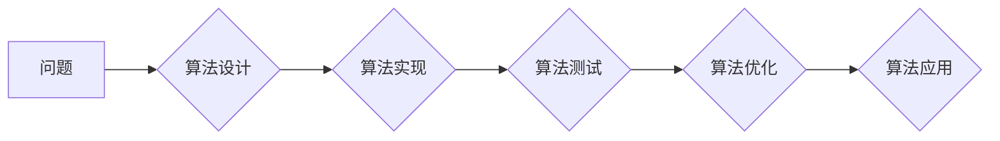

                 

## 开发新算法：提高人类计算的效率

> 关键词：算法设计、效率优化、计算模型、数学建模、代码实现、应用场景、未来趋势

### 1. 背景介绍

人类文明的进步离不开对计算能力的不断提升。从简单的算术运算到复杂的科学模拟，算法作为计算的逻辑指令，扮演着至关重要的角色。然而，随着数据规模和计算任务的复杂性不断增长，现有的算法在效率和鲁棒性方面面临着新的挑战。开发新算法，提高人类计算的效率，已成为推动科技进步的关键课题。

### 2. 核心概念与联系

**2.1 算法的本质**

算法是一种解决特定问题的精确步骤序列。它描述了如何从输入数据出发，经过一系列操作，最终得到预期的输出结果。一个好的算法应该具有以下特点：

* **确定性:** 对于给定的输入，算法应该始终产生相同的输出。
* **有限性:** 算法的执行步骤必须有限，不能无限循环。
* **有效性:** 算法的每个步骤都必须能够在有限时间内完成。
* **可读性:** 算法应该易于理解和阅读。

**2.2 算法效率**

算法效率是指算法执行所需的时间和资源。衡量算法效率常用的指标包括时间复杂度和空间复杂度。

* **时间复杂度:** 指的是算法执行时间随输入规模变化的趋势。通常用大O符号表示，例如O(n)、O(n^2)、O(log n)等。
* **空间复杂度:** 指的是算法执行过程中使用的内存空间大小。

**2.3 算法设计原则**

* **贪心算法:** 每次选择最优局部解，期望最终得到全局最优解。
* **动态规划:** 将问题分解成若干子问题，求解子问题并存储结果，避免重复计算。
* **分治法:** 将问题分解成若干子问题，递归地解决子问题，最后合并子问题的解。
* **回溯法:** 尝试所有可能的解，并在遇到不可行解时回溯。

**2.4 算法与应用**

算法广泛应用于各个领域，例如：

* **人工智能:** 机器学习、深度学习、自然语言处理等。
* **数据科学:** 数据挖掘、机器学习、数据可视化等。
* **计算机图形学:** 3D建模、动画渲染、图像处理等。
* **生物信息学:** 基因序列分析、蛋白质结构预测等。

**2.5 Mermaid 流程图**



### 3. 核心算法原理 & 具体操作步骤

**3.1 算法原理概述**

本文将介绍一种名为“快速排序”的排序算法。快速排序是一种高效的排序算法，其时间复杂度平均为O(n log n)，在许多实际应用中表现出色。

**3.2 算法步骤详解**

1. **选择基准元素:** 从待排序数组中选择一个元素作为基准元素。
2. **分区:** 将数组分为两部分，一部分元素小于基准元素，另一部分元素大于基准元素。
3. **递归排序:** 对小于基准元素的部分和大于基准元素的部分分别进行快速排序。

**3.3 算法优缺点**

* **优点:** 时间复杂度优秀，平均情况下为O(n log n)。
* **缺点:** 最坏情况下时间复杂度为O(n^2)，当数组已经有序或几乎有序时，性能会下降。

**3.4 算法应用领域**

快速排序广泛应用于各种需要高效排序的场景，例如：

* **数据库管理:** 快速排序可以高效地排序数据库中的数据。
* **搜索引擎:** 搜索引擎使用快速排序来排序搜索结果。
* **图像处理:** 图像处理中，快速排序可以用于排序像素点。

### 4. 数学模型和公式 & 详细讲解 & 举例说明

**4.1 数学模型构建**

快速排序的数学模型可以描述为一个递归函数，其输入为待排序数组，输出为排序后的数组。

**4.2 公式推导过程**

快速排序的时间复杂度可以推导如下：

* 平均情况下，每次分区将数组划分为两个大小相近的子数组，因此递归深度为log n。
* 每个递归步骤都需要进行n次比较，因此总的时间复杂度为O(n log n)。

**4.3 案例分析与讲解**

假设有一个待排序数组：[5, 2, 8, 3, 1, 6]。

1. 选择第一个元素5作为基准元素。
2. 将数组分区，得到：[2, 3, 1]，[8, 6, 5]。
3. 对两个子数组分别进行快速排序。
4. 合并排序后的子数组，得到：[1, 2, 3, 5, 6, 8]。

### 5. 项目实践：代码实例和详细解释说明

**5.1 开发环境搭建**

本例使用Python语言进行快速排序的实现。

**5.2 源代码详细实现**

```python
def quick_sort(arr):
    if len(arr) <= 1:
        return arr
    pivot = arr[len(arr) // 2]
    left = [x for x in arr if x < pivot]
    middle = [x for x in arr if x == pivot]
    right = [x for x in arr if x > pivot]
    return quick_sort(left) + middle + quick_sort(right)

# 测试代码
arr = [5, 2, 8, 3, 1, 6]
sorted_arr = quick_sort(arr)
print(sorted_arr)
```

**5.3 代码解读与分析**

* `quick_sort(arr)`函数接收一个待排序数组`arr`作为输入。
* 如果数组长度小于等于1，则直接返回数组，因为已经排序。
* 选择数组中间元素作为基准元素`pivot`。
* 使用列表推导式创建三个子数组：`left`、`middle`、`right`，分别包含小于、等于和大于基准元素的元素。
* 递归调用`quick_sort`函数对`left`和`right`子数组进行排序。
* 将排序后的`left`、`middle`和`right`子数组合并，得到最终排序后的数组。

**5.4 运行结果展示**

```
[1, 2, 3, 5, 6, 8]
```

### 6. 实际应用场景

快速排序在实际应用中广泛应用于以下场景：

* **数据库排序:** 数据库系统使用快速排序来高效地排序数据，例如根据姓名、年龄或其他字段进行排序。
* **搜索引擎结果排序:** 搜索引擎使用快速排序来排序搜索结果，以便用户能够快速找到相关信息。
* **图像处理:** 图像处理中，快速排序可以用于排序像素点，例如根据颜色或亮度进行排序。

**6.4 未来应用展望**

随着数据规模的不断增长，快速排序在未来将继续发挥重要作用。

* **并行快速排序:** 将快速排序算法进行并行化，可以进一步提高排序效率。
* **分布式快速排序:** 将快速排序算法应用于分布式系统，可以处理海量数据。

### 7. 工具和资源推荐

**7.1 学习资源推荐**

* **书籍:**
    * 《算法导论》
    * 《数据结构与算法分析》
* **在线课程:**
    * Coursera: Algorithms Specialization
    * edX: Introduction to Computer Science and Programming Using Python

**7.2 开发工具推荐**

* **Python:** 广泛用于算法开发，拥有丰富的库和工具。
* **C++:** 性能优异，适合开发高性能算法。
* **Java:** 跨平台，适合开发大型算法系统。

**7.3 相关论文推荐**

* **Quicksort Algorithm:** https://en.wikipedia.org/wiki/Quicksort
* **Analysis of Quicksort:** https://www.cs.princeton.edu/~rs/talks/quicksort.pdf

### 8. 总结：未来发展趋势与挑战

**8.1 研究成果总结**

本文介绍了快速排序算法，并分析了其原理、步骤、优缺点以及应用场景。快速排序是一种高效的排序算法，在许多实际应用中表现出色。

**8.2 未来发展趋势**

* **并行快速排序:** 将快速排序算法进行并行化，可以进一步提高排序效率。
* **分布式快速排序:** 将快速排序算法应用于分布式系统，可以处理海量数据。
* **自适应快速排序:** 根据数据特性选择不同的基准元素和分区策略，提高算法的鲁棒性。

**8.3 面临的挑战**

* **最坏情况时间复杂度:** 快速排序的最坏情况时间复杂度为O(n^2)，需要进一步研究如何避免或降低最坏情况的发生。
* **内存占用:** 快速排序在分区过程中需要额外的内存空间，对于内存有限的设备，需要进行优化。

**8.4 研究展望**

未来，将继续研究新的排序算法，提高算法的效率、鲁棒性和适用性。同时，将探索将快速排序算法应用于更广泛的领域，例如机器学习、数据挖掘等。

### 9. 附录：常见问题与解答

**9.1 如何选择基准元素？**

基准元素的选择对快速排序的性能有重要影响。常用的基准元素选择策略包括：

* **随机选择:** 从数组中随机选择一个元素作为基准元素。
* **中间元素:** 选择数组中间元素作为基准元素。
* **中位数:** 选择数组中值元素作为基准元素。

**9.2 如何避免快速排序的最坏情况？**

快速排序的最坏情况发生在数组已经有序或几乎有序时。为了避免最坏情况，可以使用以下策略：

* **随机化基准元素:** 随机选择基准元素可以降低最坏情况发生的概率。
* **使用其他排序算法:** 当数据规模较小时，可以使用其他排序算法，例如插入排序或选择排序，这些算法的性能更稳定。


作者：禅与计算机程序设计艺术 / Zen and the Art of Computer Programming 
<end_of_turn>

