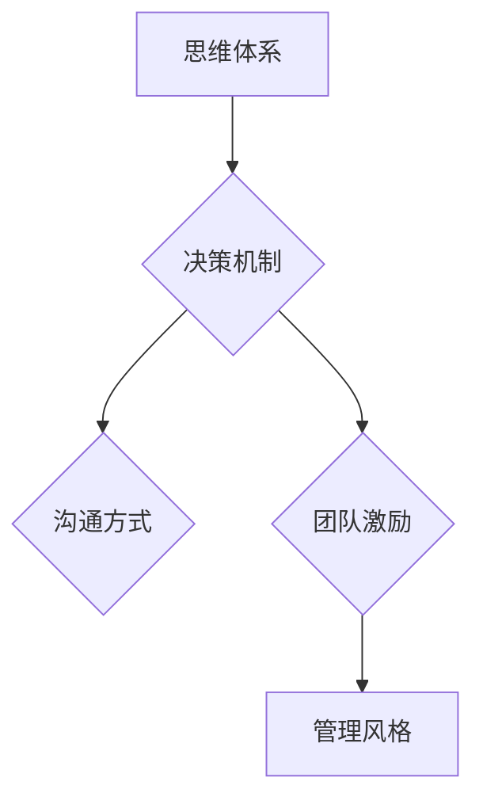

                 

## 思维体系如何影响管理风格

> 关键词：管理风格、思维体系、认知偏差、决策机制、团队协作、创新驱动、领导力、组织文化、人工智能

## 1. 背景介绍

在当今瞬息万变的科技时代，管理者面临着前所未有的挑战。如何有效地领导团队，激发员工潜能，并推动组织持续发展，成为摆在管理者面前的首要课题。而一个清晰、高效的思维体系，恰恰是管理者成功的重要基石。

传统的管理理论往往侧重于工具和方法，例如目标管理、绩效考核等。然而，这些工具的有效性很大程度上取决于管理者的思维方式。一个固执、封闭的思维体系，即使掌握了最先进的管理工具，也难以有效地应对复杂、多变的现实。

反之，一个开放、灵活、富有创新精神的思维体系，能够帮助管理者洞察问题本质，制定更有效的策略，并带领团队在竞争激烈的环境中取得成功。

## 2. 核心概念与联系

### 2.1 思维体系

思维体系是指一个人或群体在认知、理解和处理信息时所遵循的模式和规则。它包括我们的价值观、信念、经验、知识结构等多方面因素。思维体系决定了我们如何看待世界，如何做出判断，以及如何采取行动。

### 2.2 管理风格

管理风格是指管理者在领导团队、分配任务、处理冲突、激励员工等方面所采取的特定方式。不同的管理风格对应着不同的思维模式，例如：

* **命令型管理风格:** 强调权威和控制，决策集中在管理者手中，团队成员执行命令。这种风格适合于需要快速反应、执行力强的环境，但可能导致团队缺乏自主性和创新精神。
* **民主型管理风格:** 鼓励团队成员参与决策，重视协作和沟通，管理者扮演的角色更多是引导和协调。这种风格有利于团队凝聚力和创新，但可能导致决策效率较低。
* ** Laissez-faire 管理风格:** 赋予团队成员高度自主权，管理者干预较少，团队成员自行组织和决策。这种风格适合于高素质、经验丰富的团队，但可能导致缺乏方向和目标。

### 2.3 思维体系与管理风格的联系

思维体系直接影响着管理者的决策机制、沟通方式、团队激励策略等，进而塑造了其独特的管理风格。

**Mermaid 流程图:**



## 3. 核心算法原理 & 具体操作步骤

### 3.1 算法原理概述

虽然管理风格并非一个严格的算法，但我们可以将其视为一个复杂的决策过程，其中思维体系扮演着核心算法的角色。

管理者在面对各种问题和挑战时，会根据其思维体系中的价值观、信念、经验等因素，进行信息筛选、判断和决策。

例如，一个注重效率的管理者，可能会倾向于选择快速、直接的解决方案，而一个注重团队合作的管理者，则可能会选择更加协商、沟通的方式。

### 3.2 算法步骤详解

1. **信息收集:** 管理者从各种渠道收集相关信息，例如市场趋势、员工反馈、财务数据等。
2. **信息筛选:** 根据其思维体系中的价值观和偏好，管理者对收集到的信息进行筛选，重点关注与自身目标和利益相关的关键信息。
3. **问题分析:** 管理者对筛选后的信息进行分析，试图理解问题的本质、根源和潜在影响。
4. **方案生成:** 管理者根据其思维体系中的经验和知识，生成多种可能的解决方案。
5. **方案评估:** 管理者对每个方案进行评估，考虑其优缺点、风险和收益，并根据其思维体系中的风险偏好和决策风格，选择最合适的方案。
6. **方案实施:** 管理者将选定的方案付诸实施，并根据实际情况进行调整和优化。

### 3.3 算法优缺点

* **优点:** 思维体系能够帮助管理者快速做出决策，并有效地应对复杂、多变的挑战。
* **缺点:** 思维体系也可能导致认知偏差，限制管理者的视野和创新能力。

### 3.4 算法应用领域

思维体系与管理风格的联系广泛应用于各个领域，例如：

* **团队管理:** 不同的思维体系会导致不同的团队管理风格，例如，注重效率的管理者可能更倾向于采用命令型管理风格，而注重合作的管理者则可能更倾向于采用民主型管理风格。
* **项目管理:** 思维体系影响着项目经理的决策、风险管理和团队激励策略，从而影响项目的成功与否。
* **企业文化建设:** 企业文化的形成和发展与管理者的思维体系密切相关，一个开放、包容的思维体系能够促进企业文化的创新和发展。

## 4. 数学模型和公式 & 详细讲解 & 举例说明

### 4.1 数学模型构建

我们可以用一个简单的数学模型来描述思维体系对管理风格的影响：

**管理风格 = f(思维体系, 环境因素)**

其中：

* **管理风格:** 管理者在领导团队、分配任务、处理冲突、激励员工等方面所采取的特定方式。
* **思维体系:** 人或群体在认知、理解和处理信息时所遵循的模式和规则。
* **环境因素:** 包括组织文化、市场环境、团队成员素质等外部因素。

### 4.2 公式推导过程

这个模型表明，管理风格是由思维体系和环境因素共同决定的。

* **思维体系** 作为核心因素，决定了管理者对信息的筛选、判断和决策方式。
* **环境因素** 则会对管理者的思维体系产生影响，例如，一个竞争激烈的市场环境可能会导致管理者更加注重效率和控制。

### 4.3 案例分析与讲解

例如，一个注重创新和学习的管理者，其思维体系可能更加开放、包容，愿意接受新的想法和挑战。

在这种思维体系的影响下，他们可能会采用更加民主、协作的管理风格，鼓励团队成员自由思考、提出创意，并提供必要的支持和资源。

然而，如果这个管理者所在的组织文化更加保守、传统，则可能会限制其管理风格的灵活性和创新性。

## 5. 项目实践：代码实例和详细解释说明

### 5.1 开发环境搭建

为了更好地理解思维体系如何影响管理风格，我们可以通过一个简单的项目实践来进行探索。

例如，我们可以开发一个模拟团队管理的程序，其中包含不同的管理风格和思维体系。

通过调整程序中的参数，我们可以观察不同思维体系和管理风格对团队绩效、成员满意度等方面的影响。

### 5.2 源代码详细实现

由于篇幅限制，这里只提供一个简单的代码框架，具体的实现细节可以根据实际需求进行调整。

```python
class Manager:
    def __init__(self, style, mindset):
        self.style = style  # 管理风格
        self.mindset = mindset  # 思维体系

    def make_decision(self, problem):
        # 根据思维体系和管理风格，做出决策
        pass

    def motivate_team(self):
        # 根据管理风格，激励团队成员
        pass

class Team:
    def __init__(self, manager):
        self.manager = manager
        self.members = []

    def work(self):
        # 根据管理风格和团队成员素质，完成工作
        pass

# 示例代码
manager1 = Manager(style="command", mindset="efficiency")
manager2 = Manager(style="democratic", mindset="collaboration")

team1 = Team(manager1)
team2 = Team(manager2)

# 模拟团队工作
team1.work()
team2.work()
```

### 5.3 代码解读与分析

在这个代码框架中，`Manager` 类代表管理者，其属性包括管理风格和思维体系。

`make_decision` 和 `motivate_team` 方法模拟管理者在决策和激励团队方面的行为。

`Team` 类代表团队，其属性包括管理者和团队成员。

`work` 方法模拟团队完成工作的情况。

通过调整 `Manager` 类中的属性，我们可以模拟不同思维体系和管理风格对团队的影响。

### 5.4 运行结果展示

运行结果可以展示不同管理风格和思维体系对团队绩效、成员满意度等方面的影响。

例如，一个注重效率的管理风格可能导致团队工作效率更高，但成员满意度较低。

而一个注重合作的管理风格可能导致团队成员更加团结协作，但工作效率可能相对较低。

## 6. 实际应用场景

### 6.1 领导力培养

了解思维体系与管理风格的联系，对于领导力培养具有重要意义。

可以通过自我反思、性格测试、行为分析等方式，帮助领导者识别自身的思维模式，并针对性地进行调整和优化。

例如，一个过于命令型的领导者，可以通过学习民主管理的理念和技巧，提高团队成员的参与度和积极性。

### 6.2 团队建设

在团队建设过程中，需要考虑团队成员的思维体系和管理风格的差异。

可以通过团队建设活动、沟通交流、角色扮演等方式，帮助团队成员了解彼此的思维模式，并建立起相互理解、尊重和协作的团队文化。

### 6.3 组织文化建设

组织文化是企业长期发展的基石，而管理者的思维体系对组织文化的形成和发展具有重要影响。

企业可以通过引进先进的管理理念、培养开放、包容的思维方式、鼓励创新和学习等方式，塑造一个积极向上的组织文化。

### 6.4 未来应用展望

随着人工智能技术的不断发展，我们可以期待看到更多基于思维体系和管理风格的智能化管理工具和平台。

这些工具能够帮助管理者更深入地了解自身和团队成员的思维模式，并提供更精准、个性化的管理建议。

## 7. 工具和资源推荐

### 7.1 学习资源推荐

* **书籍:**
    * 《思维，快与慢》 - Daniel Kahneman
    * 《影响力》 - Robert Cialdini
    * 《领导力》 - John C. Maxwell
* **在线课程:**
    * Coursera: 领导力与管理
    * edX: 认知心理学
    * Udemy: 思维模式

### 7.2 开发工具推荐

* **Python:** 作为一种通用的编程语言，Python 非常适合于开发管理风格模拟程序。
* **R:** 作为一种统计分析语言，R 可以用于分析团队绩效和成员满意度等数据。
* **Tableau:** 作为一种数据可视化工具，Tableau 可以帮助我们直观地展示不同管理风格和思维体系的影响。

### 7.3 相关论文推荐

* **The Impact of Leadership Style on Team Performance**
* **Cognitive Biases and Decision Making in Management**
* **The Role of Mindset in Organizational Culture**

## 8. 总结：未来发展趋势与挑战

### 8.1 研究成果总结

研究表明，思维体系与管理风格之间存在着密切的联系，思维体系直接影响着管理者的决策机制、沟通方式、团队激励策略等，进而塑造了其独特的管理风格。

### 8.2 未来发展趋势

未来，随着人工智能技术的不断发展，我们可以期待看到更多基于思维体系和管理风格的智能化管理工具和平台。

这些工具能够帮助管理者更深入地了解自身和团队成员的思维模式，并提供更精准、个性化的管理建议。

### 8.3 面临的挑战

* **思维体系的复杂性:** 思维体系是一个非常复杂的概念，难以用简单的模型或公式完全描述。
* **个体差异:** 每个人的思维体系都是独一无二的，难以进行标准化分析和评估。
* **文化差异:** 不同的文化背景会对思维体系产生不同的影响，需要考虑文化差异带来的挑战。

### 8.4 研究展望

未来研究可以进一步探索思维体系与管理风格之间的更深层次的联系，例如：

* 如何量化和评估思维体系的各个维度？
* 如何利用人工智能技术，开发更精准、个性化的管理建议？
* 如何跨越文化差异，建立通用的思维体系模型？


## 9. 附录：常见问题与解答

**Q1: 如何改变自己的思维体系？**

**A1:** 改变思维体系是一个循序渐进的过程，需要持续的学习、反思和实践。

可以通过阅读书籍、参加课程、与不同背景的人交流、尝试新的事物等方式，不断拓展自己的视野和认知。

**Q2: 思维体系与性格有什么关系？**

**A2:** 思维体系和性格是相互影响的。性格会影响我们的思维模式，而思维模式也会影响我们的性格发展。

例如，一个内向的人可能倾向于更加理性、分析性的思维方式，而一个外向的人可能更倾向于更加直觉、情感化的思维方式。

**Q3: 不同的管理风格适用于不同的场景吗？**

**A3:** 是的，不同的管理风格适用于不同的场景。

例如，在需要快速反应、执行力强的环境中，命令型管理风格可能更有效；而在需要团队协作、创新能力强的环境中，民主型管理风格可能更合适。

**作者：禅与计算机程序设计艺术 / Zen and the Art of Computer Programming**<end_of_turn>

