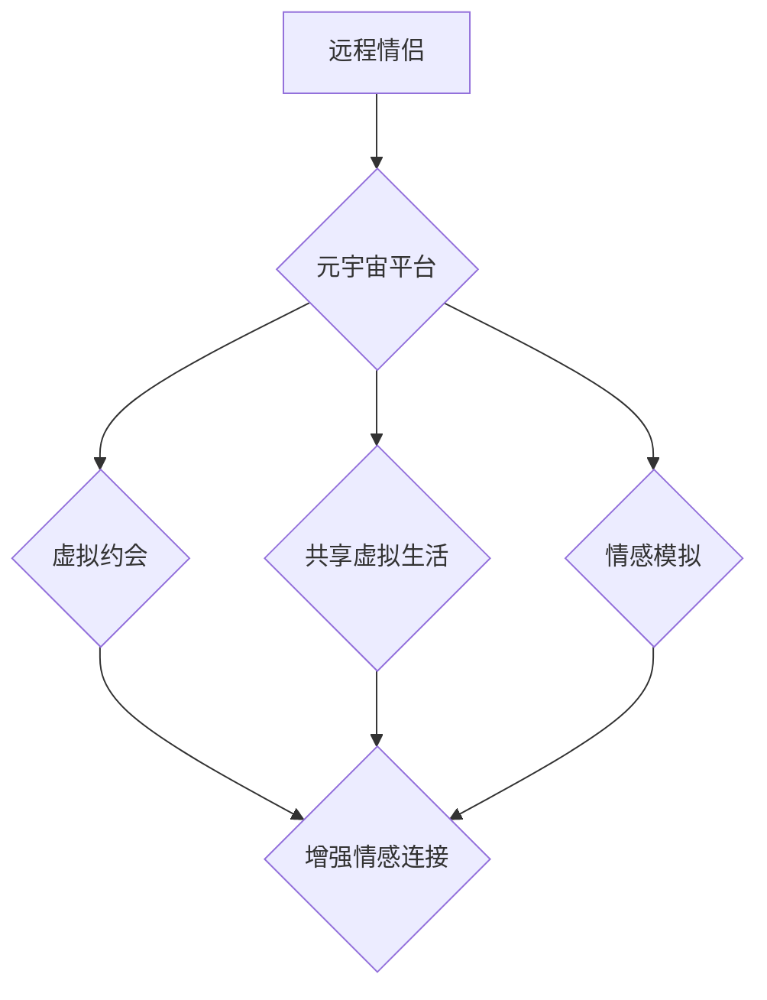

                 

## 数字化情侣:元宇宙中的远程恋爱

> 关键词：元宇宙、远程恋爱、虚拟现实、人工智能、情感模拟、数字身份、隐私安全、伦理问题

## 1. 背景介绍

随着科技的飞速发展，元宇宙概念逐渐从科幻小说走向现实。元宇宙，一个由虚拟现实、增强现实和互联网相互融合构建的沉浸式数字世界，正在改变人们的生活方式，包括恋爱方式。远程恋爱，因地理距离、工作忙碌等原因而产生的恋爱模式，在现代社会越来越普遍。元宇宙为远程恋爱提供了全新的可能性，让情侣们即使身处千里之外，也能在虚拟世界中共享生活、体验情感共鸣。

## 2. 核心概念与联系

### 2.1 元宇宙

元宇宙是一个由虚拟现实、增强现实和互联网相互融合构建的沉浸式数字世界。它拥有以下核心特征：

* **沉浸式体验:**  通过VR/AR技术，用户可以身临其境地体验虚拟世界，与虚拟环境和虚拟角色进行互动。
* **持久性:** 元宇宙是一个永不关闭的虚拟世界，用户可以随时随地进入，并保留虚拟资产和身份。
* **去中心化:** 元宇宙由多个平台和开发者共同构建，用户拥有对虚拟资产和身份的自主控制权。
* **经济体系:** 元宇宙拥有自己的虚拟经济体系，用户可以通过虚拟货币进行交易和互动。

### 2.2 远程恋爱

远程恋爱是指情侣双方由于地理距离、工作忙碌等原因，无法经常见面，但仍然保持着恋爱关系的一种模式。远程恋爱面临着以下挑战：

* **缺乏面对面交流:**  远程情侣难以通过肢体语言、眼神交流等方式表达情感，容易产生误解和隔阂。
* **时间差:**  不同时区的情侣难以协调时间进行沟通和互动。
* **情感距离:**  长时间的距离会让情侣之间的情感距离拉大，容易产生孤独感和缺乏安全感。

### 2.3 元宇宙与远程恋爱的结合

元宇宙为远程恋爱提供了新的解决方案，可以帮助情侣们克服远程恋爱的挑战，增强情感连接。

* **虚拟约会:**  情侣可以在元宇宙中创建虚拟约会场景，例如浪漫的餐厅、美丽的风景区等，通过虚拟角色进行互动，体验身临其境的约会氛围。
* **共享虚拟生活:**  情侣可以共同参与元宇宙中的虚拟活动，例如虚拟旅行、虚拟游戏等，分享虚拟生活，增进彼此了解。
* **情感模拟:**  元宇宙可以利用人工智能技术模拟情感，帮助情侣更好地理解彼此的情感需求，增强情感共鸣。

**元宇宙与远程恋爱的关系流程图:**



## 3. 核心算法原理 & 具体操作步骤

### 3.1 算法原理概述

元宇宙中的远程恋爱主要依赖于以下核心算法：

* **虚拟角色生成算法:**  根据用户提供的个人信息和喜好，生成个性化的虚拟角色，使其更具真实感和可信度。
* **情感识别算法:**  通过分析用户的语音、表情、肢体语言等信息，识别用户的真实情感状态，并将其转化为虚拟角色的行为和表达。
* **场景渲染算法:**  根据用户的需求，渲染逼真的虚拟场景，营造沉浸式的恋爱体验。
* **虚拟交互算法:**  实现虚拟角色之间的自然流畅的交互，例如对话、动作、表情等。

### 3.2 算法步骤详解

**虚拟角色生成算法:**

1. **数据采集:** 收集用户的个人信息，例如年龄、性别、身高、体重、兴趣爱好等。
2. **特征提取:** 从用户数据中提取关键特征，例如面部轮廓、体型特征、性格特点等。
3. **角色模板匹配:** 将提取的特征与预设的角色模板进行匹配，选择最符合用户特征的角色模板。
4. **个性化定制:** 根据用户的个性化需求，对角色模板进行调整，例如服装、发型、妆容等。
5. **角色生成:**  利用3D建模技术，生成个性化的虚拟角色模型。

**情感识别算法:**

1. **数据采集:** 收集用户的语音、表情、肢体语言等信息。
2. **特征提取:** 从采集的数据中提取情感相关的特征，例如语音语调、表情变化、肢体动作等。
3. **情感分类:** 利用机器学习算法，将提取的特征与预先训练好的情感分类模型进行匹配，识别用户的真实情感状态。
4. **情感表达:** 将识别的用户情感状态转化为虚拟角色的行为和表达，例如虚拟角色的表情、语气、动作等。

### 3.3 算法优缺点

**优点:**

* **增强沉浸感:**  虚拟角色和场景的逼真程度可以增强用户的沉浸感，使他们更能融入虚拟世界。
* **克服距离限制:**  元宇宙可以帮助情侣们克服地理距离的限制，随时随地进行互动。
* **丰富情感体验:**  元宇宙可以提供多种虚拟情境，让情侣们体验不同的情感体验。

**缺点:**

* **技术限制:**  目前虚拟角色和场景的逼真程度还有待提高，情感模拟也存在一定的局限性。
* **伦理问题:**  元宇宙中的虚拟恋爱可能会引发一些伦理问题，例如虚拟身份的真实性、情感的真实性等。
* **隐私安全:**  元宇宙中的用户数据需要得到妥善保护，防止泄露和滥用。

### 3.4 算法应用领域

* **远程恋爱:**  帮助情侣们克服距离限制，增强情感连接。
* **社交娱乐:**  提供沉浸式的虚拟社交体验，例如虚拟聚会、虚拟游戏等。
* **教育培训:**  创造虚拟场景，进行沉浸式的教育培训，例如虚拟博物馆、虚拟实验室等。
* **医疗保健:**  提供虚拟治疗环境，帮助患者进行心理治疗、康复训练等。

## 4. 数学模型和公式 & 详细讲解 & 举例说明

### 4.1 数学模型构建

元宇宙中的远程恋爱可以构建一个基于图论的数学模型，其中：

* **节点:** 代表用户或虚拟角色。
* **边:** 代表用户之间的关系，例如恋爱关系、友谊关系等。

**用户关系图:**

```
G = (V, E)
```

其中：

* **V:** 用户集合
* **E:** 用户关系集合

### 4.2 公式推导过程

可以利用图论中的算法，例如最短路径算法，来计算用户之间的关系距离，并根据关系距离，调整虚拟角色的行为和表达，增强情感连接。

**最短路径算法:**

```
distance(u, v) = min(distance(u, w) + distance(w, v))
```

其中：

* **u:** 起始节点
* **v:** 终点节点
* **w:** 中间节点

### 4.3 案例分析与讲解

假设有两个用户A和B，他们在元宇宙中建立了恋爱关系。通过最短路径算法，可以计算出A和B之间的关系距离，并根据关系距离，调整虚拟角色的行为和表达，例如：

* **关系距离较短:**  虚拟角色会表现出更加亲密和温柔的行为。
* **关系距离较长:**  虚拟角色会表现出更加疏远和冷淡的行为。

## 5. 项目实践：代码实例和详细解释说明

### 5.1 开发环境搭建

* **操作系统:**  Windows/macOS/Linux
* **编程语言:**  Python
* **框架:**  Unity3D/Unreal Engine
* **工具:**  Git、Visual Studio Code

### 5.2 源代码详细实现

```python
# 虚拟角色生成算法示例代码

class VirtualCharacter:
    def __init__(self, user_data):
        self.name = user_data['name']
        self.gender = user_data['gender']
        self.age = user_data['age']
        self.appearance = self.generate_appearance(user_data)

    def generate_appearance(self, user_data):
        # 根据用户数据生成虚拟角色的外观
        pass

# 情感识别算法示例代码

class EmotionRecognizer:
    def __init__(self):
        # 加载预训练模型
        pass

    def recognize_emotion(self, user_data):
        # 分析用户数据，识别用户的情感状态
        pass
```

### 5.3 代码解读与分析

* **虚拟角色生成算法:**  该算法根据用户的个人信息，生成个性化的虚拟角色模型。
* **情感识别算法:**  该算法利用机器学习模型，分析用户的语音、表情、肢体语言等信息，识别用户的真实情感状态。

### 5.4 运行结果展示

运行上述代码，可以生成虚拟角色并识别用户的真实情感状态，从而实现元宇宙中的远程恋爱功能。

## 6. 实际应用场景

### 6.1 远程情侣

元宇宙可以为远程情侣提供一个虚拟空间，让他们可以随时随地进行互动，共享生活，增强情感连接。

### 6.2 虚拟社交

元宇宙可以提供沉浸式的虚拟社交体验，例如虚拟聚会、虚拟游戏等，让用户可以结交新朋友，拓展社交圈。

### 6.3 教育培训

元宇宙可以创造虚拟场景，进行沉浸式的教育培训，例如虚拟博物馆、虚拟实验室等，提高学习效率和体验。

### 6.4 未来应用展望

元宇宙的应用场景还在不断拓展，未来可能会应用于更多领域，例如医疗保健、艺术创作、商业营销等。

## 7. 工具和资源推荐

### 7.1 学习资源推荐

* **书籍:**  《元宇宙：未来世界的构建》
* **网站:**  Metaverse Standards Forum
* **在线课程:**  Coursera、edX

### 7.2 开发工具推荐

* **Unity3D:**  跨平台游戏引擎
* **Unreal Engine:**  高性能游戏引擎
* **Blender:**  开源3D建模软件

### 7.3 相关论文推荐

* **The Metaverse: A New Paradigm for Social Interaction**
* **Towards a Framework for Understanding the Metaverse**

## 8. 总结：未来发展趋势与挑战

### 8.1 研究成果总结

元宇宙为远程恋爱提供了新的可能性，可以帮助情侣们克服距离限制，增强情感连接。

### 8.2 未来发展趋势

* **技术进步:**  虚拟角色和场景的逼真程度会不断提高，情感模拟也会更加智能化。
* **应用场景拓展:**  元宇宙的应用场景会不断拓展，覆盖更多领域。
* **商业模式创新:**  元宇宙的商业模式会不断创新，例如虚拟商品、虚拟服务等。

### 8.3 面临的挑战

* **技术瓶颈:**  元宇宙的构建需要克服许多技术瓶颈，例如渲染技术、交互技术、人工智能技术等。
* **伦理问题:**  元宇宙中的虚拟恋爱可能会引发一些伦理问题，例如虚拟身份的真实性、情感的真实性等。
* **隐私安全:**  元宇宙中的用户数据需要得到妥善保护，防止泄露和滥用。

### 8.4 研究展望

未来，我们需要继续研究元宇宙的应用场景，探索元宇宙对人类社会的影响，并制定相应的规范和政策，引导元宇宙的健康发展。

## 9. 附录：常见问题与解答

**Q1: 元宇宙中的虚拟恋爱是否真实？**

A1: 元宇宙中的虚拟恋爱虽然可以提供沉浸式的体验，但它仍然是一种虚拟的体验，不能完全替代现实中的恋爱。

**Q2: 元宇宙中的虚拟角色是否会取代现实中的伴侣？**

A2: 元宇宙中的虚拟角色可以作为一种补充，帮助人们缓解孤独感，但它不会取代现实中的伴侣。

**Q3: 元宇宙中的用户数据是否安全？**

A3: 元宇宙平台需要采取措施保护用户的隐私数据，防止泄露和滥用。


作者：禅与计算机程序设计艺术 / Zen and the Art of Computer Programming 
<end_of_turn>

