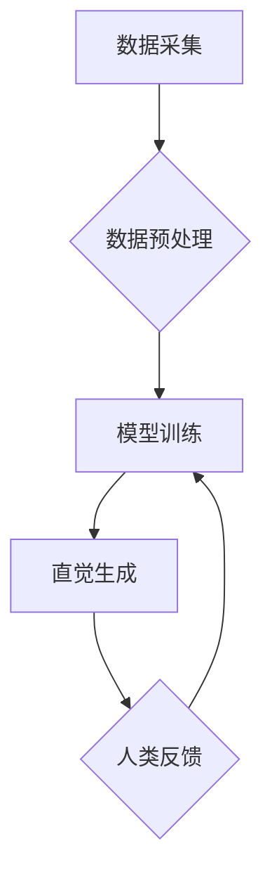

                 

## 数字化直觉增强：AI辅助的第六感开发

> 关键词：人工智能、直觉、第六感、机器学习、深度学习、数据分析、模式识别、预测

### 1. 背景介绍

在瞬息万变的数字化时代，人类面临着海量信息和复杂问题的挑战。传统的逻辑思维和理性分析已难以应对日益增长的信息处理需求。直觉，一种基于经验和潜意识的快速判断能力，在这样的背景下显得尤为重要。它能够帮助我们快速识别模式、洞察隐藏关系，并做出高效的决策。然而，直觉往往难以被量化和解释，其背后的机制也一直是学术界研究的热点。

近年来，人工智能（AI）技术取得了飞速发展，特别是深度学习的突破，为增强人类直觉提供了新的可能性。AI算法能够从海量数据中学习复杂的模式和关系，并将其转化为可解释的决策建议。通过将AI技术与人类直觉相结合，我们可以开发出一种全新的“数字化直觉”，帮助我们更有效地应对数字化时代的挑战。

### 2. 核心概念与联系

**2.1 数字化直觉的定义**

数字化直觉是指通过AI技术辅助人类识别、理解和利用数据中隐藏的模式和关系，从而快速做出高效决策的一种能力。它融合了人类的经验和直觉，以及AI技术的计算能力和数据分析能力，形成了一种全新的认知模式。

**2.2 AI辅助直觉的架构**

AI辅助直觉的架构主要包括以下几个模块：

* **数据采集与预处理:** 收集来自各种来源的数据，并进行清洗、转换和特征提取等预处理工作。
* **模型训练:** 利用深度学习算法，从预处理后的数据中学习复杂的模式和关系。
* **直觉生成:** 基于训练好的模型，对新的数据进行分析，并生成直觉性的决策建议。
* **人类反馈与迭代:** 人类对AI生成的建议进行评估和反馈，并将其反馈到模型训练中，不断优化模型的性能。

**2.3 Mermaid 流程图**



### 3. 核心算法原理 & 具体操作步骤

**3.1 算法原理概述**

AI辅助直觉的核心算法主要基于深度学习，特别是卷积神经网络（CNN）和循环神经网络（RNN）。

* **CNN:** 擅长处理图像、视频等空间数据，能够学习图像中的特征和模式。
* **RNN:** 擅长处理序列数据，例如文本、语音等，能够学习序列中的上下文关系和依赖性。

通过训练这些深度学习模型，我们可以让它们能够从海量数据中学习复杂的模式和关系，并将其转化为可解释的决策建议。

**3.2 算法步骤详解**

1. **数据收集:** 从各种来源收集相关数据，例如用户行为数据、市场趋势数据、社会舆情数据等。
2. **数据预处理:** 对收集到的数据进行清洗、转换和特征提取等预处理工作，使其能够被深度学习模型所接受。
3. **模型选择:** 根据数据的类型和任务需求，选择合适的深度学习模型，例如CNN、RNN或其变体。
4. **模型训练:** 利用训练数据，训练选择的深度学习模型，使其能够学习数据的复杂模式和关系。
5. **模型评估:** 利用测试数据，评估模型的性能，例如准确率、召回率、F1-score等。
6. **模型优化:** 根据评估结果，对模型进行优化，例如调整模型参数、增加训练数据等。
7. **直觉生成:** 将训练好的模型应用于新的数据，并根据模型的输出生成直觉性的决策建议。

**3.3 算法优缺点**

**优点:**

* 能够从海量数据中学习复杂的模式和关系，识别人类难以察觉的趋势。
* 能够快速生成直觉性的决策建议，提高决策效率。
* 能够不断学习和迭代，随着数据量的增加，模型性能不断提升。

**缺点:**

* 需要大量的训练数据，数据质量对模型性能有很大影响。
* 模型训练过程复杂，需要专业的技术人员和计算资源。
* 模型的决策结果难以解释，缺乏透明度。

**3.4 算法应用领域**

AI辅助直觉的应用领域非常广泛，例如：

* **金融领域:** 识别欺诈交易、预测市场趋势、评估投资风险。
* **医疗领域:** 辅助诊断疾病、预测患者病情发展、个性化治疗方案。
* **营销领域:** 预测客户行为、精准营销、个性化推荐。
* **教育领域:** 辅助教师教学、个性化学习方案、智能答疑。

### 4. 数学模型和公式 & 详细讲解 & 举例说明

**4.1 数学模型构建**

AI辅助直觉的核心数学模型通常基于深度学习框架，例如TensorFlow或PyTorch。这些框架提供了一系列预训练的模型和工具，可以帮助我们快速构建和训练直觉生成模型。

**4.2 公式推导过程**

深度学习模型的训练过程本质上是一个优化问题，目标是找到模型参数，使得模型的预测结果与真实结果之间的误差最小化。常用的优化算法包括梯度下降法、Adam算法等。

**4.3 案例分析与讲解**

例如，在金融领域，我们可以利用深度学习模型预测股票价格走势。模型的输入数据可以包括股票的历史价格、交易量、新闻事件等信息。模型的输出结果可以是一个预测价格的数值，或者是一个概率分布，表示股票价格可能上涨、下跌或持平的概率。

通过训练模型，我们可以让它学习股票价格走势的复杂模式和关系，并生成更准确的预测结果。

### 5. 项目实践：代码实例和详细解释说明

**5.1 开发环境搭建**

为了实现AI辅助直觉的项目实践，我们需要搭建一个合适的开发环境。常用的开发环境包括：

* **Python:** 作为深度学习的编程语言，Python拥有丰富的库和工具，例如TensorFlow、PyTorch、NumPy等。
* **GPU:** 深度学习模型的训练过程需要大量的计算资源，GPU可以显著加速训练速度。
* **云计算平台:** 云计算平台例如AWS、Azure、GCP等可以提供强大的计算资源和存储空间，方便我们进行大规模数据处理和模型训练。

**5.2 源代码详细实现**

以下是一个简单的AI辅助直觉项目代码实例，使用TensorFlow框架构建一个简单的图像分类模型：

```python
import tensorflow as tf

# 定义模型结构
model = tf.keras.models.Sequential([
    tf.keras.layers.Conv2D(32, (3, 3), activation='relu', input_shape=(28, 28, 1)),
    tf.keras.layers.MaxPooling2D((2, 2)),
    tf.keras.layers.Conv2D(64, (3, 3), activation='relu'),
    tf.keras.layers.MaxPooling2D((2, 2)),
    tf.keras.layers.Flatten(),
    tf.keras.layers.Dense(10, activation='softmax')
])

# 编译模型
model.compile(optimizer='adam',
              loss='sparse_categorical_crossentropy',
              metrics=['accuracy'])

# 训练模型
model.fit(x_train, y_train, epochs=5)

# 评估模型
loss, accuracy = model.evaluate(x_test, y_test)
print('Test loss:', loss)
print('Test accuracy:', accuracy)
```

**5.3 代码解读与分析**

这段代码定义了一个简单的卷积神经网络模型，用于图像分类任务。模型包含两个卷积层、两个最大池化层、一个全连接层和一个输出层。

* **Conv2D层:** 用于提取图像特征。
* **MaxPooling2D层:** 用于降维，减少计算量。
* **Flatten层:** 将多维特征转换为一维向量。
* **Dense层:** 用于分类，输出10个类别概率。

模型使用Adam优化器、交叉熵损失函数和准确率作为评估指标。

**5.4 运行结果展示**

训练完成后，我们可以使用测试数据评估模型的性能。模型的准确率越高，说明模型的预测能力越强。

### 6. 实际应用场景

**6.1 金融领域**

* **欺诈检测:** AI辅助直觉可以分析交易数据，识别异常行为，并及时报警，有效预防欺诈交易。
* **风险评估:** AI辅助直觉可以分析客户的信用记录、财务状况等信息，评估其投资风险，帮助金融机构做出更明智的决策。
* **个性化投资:** AI辅助直觉可以根据用户的风险偏好、投资目标等信息，推荐个性化的投资方案，提高投资收益。

**6.2 医疗领域**

* **疾病诊断:** AI辅助直觉可以分析患者的病历、检查结果等信息，辅助医生诊断疾病，提高诊断准确率。
* **病情预测:** AI辅助直觉可以分析患者的病情变化趋势，预测其未来病情发展，帮助医生制定更有效的治疗方案。
* **药物研发:** AI辅助直觉可以分析大量的生物数据，加速药物研发过程，发现新的药物靶点和治疗方案。

**6.3 其他领域**

* **营销领域:** AI辅助直觉可以分析客户的行为数据，预测其购买意愿，进行精准营销，提高营销效果。
* **教育领域:** AI辅助直觉可以分析学生的学习数据，个性化推荐学习方案，提高学习效率。
* **交通领域:** AI辅助直觉可以分析交通流量数据，预测交通拥堵情况，优化交通管理，提高交通效率。

**6.4 未来应用展望**

随着人工智能技术的不断发展，AI辅助直觉的应用场景将更加广泛，并对人类社会产生更深远的影响。未来，AI辅助直觉将可能应用于以下领域：

* **科学研究:** 帮助科学家发现新的物理规律、化学反应、生物机制等。
* **艺术创作:** 帮助艺术家创作出更具创意和想象力的作品。
* **人机交互:** 帮助人类与机器进行更自然、更流畅的交互。

### 7. 工具和资源推荐

**7.1 学习资源推荐**

* **在线课程:** Coursera、edX、Udacity等平台提供丰富的深度学习课程。
* **书籍:** 《深度学习》、《动手学深度学习》等书籍是深度学习入门的好选择。
* **博客和论坛:** TensorFlow、PyTorch等框架的官方博客和论坛提供大量的学习资源和技术支持。

**7.2 开发工具推荐**

* **TensorFlow:** Google开发的开源深度学习框架，功能强大，应用广泛。
* **PyTorch:** Facebook开发的开源深度学习框架，灵活易用，适合研究和开发。
* **Keras:** TensorFlow的高级API，简化了模型构建和训练过程。

**7.3 相关论文推荐**

* **AlexNet:** 《ImageNet Classification with Deep Convolutional Neural Networks》
* **VGGNet:** 《Very Deep Convolutional Networks for Large-Scale Image Recognition》
* **ResNet:** 《Deep Residual Learning for Image Recognition》

### 8. 总结：未来发展趋势与挑战

**8.1 研究成果总结**

近年来，AI辅助直觉的研究取得了显著进展，在金融、医疗、营销等领域取得了成功应用。深度学习算法的不断发展，为AI辅助直觉的实现提供了强大的技术支撑。

**8.2 未来发展趋势**

未来，AI辅助直觉的发展趋势包括：

* **模型更加智能化:** 模型将能够学习更复杂的模式和关系，并生成更准确、更可靠的直觉建议。
* **应用场景更加广泛:** AI辅助直觉将应用于更多领域，例如科学研究、艺术创作、人机交互等。
* **解释性更强:** 模型的决策结果将更加透明可解释，增强用户对AI辅助直觉的信任。

**8.3 面临的挑战**

AI辅助直觉的发展也面临着一些挑战：

* **数据质量:** 模型的性能依赖于数据的质量，需要收集和处理高质量的数据。
* **模型解释性:** 模型的决策结果难以解释，缺乏透明度，需要进一步研究模型的解释性。
* **伦理问题:** AI辅助直觉的应用可能会带来一些伦理问题，例如数据隐私、算法偏见等，需要进行深入探讨和规范。

**8.4 研究展望**

未来，我们需要继续深入研究AI辅助直觉的原理和算法，开发更智能、更可靠的模型，并解决其面临的挑战，使其更好地服务于人类社会。


### 9. 附录：常见问题与解答

**9.1 如何选择合适的深度学习模型？**

选择合适的深度学习模型需要根据具体任务和数据特点进行选择。例如，对于图像分类任务，可以使用CNN模型；对于文本处理任务，可以使用RNN模型。

**9.2 如何评估模型的性能？**

常用的模型评估指标包括准确率、召回率、F1-score等。

**9.3 如何解决模型过拟合问题？**

模型过拟合是指模型在训练数据上表现很好，但在测试数据上表现较差。解决模型过拟合问题的方法包括：

* 增加训练数据量
* 使用正则化技术
* 使用Dropout技术
* 使用早停策略

**9.4 如何解释模型的决策结果？**

解释模型的决策结果是一个复杂的问题，目前还没有完美的解决方案。一些常用的方法包括：

* 使用可视化技术，例如热力图，展示模型对输入特征的关注程度。
* 使用LIME等解释性AI技术，解释模型对单个样本的预测结果。
* 使用SHAP等方法，解释模型对多个样本的预测结果。


作者：禅与计算机程序设计艺术 / Zen and the Art of Computer Programming 
<end_of_turn>

