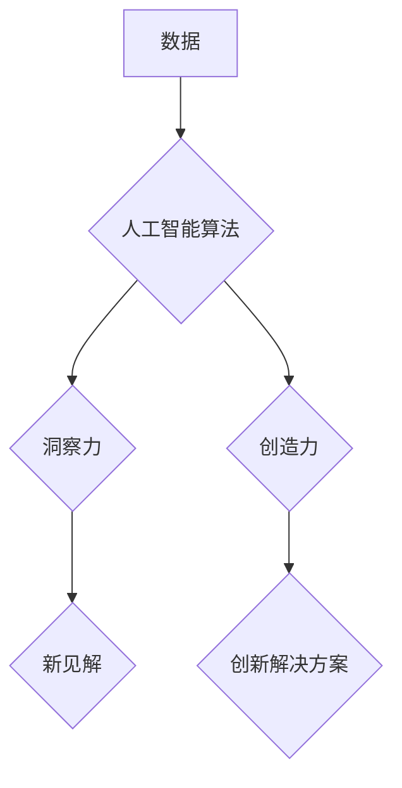

                 

## 洞察力与创造力：灵感的科学解析

> 关键词：人工智能、洞察力、创造力、灵感、算法、神经网络、机器学习、深度学习、认知科学

## 1. 背景介绍

在当今数据爆炸的时代，人类面临着前所未有的信息量。如何从海量数据中提取有价值的洞察力，并将其转化为创新和创造力，成为一个至关重要的挑战。人工智能（AI）作为一种新兴技术，正在逐渐改变我们获取和利用信息的方式，并为洞察力和创造力的提升提供了新的可能性。

传统的认知科学认为，洞察力和创造力是人类独有的特质，源于复杂的意识和情感体验。然而，随着人工智能技术的不断发展，我们开始认识到，灵感和创造力并非完全神秘不可解的领域。通过对人类认知机制的深入研究和对人工智能算法的不断改进，我们可以逐渐揭开灵感和创造力的奥秘，并将其应用于解决现实世界中的各种问题。

## 2. 核心概念与联系

**2.1 洞察力与创造力的定义**

* **洞察力**是指从纷繁复杂的现象中识别出隐藏的模式、关系和趋势的能力。它是一种对信息的深度理解和分析，能够帮助我们发现新的见解和解决问题的新思路。
* **创造力**是指产生新颖、独特和有价值的思想、概念或作品的能力。它需要洞察力的支持，并结合想象力、联想能力和执行力，才能最终转化为现实。

**2.2 人工智能与洞察力创造力的关系**

人工智能技术可以帮助我们增强洞察力和创造力，主要通过以下几个方面：

* **数据分析和模式识别:** 人工智能算法能够处理海量数据，并从中识别出人类难以察觉的模式和趋势。这为我们提供了更深入的洞察力，并为创造新的解决方案提供了灵感。
* **联想和想象:** 一些人工智能模型，例如生成式对抗网络（GAN），能够生成新的图像、文本和音乐等创意内容。这表明人工智能正在逐渐具备模拟人类想象力的能力。
* **协同工作:** 人工智能可以作为人类的助手，帮助我们更快、更有效地完成工作。例如，人工智能可以帮助我们整理信息、生成草稿、提供创意建议等，从而解放我们的创造力。

**2.3 核心概念架构**



## 3. 核心算法原理 & 具体操作步骤

### 3.1 算法原理概述

深度学习是人工智能领域中一个重要的分支，它利用多层神经网络来模拟人类的学习过程。深度学习算法能够从数据中自动学习特征，并进行复杂的模式识别和预测。

### 3.2 算法步骤详解

1. **数据收集和预处理:** 收集相关数据，并进行清洗、转换和格式化等预处理操作。
2. **模型构建:** 选择合适的深度学习模型架构，例如卷积神经网络（CNN）、循环神经网络（RNN）或变分自编码器（VAE）。
3. **模型训练:** 使用训练数据训练模型，调整模型参数以最小化预测误差。
4. **模型评估:** 使用测试数据评估模型的性能，并进行必要的调整和优化。
5. **模型应用:** 将训练好的模型应用于实际场景，例如进行数据分析、生成创意内容或提供个性化服务。

### 3.3 算法优缺点

**优点:**

* 能够自动学习特征，无需人工特征工程。
* 能够处理复杂的数据模式，并进行高精度预测。
* 在图像识别、自然语言处理等领域取得了突破性进展。

**缺点:**

* 需要大量的训练数据，否则模型性能会下降。
* 训练过程耗时和计算资源消耗大。
* 模型解释性较差，难以理解模型的决策过程。

### 3.4 算法应用领域

* **数据分析和洞察:** 从海量数据中识别出隐藏的模式和趋势，帮助企业做出更明智的决策。
* **创意内容生成:** 生成新的图像、文本、音乐等创意内容，为艺术创作和娱乐产业提供新的可能性。
* **个性化推荐:** 根据用户的兴趣和行为，推荐个性化的商品、服务和内容。
* **医疗诊断:** 分析医学图像和患者数据，辅助医生进行诊断和治疗。

## 4. 数学模型和公式 & 详细讲解 & 举例说明

### 4.1 数学模型构建

深度学习模型的核心是神经网络，它由多个层级的神经元组成。每个神经元接收来自上一层的输入信号，并对其进行处理，然后将处理后的信号传递到下一层。

神经网络的学习过程本质上是一个参数优化过程。通过调整神经网络的参数，使得模型的预测结果与实际结果之间的误差最小化。

### 4.2 公式推导过程

**损失函数:** 衡量模型预测结果与实际结果之间的误差。常用的损失函数包括均方误差（MSE）和交叉熵损失（Cross-Entropy Loss）。

**梯度下降:** 用于优化模型参数的算法。通过计算损失函数对参数的梯度，并沿着梯度方向更新参数，逐步降低损失函数的值。

**激活函数:** 用于引入非线性，使神经网络能够学习更复杂的模式。常用的激活函数包括ReLU、Sigmoid和Tanh。

### 4.3 案例分析与讲解

**举例说明:**

假设我们有一个图像分类任务，目标是将图像分类为猫或狗。我们可以使用卷积神经网络（CNN）来解决这个问题。

CNN模型的结构包括多个卷积层、池化层和全连接层。卷积层用于提取图像特征，池化层用于降低特征维度，全连接层用于分类。

训练过程中，我们会使用大量的猫狗图像数据，并通过梯度下降算法优化模型参数。

损失函数用于衡量模型预测结果与实际标签之间的误差。

通过不断的训练和优化，模型最终能够准确地将图像分类为猫或狗。

## 5. 项目实践：代码实例和详细解释说明

### 5.1 开发环境搭建

* **操作系统:** Ubuntu 18.04 或更高版本
* **编程语言:** Python 3.6 或更高版本
* **深度学习框架:** TensorFlow 或 PyTorch
* **其他工具:** Jupyter Notebook、Git

### 5.2 源代码详细实现

```python
# 使用 TensorFlow 实现一个简单的图像分类模型

import tensorflow as tf

# 定义模型结构
model = tf.keras.models.Sequential([
    tf.keras.layers.Conv2D(32, (3, 3), activation='relu', input_shape=(28, 28, 1)),
    tf.keras.layers.MaxPooling2D((2, 2)),
    tf.keras.layers.Conv2D(64, (3, 3), activation='relu'),
    tf.keras.layers.MaxPooling2D((2, 2)),
    tf.keras.layers.Flatten(),
    tf.keras.layers.Dense(10, activation='softmax')
])

# 编译模型
model.compile(optimizer='adam',
              loss='sparse_categorical_crossentropy',
              metrics=['accuracy'])

# 训练模型
model.fit(x_train, y_train, epochs=5)

# 评估模型
loss, accuracy = model.evaluate(x_test, y_test)
print('Test loss:', loss)
print('Test accuracy:', accuracy)
```

### 5.3 代码解读与分析

* **模型结构:** 该代码定义了一个简单的卷积神经网络模型，包含两个卷积层、两个池化层和一个全连接层。
* **激活函数:** 使用ReLU作为激活函数，可以提高模型的学习能力。
* **损失函数:** 使用交叉熵损失函数，适合多分类问题。
* **优化器:** 使用Adam优化器，可以加速模型训练。
* **训练过程:** 使用训练数据训练模型，并设置训练轮数（epochs）。
* **评估过程:** 使用测试数据评估模型的性能，并打印测试损失和准确率。

### 5.4 运行结果展示

运行代码后，会输出模型的训练过程和测试结果。

## 6. 实际应用场景

### 6.1 数据分析与洞察

* **市场趋势分析:** 从海量销售数据中识别出消费者的购买趋势，帮助企业制定营销策略。
* **客户行为分析:** 分析客户的浏览记录、购买历史和反馈信息，了解客户的需求和偏好，提供个性化服务。
* **风险预测:** 分析金融数据，识别潜在的风险，帮助企业进行风险管理。

### 6.2 创意内容生成

* **艺术创作:** 使用GAN生成新的图像、音乐和文本，为艺术创作提供新的灵感和可能性。
* **广告创意:** 使用AI生成个性化的广告文案和创意，提高广告效果。
* **游戏开发:** 使用AI生成游戏场景、角色和剧情，丰富游戏内容。

### 6.3 个性化推荐

* **电商推荐:** 根据用户的购买历史和浏览记录，推荐个性化的商品。
* **内容推荐:** 根据用户的兴趣和行为，推荐个性化的新闻、视频和文章。
* **音乐推荐:** 根据用户的音乐偏好，推荐个性化的歌曲和音乐专辑。

### 6.4 未来应用展望

随着人工智能技术的不断发展，洞察力和创造力的应用场景将会更加广泛。

* **医疗诊断:** AI将能够辅助医生进行更精准的诊断，并提供个性化的治疗方案。
* **教育教学:** AI将能够提供个性化的学习内容和辅导，帮助学生更好地掌握知识。
* **科学研究:** AI将能够加速科学研究的进程，帮助科学家发现新的规律和知识。

## 7. 工具和资源推荐

### 7.1 学习资源推荐

* **书籍:**
    * 《深度学习》
    * 《人工智能：一种现代方法》
    * 《机器学习》
* **在线课程:**
    * Coursera
    * edX
    * Udacity
* **博客和网站:**
    * TensorFlow Blog
    * PyTorch Blog
    * Towards Data Science

### 7.2 开发工具推荐

* **深度学习框架:** TensorFlow, PyTorch, Keras
* **数据处理工具:** Pandas, NumPy
* **可视化工具:** Matplotlib, Seaborn

### 7.3 相关论文推荐

* **《ImageNet Classification with Deep Convolutional Neural Networks》**
* **《Attention Is All You Need》**
* **《Generative Adversarial Networks》**

## 8. 总结：未来发展趋势与挑战

### 8.1 研究成果总结

近年来，人工智能在洞察力和创造力方面的研究取得了显著进展。深度学习算法能够自动学习特征，并进行复杂的模式识别和预测，为洞察力和创造力的提升提供了新的可能性。

### 8.2 未来发展趋势

* **更强大的模型:** 研究人员将继续开发更强大的深度学习模型，例如Transformer、BERT等，以提高洞察力和创造力的水平。
* **更广泛的应用:** AI将应用于更多领域，例如医疗、教育、科学研究等，为人类社会带来更多价值。
* **更强的解释性:** 研究人员将致力于提高AI模型的解释性，使人类能够更好地理解AI的决策过程。

### 8.3 面临的挑战

* **数据获取和隐私问题:** AI模型需要大量的训练数据，而数据获取和隐私保护是一个重要的挑战。
* **算法可解释性和信任问题:** AI模型的决策过程往往难以理解，这可能会导致人们对AI的信任不足。
* **伦理和社会影响:** AI技术的快速发展可能会带来一些伦理和社会问题，需要我们认真思考和应对。

### 8.4 研究展望

未来，人工智能在洞察力和创造力方面的研究将继续深入，并为人类社会带来更多福祉。我们需要加强跨学科合作，探索AI与人类认知的相互关系，并制定相应的伦理规范和政策，确保AI技术能够安全、有效地服务于人类。

## 9. 附录：常见问题与解答

**Q1: 如何选择合适的深度学习模型？**

**A1:** 选择深度学习模型需要根据具体任务和数据特点进行考虑。例如，图像分类任务可以使用CNN，文本分类任务可以使用RNN或Transformer。

**Q2: 如何处理数据不平衡问题？**

**A2:** 数据不平衡问题可以通过数据增强、权重调整等方法进行解决。

**Q3: 如何评估深度学习模型的性能？**

**A3:** 可以使用准确率、召回率、F1-score等指标来评估深度学习模型的性能。

**作者：禅与计算机程序设计艺术 / Zen and the Art of Computer Programming**


<end_of_turn>

