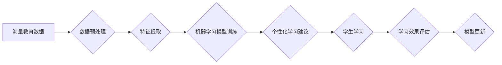

                 

## 知识发现引擎：教育领域的个性化变革

> 关键词：知识发现引擎、个性化学习、机器学习、数据挖掘、教育科技、人工智能、学习路径

## 1. 背景介绍

教育领域一直致力于为每个学生提供最佳的学习体验，但传统的教育模式往往难以满足个性化需求。学生们在学习过程中存在着不同的学习风格、节奏和兴趣点，而传统的“一刀切”的教学方法难以兼顾所有学生的差异。随着人工智能技术的快速发展，知识发现引擎（Knowledge Discovery Engine，KDE）应运而生，为教育领域带来了个性化学习的全新可能性。

知识发现引擎是一种利用机器学习、数据挖掘等技术，从海量教育数据中挖掘出隐藏的知识和模式，并将其转化为个性化的学习建议和资源的系统。它可以分析学生的学习行为、知识掌握情况、兴趣偏好等信息，并根据这些信息，为每个学生定制个性化的学习路径、学习内容和学习方式。

## 2. 核心概念与联系

### 2.1  知识发现引擎 (KDE)

知识发现引擎的核心是利用数据分析和机器学习算法，从海量教育数据中发现隐藏的知识和模式。这些数据可以包括学生的学习记录、考试成绩、课堂参与情况、学习偏好等。KDE 通过对这些数据的分析，可以识别学生的学习风格、知识掌握情况、学习兴趣等特征，并根据这些特征，为学生提供个性化的学习建议和资源。

### 2.2  个性化学习

个性化学习是指根据学生的个体差异，定制化的学习体验。它强调学生的自主学习、自驱学习和个性化发展。个性化学习的目标是帮助每个学生在自己的节奏和方式下，达到最佳的学习效果。

### 2.3  机器学习与数据挖掘

机器学习和数据挖掘是KDE的核心技术。机器学习算法可以从数据中学习模式和规律，并根据这些模式，预测未来的结果。数据挖掘算法可以从数据中发现隐藏的知识和模式，并将其转化为可理解的形式。

**Mermaid 流程图**



## 3. 核心算法原理 & 具体操作步骤

### 3.1  算法原理概述

KDE 的核心算法通常基于以下几种机器学习算法：

* **推荐系统算法:**  例如协同过滤、内容过滤、混合推荐等，用于根据学生的学习历史和兴趣，推荐个性化的学习资源。
* **分类算法:**  例如决策树、支持向量机、神经网络等，用于根据学生的学习特征，预测学生的学习能力、学习风格等。
* **聚类算法:**  例如K-means、层次聚类等，用于将学生按照学习特征进行分组，为不同学习类型的学生提供个性化的学习方案。

### 3.2  算法步骤详解

1. **数据收集:** 收集海量教育数据，包括学生的学习记录、考试成绩、课堂参与情况、学习偏好等。
2. **数据预处理:** 对收集到的数据进行清洗、转换、归一化等处理，使其适合机器学习算法的训练。
3. **特征提取:** 从预处理后的数据中提取重要的特征，例如学生的学习时间、学习内容、学习效率等。
4. **模型训练:** 选择合适的机器学习算法，并使用提取的特征进行模型训练。
5. **模型评估:** 使用测试数据对训练好的模型进行评估，并根据评估结果进行模型调优。
6. **个性化学习建议:** 将训练好的模型应用于新的数据，为学生提供个性化的学习建议和资源。

### 3.3  算法优缺点

**优点:**

* **个性化学习:**  可以根据学生的个体差异，提供个性化的学习体验。
* **提高学习效率:**  可以帮助学生更快地掌握知识，提高学习效率。
* **数据驱动:**  基于数据分析和机器学习，可以提供更科学、更精准的学习建议。

**缺点:**

* **数据依赖:**  KDE 的效果依赖于海量高质量的教育数据。
* **算法复杂性:**  一些机器学习算法的训练和应用需要较高的技术水平。
* **伦理问题:**  KDE 的应用需要考虑数据隐私、算法公平性等伦理问题。

### 3.4  算法应用领域

KDE 的应用领域非常广泛，包括：

* **个性化学习平台:** 为学生提供个性化的学习路径、学习内容和学习方式。
* **智能辅导系统:** 为学生提供个性化的学习辅导和答疑服务。
* **教育资源推荐:** 为学生推荐个性化的学习资源，例如书籍、视频、练习题等。
* **学习效果评估:**  评估学生的学习效果，并根据评估结果提供个性化的学习建议。

## 4. 数学模型和公式 & 详细讲解 & 举例说明

### 4.1  数学模型构建

KDE 的数学模型通常基于概率论和统计学，例如贝叶斯网络、隐马尔可夫模型等。这些模型可以用来描述学生学习过程中的各种因素之间的关系，并预测学生的学习行为和学习效果。

**举例说明:**

假设我们想要构建一个推荐学习资源的模型，可以使用协同过滤算法。协同过滤算法基于用户的行为相似性，推荐用户可能感兴趣的资源。

**用户-物品交互矩阵:**

我们可以用一个用户-物品交互矩阵来表示用户的行为，其中每个元素代表用户对某一物品的评分或交互行为。

```
用户 | 资源1 | 资源2 | 资源3
------- | -------- | -------- | --------
用户1 | 5 | 3 | 4
用户2 | 4 | 5 | 2
用户3 | 3 | 2 | 5
```

**相似度计算:**

我们可以使用余弦相似度等方法计算用户之间的相似度。

**资源推荐:**

根据用户与其他用户的相似度，我们可以推荐用户可能感兴趣的资源。

### 4.2  公式推导过程

协同过滤算法的具体公式推导过程比较复杂，涉及到矩阵分解、线性代数等知识。

### 4.3  案例分析与讲解

我们可以通过分析实际的教育数据，例如学生的学习记录、考试成绩等，来验证KDE的有效性。

## 5. 项目实践：代码实例和详细解释说明

### 5.1  开发环境搭建

KDE 的开发环境通常包括以下软件：

* Python 编程语言
* Jupyter Notebook 或其他代码编辑器
* 机器学习库，例如 scikit-learn、TensorFlow、PyTorch
* 数据处理库，例如 Pandas、NumPy

### 5.2  源代码详细实现

```python
# 导入必要的库
import pandas as pd
from sklearn.model_selection import train_test_split
from sklearn.linear_model import LogisticRegression

# 加载数据
data = pd.read_csv("education_data.csv")

# 数据预处理
# ...

# 特征提取
# ...

# 将数据划分为训练集和测试集
X_train, X_test, y_train, y_test = train_test_split(X, y, test_size=0.2)

# 训练模型
model = LogisticRegression()
model.fit(X_train, y_train)

# 模型评估
# ...

# 个性化学习建议
# ...
```

### 5.3  代码解读与分析

这段代码展示了KDE 的基本流程，包括数据加载、数据预处理、特征提取、模型训练、模型评估和个性化学习建议。

### 5.4  运行结果展示

运行结果可以包括模型的准确率、召回率、F1-score等指标，以及个性化学习建议的具体内容。

## 6. 实际应用场景

KDE 在教育领域的应用场景非常广泛，例如：

* **个性化学习平台:**  例如 Khan Academy、Coursera 等平台，可以根据学生的学习进度和掌握情况，推荐个性化的学习内容和学习路径。
* **智能辅导系统:**  例如 Wolfram Alpha、Duolingo 等系统，可以根据学生的学习问题，提供个性化的辅导和答疑服务。
* **教育资源推荐:**  例如 Google Scholar、Amazon Kindle 等平台，可以根据学生的学习兴趣和需求，推荐个性化的学习资源。

### 6.4  未来应用展望

未来，KDE 将会更加智能化、个性化和自动化。例如：

* **更精准的个性化推荐:**  利用更先进的机器学习算法，对学生的学习行为进行更精准的分析，提供更个性化的学习建议。
* **更丰富的学习资源:**  KDE 将会整合更多类型的学习资源，例如视频、音频、游戏、虚拟现实等，为学生提供更丰富的学习体验。
* **更智能的学习助手:**  KDE 将会发展成为更智能的学习助手，可以帮助学生制定学习计划、跟踪学习进度、提供学习反馈等。

## 7. 工具和资源推荐

### 7.1  学习资源推荐

* **书籍:**
    * 《机器学习》 by Tom Mitchell
    * 《深度学习》 by Ian Goodfellow, Yoshua Bengio, and Aaron Courville
* **在线课程:**
    * Coursera: Machine Learning
    * edX: Artificial Intelligence
* **博客和网站:**
    * Towards Data Science
    * Machine Learning Mastery

### 7.2  开发工具推荐

* **Python:**  Python 是机器学习和数据挖掘的常用编程语言。
* **Jupyter Notebook:**  Jupyter Notebook 是一个交互式代码编辑器，方便进行机器学习实验和原型开发。
* **scikit-learn:**  scikit-learn 是一个常用的机器学习库，提供各种机器学习算法的实现。
* **TensorFlow:**  TensorFlow 是一个开源的机器学习框架，可以用于构建和训练深度学习模型。

### 7.3  相关论文推荐

* **《Collaborative Filtering for Implicit Feedback Datasets》** by  Koren, Y.
* **《Recurrent Neural Networks for Sequence Learning》** by  Hochreiter, S. and Schmidhuber, J.
* **《Deep Learning》** by  Goodfellow, I., Bengio, Y., and Courville, A.

## 8. 总结：未来发展趋势与挑战

### 8.1  研究成果总结

KDE 在教育领域的应用取得了显著的成果，例如提高了学习效率、个性化学习体验等。

### 8.2  未来发展趋势

未来，KDE 将会更加智能化、个性化和自动化，并应用于更多教育场景。

### 8.3  面临的挑战

KDE 的发展还面临着一些挑战，例如数据隐私、算法公平性、伦理问题等。

### 8.4  研究展望

未来研究方向包括：

* 开发更精准、更个性化的机器学习算法。
* 构建更丰富的学习资源库。
* 探索KDE在更多教育场景的应用。
* 研究KDE的伦理问题，确保其公平、安全、可信赖地应用于教育领域。

## 9. 附录：常见问题与解答

* **Q: KDE 的数据来源是什么？**
* **A:** KDE 的数据来源可以包括学生的学习记录、考试成绩、课堂参与情况、学习偏好等。

* **Q: KDE 的算法是如何训练的？**
* **A:** KDE 的算法通常使用机器学习技术进行训练，例如监督学习、无监督学习等。

* **Q: KDE 的应用场景有哪些？**
* **A:** KDE 的应用场景非常广泛，例如个性化学习平台、智能辅导系统、教育资源推荐等。

* **Q: KDE 的伦理问题有哪些？**
* **A:** KDE 的应用需要考虑数据隐私、算法公平性、算法透明度等伦理问题。


作者：禅与计算机程序设计艺术 / Zen and the Art of Computer Programming 
<end_of_turn>

