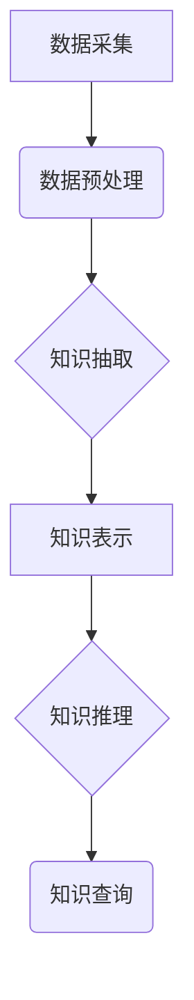

                 

## 知识的碎片化与整合：发现引擎的挑战与机遇

> 关键词：知识图谱、知识发现、人工智能、机器学习、自然语言处理、数据整合、信息检索

### 1. 背景介绍

在信息爆炸的时代，人类所面临的最大挑战之一便是知识的碎片化。海量的文本、图像、音频、视频等数据无处不在，但这些数据往往分散在不同的平台、格式和语境中，难以被有效地整合和利用。传统的搜索引擎主要依靠关键词匹配，难以理解数据的深层含义和语义关系，导致信息检索效率低下，用户难以从海量数据中发现真正有价值的信息。

为了解决这一问题，知识图谱和发现引擎应运而生。知识图谱是一种结构化的知识表示形式，它将知识表示为实体、关系和属性的网络结构，能够更好地捕捉知识之间的语义关联。发现引擎则利用人工智能、机器学习和自然语言处理等技术，从海量数据中自动发现知识，构建知识图谱，并提供更智能、更精准的信息检索和知识导航服务。

### 2. 核心概念与联系

#### 2.1 知识图谱

知识图谱是一种基于本体论的知识表示形式，它将知识表示为实体、关系和属性的网络结构。

* **实体:** 指知识图谱中的基本概念或对象，例如“人”、“地点”、“事物”等。
* **关系:** 指实体之间的连接或关联，例如“出生于”、“位于”、“拥有”等。
* **属性:** 指实体的特征或描述，例如“姓名”、“年龄”、“地址”等。

知识图谱能够有效地捕捉知识之间的语义关联，并支持多种推理和查询操作，例如：

* **实体链接:** 将文本中的提及实体链接到知识图谱中的对应实体。
* **关系抽取:** 从文本中识别实体之间的关系。
* **知识推理:** 基于知识图谱中的已知知识，推断出新的知识。

#### 2.2 发现引擎

发现引擎是一种利用人工智能、机器学习和自然语言处理等技术，从海量数据中自动发现知识，构建知识图谱，并提供更智能、更精准的信息检索和知识导航服务的系统。

发现引擎通常包含以下几个主要模块：

* **数据采集:** 从各种数据源中收集数据，例如文本、图像、音频、视频等。
* **数据预处理:** 对收集到的数据进行清洗、格式化和转换，使其能够被后续模块处理。
* **知识抽取:** 利用自然语言处理技术，从数据中提取实体、关系和属性。
* **知识表示:** 将提取到的知识表示为知识图谱的形式。
* **知识推理:** 基于知识图谱中的已知知识，推断出新的知识。
* **知识查询:** 提供用户查询知识图谱的接口，并返回相关结果。

#### 2.3 核心架构



### 3. 核心算法原理 & 具体操作步骤

#### 3.1 算法原理概述

发现引擎的核心算法原理主要包括：

* **自然语言处理 (NLP):** 用于理解和处理自然语言文本，包括词性标注、依存句法分析、命名实体识别等。
* **机器学习 (ML):** 用于从数据中学习知识，包括监督学习、无监督学习和强化学习等。
* **知识图谱推理:** 用于基于知识图谱中的已知知识，推断出新的知识，例如基于规则推理、基于逻辑推理等。

#### 3.2 算法步骤详解

1. **数据采集:** 从各种数据源中收集数据，例如文本、图像、音频、视频等。
2. **数据预处理:** 对收集到的数据进行清洗、格式化和转换，使其能够被后续模块处理。例如，去除停用词、标点符号，将文本转换为词袋模型等。
3. **实体识别:** 利用自然语言处理技术，从文本中识别出实体，例如人名、地名、机构名等。
4. **关系抽取:** 利用机器学习算法，从文本中识别出实体之间的关系，例如“出生于”、“位于”、“拥有”等。
5. **知识表示:** 将提取到的实体、关系和属性表示为知识图谱的形式。
6. **知识推理:** 基于知识图谱中的已知知识，推断出新的知识。例如，如果知道“张三出生于北京”，并且知道“北京是中国的首都”，那么可以推断出“张三出生在中国”。
7. **知识查询:** 提供用户查询知识图谱的接口，并返回相关结果。

#### 3.3 算法优缺点

**优点:**

* 能够有效地捕捉知识之间的语义关联。
* 支持多种推理和查询操作。
* 可以帮助用户更深入地理解知识。

**缺点:**

* 构建知识图谱需要大量的标注数据。
* 知识抽取和推理算法的准确性仍然存在挑战。
* 知识图谱的规模和复杂度不断增长，维护和更新难度不断增加。

#### 3.4 算法应用领域

发现引擎的应用领域非常广泛，例如：

* **搜索引擎:** 提供更智能、更精准的信息检索服务。
* **问答系统:** 能够回答用户复杂的问题，并提供多角度的答案。
* **推荐系统:** 基于用户的兴趣和行为，推荐相关信息和产品。
* **教育领域:** 提供个性化的学习内容和辅导服务。
* **医疗领域:** 辅助医生诊断疾病、制定治疗方案。

### 4. 数学模型和公式 & 详细讲解 & 举例说明

#### 4.1 数学模型构建

知识图谱可以表示为一个三元组的集合：

```
G = (E, R, T)
```

其中：

* **E:** 实体集合
* **R:** 关系集合
* **T:** 三元组集合，每个三元组表示一个事实，格式为 (h, r, t)，其中 h 是主语实体，r 是关系，t 是宾语实体。

#### 4.2 公式推导过程

知识推理可以利用逻辑规则和机器学习算法进行。

* **基于规则推理:** 定义一组规则，根据规则和知识图谱中的已知知识，推断出新的知识。例如，如果规则为“如果 A 是 B 的子类，并且 B 是 C 的子类，那么 A 是 C 的子类”，那么如果知识图谱中包含“动物 是 生物 的子类” 和 “哺乳动物 是 动物 的子类”，那么可以推断出“哺乳动物 是 生物 的子类”。
* **基于逻辑推理:** 利用逻辑推理算法，从知识图谱中推断出新的知识。例如，可以使用 Description Logic (DL) 或 OWL (Web Ontology Language) 等逻辑语言进行推理。

#### 4.3 案例分析与讲解

假设知识图谱包含以下事实：

* (张三, 出生于, 北京)
* (北京, 位于, 中国)

利用规则推理，可以推断出以下新的知识：

* (张三, 位于, 中国)

### 5. 项目实践：代码实例和详细解释说明

#### 5.1 开发环境搭建

* Python 3.x
* TensorFlow 或 PyTorch
* SpaCy 或 NLTK

#### 5.2 源代码详细实现

```python
# 实体识别
import spacy

nlp = spacy.load("en_core_web_sm")

text = "Barack Obama was born in Honolulu, Hawaii."
doc = nlp(text)

for ent in doc.ents:
    print(ent.text, ent.label_)

# 关系抽取
# 使用机器学习模型进行关系抽取，例如 BERT 或 RoBERTa

# 知识表示
# 使用 RDF 或 OWL 等标准格式表示知识图谱

# 知识推理
# 使用规则引擎或逻辑推理算法进行知识推理
```

#### 5.3 代码解读与分析

* 实体识别: 使用 SpaCy 库对文本进行实体识别，识别出实体类型和文本内容。
* 关系抽取: 使用机器学习模型对文本进行关系抽取，识别出实体之间的关系类型。
* 知识表示: 将实体、关系和属性表示为 RDF 或 OWL 格式的知识图谱。
* 知识推理: 使用规则引擎或逻辑推理算法对知识图谱进行推理，推断出新的知识。

#### 5.4 运行结果展示

运行代码后，可以得到以下结果：

* 实体识别结果: Barack Obama (PERSON), Honolulu (GPE), Hawaii (GPE)
* 关系抽取结果: (Barack Obama, born in, Honolulu)
* 知识图谱:

```
(Barack Obama, 出生于, Honolulu)
(Honolulu, 位于, Hawaii)
```

* 知识推理结果: (Barack Obama, 位于, Hawaii)

### 6. 实际应用场景

#### 6.1 搜索引擎

发现引擎可以帮助搜索引擎更智能地理解用户查询意图，并提供更精准的搜索结果。例如，如果用户查询“苹果公司”，发现引擎可以识别出“苹果公司”是实体，并从知识图谱中获取到苹果公司的相关信息，例如公司地址、成立时间、主要产品等，并将其展示给用户。

#### 6.2 问答系统

发现引擎可以帮助问答系统回答用户复杂的问题，并提供多角度的答案。例如，如果用户查询“中国古代四大发明是什么”，发现引擎可以从知识图谱中获取到“四大发明”的定义和具体内容，并将其以简洁易懂的语言回答给用户。

#### 6.3 推荐系统

发现引擎可以帮助推荐系统根据用户的兴趣和行为，推荐相关信息和产品。例如，如果用户经常阅读科技类文章，发现引擎可以从知识图谱中获取到与科技相关的实体和关系，并推荐用户阅读其他科技类文章或关注相关科技公司。

#### 6.4 未来应用展望

随着人工智能、机器学习和自然语言处理技术的不断发展，发现引擎的应用场景将更加广泛，例如：

* **个性化教育:** 提供个性化的学习内容和辅导服务。
* **医疗诊断:** 辅助医生诊断疾病、制定治疗方案。
* **法律服务:** 帮助律师进行法律研究、分析案件。
* **金融分析:** 分析市场趋势、预测股票价格。

### 7. 工具和资源推荐

#### 7.1 学习资源推荐

* **Stanford NLP Group:** https://nlp.stanford.edu/
* **Allen Institute for Artificial Intelligence:** https://allenai.org/
* **DeepMind:** https://deepmind.com/

#### 7.2 开发工具推荐

* **SpaCy:** https://spacy.io/
* **NLTK:** https://www.nltk.org/
* **TensorFlow:** https://www.tensorflow.org/
* **PyTorch:** https://pytorch.org/

#### 7.3 相关论文推荐

* **Knowledge Graph Embedding: A Survey**
* **A Survey on Relation Extraction**
* **Deep Learning for Natural Language Processing**

### 8. 总结：未来发展趋势与挑战

#### 8.1 研究成果总结

发现引擎的研究取得了显著进展，能够有效地从海量数据中发现知识，构建知识图谱，并提供更智能、更精准的信息检索和知识导航服务。

#### 8.2 未来发展趋势

* **更强大的知识推理能力:** 开发更强大的知识推理算法，能够处理更复杂的关系和逻辑推理。
* **更丰富的知识表示形式:** 探索更丰富的知识表示形式，例如时间、空间、因果关系等。
* **更个性化的知识服务:** 基于用户的兴趣和行为，提供更个性化的知识服务。
* **跨语言知识发现:** 实现跨语言知识发现，构建全球性的知识图谱。

#### 8.3 面临的挑战

* **数据质量问题:** 现有的知识图谱数据质量参差不齐，需要开发更有效的知识抽取和验证算法。
* **知识图谱的可解释性:** 知识图谱的推理过程往往难以解释，需要提高知识图谱的可解释性。
* **知识图谱的维护和更新:** 知识图谱的规模和复杂度不断增长，维护和更新难度不断增加。

#### 8.4 研究展望

未来，发现引擎的研究将继续朝着更智能、更精准、更个性化的方向发展，并将为人类社会带来更多价值。

### 9. 附录：常见问题与解答

* **什么是知识图谱？**

知识图谱是一种结构化的知识表示形式，它将知识表示为实体、关系和属性的网络结构。

* **发现引擎的工作原理是什么？**

发现引擎利用人工智能、机器学习和自然语言处理等技术，从海量数据中自动发现知识，构建知识图谱，并提供更智能、更精准的信息检索和知识导航服务。

* **发现引擎有哪些应用场景？**

发现引擎的应用场景非常广泛，例如搜索引擎、问答系统、推荐系统、个性化教育、医疗诊断等。


作者：禅与计算机程序设计艺术 / Zen and the Art of Computer Programming 
<end_of_turn>

