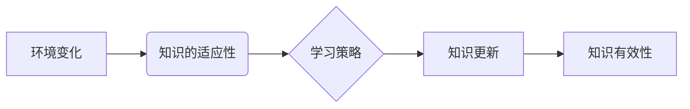

                 

## 知识的适应性：在变化环境中的学习策略

> 关键词：机器学习、深度学习、知识图谱、迁移学习、自适应学习、环境变化、知识更新、算法优化

## 1. 背景介绍

在瞬息万变的科技时代，知识的有效获取、存储和利用至关重要。传统的知识获取方式往往依赖于静态的知识库和固定的学习模式，难以适应不断变化的环境和新兴的挑战。随着人工智能技术的飞速发展，机器学习、深度学习等方法为知识的适应性学习提供了新的思路和工具。

然而，现有的机器学习模型通常在训练时依赖于大量的标注数据，并且难以迁移到新的领域或环境中。当环境发生变化时，这些模型的性能会显著下降，甚至失效。因此，如何使机器学习模型具备适应性，能够在不断变化的环境中持续学习和进化，成为一个亟待解决的关键问题。

## 2. 核心概念与联系

**2.1 知识的适应性**

知识的适应性是指知识能够根据环境的变化进行调整和更新，保持其有效性和相关性。在变化的环境中，知识的适应性至关重要，因为它能够帮助个体或系统更好地理解和应对新的挑战。

**2.2 环境变化**

环境变化是指外部世界或系统内部的条件发生改变。环境变化可以是缓慢的渐进变化，也可以是突然的剧烈变化。环境变化的类型包括：

* **数据分布变化:** 输入数据的统计特性发生改变。
* **任务需求变化:** 需要学习的任务或目标发生改变。
* **环境规则变化:** 系统运行的规则或约束条件发生改变。

**2.3 学习策略**

学习策略是指在变化环境中获取、更新和利用知识的方法。有效的学习策略应该能够：

* **识别环境变化:** 能够及时感知环境的变化。
* **适应环境变化:** 根据环境变化调整学习目标和方法。
* **更新知识:** 更新知识库以反映环境的变化。
* **保持知识有效性:** 确保知识能够在变化的环境中保持有效性和相关性。

**2.4 核心概念关系图**



## 3. 核心算法原理 & 具体操作步骤

**3.1 算法原理概述**

自适应学习算法旨在使机器学习模型能够在不断变化的环境中持续学习和进化。这些算法通常基于以下核心原理：

* **在线学习:** 模型在不断接收新数据时进行更新，而不是一次性学习所有数据。
* **元学习:** 模型学习如何学习，能够根据不同的任务和环境调整学习策略。
* **知识迁移:** 模型能够将从一个领域或任务中学到的知识迁移到另一个领域或任务中。

**3.2 算法步骤详解**

自适应学习算法的具体步骤通常包括以下几个阶段：

1. **环境感知:** 模型首先需要感知环境的变化，例如数据分布的变化、任务需求的变化等。
2. **策略调整:** 根据环境变化，模型调整其学习策略，例如改变学习率、更新模型参数等。
3. **知识更新:** 模型利用新数据更新其知识库，例如训练新的模型、更新已有模型的参数等。
4. **性能评估:** 模型评估其在变化环境下的性能，并根据评估结果进一步调整学习策略。

**3.3 算法优缺点**

**优点:**

* **适应性强:** 能够有效应对环境变化。
* **持续学习:** 可以不断学习新的知识和技能。
* **效率高:** 不需要重新训练整个模型，只需要更新部分参数。

**缺点:**

* **复杂度高:** 设计和实现自适应学习算法比较复杂。
* **数据依赖:** 需要大量的训练数据来支持模型的学习和更新。
* **鲁棒性:** 仍然存在一些挑战，例如面对剧烈环境变化时，模型的性能可能下降。

**3.4 算法应用领域**

自适应学习算法在许多领域都有广泛的应用，例如：

* **推荐系统:** 根据用户的行为变化，推荐更相关的商品或服务。
* **自然语言处理:** 适应不同的语言风格和语境，提高文本理解和生成能力。
* **机器人控制:** 适应不同的环境和任务，提高机器人的自主学习能力。
* **医疗诊断:** 适应新的疾病和治疗方法，提高诊断的准确性和效率。

## 4. 数学模型和公式 & 详细讲解 & 举例说明

**4.1 数学模型构建**

自适应学习算法通常基于概率模型，例如贝叶斯模型或神经网络模型。这些模型可以用来表示知识和学习过程。

**4.2 公式推导过程**

自适应学习算法的具体公式推导过程取决于具体的算法和应用场景。例如，在线学习算法通常会使用梯度下降法来更新模型参数，而元学习算法则会使用强化学习方法来学习学习策略。

**4.3 案例分析与讲解**

假设我们有一个简单的在线学习模型，用于预测房价。模型的输入是房屋的特征，例如面积、位置、楼层等，输出是房价的预测值。

模型的损失函数定义为预测值与真实房价之间的平方差。在线学习算法会使用梯度下降法来更新模型参数，以最小化损失函数。

当模型接收新的数据时，它会计算新的梯度，并根据梯度更新模型参数。随着时间的推移，模型的参数会不断更新，最终能够预测房价的准确性会提高。

## 5. 项目实践：代码实例和详细解释说明

**5.1 开发环境搭建**

为了实现自适应学习算法，需要搭建相应的开发环境。常用的开发环境包括：

* **Python:** Python 是一个流行的编程语言，拥有丰富的机器学习库，例如 TensorFlow、PyTorch 等。
* **Jupyter Notebook:** Jupyter Notebook 是一个交互式编程环境，方便进行代码编写、调试和可视化。
* **云计算平台:** 云计算平台，例如 AWS、Azure、GCP 等，可以提供强大的计算资源和存储空间，支持大规模的机器学习模型训练和部署。

**5.2 源代码详细实现**

以下是一个简单的在线学习模型的 Python 代码实现示例：

```python
import numpy as np

class OnlineLearningModel:
    def __init__(self, learning_rate=0.01):
        self.learning_rate = learning_rate
        self.weights = np.zeros(1)

    def predict(self, x):
        return np.dot(x, self.weights)

    def update(self, x, y):
        prediction = self.predict(x)
        error = y - prediction
        self.weights += self.learning_rate * error * x

# 示例使用
model = OnlineLearningModel()
data = np.array([[1], [2], [3]])
labels = np.array([2, 4, 6])

for i in range(len(data)):
    model.update(data[i], labels[i])

print(model.predict(np.array([[4]])))
```

**5.3 代码解读与分析**

该代码实现了一个简单的线性回归模型，用于预测房价。模型的权重参数通过在线学习算法更新，每次更新都使用新的数据来调整权重。

**5.4 运行结果展示**

运行该代码后，模型将预测出输入数据为 [4] 时对应的房价。

## 6. 实际应用场景

自适应学习算法在许多实际应用场景中发挥着重要作用，例如：

**6.1 个性化推荐系统:**

电商平台、流媒体服务等平台利用自适应学习算法，根据用户的浏览历史、购买记录等数据，个性化推荐商品或内容，提高用户体验和转化率。

**6.2 自动驾驶系统:**

自动驾驶系统需要在复杂多变的道路环境中进行决策，自适应学习算法可以帮助车辆识别道路标志、预测其他车辆的行为，提高驾驶安全性。

**6.3 医疗诊断辅助系统:**

自适应学习算法可以帮助医生分析患者的病历、影像数据等信息，提高诊断的准确性和效率，辅助医生做出更科学的治疗方案。

**6.4 欺诈检测系统:**

金融机构利用自适应学习算法，分析用户的交易行为，识别异常交易，提高欺诈检测的准确率。

**6.5 未来应用展望**

随着人工智能技术的不断发展，自适应学习算法将在更多领域得到应用，例如：

* **教育领域:** 个性化学习、智能辅导等。
* **制造业:** 智能制造、设备预测维护等。
* **农业:** 智能农业、作物病虫害预测等。

## 7. 工具和资源推荐

**7.1 学习资源推荐**

* **书籍:**

    * 《机器学习》 - 周志华
    * 《深度学习》 - Ian Goodfellow, Yoshua Bengio, Aaron Courville
    * 《强化学习：原理、算法和应用》 - Richard S. Sutton, Andrew G. Barto

* **在线课程:**

    * Coursera: Machine Learning by Andrew Ng
    * edX: Deep Learning by Andrew Ng
    * Udacity: Machine Learning Engineer Nanodegree

**7.2 开发工具推荐**

* **Python:** Python 是一个流行的编程语言，拥有丰富的机器学习库，例如 TensorFlow、PyTorch、Scikit-learn 等。
* **Jupyter Notebook:** Jupyter Notebook 是一个交互式编程环境，方便进行代码编写、调试和可视化。
* **云计算平台:** 云计算平台，例如 AWS、Azure、GCP 等，可以提供强大的计算资源和存储空间，支持大规模的机器学习模型训练和部署。

**7.3 相关论文推荐**

* **《Online Learning》** - Robert E. Schapire
* **《Meta-Learning with Model-Agnostic Meta-Learning Algorithms》** - Timothy Hospedales, Antreas Antoniou,  et al.
* **《Transfer Learning》** - Pan, S. J., & Yang, Q.

## 8. 总结：未来发展趋势与挑战

**8.1 研究成果总结**

自适应学习算法在机器学习领域取得了显著的进展，能够有效应对环境变化，提高模型的适应性和持续学习能力。

**8.2 未来发展趋势**

未来，自适应学习算法的研究将朝着以下几个方向发展：

* **更鲁棒的算法:** 设计更鲁棒的算法，能够应对更剧烈的环境变化。
* **更有效的学习策略:** 研究更有效的学习策略，提高模型的学习效率和准确性。
* **更广泛的应用场景:** 将自适应学习算法应用到更多领域，例如医疗、教育、农业等。

**8.3 面临的挑战**

自适应学习算法仍然面临一些挑战，例如：

* **数据效率:** 仍然需要大量的训练数据来支持模型的学习和更新。
* **解释性:** 自适应学习算法的决策过程往往比较复杂，难以解释。
* **安全性和可靠性:** 自适应学习算法在安全性和可靠性方面还需要进一步研究和改进。

**8.4 研究展望**

未来，自适应学习算法的研究将继续深入，推动人工智能技术的进步，为解决人类面临的各种挑战提供新的解决方案。

## 9. 附录：常见问题与解答

**9.1 如何选择合适的自适应学习算法？**

选择合适的自适应学习算法取决于具体的应用场景和数据特点。例如，对于预测房价这类问题，可以使用线性回归模型；对于图像识别这类问题，可以使用卷积神经网络模型。

**9.2 如何评估自适应学习算法的性能？**

评估自适应学习算法的性能可以使用多种指标，例如准确率、召回率、F1-score 等。

**9.3 如何提高自适应学习算法的鲁棒性？**

提高自适应学习算法的鲁棒性可以通过以下方法：

* 使用更复杂的模型架构。
* 使用正则化技术来防止过拟合。
* 使用数据增强技术来增加训练数据的多样性。


作者：禅与计算机程序设计艺术 / Zen and the Art of Computer Programming 
<end_of_turn>

