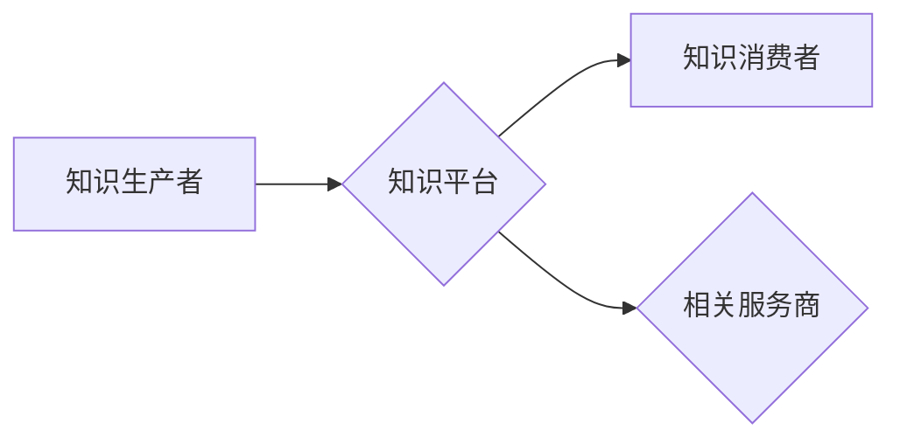

                 

## 知识经济时代下的知识付费创新盈利模式探索

> 关键词：知识付费、盈利模式、创新、数字经济、在线教育、内容平台、知识产权

### 1. 背景介绍

随着互联网技术的飞速发展和数字经济的蓬勃兴起，知识已成为最宝贵的资源之一。知识经济时代，知识的生产、传播和应用方式发生了根本性变化。传统知识付费模式面临着新的挑战，同时也孕育着新的机遇。

**1.1 知识经济时代的来临**

知识经济时代，以知识、技术和创新为核心驱动的经济模式逐渐取代了以土地、资本和劳动为核心的传统经济模式。知识的价值日益凸显，知识生产、传播和应用成为经济增长的关键驱动力。

**1.2 传统知识付费模式的局限性**

传统的知识付费模式主要以线下课程、书籍出版、咨询服务等形式存在。这些模式存在着以下局限性：

* **传播范围有限:** 线下课程受地域限制，书籍出版成本高，咨询服务受时间和资源限制。
* **知识更新慢:** 传统知识付费模式更新周期长，难以满足知识经济时代快速变化的需求。
* **用户体验差:** 传统模式的用户体验相对较差，缺乏互动性和个性化服务。

**1.3 数字经济对知识付费的变革**

数字经济的兴起为知识付费模式带来了新的变革机遇。互联网、移动互联网、云计算等技术的应用，使得知识的生产、传播和应用更加便捷高效。

* **打破地域限制:** 在线教育平台、知识付费网站等数字平台打破了地域限制，知识可以随时随地获取。
* **降低知识获取成本:** 数字化知识产品成本低，用户可以以更低的成本获取高质量的知识。
* **提升用户体验:** 数字平台可以提供互动性强的学习体验，例如在线答疑、直播课程、个性化学习路径等。

### 2. 核心概念与联系

**2.1 知识付费的核心概念**

知识付费是指以知识为核心产品，通过付费的方式获取知识和技能。它是一种基于知识价值的经济模式，旨在通过知识的交易实现价值创造和共享。

**2.2 知识付费的盈利模式**

知识付费的盈利模式主要包括以下几种：

* **订阅制:** 用户按月或年订阅知识平台，获得持续更新的知识内容和服务。
* **课程销售:** 平台提供付费课程，用户购买课程获得相应的知识和技能。
* **会员制:** 平台提供不同等级的会员服务，会员享受不同级别的知识内容和服务。
* **广告收入:** 平台通过展示广告获取收入。

**2.3 知识付费与数字经济的关系**

数字经济为知识付费模式提供了重要的技术支撑和发展环境。互联网、移动互联网、云计算等技术的应用，使得知识的生产、传播和应用更加便捷高效，为知识付费模式的创新发展提供了广阔的空间。

**2.4 知识付费的生态系统**

知识付费的生态系统包括知识生产者、知识平台、知识消费者和相关服务商等多个参与主体。

* **知识生产者:** 包括专家学者、行业从业者、内容创作者等，他们负责创作和提供知识内容。
* **知识平台:** 提供知识付费服务的平台，例如在线教育平台、知识付费网站等。
* **知识消费者:** 包括个人用户、企业用户等，他们通过付费的方式获取知识和技能。
* **相关服务商:** 包括支付平台、技术服务商、营销服务商等，他们为知识付费生态系统提供相关服务。

**2.5 知识付费的未来趋势**

知识付费模式将继续朝着更加个性化、智能化、多元化的方向发展。

* **个性化定制:** 知识平台将根据用户的学习需求和兴趣爱好，提供个性化的学习内容和服务。
* **智能化推荐:** 基于人工智能技术，平台将对用户的学习行为进行分析，推荐更符合用户需求的知识内容。
* **多元化内容形式:** 除了文字、视频等传统形式，知识付费平台将引入更多元的知识内容形式，例如音频、游戏、虚拟现实等。

**Mermaid 流程图**



### 3. 核心算法原理 & 具体操作步骤

**3.1 算法原理概述**

知识付费平台的运营需要依赖于一系列的算法，例如推荐算法、内容分发算法、用户画像算法等。这些算法通过对用户数据、知识内容数据等进行分析和处理，实现知识内容的精准推荐、个性化服务、用户行为分析等功能。

**3.2 算法步骤详解**

以推荐算法为例，其基本步骤包括：

1. **数据收集:** 收集用户行为数据、知识内容数据等。
2. **数据预处理:** 对收集到的数据进行清洗、转换、特征提取等处理。
3. **模型训练:** 选择合适的推荐算法模型，并利用训练数据对模型进行训练。
4. **模型评估:** 利用测试数据对模型进行评估，并根据评估结果进行模型优化。
5. **模型部署:** 将训练好的模型部署到线上环境，实现知识内容的推荐。

**3.3 算法优缺点**

推荐算法的优缺点取决于具体的算法模型和应用场景。

* **优点:** 可以精准推荐用户感兴趣的知识内容，提高用户粘性和转化率。
* **缺点:** 可能存在推荐偏差，例如推荐同质化内容、推荐热门内容等问题。

**3.4 算法应用领域**

推荐算法广泛应用于各种领域，例如电商、社交媒体、在线教育等。在知识付费平台中，推荐算法可以帮助用户发现更符合自己需求的知识内容，提高用户学习效率和满意度。

### 4. 数学模型和公式 & 详细讲解 & 举例说明

**4.1 数学模型构建**

推荐算法通常基于用户-物品交互矩阵，该矩阵表示用户对不同知识内容的评分或行为。

**用户-物品交互矩阵:**

```
| 用户 | 内容1 | 内容2 | 内容3 |
|---|---|---|---|
| 用户1 | 5 | 3 | 4 |
| 用户2 | 2 | 5 | 1 |
| 用户3 | 4 | 2 | 5 |
```

其中，每个单元格表示用户对相应知识内容的评分或行为。

**4.2 公式推导过程**

常用的推荐算法模型包括协同过滤、内容过滤、深度学习等。

* **协同过滤:** 基于用户的相似性或物品的相似性进行推荐。

**相似度计算公式:**

```
相似度(用户1, 用户2) = ∑(用户1对物品i的评分 * 用户2对物品i的评分) / (√(∑(用户1对物品j的评分^2)) * √(∑(用户2对物品j的评分^2)))
```

* **内容过滤:** 基于知识内容的特征进行推荐。

**内容相似度计算公式:**

```
相似度(内容1, 内容2) = ∑(内容1的特征i * 内容2的特征i) / (√(∑(内容1的特征i^2)) * √(∑(内容2的特征i^2)))
```

* **深度学习:** 利用神经网络模型学习用户和知识内容之间的复杂关系进行推荐。

**4.3 案例分析与讲解**

以协同过滤算法为例，假设用户A和用户B对某些知识内容的评分相似，则可以认为用户A和用户B的兴趣爱好相似。因此，如果用户A对某个知识内容评分较高，则可以推荐该知识内容给用户B。

### 5. 项目实践：代码实例和详细解释说明

**5.1 开发环境搭建**

* Python 3.x
* Jupyter Notebook
* Pandas
* Scikit-learn

**5.2 源代码详细实现**

```python
import pandas as pd
from sklearn.metrics.pairwise import cosine_similarity

# 加载用户-物品交互数据
data = pd.read_csv('user_item_data.csv')

# 计算用户之间的相似度
user_similarity = cosine_similarity(data.T)

# 获取用户A的相似用户
user_A_index = data.columns.get_loc('用户A')
similar_users = user_similarity[user_A_index].argsort()[:-6:-1]

# 推荐给用户A的知识内容
recommended_items = data.iloc[similar_users, :].mean().sort_values(ascending=False)

# 打印推荐结果
print(recommended_items)
```

**5.3 代码解读与分析**

* 代码首先加载用户-物品交互数据。
* 然后使用cosine_similarity函数计算用户之间的相似度。
* 获取用户A的相似用户，并根据相似用户的评分平均值推荐知识内容给用户A。

**5.4 运行结果展示**

运行代码后，将输出一个包含推荐知识内容及其评分的DataFrame。

### 6. 实际应用场景

**6.1 在线教育平台**

在线教育平台可以利用知识付费模式提供各种在线课程、直播课程、学习资料等。

**6.2 知识付费网站**

知识付费网站可以提供各种类型的付费知识内容，例如电子书、音频课程、视频教程等。

**6.3 企业培训平台**

企业可以利用知识付费模式提供员工培训课程、技能提升课程等。

**6.4 个人知识分享平台**

个人知识分享平台可以利用知识付费模式分享自己的专业知识和经验。

**6.5 未来应用展望**

知识付费模式将继续发展壮大，并应用于更多领域。例如，未来可能出现基于人工智能的个性化知识推荐平台、虚拟现实知识学习平台等。

### 7. 工具和资源推荐

**7.1 学习资源推荐**

* **书籍:** 《知识经济》、《数字经济》、《互联网思维》
* **在线课程:** Coursera、edX、Udemy等平台提供相关课程
* **博客:** 知乎、CSDN等平台上有许多关于知识付费的博客文章

**7.2 开发工具推荐**

* **Python:** 广泛应用于数据分析、机器学习等领域
* **Jupyter Notebook:** 用于编写和运行Python代码
* **Pandas:** 用于数据分析和处理
* **Scikit-learn:** 用于机器学习算法实现

**7.3 相关论文推荐**

* **The Sharing Economy: What It Is, What It Isn't, and What It Could Be**
* **The Future of Work: How Technology Will Transform the Workplace**
* **The Digital Economy: A Global Perspective**

### 8. 总结：未来发展趋势与挑战

**8.1 研究成果总结**

知识付费模式在知识经济时代具有重要的发展意义。通过分析核心概念、算法原理、应用场景等，我们了解到知识付费模式的运作机制和发展趋势。

**8.2 未来发展趋势**

知识付费模式将继续朝着更加个性化、智能化、多元化的方向发展。

* **个性化定制:** 基于用户数据分析，提供个性化的学习内容和服务。
* **智能化推荐:** 利用人工智能技术，精准推荐用户感兴趣的知识内容。
* **多元化内容形式:** 除了文字、视频等传统形式，引入更多元的知识内容形式，例如音频、游戏、虚拟现实等。

**8.3 面临的挑战**

知识付费模式也面临着一些挑战，例如：

* **知识产权保护:** 如何有效保护知识产权，防止知识盗版和侵权。
* **用户信任问题:** 如何建立用户对知识付费平台的信任，保证知识内容的质量和可靠性。
* **商业模式创新:** 如何探索更加可持续的商业模式，实现知识付费平台的长期发展。

**8.4 研究展望**

未来研究可以关注以下几个方面：

* **基于人工智能的知识推荐算法研究:** 开发更加精准、个性化的知识推荐算法。
* **知识付费平台的商业模式创新:** 探索更加可持续的商业模式，例如订阅制、会员制、广告收入等。
* **知识付费平台的监管机制研究:** 建立完善的监管机制，保障知识付费平台的健康发展。

### 9. 附录：常见问题与解答

**9.1 如何选择合适的知识付费平台？**

选择知识付费平台时，可以考虑以下因素：

* 平台的口碑和信誉
* 平台提供的知识内容质量和丰富度
* 平台的学习体验和服务
* 平台的收费标准和支付方式

**9.2 如何保护知识产权？**

知识付费平台可以采取以下措施保护知识产权：

* 使用版权声明和知识产权许可协议
* 对知识内容进行加密和水印技术保护
* 建立知识产权投诉机制

**9.3 如何提高知识付费平台的用户粘性？**

提高知识付费平台的用户粘性可以采取以下措施：

* 提供个性化的学习内容和服务
* 建立用户社区，促进用户互动
* 定期举办线上线下活动，增强用户参与感
* 提供优质的售后服务


作者：禅与计算机程序设计艺术 / Zen and the Art of Computer Programming 
<end_of_turn>

