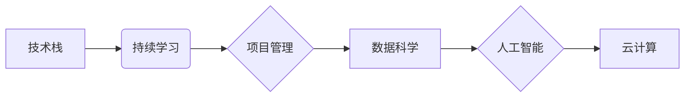

                 

## 程序员在知识经济时代的职业规划

> 关键词：知识经济、程序员职业规划、技术栈、持续学习、软技能、项目管理、数据科学、人工智能、云计算

### 1. 背景介绍

知识经济时代，信息化和数字化成为社会发展的主旋律，程序员作为构建数字世界的关键力量，面临着前所未有的机遇和挑战。传统的编程技能不再是唯一的竞争优势，程序员需要不断学习新技术、提升自身能力，才能在激烈的竞争中脱颖而出。

**1.1 知识经济的特点**

知识经济时代，知识、信息和技术成为重要的生产要素，以创造、创新和知识应用为核心。其特点包括：

* **知识是核心竞争力:**  知识的积累、应用和创新成为企业和个人竞争的关键。
* **信息化和数字化:** 信息技术广泛应用于各个领域，推动社会数字化转型。
* **创新驱动发展:**  科技创新成为经济增长的主要动力。
* **人才需求多样化:**  知识经济需要具备跨学科知识、创新能力和解决问题能力的人才。

**1.2 程序员职业发展趋势**

随着科技发展和行业变革，程序员的职业发展趋势呈现以下特点：

* **技术栈多元化:**  程序员需要掌握多种编程语言、框架和工具，才能适应不同的项目需求。
* **持续学习成为必选项:**  技术迭代速度加快，程序员需要不断学习新技术，保持竞争力。
* **跨领域融合:**  程序员需要具备跨领域知识，例如数据科学、人工智能等，才能更好地解决复杂问题。
* **软技能提升:**  除了技术能力，沟通、协作、团队合作等软技能也越来越重要。

### 2. 核心概念与联系

程序员在知识经济时代需要具备以下核心概念和联系：

* **技术栈:**  指程序员掌握的编程语言、框架、工具等技术组合。
* **持续学习:**  指程序员不断学习新技术、提升自身能力的意识和行动。
* **项目管理:**  指程序员参与项目规划、执行、控制和总结的整个过程。
* **数据科学:**  指利用数据分析、机器学习等技术，从数据中挖掘价值。
* **人工智能:**  指模拟人类智能的计算机系统。
* **云计算:**  指利用互联网提供计算资源和服务的模式。

**2.1 核心概念关系图**



### 3. 核心算法原理 & 具体操作步骤

**3.1 算法原理概述**

算法是解决特定问题的步骤或规则，是程序员的核心技能之一。在知识经济时代，程序员需要掌握多种算法，例如排序算法、搜索算法、数据结构等，才能高效地解决复杂问题。

**3.2 算法步骤详解**

以快速排序算法为例，详细说明其步骤：

1. 选择一个元素作为基准元素。
2. 将小于基准元素的元素放在基准元素的左边，大于基准元素的元素放在基准元素的右边。
3. 对基准元素左边和右边的子数组重复步骤1和2，直到子数组只有一个元素。

**3.3 算法优缺点**

**优点:**

* 时间复杂度平均为 O(n log n)，效率较高。
* 稳定性较好，不会改变原数组元素的相对顺序。

**缺点:**

* 最坏情况下时间复杂度为 O(n^2)，效率较低。
* 空间复杂度为 O(log n)，需要额外的空间。

**3.4 算法应用领域**

快速排序算法广泛应用于以下领域：

* **数据排序:**  将数据按照特定顺序排列。
* **查找算法:**  快速查找指定元素。
* **数据库管理:**  高效地管理和查询数据。

### 4. 数学模型和公式 & 详细讲解 & 举例说明

**4.1 数学模型构建**

快速排序算法可以抽象为以下数学模型：

```
T(n) = 2T(n/2) + O(n)
```

其中：

* T(n) 表示排序n个元素的时间复杂度。
* T(n/2) 表示排序n/2个元素的时间复杂度。

**4.2 公式推导过程**

使用递归树法可以推导出快速排序算法的时间复杂度为 O(n log n)。

**4.3 案例分析与讲解**

假设需要排序5个元素，则快速排序算法的执行过程如下：

1. 选择第一个元素作为基准元素，将小于基准元素的元素放在左边，大于基准元素的元素放在右边。
2. 对左边和右边的子数组重复步骤1，直到子数组只有一个元素。

### 5. 项目实践：代码实例和详细解释说明

**5.1 开发环境搭建**

使用Python语言实现快速排序算法，需要搭建Python开发环境，包括安装Python解释器、IDE工具等。

**5.2 源代码详细实现**

```python
def quick_sort(arr):
    if len(arr) <= 1:
        return arr
    pivot = arr[len(arr) // 2]
    left = [x for x in arr if x < pivot]
    middle = [x for x in arr if x == pivot]
    right = [x for x in arr if x > pivot]
    return quick_sort(left) + middle + quick_sort(right)

# 测试代码
arr = [3, 7, 8, 5, 2, 1, 9, 5, 4]
sorted_arr = quick_sort(arr)
print(sorted_arr)
```

**5.3 代码解读与分析**

* `quick_sort(arr)` 函数实现快速排序算法。
* `if len(arr) <= 1:` 判断数组长度是否小于等于1，如果小于等于1，则返回原数组，因为已经排序完成。
* `pivot = arr[len(arr) // 2]` 选择数组中间元素作为基准元素。
* `left`, `middle`, `right` 分别存储小于基准元素、等于基准元素和大于基准元素的元素。
* `return quick_sort(left) + middle + quick_sort(right)` 对左右子数组递归调用快速排序算法，并将结果合并。

**5.4 运行结果展示**

```
[1, 2, 3, 4, 5, 5, 7, 8, 9]
```

### 6. 实际应用场景

**6.1 数据排序**

快速排序算法广泛应用于数据排序，例如：

* **搜索引擎:**  根据网页内容进行排序，提高搜索结果的准确性。
* **电子商务平台:**  根据商品价格、销量等进行排序，方便用户查找商品。
* **数据库管理:**  高效地管理和查询数据。

**6.2 查找算法**

快速排序算法可以用于查找特定元素，例如：

* **查找表:**  快速查找指定元素的对应值。
* **文件系统:**  快速查找指定文件。

**6.3 其他应用场景**

快速排序算法还可以应用于以下场景：

* **图像处理:**  对图像进行排序，例如根据颜色进行排序。
* **机器学习:**  作为机器学习算法的一部分，例如用于数据预处理。

**6.4 未来应用展望**

随着人工智能和云计算的发展，快速排序算法将在更多领域得到应用，例如：

* **大数据分析:**  高效地处理海量数据。
* **实时数据处理:**  对实时数据进行排序和分析。
* **边缘计算:**  在边缘设备上进行数据排序和处理。

### 7. 工具和资源推荐

**7.1 学习资源推荐**

* **书籍:**  《算法导论》、《数据结构与算法分析》
* **在线课程:**  Coursera、edX、Udemy
* **网站:**  GeeksforGeeks、LeetCode、HackerRank

**7.2 开发工具推荐**

* **Python:**  Python解释器、IDE工具（PyCharm、VS Code）
* **数据结构和算法库:**  NumPy、Pandas

**7.3 相关论文推荐**

* **快速排序算法的分析和改进**
* **快速排序算法在实际应用中的研究**

### 8. 总结：未来发展趋势与挑战

**8.1 研究成果总结**

快速排序算法是一种高效的排序算法，在数据排序、查找算法等领域有着广泛的应用。

**8.2 未来发展趋势**

随着人工智能和云计算的发展，快速排序算法将在更多领域得到应用，例如大数据分析、实时数据处理、边缘计算等。

**8.3 面临的挑战**

* **算法优化:**  如何进一步优化快速排序算法，提高其效率和稳定性。
* **应用扩展:**  如何将快速排序算法应用于更多领域，解决更复杂的问题。
* **新技术融合:**  如何将快速排序算法与人工智能、云计算等新技术融合，开发更智能、更强大的应用。

**8.4 研究展望**

未来研究将重点关注以下方面：

* **基于深度学习的快速排序算法:**  利用深度学习技术，提高快速排序算法的效率和鲁棒性。
* **分布式快速排序算法:**  针对大规模数据，开发分布式快速排序算法，提高数据处理效率。
* **快速排序算法的理论研究:**  深入研究快速排序算法的理论基础，探索其更深层次的特性和应用潜力。

### 9. 附录：常见问题与解答

**9.1 快速排序算法的时间复杂度为什么是 O(n log n)?**

快速排序算法的时间复杂度是 O(n log n) 是因为其递归结构和平均情况下的性能。

**9.2 快速排序算法的稳定性如何?**

快速排序算法的稳定性取决于实现方式。一般的快速排序算法是不稳定的，但是可以通过一些技巧使其稳定。

**9.3 快速排序算法的缺点是什么?**

快速排序算法的缺点包括：

* 最坏情况下时间复杂度为 O(n^2)。
* 空间复杂度为 O(log n)。


作者：禅与计算机程序设计艺术 / Zen and the Art of Computer Programming 
<end_of_turn>

