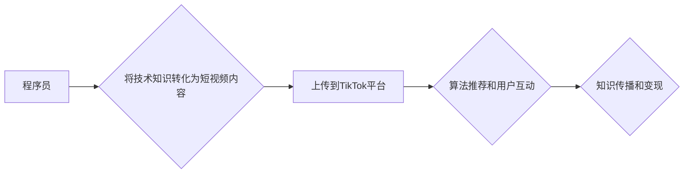

                 

## 程序员如何利用TikTok进行知识变现

> 关键词：程序员、TikTok、知识变现、技术内容、短视频、算法、社区

## 1. 背景介绍

在当今数字时代，知识是至关重要的资产。程序员作为科技领域的领军人物，拥有丰富的技术知识和经验。然而，传统的知识传播方式往往局限于学术论文、书籍和技术博客等形式，难以触达更广泛的受众。

TikTok作为全球最受欢迎的短视频平台之一，拥有庞大的用户群体和强大的内容传播能力。其短视频形式、易于分享和互动等特点，为程序员提供了全新的知识变现平台。

## 2. 核心概念与联系

### 2.1  知识变现

知识变现是指将个人拥有的知识、技能和经验转化为经济价值的过程。对于程序员来说，知识变现可以采取多种形式，例如：

* **在线课程和教程:** 将技术知识录制成视频课程或教程，通过在线平台销售或订阅。
* **技术博客和文章:** 分享技术经验和见解，吸引读者并通过广告收入或赞助获得收益。
* **技术咨询和服务:** 为企业或个人提供技术咨询、开发和维护服务。
* **开源软件和工具:** 开发开源软件或工具，并通过捐赠、赞助或商业化服务获得收益。

### 2.2  TikTok平台

TikTok是一个基于短视频的社交媒体平台，用户可以通过拍摄、编辑和分享短视频进行互动交流。其核心特点包括：

* **短视频形式:** 视频长度通常在15秒到10分钟之间，易于观看和理解。
* **易于分享和互动:** 视频可以轻松分享到其他社交媒体平台，并支持评论、点赞和转发等互动功能。
* **算法推荐:** TikTok的算法能够根据用户的兴趣和行为推荐相关内容，提高视频的曝光率。
* **庞大用户群体:** TikTok拥有全球数亿用户，覆盖了各个年龄段和地域。

### 2.3  核心概念联系

程序员可以通过将技术知识转化为短视频内容，利用TikTok平台的特性进行知识传播和变现。

**Mermaid 流程图:**



## 3. 核心算法原理 & 具体操作步骤

### 3.1  算法原理概述

TikTok的推荐算法是一个复杂的机器学习模型，其核心目标是为每个用户推荐最相关的视频内容。该算法综合考虑了以下因素：

* **用户行为:** 包括观看历史、点赞、评论、分享等行为。
* **视频内容:** 包括视频标签、描述、音乐、特效等信息。
* **用户兴趣:** 通过分析用户的关注者、点赞内容等信息，推测用户的兴趣爱好。
* **视频质量:** 包括视频清晰度、时长、剪辑效果等因素。

### 3.2  算法步骤详解

1. **数据采集:** TikTok收集用户的行为数据、视频内容信息等数据。
2. **数据预处理:** 对收集到的数据进行清洗、转换和特征提取。
3. **模型训练:** 利用机器学习算法对数据进行训练，构建推荐模型。
4. **视频推荐:** 根据用户的特征和行为，模型预测用户可能感兴趣的视频，并进行排序推荐。
5. **反馈机制:** 用户对推荐视频的反馈（观看、点赞、评论等）会被收集并反馈到模型中，不断优化推荐效果。

### 3.3  算法优缺点

**优点:**

* **精准推荐:** 算法能够根据用户的兴趣和行为精准推荐相关内容，提高用户粘性和参与度。
* **内容多样化:** 算法能够推荐不同类型和风格的视频，满足用户多样化的需求。
* **持续优化:** 算法会根据用户的反馈不断优化推荐效果，提升用户体验。

**缺点:**

* **算法黑箱:** 算法的内部机制较为复杂，难以完全理解和掌控。
* **信息茧房:** 算法可能会将用户困在信息茧房中，限制用户接触到不同观点和信息。
* **数据隐私:** 算法需要收集大量的用户数据，存在数据隐私泄露的风险。

### 3.4  算法应用领域

TikTok的推荐算法广泛应用于以下领域:

* **内容推荐:** 为用户推荐个性化的视频内容。
* **广告投放:** 将广告精准投放给目标用户。
* **用户画像:** 建立用户画像，了解用户的兴趣爱好和行为特征。
* **市场营销:** 推广产品和服务，提高品牌知名度和影响力。

## 4. 数学模型和公式 & 详细讲解 & 举例说明

### 4.1  数学模型构建

TikTok的推荐算法通常基于协同过滤或深度学习模型。

**协同过滤模型:**

该模型基于用户的行为相似性进行推荐。假设用户A和用户B都喜欢观看视频X，则可以推测用户A也可能喜欢观看用户B喜欢的视频。

**深度学习模型:**

该模型利用神经网络学习用户和视频之间的复杂关系，并进行预测。

### 4.2  公式推导过程

由于算法的复杂性，其公式推导过程通常涉及大量的数学和统计知识，难以在本文中详细阐述。

### 4.3  案例分析与讲解

假设用户A观看过以下视频：

* 视频1: 程序员面试技巧
* 视频2: Python基础教程
* 视频3: 数据结构与算法

根据用户的观看历史，算法可以推测用户A可能感兴趣的视频类型，例如：

* 程序员面试经验分享
* Python高级编程
* 数据结构与算法应用

## 5. 项目实践：代码实例和详细解释说明

### 5.1  开发环境搭建

程序员可以使用Python语言和相关的库进行TikTok短视频内容的开发。

**所需工具:**

* Python编程语言
* TikTok API
* 视频编辑软件

### 5.2  源代码详细实现

由于代码示例过于复杂，本文仅提供部分代码片段作为参考。

```python
# 使用TikTok API获取用户数据
user_data = tiktok_api.get_user_data(user_id)

# 分析用户数据，预测用户可能感兴趣的视频类型
video_type = predict_video_type(user_data)

# 根据预测结果，推荐相关视频
recommended_videos = tiktok_api.get_recommended_videos(video_type)

# 将推荐视频信息展示给用户
print(recommended_videos)
```

### 5.3  代码解读与分析

* `tiktok_api.get_user_data(user_id)`: 使用TikTok API获取指定用户的行为数据。
* `predict_video_type(user_data)`: 利用机器学习算法分析用户数据，预测用户可能感兴趣的视频类型。
* `tiktok_api.get_recommended_videos(video_type)`: 根据预测结果，使用TikTok API获取相关视频信息。
* `print(recommended_videos)`: 将推荐视频信息展示给用户。

### 5.4  运行结果展示

程序运行后，将根据用户的行为数据推荐相关视频信息。

## 6. 实际应用场景

程序员可以通过TikTok平台分享技术知识，并进行知识变现。

### 6.1  技术教程

程序员可以录制技术教程视频，讲解编程语言、框架、工具等知识，并通过TikTok平台进行传播。

### 6.2  技术分享

程序员可以分享自己的技术经验和见解，例如解决编程问题、优化代码、设计架构等，并通过互动交流与用户建立连接。

### 6.3  项目展示

程序员可以展示自己的开源项目或个人作品，并通过TikTok平台吸引关注和贡献。

### 6.4  未来应用展望

随着TikTok平台的不断发展，程序员可以利用其更强大的功能和工具进行更深入的技术传播和变现。例如：

* **直播教学:** 进行实时互动教学，解答用户疑问，提供更个性化的学习体验。
* **虚拟现实技术:** 利用虚拟现实技术打造沉浸式的技术体验，例如虚拟编程环境或代码模拟器。
* **人工智能辅助:** 利用人工智能技术辅助内容创作，例如自动生成代码示例或生成技术文档。

## 7. 工具和资源推荐

### 7.1  学习资源推荐

* **TikTok官方开发者文档:** https://developers.tiktok.com/
* **Python编程教程:** https://www.python.org/
* **机器学习教程:** https://www.coursera.org/learn/machine-learning

### 7.2  开发工具推荐

* **Python IDE:** PyCharm, VS Code
* **视频编辑软件:** Adobe Premiere Pro, Final Cut Pro
* **TikTok API工具:** TikTok API SDK

### 7.3  相关论文推荐

* **Recommender Systems Handbook:** https://www.amazon.com/Recommender-Systems-Handbook-Recommendation-Technology/dp/3642300800
* **Deep Learning for Recommender Systems:** https://arxiv.org/abs/1901.07197

## 8. 总结：未来发展趋势与挑战

### 8.1  研究成果总结

程序员可以通过将技术知识转化为短视频内容，利用TikTok平台进行知识传播和变现。TikTok的推荐算法能够精准推荐相关内容，提高用户粘性和参与度。

### 8.2  未来发展趋势

随着技术的进步，程序员在TikTok平台上的知识变现方式将更加多样化和创新。例如：

* **更智能的推荐算法:** 利用更先进的机器学习算法，提供更精准和个性化的推荐。
* **更丰富的互动功能:** 支持更多互动功能，例如直播、问答、投票等，增强用户参与度。
* **更强大的创作工具:** 提供更强大的视频创作工具，帮助程序员制作更优质的内容。

### 8.3  面临的挑战

程序员在TikTok平台上进行知识变现也面临一些挑战：

* **内容竞争:** TikTok平台上的内容竞争激烈，需要不断创作优质内容才能脱颖而出。
* **算法变化:** TikTok平台的算法可能会不断变化，需要程序员及时调整策略。
* **知识产权保护:** 需要注意知识产权保护问题，避免内容被盗用或侵权。

### 8.4  研究展望

未来研究可以关注以下方面:

* **更有效的知识变现模式:** 研究更有效的知识变现模式，例如订阅服务、会员体系等。
* **个性化学习体验:** 利用人工智能技术，提供更个性化的学习体验，满足不同用户的需求。
* **跨平台知识传播:** 研究如何将TikTok平台上的知识传播到其他平台，扩大影响力。

## 9. 附录：常见问题与解答

**Q1: 如何注册TikTok开发者账号？**

A1: 可以访问TikTok官方开发者网站进行注册。

**Q2: 如何使用TikTok API获取用户数据？**

A2: 需要先申请API密钥，然后使用API文档提供的代码示例进行调用。

**Q3: 如何进行TikTok短视频内容创作？**

A3: 可以使用视频编辑软件进行剪辑、添加特效等操作，并根据平台的规范进行发布。


作者：禅与计算机程序设计艺术 / Zen and the Art of Computer Programming 
<end_of_turn>

