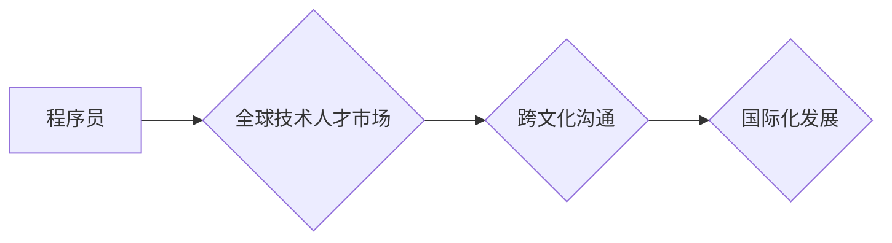

                 

## 程序员的国际化发展：机遇与挑战

> 关键词：程序员国际化、全球技术人才市场、跨文化沟通、远程工作、技术移民、职业发展、技能提升、语言学习、文化适应

### 1. 背景介绍

在全球化加速发展的时代，科技行业也呈现出越来越国际化的趋势。程序员作为科技行业的核心力量，其国际化发展也成为一个不可忽视的现象。近年来，全球技术人才市场日益活跃，跨国公司和互联网巨头纷纷设立海外研发中心，远程工作模式也越来越普遍。这些因素共同推动着程序员的国际化发展，为他们带来了更多机遇，但也带来了新的挑战。

### 2. 核心概念与联系

**2.1 程序员国际化**

程序员国际化是指程序员在全球范围内进行工作、学习和交流的现象。它涵盖了以下几个方面：

* **地理位置:** 程序员可以跨越国界，在不同的国家和地区工作。
* **工作模式:** 程序员可以采用远程工作模式，不受地理位置的限制。
* **团队合作:** 程序员可以与来自不同国家和文化背景的同事进行合作。
* **知识共享:** 程序员可以参与全球范围内的技术交流和知识分享。

**2.2 全球技术人才市场**

全球技术人才市场是指全球范围内程序员、软件工程师和其他技术人才的供求关系。随着科技行业的快速发展，全球技术人才市场呈现出以下特点：

* **人才需求旺盛:** 全球范围内对技术人才的需求量持续增长。
* **人才竞争激烈:** 优秀的技术人才受到全球范围内的追捧。
* **薪资水平差异:** 不同国家和地区的薪资水平存在较大差异。
* **人才流动性增强:** 程序员可以更容易地跨越国界进行工作。

**2.3 跨文化沟通**

跨文化沟通是指不同文化背景的人之间进行交流的过程。在全球化时代，程序员需要与来自不同文化背景的同事、客户和合作伙伴进行沟通，跨文化沟通能力成为一项重要的技能。

**Mermaid 流程图**



### 3. 核心算法原理 & 具体操作步骤

**3.1 算法原理概述**

程序员国际化发展是一个复杂的过程，涉及到多个因素的相互作用。其中，技术能力、语言能力、文化适应能力和职业规划等都是关键因素。

**3.2 算法步骤详解**

1. **技术能力提升:** 掌握主流编程语言、软件开发工具和技术框架，不断学习新技术，保持技术竞争力。
2. **语言学习:** 学习英语或其他国际通用语言，提高语言沟通能力，以便与全球范围内的同事和客户进行交流。
3. **文化适应:** 了解不同文化背景的价值观、行为规范和沟通方式，提高跨文化沟通能力，适应不同的工作环境。
4. **职业规划:** 制定清晰的职业目标，了解国际技术人才市场的发展趋势，选择适合自己的职业发展路径。
5. **网络资源利用:** 积极参加技术社区、线上论坛和线下活动，拓展人脉，获取行业信息和发展机会。

**3.3 算法优缺点**

* **优点:** 
    * 能够获得更广阔的职业发展空间。
    * 能够接触到更先进的技术和理念。
    * 能够结识来自不同文化背景的同事和朋友。
* **缺点:** 
    * 需要克服语言和文化障碍。
    * 需要适应不同的工作环境和生活方式。
    * 需要承担一定的风险和挑战。

**3.4 算法应用领域**

程序员国际化发展应用于各个领域，例如：

* **跨国公司:** 跨国公司需要全球化的技术人才队伍，以支持其全球业务发展。
* **互联网巨头:** 互联网巨头需要全球化的技术人才，以开发和推广其全球产品和服务。
* **创业公司:** 创业公司需要全球化的技术人才，以快速发展和扩张。
* **学术研究:** 学术研究需要全球化的技术人才，以促进科技创新和发展。

### 4. 数学模型和公式 & 详细讲解 & 举例说明

**4.1 数学模型构建**

程序员国际化发展可以被建模为一个多因素影响的系统，其中包括技术能力、语言能力、文化适应能力、职业规划等因素。我们可以使用以下数学模型来描述程序员国际化发展水平：

```
国际化发展水平 = f(技术能力, 语言能力, 文化适应能力, 职业规划)
```

其中，f()代表一个复杂的函数，表示各个因素之间的相互作用关系。

**4.2 公式推导过程**

由于各个因素之间的相互作用关系非常复杂，很难用简单的公式来精确描述程序员国际化发展水平。但是，我们可以通过分析各个因素的影响程度，建立一个定量化的评估模型。例如，我们可以使用加权平均法来计算程序员国际化发展水平：

```
国际化发展水平 = (技术能力 * 权重1) + (语言能力 * 权重2) + (文化适应能力 * 权重3) + (职业规划 * 权重4)
```

其中，权重1、权重2、权重3、权重4分别代表各个因素的影响程度，可以通过专家评估或问卷调查来确定。

**4.3 案例分析与讲解**

假设我们有一个程序员，他的技术能力为80分，语言能力为70分，文化适应能力为60分，职业规划为90分。如果我们设定各个因素的权重分别为0.3、0.2、0.2、0.3，那么他的国际化发展水平可以计算如下：

```
国际化发展水平 = (80 * 0.3) + (70 * 0.2) + (60 * 0.2) + (90 * 0.3) = 24 + 14 + 12 + 27 = 77分
```

根据这个模型，我们可以判断这个程序员的国际化发展水平处于中等水平。

### 5. 项目实践：代码实例和详细解释说明

**5.1 开发环境搭建**

程序员国际化发展需要使用多种工具和平台，例如：

* **版本控制系统:** Git、GitHub、Bitbucket
* **协作开发平台:** Slack、Microsoft Teams、Zoom
* **远程工作工具:** VPN、远程桌面软件
* **在线学习平台:** Coursera、edX、Udemy

**5.2 源代码详细实现**

程序员国际化发展需要掌握多种编程语言和技术框架，例如：

* **Python:** 数据科学、机器学习、Web开发
* **Java:** 企业级应用开发、Android开发
* **JavaScript:** Web前端开发、Node.js开发
* **C++:** 游戏开发、高性能计算

**5.3 代码解读与分析**

程序员需要能够阅读和理解来自不同作者和团队的代码，并进行调试和维护。

**5.4 运行结果展示**

程序员需要能够测试和验证代码的运行结果，并进行优化和改进。

### 6. 实际应用场景

**6.1 跨国公司研发中心**

跨国公司通常会在不同国家设立研发中心，以应对全球市场的需求。程序员可以参与到跨国公司的研发项目中，与来自不同国家和文化背景的同事合作，开发和推广全球化的产品和服务。

**6.2 互联网巨头全球化扩张**

互联网巨头如谷歌、亚马逊、Facebook等都在积极进行全球化扩张，需要大量的技术人才来支持其全球业务发展。程序员可以加入到这些互联网巨头的全球化团队中，参与到全球范围内的产品开发、运营和维护工作。

**6.3 远程工作模式**

随着远程工作模式的普及，程序员可以不受地理位置的限制，为全球范围内的公司提供服务。程序员可以利用远程工作平台，与来自不同国家和地区的同事进行合作，参与到全球范围内的项目开发。

**6.4 未来应用展望**

随着科技行业的持续发展，程序员国际化发展趋势将更加明显。未来，程序员将更加注重跨文化沟通、全球视野和国际化技能的培养。

### 7. 工具和资源推荐

**7.1 学习资源推荐**

* **在线学习平台:** Coursera、edX、Udemy、Udacity
* **技术社区:** Stack Overflow、GitHub、Reddit
* **书籍:** 《程序员的修炼之道》、《代码的艺术》

**7.2 开发工具推荐**

* **版本控制系统:** Git、GitHub、Bitbucket
* **协作开发平台:** Slack、Microsoft Teams、Zoom
* **远程工作工具:** VPN、远程桌面软件

**7.3 相关论文推荐**

* **程序员国际化发展趋势研究**
* **跨文化沟通对程序员团队合作的影响**
* **远程工作对程序员工作效率的影响**

### 8. 总结：未来发展趋势与挑战

**8.1 研究成果总结**

程序员国际化发展是一个重要的趋势，它为程序员带来了更多机遇，但也带来了新的挑战。

**8.2 未来发展趋势**

未来，程序员国际化发展将更加明显，程序员将更加注重跨文化沟通、全球视野和国际化技能的培养。

**8.3 面临的挑战**

程序员国际化发展面临着以下挑战：

* **语言障碍:** 不同国家和地区的语言差异可能导致沟通困难。
* **文化差异:** 不同文化背景的人们在价值观、行为规范和沟通方式上存在差异，可能导致误解和冲突。
* **职业规划:** 程序员需要根据国际化发展趋势，制定合理的职业规划。

**8.4 研究展望**

未来，需要进一步研究程序员国际化发展的影响因素、发展趋势和应对挑战的策略。


### 9. 附录：常见问题与解答

**9.1 如何提高跨文化沟通能力？**

* 学习其他语言
* 阅读不同文化背景的书籍和文章
* 参加跨文化交流活动
* 与来自不同文化背景的人进行交流

**9.2 如何适应不同的工作环境？**

* 了解不同国家和地区的文化规范
* 保持开放和包容的心态
* 积极与同事沟通和合作

**9.3 如何制定合理的职业规划？**

* 了解国际技术人才市场的发展趋势
* 评估自己的技术能力和兴趣
* 制定清晰的职业目标
* 积极寻求学习和发展的机会


作者：禅与计算机程序设计艺术 / Zen and the Art of Computer Programming 
<end_of_turn>

