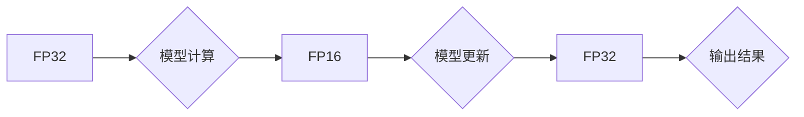

                 

## 第九章：混合精度训练的优势

> 关键词：混合精度训练、FP16、FP32、模型训练、深度学习、效率、性能、内存

### 1. 背景介绍

深度学习模型的训练过程通常需要处理海量数据，并进行复杂的计算。传统的训练方法使用高精度浮点数（FP32）进行计算，但这种方法在计算量和内存消耗方面存在显著的瓶颈。随着模型规模的不断增长，训练成本和时间也随之增加，这限制了深度学习的应用范围。为了解决这些问题，混合精度训练（Mixed Precision Training）应运而生。

混合精度训练是一种利用不同精度浮点数进行计算的训练方法，它通过在模型训练过程中使用低精度浮点数（如FP16）来加速计算，同时在关键步骤使用高精度浮点数（如FP32）来保证模型的精度。这种方法可以有效降低模型训练的内存消耗和计算时间，从而提高训练效率和性能。

### 2. 核心概念与联系

混合精度训练的核心概念是利用不同精度浮点数的特性来优化模型训练过程。

* **FP32 (单精度浮点数):** 标准的浮点数格式，精度高，但计算量大，内存消耗高。
* **FP16 (半精度浮点数):** 精度较低，但计算量和内存消耗都比FP32小一半。

混合精度训练通过在模型的不同部分使用不同的精度浮点数来达到最佳的性能和效率平衡。

**Mermaid 流程图:**



### 3. 核心算法原理 & 具体操作步骤

#### 3.1 算法原理概述

混合精度训练的核心原理是将模型的计算过程分为两部分：

1. **低精度计算:** 使用FP16进行大部分模型计算，以减少计算量和内存消耗。
2. **高精度更新:** 在模型更新阶段使用FP32来保证更新的精度，避免因低精度计算导致的精度损失。

#### 3.2 算法步骤详解

1. **数据预处理:** 将输入数据转换为FP16格式。
2. **前向传播:** 使用FP16进行模型的前向传播计算，得到模型输出。
3. **损失函数计算:** 使用FP32计算模型的损失函数值。
4. **反向传播:** 使用FP16进行反向传播计算，得到梯度值。
5. **梯度更新:** 将梯度值转换为FP32格式，并使用FP32更新模型参数。
6. **输出结果:** 将模型输出转换为FP32格式，并进行后续处理。

#### 3.3 算法优缺点

**优点:**

* **提高训练速度:** 使用FP16进行计算可以显著减少计算时间，从而加速模型训练。
* **降低内存消耗:** FP16的内存占用比FP32小一半，可以有效降低模型训练的内存需求。
* **提高训练效率:** 混合精度训练可以有效提高模型训练的效率，缩短训练时间，降低训练成本。

**缺点:**

* **精度损失:** 使用FP16进行计算可能会导致精度损失，需要在训练过程中进行权衡。
* **硬件支持:** 混合精度训练需要硬件支持，例如支持FP16计算的GPU。

#### 3.4 算法应用领域

混合精度训练广泛应用于各种深度学习领域，例如：

* **图像识别:** 提高图像识别模型的训练速度和效率。
* **自然语言处理:** 加速自然语言处理模型的训练，例如机器翻译、文本摘要等。
* **语音识别:** 提升语音识别模型的性能和训练效率。
* **推荐系统:** 优化推荐系统的训练过程，提高推荐精度。

### 4. 数学模型和公式 & 详细讲解 & 举例说明

#### 4.1 数学模型构建

混合精度训练的数学模型主要基于以下两个概念：

* **FP16 运算:** 使用半精度浮点数进行计算，例如加法、减法、乘法、除法等。
* **FP32 精度校正:** 在模型更新阶段使用高精度浮点数进行精度校正，确保模型的精度。

#### 4.2 公式推导过程

混合精度训练的公式推导过程较为复杂，涉及到FP16和FP32之间的转换、梯度计算、模型更新等多个步骤。

**举例说明:**

假设模型的输出为y，输入为x，损失函数为L(y, x)。

* **FP16 前向传播:** 使用FP16计算模型的输出y。
* **FP32 损失函数计算:** 使用FP32计算损失函数L(y, x)。
* **FP16 反向传播:** 使用FP16计算梯度值。
* **FP32 梯度校正:** 将FP16梯度值转换为FP32格式，并进行精度校正。
* **FP32 模型更新:** 使用FP32更新模型参数。

#### 4.3 案例分析与讲解

混合精度训练在实际应用中可以显著提高模型训练的效率和性能。例如，在训练大型语言模型时，使用混合精度训练可以将训练时间缩短一半，同时保持模型的精度。

### 5. 项目实践：代码实例和详细解释说明

#### 5.1 开发环境搭建

混合精度训练需要支持FP16计算的硬件环境，例如NVIDIA GPU。

#### 5.2 源代码详细实现

以下是一个使用PyTorch框架进行混合精度训练的代码示例：

```python
import torch
import torch.nn as nn

# 定义模型
class MyModel(nn.Module):
    # ...

# 实例化模型
model = MyModel()

# 设置混合精度训练
model.half()

# 定义优化器
optimizer = torch.optim.Adam(model.parameters())

# 训练循环
for epoch in range(num_epochs):
    for batch in dataloader:
        # 前向传播
        with torch.cuda.amp.autocast():
            outputs = model(batch)
            loss = criterion(outputs, batch_labels)

        # 反向传播
        optimizer.zero_grad()
        scaler.scale(loss).backward()
        scaler.step(optimizer)
        scaler.update()
```

#### 5.3 代码解读与分析

* `model.half()`: 将模型参数和中间结果转换为FP16格式。
* `torch.cuda.amp.autocast()`: 自动将计算过程转换为混合精度模式。
* `scaler`: 混合精度训练的缩放器，用于控制FP16和FP32之间的转换。

#### 5.4 运行结果展示

混合精度训练可以显著提高模型训练的速度和效率。

### 6. 实际应用场景

混合精度训练在实际应用中具有广泛的应用场景，例如：

* **图像分类:** 训练大型图像分类模型，例如ResNet、Inception等。
* **目标检测:** 提高目标检测模型的训练速度和精度，例如YOLO、Faster R-CNN等。
* **语义分割:** 加速语义分割模型的训练，例如U-Net、DeepLab等。

### 6. 实际应用场景

#### 6.1 实际应用场景

混合精度训练在实际应用中具有广泛的应用场景，例如：

* **图像分类:** 训练大型图像分类模型，例如ResNet、Inception等。
* **目标检测:** 提高目标检测模型的训练速度和精度，例如YOLO、Faster R-CNN等。
* **语义分割:** 加速语义分割模型的训练，例如U-Net、DeepLab等。

#### 6.2 未来应用展望

随着深度学习模型规模的不断增长，混合精度训练将成为深度学习训练的标准方法。未来，混合精度训练技术将不断发展，例如：

* **更广泛的精度支持:** 支持更多种类的精度浮点数，例如BF16、TF32等。
* **更智能的精度转换:** 自动根据模型结构和训练数据选择最佳的精度转换策略。
* **更有效的硬件加速:** 利用新的硬件架构和加速技术，进一步提高混合精度训练的效率。

### 7. 工具和资源推荐

#### 7.1 学习资源推荐

* **PyTorch 官方文档:** https://pytorch.org/docs/stable/index.html
* **TensorFlow 官方文档:** https://www.tensorflow.org/
* **混合精度训练教程:** https://pytorch.org/tutorials/beginner/blitz/mixed_precision_tutorial.html

#### 7.2 开发工具推荐

* **PyTorch:** https://pytorch.org/
* **TensorFlow:** https://www.tensorflow.org/
* **CUDA Toolkit:** https://developer.nvidia.com/cuda-toolkit

#### 7.3 相关论文推荐

* **Mixed Precision Training:** https://arxiv.org/abs/1710.03740
* **Training Deep Neural Networks with Mixed Precision:** https://arxiv.org/abs/1901.08303

### 8. 总结：未来发展趋势与挑战

#### 8.1 研究成果总结

混合精度训练是一种有效的深度学习训练方法，可以显著提高训练速度和效率，同时保持模型精度。

#### 8.2 未来发展趋势

混合精度训练技术将继续发展，例如支持更多种类的精度浮点数，更智能的精度转换策略，以及更有效的硬件加速。

#### 8.3 面临的挑战

混合精度训练仍然面临一些挑战，例如：

* **精度损失:** 使用低精度浮点数计算可能会导致精度损失，需要在训练过程中进行权衡。
* **硬件支持:** 混合精度训练需要硬件支持，例如支持FP16计算的GPU。
* **模型兼容性:** 并非所有深度学习模型都支持混合精度训练。

#### 8.4 研究展望

未来研究方向包括：

* **开发更有效的精度转换策略:** 找到更智能的精度转换策略，以最大限度地提高训练效率，同时最小化精度损失。
* **探索新的精度浮点数格式:** 研究新的精度浮点数格式，例如BF16、TF32等，以进一步提高训练效率。
* **开发混合精度训练的通用框架:** 开发更通用的混合精度训练框架，支持更多种类的模型和硬件平台。

### 9. 附录：常见问题与解答

**Q1: 混合精度训练的精度损失如何控制？**

**A1:** 混合精度训练的精度损失可以通过以下方法控制：

* **使用更小的学习率:** 降低学习率可以减小精度损失。
* **使用梯度校正:** 在模型更新阶段使用FP32进行梯度校正，可以有效减少精度损失。
* **选择合适的精度转换策略:** 根据模型结构和训练数据选择合适的精度转换策略，可以最大限度地提高训练效率，同时最小化精度损失。

**Q2: 混合精度训练需要哪些硬件支持？**

**A2:** 混合精度训练需要支持FP16计算的硬件环境，例如NVIDIA GPU。

**Q3: 混合精度训练适用于所有深度学习模型吗？**

**A3:** 并非所有深度学习模型都支持混合精度训练。一些模型，例如需要高精度计算的模型，可能不适合使用混合精度训练。


作者：禅与计算机程序设计艺术 / Zen and the Art of Computer Programming 
<end_of_turn>

