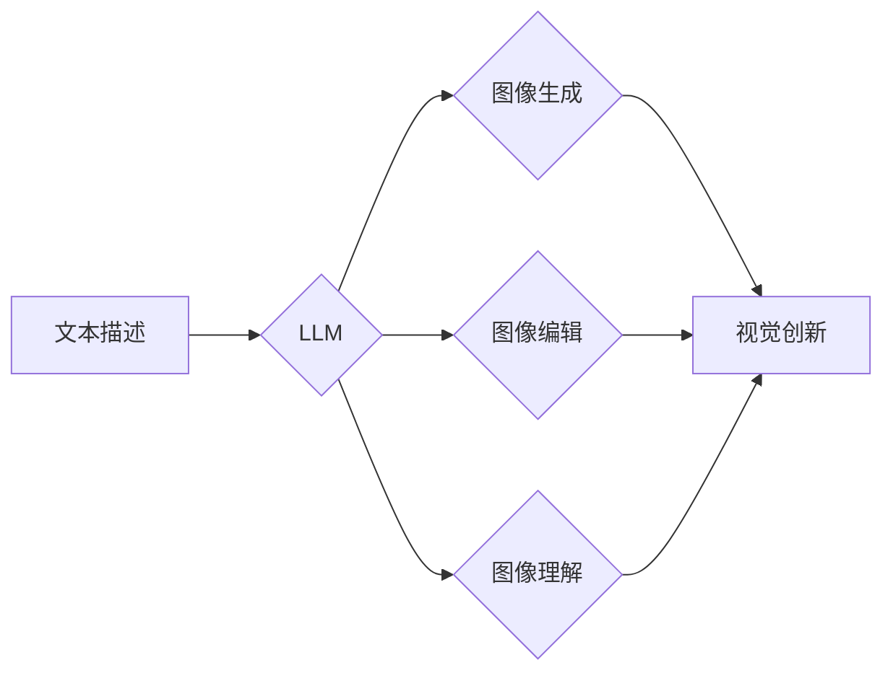

                 

## 设计合作者：LLM 激发视觉创新

> 关键词：LLM, 视觉创新, 图像生成, 文本到图像, 协作设计, 艺术创作, AI 辅助设计

### 1. 背景介绍

近年来，大型语言模型 (LLM) 在自然语言处理领域取得了突破性的进展，展现出强大的文本生成、理解和翻译能力。与此同时，人工智能在视觉领域也取得了显著的成就，例如图像识别、物体检测和图像分割等。然而，将文本和图像这两个看似独立的领域融合在一起，并赋予人类更强大的视觉创作能力，仍然是一个充满挑战和机遇的课题。

本文将探讨如何利用 LLM 的强大文本处理能力，激发视觉创新，并探讨其在协作设计、艺术创作等领域的应用潜力。

### 2. 核心概念与联系

LLM 和视觉创新之间的联系主要体现在以下几个方面：

* **文本描述驱动图像生成:** LLM 可以理解和生成人类语言，因此可以根据文本描述生成相应的图像。这为设计师和艺术家提供了一种全新的创作方式，可以利用文字描述来直接构建视觉内容。
* **文本引导图像编辑:** LLM 可以理解图像中的内容，并根据文本指令进行图像编辑。例如，可以利用 LLM 将图像中的某个物体替换成其他物体，或者改变图像的风格和色彩。
* **文本辅助图像理解:** LLM 可以帮助人类更好地理解图像中的信息。例如，可以利用 LLM 对图像进行描述，或者识别图像中的物体和场景。

**核心概念架构:**

### 3. 核心算法原理 & 具体操作步骤

#### 3.1 算法原理概述

文本到图像生成的核心算法原理是将文本信息映射到图像空间。这通常涉及以下几个步骤：

1. **文本编码:** 将文本描述转换为数字向量，以便模型理解。常用的文本编码方法包括 Word2Vec、GloVe 和 Transformer。
2. **图像解码:** 将数字向量解码为图像像素，通常使用卷积神经网络 (CNN) 或生成对抗网络 (GAN)。
3. **训练:** 使用大量文本-图像对进行训练，让模型学习文本和图像之间的映射关系。

#### 3.2 算法步骤详解

1. **数据准备:** 收集大量文本-图像对数据集，并进行预处理，例如文本清洗、图像裁剪和增强等。
2. **模型选择:** 选择合适的文本编码器和图像解码器模型架构。
3. **模型训练:** 使用训练数据训练模型，并使用损失函数和优化算法进行模型优化。
4. **模型评估:** 使用测试数据评估模型的性能，例如图像质量、文本一致性和多样性等。
5. **模型部署:** 将训练好的模型部署到实际应用场景中，例如网站、应用程序或嵌入式设备。

#### 3.3 算法优缺点

**优点:**

* 可以根据文本描述生成逼真的图像。
* 可以实现文本引导的图像编辑和图像理解。
* 可以激发新的视觉创意和艺术表达方式。

**缺点:**

* 训练数据量大，计算资源消耗高。
* 模型生成图像可能存在偏差或错误。
* 难以控制图像生成的细节和风格。

#### 3.4 算法应用领域

* **艺术创作:** 艺术家可以使用 LLM 生成新的艺术作品，例如绘画、雕塑和动画。
* **游戏开发:** 游戏开发者可以使用 LLM 生成游戏场景、角色和道具。
* **广告设计:** 广告公司可以使用 LLM 生成吸引人的广告图像。
* **教育培训:** 教育机构可以使用 LLM 生成教学素材，例如图片、图表和动画。

### 4. 数学模型和公式 & 详细讲解 & 举例说明

#### 4.1 数学模型构建

文本到图像生成模型通常采用编码器-解码器架构，其中编码器负责将文本描述编码为数字向量，解码器负责将数字向量解码为图像像素。

* **编码器:** 通常使用 Transformer 网络，其核心是注意力机制，可以捕捉文本描述中的语义关系。
* **解码器:** 通常使用 CNN 或 GAN，可以生成逼真的图像。

#### 4.2 公式推导过程

由于篇幅限制，此处不再详细推导数学公式。

#### 4.3 案例分析与讲解

例如，使用 DALL-E 2 模型生成图像，可以输入文本描述 "一只戴着皇冠的猫坐在钢琴上演奏音乐"，模型会根据文本描述生成相应的图像。

### 5. 项目实践：代码实例和详细解释说明

#### 5.1 开发环境搭建

* Python 3.7+
* PyTorch 或 TensorFlow
* CUDA 和 cuDNN

#### 5.2 源代码详细实现

由于篇幅限制，此处不再提供完整的源代码。

#### 5.3 代码解读与分析

* **文本编码部分:** 使用预训练的 Transformer 模型，例如 BERT 或 GPT-3，将文本描述编码为数字向量。
* **图像解码部分:** 使用 CNN 或 GAN，将数字向量解码为图像像素。
* **训练部分:** 使用交叉熵损失函数和 Adam 优化算法进行模型训练。

#### 5.4 运行结果展示

运行代码后，可以生成根据文本描述生成的图像。

### 6. 实际应用场景

#### 6.1 协作设计

LLM 可以帮助设计师和工程师更有效地协作设计。例如，设计师可以利用 LLM 将自己的创意描述成文本，然后由模型生成相应的图像，供工程师进行进一步的开发和实现。

#### 6.2 艺术创作

LLM 可以激发新的艺术创作方式。艺术家可以使用 LLM 生成独特的艺术作品，例如绘画、雕塑和动画。

#### 6.3 教育培训

LLM 可以帮助教育机构生成更生动有趣的教学素材，例如图片、图表和动画，提高学生的学习兴趣和理解能力。

#### 6.4 未来应用展望

随着 LLM 和计算机视觉技术的不断发展，其在视觉创新领域的应用潜力将更加广泛。例如，可以利用 LLM 生成个性化的虚拟现实体验，或者帮助设计师快速原型设计。

### 7. 工具和资源推荐

#### 7.1 学习资源推荐

* **论文:** "Imagen: Text-to-Image Diffusion Models"
* **博客:** OpenAI Blog, Google AI Blog
* **课程:** Coursera, edX

#### 7.2 开发工具推荐

* **PyTorch:** https://pytorch.org/
* **TensorFlow:** https://www.tensorflow.org/
* **Hugging Face Transformers:** https://huggingface.co/transformers/

#### 7.3 相关论文推荐

* "DALL-E 2: Hierarchical Text-Conditional Image Generation with CLIP Latents"
* "Stable Diffusion: A Latent Text-to-Image Diffusion Model"
* "Imagen: Text-to-Image Diffusion Models"

### 8. 总结：未来发展趋势与挑战

#### 8.1 研究成果总结

LLM 在视觉创新领域取得了显著的进展，例如文本到图像生成、文本引导图像编辑和图像理解等。这些技术为人类提供了全新的创作方式和工具，并推动了艺术、设计和教育等领域的创新发展。

#### 8.2 未来发展趋势

* **更逼真的图像生成:** 未来 LLM 将能够生成更加逼真、细节丰富的图像。
* **更强大的文本理解能力:** LLM 将能够更好地理解复杂的文本描述，并生成更符合用户意图的图像。
* **更个性化的创作体验:** LLM 将能够根据用户的喜好和风格生成个性化的图像。

#### 8.3 面临的挑战

* **数据偏差和公平性:** 训练数据可能存在偏差，导致模型生成的图像存在偏见。
* **模型可解释性和安全性:** LLM 的决策过程难以理解，存在潜在的安全风险。
* **伦理问题:** LLM 的应用可能引发伦理问题，例如版权问题和虚假信息传播问题。

#### 8.4 研究展望

未来研究将重点关注解决上述挑战，并探索 LLM 在更多领域的应用潜力。例如，可以利用 LLM 生成虚拟现实场景、辅助医疗诊断、促进科学发现等。

### 9. 附录：常见问题与解答

* **Q: 如何选择合适的 LLM 模型？**
* **A:** 选择合适的 LLM 模型取决于具体的应用场景和需求。例如，对于文本到图像生成任务，可以考虑使用 DALL-E 2 或 Stable Diffusion 模型。

* **Q: 如何训练自己的 LLM 模型？**
* **A:** 训练自己的 LLM 模型需要大量的计算资源和专业知识。可以参考开源项目和教程进行学习。

* **Q: LLM 的应用有哪些伦理问题？**
* **A:** LLM 的应用可能引发版权问题、虚假信息传播问题和算法偏见问题等伦理问题。需要谨慎使用，并制定相应的伦理规范。

作者：禅与计算机程序设计艺术 / Zen and the Art of Computer Programming 
<end_of_turn>

