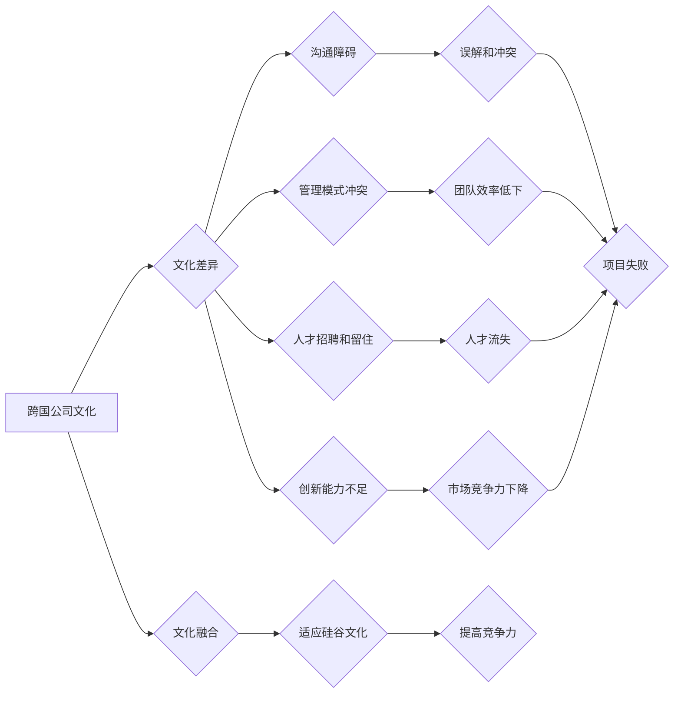

                 

## 跨国公司在硅谷的文化适应

> 关键词：跨国公司、硅谷、文化适应、创新、团队合作、领导风格、人才招聘

### 1. 背景介绍

硅谷，作为全球科技创新的中心，吸引着来自世界各地的跨国公司前来寻求发展机遇。然而，跨国公司进入硅谷并非一帆风顺，文化差异带来的挑战是他们必须面对的难题。硅谷文化以其开放、包容、创新和快速迭代的特点著称，与许多传统跨国公司的管理模式和文化价值观存在显著差异。

跨国公司在硅谷的文化适应，关系到其能否成功融入当地生态系统，吸引和留住人才，并最终实现业务目标。 

### 2. 核心概念与联系

#### 2.1 硅谷文化特征

硅谷文化是一个独特的文化现象，其核心特征包括：

* **创新驱动:** 硅谷以创新为核心价值观，鼓励员工大胆尝试、勇于冒险，并对失败持开放态度。
* **扁平化管理:** 硅谷企业普遍采用扁平化管理模式，决策层级较少，员工拥有较高的自主权和责任感。
* **团队合作:** 硅谷企业高度重视团队合作，鼓励员工互相帮助、共同进步，并构建开放、透明的沟通机制。
* **结果导向:** 硅谷企业注重结果，而非过程，员工的绩效考核主要基于实际成果。
* **快速迭代:** 硅谷企业采用敏捷开发模式，快速迭代产品，并根据用户反馈不断改进。

#### 2.2 跨国公司文化特征

传统跨国公司通常具有以下文化特征：

* **等级森严:** 跨国公司通常采用等级森严的管理模式，决策层级较多，员工的自主权相对较低。
* **流程化管理:** 跨国公司注重流程规范，制定详细的规章制度，并严格执行。
* **个人主义:** 跨国公司文化中个人主义倾向较强，员工的个人成就和竞争意识得到重视。
* **稳定性:** 跨国公司追求稳定和可持续发展，对变化和风险较为谨慎。

#### 2.3 文化差异带来的挑战

硅谷文化与传统跨国公司文化之间存在显著差异，这会导致以下挑战：

* **沟通障碍:** 不同文化背景下的员工，在沟通方式、表达习惯和理解方式上存在差异，容易导致误解和冲突。
* **管理模式冲突:** 扁平化管理与等级森严的管理模式，敏捷开发与流程化管理，创新驱动与稳定性追求，这些文化差异会导致管理模式冲突，影响团队效率和协作。
* **人才招聘和留住:** 硅谷人才市场竞争激烈，跨国公司需要适应硅谷的招聘模式和薪酬体系，并提供吸引人才的文化环境。
* **创新能力不足:** 跨国公司传统的管理模式和文化价值观，可能阻碍员工的创新思维和行动，导致创新能力不足。

#### 2.4 文化融合的必要性

跨国公司在硅谷的成功，取决于其能否有效地进行文化融合。文化融合是指跨国公司吸收硅谷文化的积极因素，并将其与自身文化相结合，形成一种新的、更加适应硅谷环境的文化模式。

**Mermaid 流程图**



### 3. 核心算法原理 & 具体操作步骤

#### 3.1 算法原理概述

文化融合是一个复杂的过程，需要跨国公司采取一系列的策略和措施。 

#### 3.2 算法步骤详解

1. **文化诊断:** 首先，跨国公司需要对自身文化和硅谷文化进行深入的诊断，了解两者的差异和冲突点。
2. **制定文化融合策略:** 根据文化诊断结果，跨国公司需要制定具体的文化融合策略，包括领导风格、团队合作模式、沟通机制、人才招聘和培训等方面。
3. **建立文化交流平台:** 跨国公司需要建立各种文化交流平台，例如员工互访、文化讲座、团队建设活动等，促进员工之间的了解和融合。
4. **培养文化包容性:** 跨国公司需要鼓励员工尊重和包容不同的文化背景，并建立一个多元化、包容性的工作环境。
5. **持续评估和改进:** 文化融合是一个持续的过程，跨国公司需要定期评估文化融合效果，并根据实际情况不断改进策略和措施。

#### 3.3 算法优缺点

* **优点:** 文化融合可以帮助跨国公司更好地适应硅谷环境，提高员工的士气和工作效率，并增强其在硅谷的竞争力。
* **缺点:** 文化融合是一个复杂的过程，需要时间和精力，并且可能面临一些阻力。

#### 3.4 算法应用领域

文化融合的算法可以应用于所有跨国公司在硅谷的运营，帮助他们更好地融入当地文化，并实现业务目标。

### 4. 数学模型和公式 & 详细讲解 & 举例说明

#### 4.1 数学模型构建

文化融合可以被看作是一个动态系统，其状态可以用一个多元向量来表示，其中每个维度代表一个文化要素，例如沟通方式、领导风格、团队合作模式等。

#### 4.2 公式推导过程

我们可以用一个简单的数学模型来描述文化融合的过程：

```
ΔC = f(C_i, C_s, T)
```

其中：

* ΔC 表示文化融合的程度变化
* C_i 表示跨国公司文化
* C_s 表示硅谷文化
* T 表示文化融合策略和措施

#### 4.3 案例分析与讲解

假设一家跨国公司想要在硅谷建立一个新的研发中心，其文化融合目标是提高团队合作效率。

我们可以通过调整文化融合策略和措施，例如：

* 采用扁平化管理模式，减少层级，提高员工的自主权
* 鼓励员工之间进行跨部门的合作，打破部门壁垒
* 建立一个开放透明的沟通机制，方便员工交流信息

这些措施可以使 ΔC 趋于正值，从而提高团队合作效率。

### 5. 项目实践：代码实例和详细解释说明

#### 5.1 开发环境搭建

跨国公司在硅谷的文化适应是一个复杂的项目，需要搭建一个合适的开发环境。

* **硬件环境:** 需要配备高性能的服务器和网络设备，以支持团队成员的协作和开发工作。
* **软件环境:** 需要安装各种开发工具和软件，例如代码编辑器、版本控制系统、测试工具等。
* **网络环境:** 需要搭建一个安全可靠的网络环境，确保团队成员之间可以顺利地进行沟通和数据共享。

#### 5.2 源代码详细实现

跨国公司在硅谷的文化适应需要涉及到多个方面，例如领导风格、团队合作模式、沟通机制等。

我们可以使用代码来实现一些具体的文化融合措施，例如：

* **扁平化管理:** 可以使用代码来实现扁平化管理模式，例如减少层级，提高员工的自主权。
* **团队合作:** 可以使用代码来实现团队合作模式，例如建立一个协作平台，方便员工进行沟通和协作。
* **沟通机制:** 可以使用代码来实现一个开放透明的沟通机制，例如建立一个内部聊天平台，方便员工进行即时沟通。

#### 5.3 代码解读与分析

代码的解读和分析需要根据具体的实现细节进行。

#### 5.4 运行结果展示

代码的运行结果需要根据具体的实现细节进行展示。

### 6. 实际应用场景

#### 6.1 案例分析

我们可以通过一些实际案例来分析跨国公司在硅谷的文化适应。

例如，谷歌、微软等跨国公司都成功地融入硅谷文化，并取得了巨大的成功。

#### 6.2 未来应用展望

随着科技发展和全球化进程的加速，跨国公司在硅谷的文化适应将变得越来越重要。

未来，我们可以期待看到更多创新性的文化融合策略和措施的出现，帮助跨国公司更好地适应硅谷环境，并实现持续发展。

### 7. 工具和资源推荐

#### 7.1 学习资源推荐

* **书籍:** 《硅谷文化》、《跨文化管理》、《创新驱动》
* **网站:** 硅谷商业周刊、TechCrunch、VentureBeat
* **课程:** 硅谷大学、斯坦福大学、加州大学伯克利分校

#### 7.2 开发工具推荐

* **代码编辑器:** Visual Studio Code、Sublime Text、Atom
* **版本控制系统:** Git、GitHub
* **测试工具:** JUnit、Selenium

#### 7.3 相关论文推荐

* **文化差异与跨国公司管理**
* **硅谷文化与创新**
* **跨文化团队合作的最佳实践**

### 8. 总结：未来发展趋势与挑战

#### 8.1 研究成果总结

跨国公司在硅谷的文化适应是一个复杂而重要的课题，研究成果表明，文化融合可以帮助跨国公司更好地融入硅谷环境，提高员工的士气和工作效率，并增强其在硅谷的竞争力。

#### 8.2 未来发展趋势

未来，跨国公司在硅谷的文化适应将更加注重以下几个方面：

* **个性化文化融合:** 跨国公司将更加注重员工个体的文化差异，并提供个性化的文化融合方案。
* **数字化文化融合:** 跨国公司将更加利用数字化工具和平台，促进文化融合。
* **跨文化领导力:** 跨国公司将更加重视培养跨文化领导力，帮助领导者更好地管理跨文化团队。

#### 8.3 面临的挑战

跨国公司在硅谷的文化适应仍然面临一些挑战，例如：

* **文化冲突:** 不同文化背景下的员工，在价值观、行为方式等方面存在差异，可能导致文化冲突。
* **人才短缺:** 硅谷人才市场竞争激烈，跨国公司难以招募和留住优秀人才。
* **监管环境:** 硅谷的监管环境不断变化，跨国公司需要及时了解和适应新的法规和政策。

#### 8.4 研究展望

未来，我们需要进一步研究跨国公司在硅谷的文化适应，探索更有效的文化融合策略和措施，帮助跨国公司更好地融入硅谷生态系统，并实现可持续发展。

### 9. 附录：常见问题与解答

#### 9.1 常见问题

* 如何才能更好地融入硅谷文化？
* 如何才能在硅谷建立一个成功的跨国公司？
* 如何才能在硅谷招募和留住优秀人才？

#### 9.2 常见问题解答

* 融入硅谷文化需要时间和精力，需要跨国公司员工积极学习和适应硅谷的文化价值观和生活方式。
* 在硅谷建立一个成功的跨国公司需要制定有效的文化融合策略，并提供吸引人才的文化环境。
* 招募和留住优秀人才需要提供具有竞争力的薪酬和福利，并提供一个充满挑战和机遇的工作环境。


作者：禅与计算机程序设计艺术 / Zen and the Art of Computer Programming 
<end_of_turn>

