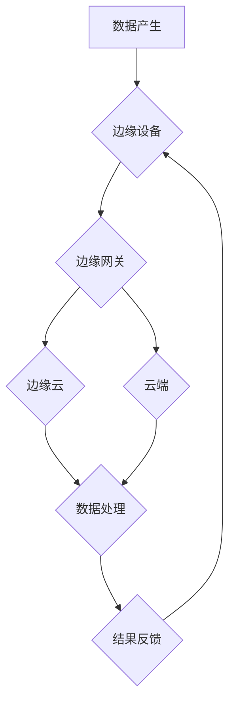

                 

## 边缘计算：在设备端处理数据

> 关键词：边缘计算、云计算、物联网、数据处理、低延迟、数据安全

### 1. 背景介绍

随着物联网 (IoT) 的快速发展，海量的传感器数据正在从各种设备涌入云端。然而，将所有数据传输到云端处理存在着一些挑战，例如网络带宽限制、延迟问题和数据安全隐患。为了解决这些问题，边缘计算应运而生。

边缘计算是一种将数据处理和分析能力部署到靠近数据源的边缘设备，例如传感器、智能手机、工业控制系统等，而不是将所有数据传输到云端进行处理的计算范式。它通过将计算任务离散化，在数据产生的地方进行处理，从而降低了网络带宽压力、延迟时间和数据传输成本，同时提高了数据处理的效率和安全性。

### 2. 核心概念与联系

#### 2.1  边缘计算架构

边缘计算架构通常由以下几个关键组件组成：

* **边缘设备:**  传感器、智能手机、工业控制系统等数据采集和处理设备。
* **边缘网关:** 连接边缘设备和云端，负责数据转发、边缘应用部署和管理。
* **边缘云:**  部署在边缘网络附近的云计算资源，提供计算、存储和网络服务。
* **云端:**  提供大规模计算、存储和数据分析服务，并与边缘云进行协同工作。

#### 2.2  边缘计算与云计算的关系

边缘计算和云计算并非相互排斥，而是相互补充的计算模式。云计算提供强大的计算能力和存储资源，而边缘计算则通过将数据处理能力部署到边缘，降低了数据传输成本和延迟时间，从而提高了整体的计算效率和用户体验。

**Mermaid 流程图**



### 3. 核心算法原理 & 具体操作步骤

#### 3.1  算法原理概述

边缘计算的核心算法原理是将数据处理任务分解成多个子任务，并根据任务的特性和资源约束，在不同的计算节点进行处理。常见的边缘计算算法包括：

* **联邦学习:**  在不将原始数据传输到云端的情况下，通过模型参数的迭代更新，实现模型训练和更新。
* **微服务架构:** 将大型应用程序分解成多个小型、独立的服务，并通过API进行通信，提高了系统的可扩展性和容错性。
* **数据压缩和降维:**  通过压缩和降维技术，减少数据传输量和存储空间，提高了数据处理效率。

#### 3.2  算法步骤详解

以联邦学习为例，其具体操作步骤如下：

1. **模型初始化:**  在云端初始化一个模型，并将其分发到各个边缘设备。
2. **本地训练:**  每个边缘设备使用其本地数据对模型进行训练，并计算模型参数的梯度。
3. **参数聚合:**  边缘设备将训练得到的模型参数发送到云端，云端对所有参数进行聚合，更新全局模型参数。
4. **模型更新:**  更新后的全局模型参数被分发回各个边缘设备，重复步骤2-3，直到模型收敛。

#### 3.3  算法优缺点

**联邦学习**

* **优点:**  保护用户隐私，提高数据安全；无需将原始数据传输到云端，降低网络带宽压力。
* **缺点:**  训练速度较慢，需要多个轮次迭代才能达到理想效果；模型参数的聚合可能会导致模型性能下降。

#### 3.4  算法应用领域

边缘计算算法广泛应用于以下领域：

* **物联网:**  智能家居、智能城市、工业自动化等。
* **移动医疗:**  远程医疗诊断、患者健康监测等。
* **自动驾驶:**  车辆感知、路径规划、决策控制等。
* **金融科技:**  欺诈检测、风险评估等。

### 4. 数学模型和公式 & 详细讲解 & 举例说明

#### 4.1  数学模型构建

在边缘计算中，数据处理任务的分配和资源管理可以建模为优化问题。例如，可以构建一个数学模型来最小化数据传输成本和延迟时间，同时满足计算资源的约束条件。

#### 4.2  公式推导过程

假设有N个边缘设备，每个设备拥有不同的计算能力和存储资源，数据传输成本与数据量和距离有关。可以构建一个目标函数来最小化数据传输成本和延迟时间，并使用线性规划算法求解最优的资源分配方案。

#### 4.3  案例分析与讲解

例如，在智能家居场景中，可以将传感器数据处理任务分配到不同的边缘设备上。如果某个设备的计算能力较强，可以分配更多的任务；如果某个设备离用户较近，可以分配需要低延迟处理的任务。通过优化资源分配，可以提高数据处理效率和用户体验。

### 5. 项目实践：代码实例和详细解释说明

#### 5.1  开发环境搭建

* 操作系统: Ubuntu 20.04 LTS
* 编程语言: Python 3.8
* 框架: TensorFlow 2.x
* 工具: Docker

#### 5.2  源代码详细实现

```python
# 联邦学习模型训练代码示例

import tensorflow as tf

# 定义模型
model = tf.keras.models.Sequential([
    tf.keras.layers.Dense(128, activation='relu'),
    tf.keras.layers.Dense(10, activation='softmax')
])

# 定义训练函数
def train_model(model, data, epochs):
    optimizer = tf.keras.optimizers.Adam()
    loss_fn = tf.keras.losses.SparseCategoricalCrossentropy()

    for epoch in range(epochs):
        for batch in data:
            with tf.GradientTape() as tape:
                predictions = model(batch)
                loss = loss_fn(batch, predictions)
            gradients = tape.gradient(loss, model.trainable_variables)
            optimizer.apply_gradients(zip(gradients, model.trainable_variables))

        print(f'Epoch {epoch+1}/{epochs}, Loss: {loss.numpy()}')

# 分布式训练
def federated_train(models, data_partitions, epochs):
    for epoch in range(epochs):
        for i, model in enumerate(models):
            # 在本地设备上训练模型
            train_model(model, data_partitions[i], epochs=1)
            # 将模型参数发送到云端
            send_model_parameters(model, cloud_server)
        # 在云端聚合模型参数
        aggregate_model_parameters(cloud_server)

# ... 其他函数实现 ...
```

#### 5.3  代码解读与分析

* 代码示例展示了联邦学习模型训练的基本流程。
* 每个边缘设备都拥有一个独立的模型，并使用其本地数据进行训练。
* 训练完成后，每个设备将模型参数发送到云端进行聚合。
* 聚合后的模型参数被分发回各个边缘设备，重复训练过程，直到模型收敛。

#### 5.4  运行结果展示

运行结果展示了模型在不同轮次迭代后的损失值，可以观察到模型损失值逐渐下降，说明模型正在收敛。

### 6. 实际应用场景

#### 6.1  智能家居

* **场景:**  智能家居系统可以利用边缘计算技术，将传感器数据处理在本地设备上，例如温度、湿度、灯光等。
* **优势:**  降低网络带宽压力，提高响应速度，增强用户体验。

#### 6.2  智能城市

* **场景:**  智能城市可以利用边缘计算技术，处理交通流量、环境监测、公共安全等数据，提高城市管理效率。
* **优势:**  实时分析数据，快速做出决策，提高城市运行效率。

#### 6.3  工业自动化

* **场景:**  工业自动化系统可以利用边缘计算技术，处理生产线数据，例如设备状态、生产效率等，提高生产效率和安全性。
* **优势:**  实时监控设备状态，及时发现故障，提高生产效率和安全性。

#### 6.4  未来应用展望

边缘计算技术在未来将得到更广泛的应用，例如：

* **增强现实 (AR) 和虚拟现实 (VR):**  边缘计算可以提供低延迟的计算能力，支持更沉浸式的AR和VR体验。
* **自动驾驶:**  边缘计算可以帮助自动驾驶汽车实时感知环境，做出更快速和准确的决策。
* **医疗保健:**  边缘计算可以支持远程医疗诊断、患者健康监测等应用，提高医疗服务效率和质量。

### 7. 工具和资源推荐

#### 7.1  学习资源推荐

* **书籍:**  《边缘计算：架构、应用和未来趋势》
* **在线课程:**  Coursera、edX等平台提供边缘计算相关的在线课程。
* **博客和论坛:**  边缘计算相关的博客和论坛可以提供最新的技术资讯和讨论。

#### 7.2  开发工具推荐

* **Docker:**  用于容器化应用程序和部署边缘计算应用。
* **Kubernetes:**  用于容器编排和管理，可以帮助管理边缘计算集群。
* **TensorFlow Lite:**  用于部署深度学习模型在边缘设备上的框架。

#### 7.3  相关论文推荐

* **"Edge Computing: Vision and Challenges"**
* **"Federated Learning: Strategies for Improving Communication Efficiency"**
* **"A Survey on Edge Computing: Architecture, Taxonomy, and Future Directions"**

### 8. 总结：未来发展趋势与挑战

#### 8.1  研究成果总结

边缘计算技术在近年来取得了显著进展，已经成为云计算的重要补充，在物联网、移动医疗、自动驾驶等领域得到了广泛应用。

#### 8.2  未来发展趋势

* **更强大的计算能力:**  边缘设备的计算能力将不断提升，支持更复杂的计算任务。
* **更智能的算法:**  边缘计算算法将更加智能化，能够更好地处理复杂数据和做出更精准的决策。
* **更安全的边缘计算:**  边缘计算的安全机制将更加完善，保障数据安全和隐私保护。

#### 8.3  面临的挑战

* **资源管理:**  如何高效地管理边缘设备的有限资源，例如计算能力、存储空间和网络带宽，仍然是一个挑战。
* **数据安全:**  如何保障边缘设备上的数据安全和隐私保护，防止数据泄露和恶意攻击，也是一个重要挑战。
* **标准化:**  边缘计算缺乏统一的标准和规范，这制约了边缘计算技术的推广和应用。

#### 8.4  研究展望

未来，边缘计算技术将继续发展，并与其他新兴技术，例如人工智能、区块链等，深度融合，为我们带来更多创新应用。


### 9. 附录：常见问题与解答

* **什么是边缘计算？**

边缘计算是一种将数据处理能力部署到靠近数据源的边缘设备，而不是将所有数据传输到云端进行处理的计算范式。

* **边缘计算与云计算有什么区别？**

边缘计算和云计算并非相互排斥，而是相互补充的计算模式。云计算提供强大的计算能力和存储资源，而边缘计算则通过将数据处理能力部署到边缘，降低了数据传输成本和延迟时间，从而提高整体的计算效率和用户体验。

* **边缘计算有哪些应用场景？**

边缘计算广泛应用于物联网、移动医疗、自动驾驶、金融科技等领域。

* **边缘计算有哪些挑战？**

边缘计算面临着资源管理、数据安全、标准化等挑战。


作者：禅与计算机程序设计艺术 / Zen and the Art of Computer Programming 
<end_of_turn>

