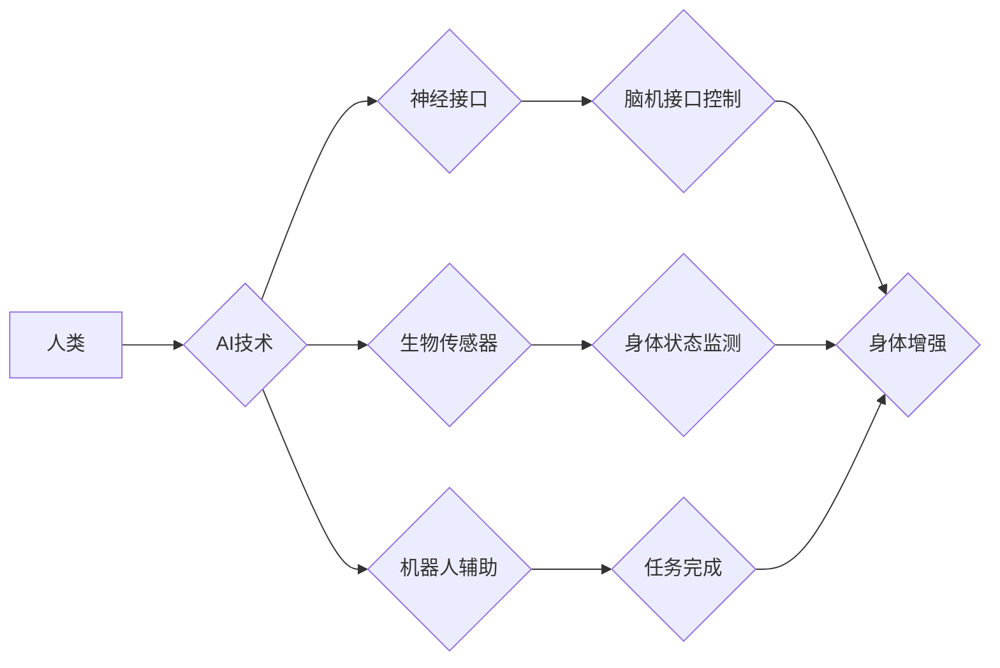

                 

## AI时代的人类增强：身体增强与道德考虑

> 关键词：人工智能、身体增强、道德伦理、生物技术、神经接口、人机融合、可持续发展、社会影响

### 1. 背景介绍

人类文明自诞生以来，就一直在探索如何超越自身的局限性。从使用工具到发明火，从农业革命到工业革命，每一次进步都标志着人类对自身能力的提升。如今，人工智能（AI）的快速发展，为我们开启了新的篇章——AI时代的人类增强。

身体增强，作为AI时代人类增强的核心领域之一，旨在通过技术手段提升人类的生理能力和认知功能。这包括增强肌肉力量、提高反应速度、扩展感知范围、提升记忆力和学习能力等。

### 2. 核心概念与联系

**2.1 人类增强概述**

人类增强是指利用科技手段提升人类能力的总称，涵盖生理、认知、情感等多个方面。它旨在帮助人类克服自身的局限性，实现更广阔的发展空间。

**2.2 身体增强概念**

身体增强是指通过技术手段提升人类的生理能力，例如增强肌肉力量、提高反应速度、扩展感知范围等。

**2.3 AI与身体增强的融合**

AI技术为身体增强提供了强大的工具和手段。例如：

* **神经接口:** 通过连接大脑和外部设备，AI可以实时读取和控制身体的运动，实现脑机接口控制。
* **生物传感器:** AI可以分析生物传感器收集到的数据，实时监测身体状态，并根据需要进行调整。
* **机器人辅助:** AI可以控制机器人，帮助人类完成复杂或危险的任务，例如重体力劳动、精密操作等。

**2.4 身体增强与道德伦理**

身体增强技术的发展也引发了诸多伦理问题，例如：

* **公平性:** 身体增强技术是否会加剧社会不平等？
* **安全性和风险:** 身体增强技术是否安全可靠？潜在的风险和副作用如何应对？
* **身份认同:** 身体增强会改变人类的本质吗？

**2.5 身体增强与社会影响**

身体增强技术的发展将对社会产生深远影响，例如：

* **劳动力市场:** 身体增强技术可能会改变工作模式，提高生产效率，但也可能导致部分工作岗位被取代。
* **社会结构:** 身体增强技术可能会改变社会阶层结构，加剧社会分化。
* **人类认知:** 身体增强技术可能会改变人类的认知能力，影响人类的思维方式和行为模式。

**Mermaid 流程图**



### 3. 核心算法原理 & 具体操作步骤

**3.1 算法原理概述**

身体增强算法的核心是将AI技术与生物系统相结合，实现对身体功能的精准控制和优化。这涉及到多个领域的技术融合，包括神经科学、生物工程、计算机视觉、机器学习等。

**3.2 算法步骤详解**

1. **数据采集:** 使用生物传感器收集人体生理数据，例如心率、血压、肌肉活动、脑电波等。
2. **数据分析:** 利用机器学习算法对收集到的数据进行分析，识别身体状态和潜在的异常情况。
3. **模型训练:** 基于分析结果，训练AI模型，建立人体功能与外部刺激之间的映射关系。
4. **控制信号生成:** 根据目标身体状态，AI模型生成相应的控制信号，例如肌肉刺激信号、视觉信息、听觉信息等。
5. **信号输出:** 将控制信号输出到相应的设备，例如神经刺激装置、机器人控制系统等，实现对身体功能的调节和控制。

**3.3 算法优缺点**

**优点:**

* **精准控制:** AI算法可以实现对身体功能的精准控制，提高增强效果。
* **个性化定制:** 算法可以根据个体差异进行个性化定制，满足不同用户的需求。
* **实时反馈:** 算法可以实时监测身体状态，并根据反馈进行调整，确保安全性和有效性。

**缺点:**

* **技术复杂:** 身体增强算法涉及多个领域的技术融合，开发难度较大。
* **数据安全:** 人体生理数据具有高度敏感性，需要采取严格的安全措施进行保护。
* **伦理风险:** 身体增强技术可能会带来伦理风险，需要谨慎评估和监管。

**3.4 算法应用领域**

* **医疗保健:** 帮助残疾人恢复功能，治疗神经系统疾病，增强免疫力。
* **体育训练:** 提高运动员的运动能力，加速恢复时间，预防运动损伤。
* **军事应用:** 增强士兵的作战能力，提高生存率，完成危险任务。
* **工业生产:** 提高工人效率，降低劳动强度，减少生产事故。

### 4. 数学模型和公式 & 详细讲解 & 举例说明

**4.1 数学模型构建**

身体增强算法通常采用神经网络模型，其结构可以根据具体应用场景进行调整。

**4.2 公式推导过程**

神经网络模型的训练过程涉及到大量的数学公式，例如梯度下降算法、激活函数、损失函数等。这些公式的推导过程较为复杂，需要深入了解神经网络的原理和数学基础。

**4.3 案例分析与讲解**

例如，在脑机接口控制领域，可以使用神经网络模型将脑电波信号映射到相应的运动指令。训练过程中，需要使用大量的脑电波数据和运动指令数据，通过调整模型参数，使模型能够准确地识别脑电波信号并生成相应的运动指令。

### 5. 项目实践：代码实例和详细解释说明

**5.1 开发环境搭建**

身体增强项目通常需要使用Python语言和相关的深度学习框架，例如TensorFlow、PyTorch等。

**5.2 源代码详细实现**

由于篇幅限制，这里只提供一个简单的代码示例，用于演示神经网络模型的训练过程。

```python
import tensorflow as tf

# 定义神经网络模型
model = tf.keras.models.Sequential([
  tf.keras.layers.Dense(128, activation='relu', input_shape=(100,)),
  tf.keras.layers.Dense(64, activation='relu'),
  tf.keras.layers.Dense(10, activation='softmax')
])

# 编译模型
model.compile(optimizer='adam',
              loss='sparse_categorical_crossentropy',
              metrics=['accuracy'])

# 训练模型
model.fit(x_train, y_train, epochs=10)
```

**5.3 代码解读与分析**

这段代码定义了一个简单的多层感知机模型，用于分类任务。模型包含三个全连接层，每个层都使用ReLU激活函数。模型使用Adam优化器，损失函数为稀疏类别交叉熵，评价指标为准确率。

**5.4 运行结果展示**

训练完成后，可以评估模型的性能，例如在测试集上的准确率。

### 6. 实际应用场景

**6.1 医疗保健**

* **神经修复:** 利用神经接口技术，帮助瘫痪患者恢复肢体运动能力。
* **视力恢复:** 开发脑机接口系统，帮助失明患者通过脑电波控制假肢眼睛，恢复视力。
* **听力增强:** 使用 cochlear implants，通过电刺激听觉神经，帮助听力障碍患者恢复听力。

**6.2 体育训练**

* **运动能力提升:** 利用AI算法分析运动员运动数据，提供个性化训练方案，提高运动能力。
* **运动损伤预防:** 通过生物传感器监测运动员身体状态，识别潜在的运动损伤风险，及时采取预防措施。
* **恢复时间缩短:** 利用AI算法分析运动员恢复数据，制定最佳的恢复方案，缩短恢复时间。

**6.3 军事应用**

* **增强士兵作战能力:** 利用增强现实技术，为士兵提供实时战场信息，提高作战决策能力。
* **远程操控机器人:** 利用脑机接口技术，远程操控机器人完成危险任务，降低士兵伤亡风险。
* **增强士兵感知能力:** 利用生物传感器监测士兵身体状态，提高士兵的耐力和抗压能力。

**6.4 未来应用展望**

随着AI技术和生物技术的不断发展，身体增强技术将应用于更多领域，例如教育、娱乐、艺术等。未来，身体增强技术将更加智能化、个性化、安全可靠，为人类带来更多福祉。

### 7. 工具和资源推荐

**7.1 学习资源推荐**

* **书籍:**《深度学习》、《人工智能：一种现代方法》
* **在线课程:** Coursera、edX、Udacity
* **研究论文:** arXiv、IEEE Xplore

**7.2 开发工具推荐**

* **Python:** TensorFlow、PyTorch、Keras
* **神经接口设备:** OpenBCI、Neuralink
* **生物传感器:** Arduino、Raspberry Pi

**7.3 相关论文推荐**

* **Brain-Computer Interfaces for Rehabilitation:** https://www.ncbi.nlm.nih.gov/pmc/articles/PMC5495433/
* **Artificial Intelligence for Healthcare:** https://www.nature.com/articles/s41591-019-0502-4
* **The Ethics of Human Enhancement:** https://www.ncbi.nlm.nih.gov/pmc/articles/PMC6097577/

### 8. 总结：未来发展趋势与挑战

**8.1 研究成果总结**

近年来，身体增强技术取得了显著进展，例如神经接口技术、生物传感器技术、机器人辅助技术等。这些技术为人类提供了新的可能性，但也带来了新的挑战。

**8.2 未来发展趋势**

未来，身体增强技术将朝着以下方向发展：

* **更加智能化:** AI算法将更加智能化，能够更好地理解和响应人类需求。
* **更加个性化:** 身体增强技术将更加个性化，能够根据个体差异提供定制化的解决方案。
* **更加安全可靠:** 身体增强技术将更加安全可靠，降低潜在的风险和副作用。

**8.3 面临的挑战**

身体增强技术的发展也面临着诸多挑战：

* **伦理风险:** 身体增强技术可能会带来伦理风险，例如身份认同危机、社会分化等。
* **技术瓶颈:** 身体增强技术还存在一些技术瓶颈，例如神经接口技术的安全性、生物传感器的精度等。
* **社会接受度:** 身体增强技术还面临着社会接受度的挑战，需要加强公众教育和宣传。

**8.4 研究展望**

未来，我们需要加强对身体增强技术的伦理研究，制定相应的规范和政策，确保其安全、可持续发展。同时，还需要加大对基础研究的投入，突破技术瓶颈，推动身体增强技术向更智能化、个性化、安全可靠的方向发展。

### 9. 附录：常见问题与解答

**9.1 Q: 身体增强技术是否会取代人类？**

A: 身体增强技术旨在帮助人类提升能力，而不是取代人类。AI技术本身不会具有意识和情感，它只是工具，最终目的是服务于人类。

**9.2 Q: 身体增强技术是否安全可靠？**

A: 身体增强技术的发展还处于早期阶段，存在一定的风险和副作用。我们需要加强对安全性的研究和监管，确保其安全可靠。

**9.3 Q: 身体增强技术会加剧社会不平等吗？**

A: 身体增强技术可能会加剧社会不平等，因为只有少数人能够负担得起这些技术。我们需要采取措施，确保身体增强技术能够公平地惠及所有人。


作者：禅与计算机程序设计艺术 / Zen and the Art of Computer Programming 
<end_of_turn>

