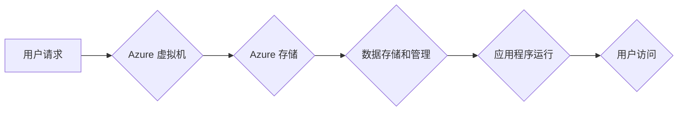

                 

## Azure 云平台：虚拟机和存储

> 关键词：Azure, 虚拟机, 存储, 云计算, IaaS, PaaS, 数据管理

## 1. 背景介绍

在当今数字化时代，云计算已成为企业数字化转型和业务发展的关键驱动力。作为全球领先的云服务提供商，微软 Azure 提供了一系列强大的云计算服务，其中虚拟机和存储是其核心组成部分。

虚拟机（VM）是云计算中模拟物理服务器的软件环境，允许用户在云平台上运行独立的操作系统和应用程序。存储服务则提供各种类型的云存储解决方案，用于存储和管理数据。

Azure 云平台的虚拟机和存储服务具有以下优势：

* **弹性伸缩:** 用户可以根据需要轻松地增加或减少虚拟机和存储容量，满足业务需求的动态变化。
* **成本效益:** 云计算模式可以降低硬件采购、维护和管理成本，提高资源利用率。
* **高可用性:** Azure 提供冗余和灾难恢复机制，确保数据和应用程序的高可用性。
* **安全性:** Azure 采用多层安全防护措施，保护用户数据和应用程序的安全。
* **全球覆盖:** Azure 拥有全球范围的云数据中心，提供低延迟和高可靠性的服务。

## 2. 核心概念与联系

### 2.1 虚拟机

Azure 虚拟机是一种模拟物理服务器的软件环境，用户可以在其中运行独立的操作系统和应用程序。Azure 虚拟机支持多种操作系统，包括 Windows Server、Linux 等。

### 2.2 存储

Azure 存储服务提供各种类型的云存储解决方案，包括：

* **Azure Blob 存储:** 用于存储大对象数据，如图像、视频、音频等。
* **Azure 文件存储:** 提供共享文件系统，用于应用程序和用户数据共享。
* **Azure 块存储:** 用于存储虚拟机磁盘，提供高性能和低延迟。
* **Azure 队列存储:** 用于存储消息，支持异步消息处理。

### 2.3 虚拟机与存储的联系

虚拟机和存储服务是 Azure 云平台中相互关联的两个核心服务。虚拟机需要存储服务来存储操作系统、应用程序和数据。

**Mermaid 流程图:**



## 3. 核心算法原理 & 具体操作步骤

### 3.1 算法原理概述

Azure 虚拟机和存储服务基于一系列复杂的算法和技术实现其功能。

* **虚拟化技术:** 虚拟机技术通过将物理硬件资源虚拟化，允许在单个物理服务器上运行多个独立的虚拟机。
* **存储分片技术:** 存储服务将数据分片存储在多个物理存储设备上，提高数据可靠性和可用性。
* **数据压缩和加密技术:** Azure 存储服务采用数据压缩和加密技术，提高数据存储效率和安全性。

### 3.2 算法步骤详解

**虚拟机创建步骤:**

1. 用户通过 Azure 门户或 API 创建虚拟机实例。
2. Azure 平台根据用户配置选择合适的虚拟机大小和操作系统。
3. Azure 平台分配虚拟机所需的虚拟硬件资源，如 CPU、内存和网络接口。
4. Azure 平台启动虚拟机实例，并安装操作系统和应用程序。

**存储服务操作步骤:**

1. 用户通过 Azure 门户或 API 创建存储帐户。
2. 用户选择存储类型，如 Blob 存储、文件存储或块存储。
3. 用户上传数据到存储帐户。
4. Azure 平台将数据存储在物理存储设备上，并提供访问和管理接口。

### 3.3 算法优缺点

**虚拟化技术:**

* **优点:** 提高硬件资源利用率，降低成本，提高灵活性。
* **缺点:** 虚拟化层引入一定的性能开销，对硬件资源要求较高。

**存储分片技术:**

* **优点:** 提高数据可靠性和可用性，支持大规模数据存储。
* **缺点:** 数据分片和重组需要额外的处理开销。

### 3.4 算法应用领域

* **企业级应用:** 虚拟机和存储服务广泛应用于企业级应用程序的部署和管理，如数据库、Web 服务器、应用程序服务器等。
* **大数据分析:** Azure 存储服务支持大规模数据存储和处理，为大数据分析提供基础设施。
* **人工智能和机器学习:** Azure 虚拟机和存储服务可以用于部署和训练人工智能和机器学习模型。

## 4. 数学模型和公式 & 详细讲解 & 举例说明

### 4.1 数学模型构建

Azure 虚拟机和存储服务的性能和成本可以抽象为数学模型，用于分析和优化资源配置。

**虚拟机性能模型:**

```latex
Performance = f(CPU, Memory, Network)
```

其中:

* Performance: 虚拟机性能指标，如吞吐量、响应时间等。
* CPU: 虚拟机分配的 CPU 核心数。
* Memory: 虚拟机分配的内存大小。
* Network: 虚拟机分配的网络带宽。

**存储成本模型:**

```latex
Cost = Storage_Capacity * Storage_Price + Network_Traffic * Network_Price
```

其中:

* Cost: 存储服务成本。
* Storage_Capacity: 存储容量。
* Storage_Price: 存储容量价格。
* Network_Traffic: 数据传输流量。
* Network_Price: 数据传输流量价格。

### 4.2 公式推导过程

上述数学模型可以通过实际数据和算法推导得出。例如，虚拟机性能模型可以通过测量不同 CPU、内存和网络配置下虚拟机的性能指标，并建立回归模型来推导。

### 4.3 案例分析与讲解

假设一个企业需要部署一个 Web 应用程序，该应用程序需要 4 个 CPU 核心、8 GB 内存和 1 Gbps 网络带宽。

根据虚拟机性能模型，我们可以计算出该应用程序所需的虚拟机性能指标。

假设 Azure 虚拟机价格为每小时 0.1 美元，存储价格为每 GB 每月 0.05 美元，网络流量价格为每 GB 每月 0.01 美元。

根据存储成本模型，我们可以计算出该应用程序所需的存储容量和网络流量，以及相应的存储成本。

## 5. 项目实践：代码实例和详细解释说明

### 5.1 开发环境搭建

* **Azure 订阅:** 用户需要拥有一个有效的 Azure 订阅。
* **Azure CLI:** 安装 Azure 命令行工具，用于与 Azure 平台交互。
* **代码编辑器:** 选择一个合适的代码编辑器，如 Visual Studio Code。

### 5.2 源代码详细实现

以下代码示例演示了如何使用 Azure CLI 创建一个虚拟机实例：

```bash
az vm create \
    --resource-group MyResourceGroup \
    --name MyVM \
    --image UbuntuLTS \
    --size Standard_B2s
```

### 5.3 代码解读与分析

* `az vm create`:  Azure CLI 命令用于创建虚拟机实例。
* `--resource-group MyResourceGroup`: 指定虚拟机所属的资源组。
* `--name MyVM`: 指定虚拟机实例的名称。
* `--image UbuntuLTS`: 指定虚拟机使用的镜像，这里使用 Ubuntu LTS 镜像。
* `--size Standard_B2s`: 指定虚拟机的大小，这里使用 Standard_B2s 虚拟机大小。

### 5.4 运行结果展示

执行上述命令后，Azure 平台会创建一个名为 MyVM 的 Ubuntu LTS 虚拟机实例，并将其添加到名为 MyResourceGroup 的资源组中。

## 6. 实际应用场景

### 6.1 Web 应用程序部署

Azure 虚拟机和存储服务可以用于部署和管理 Web 应用程序。

* **虚拟机:** 作为 Web 服务器运行应用程序。
* **存储:** 存储应用程序代码、数据和静态文件。

### 6.2 数据库托管

Azure 虚拟机可以用于托管数据库服务器，提供高可用性和可靠性。

* **虚拟机:** 作为数据库服务器运行。
* **存储:** 存储数据库文件和日志。

### 6.3 数据仓库

Azure 存储服务可以用于构建数据仓库，存储和分析大规模数据。

* **Blob 存储:** 存储原始数据。
* **文件存储:** 存储数据处理脚本和结果。

### 6.4 未来应用展望

* **Serverless 计算:** Azure 虚拟机和存储服务将与 Serverless 计算服务相结合，提供更灵活和弹性的云计算体验。
* **边缘计算:** Azure 虚拟机和存储服务将扩展到边缘计算场景，支持物联网设备和边缘应用的部署和管理。
* **人工智能和机器学习:** Azure 虚拟机和存储服务将继续支持人工智能和机器学习的开发和部署，提供更强大的计算和存储能力。

## 7. 工具和资源推荐

### 7.1 学习资源推荐

* **Microsoft Learn:** https://learn.microsoft.com/en-us/
* **Azure Documentation:** https://docs.microsoft.com/en-us/azure/
* **Azure Blog:** https://azure.microsoft.com/en-us/blog/

### 7.2 开发工具推荐

* **Azure CLI:** https://docs.microsoft.com/en-us/cli/azure/
* **Azure PowerShell:** https://docs.microsoft.com/en-us/powershell/azure/
* **Azure Portal:** https://portal.azure.com/

### 7.3 相关论文推荐

* **Virtualization Techniques for Cloud Computing:** https://ieeexplore.ieee.org/document/6097391
* **Cloud Storage Architectures and Technologies:** https://ieeexplore.ieee.org/document/7037797

## 8. 总结：未来发展趋势与挑战

### 8.1 研究成果总结

Azure 虚拟机和存储服务已经成为云计算领域的重要组成部分，为企业和个人提供强大的计算和存储能力。

### 8.2 未来发展趋势

* **更强大的计算能力:** Azure 将继续提供更强大的虚拟机实例，支持更高性能的应用程序和工作负载。
* **更智能的存储服务:** Azure 将开发更智能的存储服务，提供自动数据管理、数据分析和数据保护功能。
* **更广泛的应用场景:** Azure 虚拟机和存储服务将扩展到更多应用场景，如边缘计算、物联网和人工智能。

### 8.3 面临的挑战

* **安全性和隐私:** 云计算环境的安全性和隐私保护仍然是一个挑战，需要不断改进安全措施和隐私保护机制。
* **成本控制:** 云计算成本的控制仍然是一个重要问题，需要优化资源配置和使用策略。
* **技术复杂性:** 云计算技术的复杂性仍然是一个挑战，需要不断提高用户对云计算技术的理解和掌握能力。

### 8.4 研究展望

未来，Azure 虚拟机和存储服务将继续朝着更强大、更智能、更安全的方向发展，为用户提供更丰富的云计算体验。


## 9. 附录：常见问题与解答

**常见问题:**

* **如何选择合适的虚拟机大小？**

**解答:** 选择虚拟机大小需要根据应用程序的性能需求和预算进行考虑。Azure 提供了多种虚拟机大小，用户可以根据实际情况选择合适的虚拟机大小。

* **如何备份和恢复虚拟机数据？**

**解答:** Azure 提供了备份和恢复功能，用户可以定期备份虚拟机数据，并根据需要恢复数据。

* **如何监控虚拟机和存储资源的使用情况？**

**解答:** Azure 提供了监控工具，用户可以实时监控虚拟机和存储资源的使用情况，并进行优化配置。


作者：禅与计算机程序设计艺术 / Zen and the Art of Computer Programming 
<end_of_turn>

