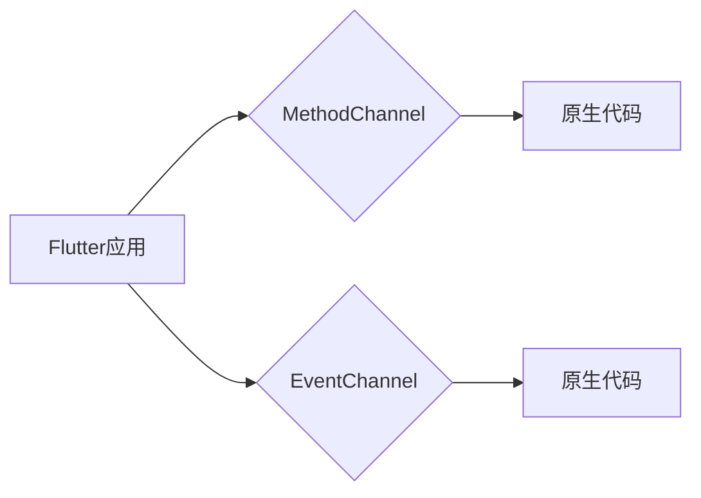

                 

## Flutter跨平台插件开发

> 关键词：Flutter, 跨平台, 插件开发, Native,  Android, iOS,  Dart,  MethodChannel,  EventChannel

## 1. 背景介绍

在当今移动应用开发领域，跨平台开发已经成为一种趋势。开发者希望能够用一套代码实现多个平台（Android、iOS、Web等）的应用，以节省开发时间和成本。Flutter作为谷歌推出的开源跨平台UI框架，凭借其高性能、快速开发和丰富的组件库，迅速成为了开发者们首选的跨平台开发框架之一。

然而，Flutter在某些情况下需要访问平台特定的功能，例如摄像头、定位、蓝牙等。这时，Flutter插件就派上用场了。Flutter插件允许开发者将原生代码集成到Flutter应用中，从而扩展Flutter应用的功能，并访问平台特定的API。

## 2. 核心概念与联系

Flutter插件的核心概念是将Flutter应用与原生平台进行通信。Flutter插件通常由两个部分组成：

* **Flutter端：** 使用Dart语言编写，负责与Flutter应用进行交互，并通过插件接口调用原生代码。
* **原生端：** 使用平台特定的语言（例如Java/Kotlin for Android，Objective-C/Swift for iOS）编写，负责实现平台特定的功能，并通过插件接口与Flutter端进行通信。

Flutter插件的通信机制主要依赖于**MethodChannel**和**EventChannel**两个机制。

* **MethodChannel:** 用于实现同步通信，Flutter端调用原生方法，原生端执行方法并返回结果。
* **EventChannel:** 用于实现异步通信，原生端向Flutter端发送事件，Flutter端接收并处理事件。

**Flutter插件通信架构**



## 3. 核心算法原理 & 具体操作步骤

### 3.1  算法原理概述

Flutter插件的开发主要基于Dart语言和平台特定的语言（Java/Kotlin/Objective-C/Swift）。

* **Dart端:** 开发者使用Dart语言编写Flutter插件的逻辑代码，并通过插件接口调用原生代码。
* **原生端:** 开发者使用平台特定的语言编写原生代码，实现平台特定的功能，并通过插件接口与Dart端进行通信。

Flutter插件的通信机制主要依赖于MethodChannel和EventChannel。

* **MethodChannel:** Flutter端调用原生方法，原生端执行方法并返回结果。
* **EventChannel:** 原生端向Flutter端发送事件，Flutter端接收并处理事件。

### 3.2  算法步骤详解

1. **定义插件接口:** 在Dart端定义插件接口，包括需要调用的原生方法和接收的原生事件。
2. **实现原生代码:** 在平台特定的语言中实现原生代码，实现平台特定的功能，并通过插件接口与Dart端进行通信。
3. **注册插件:** 在Flutter应用中注册插件，并配置插件的名称和路径。
4. **调用原生方法:** 在Dart端使用插件接口调用原生方法，并接收原生方法的返回结果。
5. **接收原生事件:** 在Dart端监听原生事件，并处理接收到的事件。

### 3.3  算法优缺点

**优点:**

* **跨平台:** 使用一套代码实现多个平台的应用。
* **高性能:** 原生代码实现，性能接近原生应用。
* **丰富的功能:** 可以访问平台特定的功能。

**缺点:**

* **开发复杂度:** 需要同时掌握Dart语言和平台特定的语言。
* **维护成本:** 需要维护多个平台的代码。
* **兼容性问题:** 不同平台的API可能存在差异，需要进行适配。

### 3.4  算法应用领域

Flutter插件广泛应用于各种移动应用开发领域，例如：

* **社交应用:** 访问摄像头、麦克风、定位等功能。
* **游戏应用:** 访问游戏控制器、传感器等功能。
* **电商应用:** 访问支付接口、物流信息等功能。
* **工具应用:** 访问文件系统、网络连接等功能。

## 4. 数学模型和公式 & 详细讲解 & 举例说明

Flutter插件的开发与数学模型和公式的应用关系不大，主要依赖于代码实现和平台API的调用。

## 5. 项目实践：代码实例和详细解释说明

### 5.1  开发环境搭建

1. 安装Flutter SDK: https://docs.flutter.dev/get-started/install
2. 安装Android Studio或Xcode: https://developer.android.com/studio/index.html, https://developer.apple.com/xcode/
3. 配置Flutter环境变量: https://docs.flutter.dev/development/tools/sdk/setup

### 5.2  源代码详细实现

以下是一个简单的Flutter插件示例，用于获取设备的电池电量。

**Dart端 (lib/battery_plugin.dart):**

```dart
import 'dart:async';

class BatteryPlugin {
  static const MethodChannel _channel = MethodChannel('battery_plugin');

  static Future<double> getBatteryLevel() async {
    final int result = await _channel.invokeMethod('getBatteryLevel');
    return result.toDouble();
  }
}
```

**Android端 (android/app/src/main/java/com/example/flutter_plugin/BatteryPlugin.java):**

```java
import io.flutter.embedding.engine.plugins.FlutterPlugin;
import io.flutter.plugin.common.MethodCall;
import io.flutter.plugin.common.MethodChannel;
import io.flutter.plugin.common.MethodChannel.MethodCallHandler;
import io.flutter.plugin.common.MethodChannel.Result;
import android.content.Context;
import android.os.BatteryManager;

public class BatteryPlugin implements FlutterPlugin, MethodCallHandler {

  private MethodChannel channel;
  private Context context;

  @Override
  public void onAttachedToEngine(FlutterPluginBinding binding) {
    context = binding.getApplicationContext();
    channel = new MethodChannel(binding.getBinaryMessenger(), "battery_plugin");
    channel.setMethodCallHandler(this);
  }

  @Override
  public void onDetachedFromEngine(@NonNull FlutterPluginBinding binding) {
    channel.setMethodCallHandler(null);
  }

  @Override
  public void onMethodCall(MethodCall call, Result result) {
    if (call.method == "getBatteryLevel") {
      int batteryLevel = getBatteryLevel();
      result.success(batteryLevel);
    } else {
      result.notImplemented();
    }
  }

  private int getBatteryLevel() {
    BatteryManager batteryManager = (BatteryManager) context.getSystemService(Context.BATTERY_SERVICE);
    int level = batteryManager.getIntProperty(BatteryManager.BATTERY_PROPERTY_CAPACITY);
    return level;
  }
}
```

### 5.3  代码解读与分析

* **Dart端:** `BatteryPlugin`类定义了`getBatteryLevel()`方法，该方法通过`MethodChannel`调用原生代码获取电池电量。
* **Android端:** `BatteryPlugin`类实现了`MethodCallHandler`接口，处理来自Flutter端的`getBatteryLevel()`方法调用。它使用`BatteryManager`类获取设备的电池电量，并返回给Flutter端。

### 5.4  运行结果展示

在Flutter应用中调用`BatteryPlugin.getBatteryLevel()`方法，可以获取设备的电池电量百分比。

## 6. 实际应用场景

Flutter插件可以应用于各种场景，例如：

* **社交应用:** 访问摄像头、麦克风、定位等功能，实现视频通话、语音聊天、位置分享等功能。
* **游戏应用:** 访问游戏控制器、传感器等功能，实现更丰富的游戏体验。
* **电商应用:** 访问支付接口、物流信息等功能，实现在线支付、物流追踪等功能。
* **工具应用:** 访问文件系统、网络连接等功能，实现文件管理、网络连接测试等功能。

### 6.4  未来应用展望

随着Flutter生态系统的不断发展，Flutter插件将越来越广泛地应用于移动应用开发领域。未来，Flutter插件可能会更加智能化、自动化，并支持更丰富的功能和平台。

## 7. 工具和资源推荐

### 7.1  学习资源推荐

* Flutter官方文档: https://docs.flutter.dev/
* Flutter插件开发指南: https://docs.flutter.dev/development/platform-integration/plugins

### 7.2  开发工具推荐

* Android Studio: https://developer.android.com/studio/index.html
* Xcode: https://developer.apple.com/xcode/

### 7.3  相关论文推荐

* Flutter: A Framework for Building Native Mobile Applications: https://arxiv.org/abs/1705.08387

## 8. 总结：未来发展趋势与挑战

### 8.1  研究成果总结

Flutter插件为跨平台开发提供了强大的工具，使得开发者能够更轻松地访问平台特定的功能，并扩展Flutter应用的功能。

### 8.2  未来发展趋势

* **更智能化的插件开发工具:** 未来可能会出现更智能化的插件开发工具，能够自动生成插件代码，并提供更便捷的插件管理功能。
* **更丰富的插件生态系统:** 未来Flutter插件生态系统将会更加丰富，提供更多类型的插件，满足开发者更广泛的需求。
* **更强大的跨平台能力:** 未来Flutter插件可能会支持更多平台，例如Web、桌面等，进一步扩展Flutter的应用范围。

### 8.3  面临的挑战

* **插件兼容性问题:** 不同平台的API可能存在差异，需要进行适配，才能保证插件在不同平台上都能正常工作。
* **插件维护成本:** 需要维护多个平台的代码，可能会增加插件的维护成本。
* **插件安全问题:** 插件需要访问设备的敏感信息，需要做好安全防护措施，防止恶意插件的攻击。

### 8.4  研究展望

未来，Flutter插件的研究方向可能会集中在以下几个方面:

* **提高插件开发效率:** 开发更智能化的插件开发工具，降低插件开发门槛。
* **增强插件安全性和可靠性:** 研究更有效的插件安全机制，提高插件的可靠性。
* **扩展插件的功能范围:** 支持更多类型的插件，满足开发者更广泛的需求。


## 9. 附录：常见问题与解答

**Q1: 如何注册Flutter插件？**

A1: 在Flutter应用的`pubspec.yaml`文件中添加插件的依赖，并运行`flutter pub get`命令更新依赖。

**Q2: 如何调用原生方法？**

A2: 使用插件提供的接口调用原生方法，例如`BatteryPlugin.getBatteryLevel()`。

**Q3: 如何处理原生事件？**

A3: 使用`Stream`监听原生事件，并处理接收到的事件。


作者：禅与计算机程序设计艺术 / Zen and the Art of Computer Programming 
<end_of_turn>

