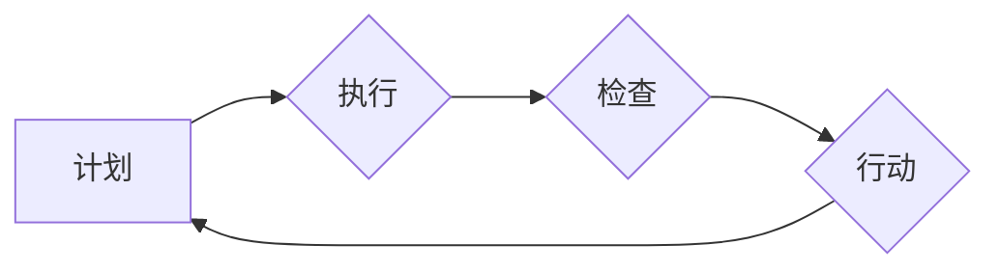

                 

## PDCA循环:从理论到实践的管理工具

> 关键词：PDCA循环, 管理工具, 持续改进, 软件开发, 项目管理, 流程优化, 质量管理

## 1. 背景介绍

在瞬息万变的科技时代，持续改进和优化已成为企业和个人发展的关键。PDCA循环，全称为Plan-Do-Check-Act（计划-执行-检查-行动），是一种以循环的方式进行改进的管理方法，被广泛应用于各个领域，包括软件开发、项目管理、质量管理等。

PDCA循环的提出源于美国质量管理大师沃伦·马歇尔·格罗夫的质量控制理论。它强调通过不断循环的计划、执行、检查和行动，逐步改进工作流程和产品质量。PDCA循环的简洁易懂、易于实施的特点使其成为一种通用的管理工具，适用于各种规模和类型的组织。

## 2. 核心概念与联系

PDCA循环的核心概念是通过四个阶段的循环来实现持续改进：

* **Plan（计划）:** 明确目标，制定计划，并确定相应的资源和步骤。
* **Do（执行）:** 根据计划进行实际操作，并收集相关数据。
* **Check（检查）:** 对执行结果进行分析，评估是否达到预期目标，并找出改进的点。
* **Act（行动）:** 根据检查结果，对计划进行调整，并执行新的计划。

**Mermaid 流程图**



PDCA循环是一个闭环的过程，每个阶段都与其他阶段紧密相连。计划阶段的成果决定了执行阶段的质量，执行阶段的结果反馈到检查阶段，检查阶段的发现又引导着行动阶段的调整，最终形成一个持续改进的循环。

## 3. 核心算法原理 & 具体操作步骤

PDCA循环本身不是一个算法，而是一种管理方法。它没有固定的算法步骤，而是根据具体情况灵活调整。

### 3.1  算法原理概述

PDCA循环的核心原理是基于数据驱动的持续改进。通过收集和分析数据，识别问题和改进点，并根据分析结果制定新的计划，不断优化工作流程和产品质量。

### 3.2  算法步骤详解

1. **计划阶段:**
    * 明确目标：首先要明确需要改进的目标是什么，例如提高软件开发效率、降低产品缺陷率等。
    * 分析现状：对当前的工作流程和产品质量进行分析，找出存在的问题和改进的点。
    * 制定计划：根据分析结果，制定具体的改进计划，包括改进措施、资源分配、时间安排等。

2. **执行阶段:**
    * 实施计划：按照制定的计划进行实际操作，并收集相关数据。
    * 监控过程：在执行过程中，需要对进度和效果进行监控，及时发现问题并进行调整。

3. **检查阶段:**
    * 分析数据：对收集到的数据进行分析，评估改进措施的效果，并找出改进的不足之处。
    * 总结经验：总结执行过程中的经验教训，为下次改进提供参考。

4. **行动阶段:**
    * 制定新的计划：根据检查结果，对计划进行调整，制定新的改进措施。
    * 执行新的计划：按照新的计划进行执行，并继续收集和分析数据。

### 3.3  算法优缺点

**优点:**

* 简单易懂：PDCA循环的原理和步骤非常简单易懂，易于理解和实施。
* 灵活可变：PDCA循环可以根据具体情况灵活调整，适用于各种规模和类型的组织。
* 数据驱动：PDCA循环强调数据驱动的持续改进，能够有效地识别问题和改进点。

**缺点:**

* 需要时间和资源：PDCA循环需要投入时间和资源进行实施，尤其是在计划和检查阶段。
* 难以量化效果：PDCA循环的改进效果难以量化，需要根据具体情况进行评估。

### 3.4  算法应用领域

PDCA循环广泛应用于各个领域，例如：

* 软件开发：提高软件开发效率、降低软件缺陷率。
* 项目管理：优化项目流程、提高项目成功率。
* 质量管理：提升产品质量、降低产品缺陷率。
* 运营管理：优化运营流程、提高运营效率。

## 4. 数学模型和公式 & 详细讲解 & 举例说明

PDCA循环本身并不依赖于复杂的数学模型和公式。它更侧重于流程和实践。然而，我们可以用一些数学概念来描述和分析PDCA循环的效率和效果。

### 4.1  数学模型构建

我们可以用一个简单的数学模型来描述PDCA循环的迭代过程：

*  **P(n)**：第n次迭代的计划改进率
*  **D(n)**：第n次迭代的执行效率
*  **C(n)**：第n次迭代的检查准确率
*  **A(n)**：第n次迭代的行动效果

则PDCA循环的整体改进效果可以表示为：

**改进效果 = ∑(P(n) * D(n) * C(n) * A(n))**

其中，∑表示对所有迭代次数进行求和。

### 4.2  公式推导过程

这个公式的推导过程基于以下假设：

* 每个阶段的改进效果相互独立。
* 每个阶段的改进效果可以量化。

根据这些假设，我们可以得出上述公式。

### 4.3  案例分析与讲解

假设一个软件开发团队使用PDCA循环来提高软件开发效率。

* 第一次迭代，计划改进率为10%，执行效率为80%，检查准确率为90%，行动效果为70%。
* 第二次迭代，计划改进率为15%，执行效率为85%，检查准确率为95%，行动效果为80%。

根据上述公式，我们可以计算出两次迭代的改进效果。

## 5. 项目实践：代码实例和详细解释说明

由于PDCA循环本身不是一个代码实现，因此无法提供具体的代码实例。但是，我们可以通过一个软件开发项目来举例说明如何应用PDCA循环。

### 5.1  开发环境搭建

假设我们开发一个简单的在线学习平台。开发环境搭建包括：

* 选择编程语言和框架
* 设置数据库和服务器
* 安装开发工具和库

### 5.2  源代码详细实现

由于篇幅限制，这里只列举部分代码示例，例如用户注册功能的实现：

```python
# 用户注册功能
def register_user(username, password):
    # 校验用户名和密码
    # ...
    # 将用户信息存储到数据库
    # ...
    return True
```

### 5.3  代码解读与分析

这段代码实现了用户注册的功能。首先，需要校验用户名和密码的格式和合法性。然后，将用户信息存储到数据库中。

### 5.4  运行结果展示

运行代码后，用户可以成功注册并登录平台。

## 6. 实际应用场景

PDCA循环在软件开发、项目管理、质量管理等领域都有广泛的应用场景。

### 6.1  软件开发

在软件开发过程中，可以使用PDCA循环来改进开发流程、提高代码质量、降低开发成本。例如，可以利用PDCA循环来改进代码审查流程、优化测试策略、提高代码复用率等。

### 6.2  项目管理

在项目管理中，可以使用PDCA循环来优化项目计划、提高项目执行效率、降低项目风险。例如，可以利用PDCA循环来改进项目风险管理、优化项目沟通机制、提高项目进度控制等。

### 6.3  质量管理

在质量管理中，可以使用PDCA循环来提升产品质量、降低产品缺陷率、提高客户满意度。例如，可以利用PDCA循环来改进产品设计、优化生产流程、提高产品测试覆盖率等。

### 6.4  未来应用展望

随着科技的不断发展，PDCA循环的应用场景将会更加广泛。例如，可以利用PDCA循环来改进人工智能算法、优化大数据分析流程、提高云计算服务质量等。

## 7. 工具和资源推荐

### 7.1  学习资源推荐

* 《质量管理的艺术》 - 沃伦·马歇尔·格罗夫
* 《精益制造》 - 詹姆斯·沃马克
* 《持续改进》 - 迈克尔·波特

### 7.2  开发工具推荐

* Jira：项目管理工具
* Git：版本控制工具
* Trello：协作工具

### 7.3  相关论文推荐

* Deming's PDCA Cycle: A Practical Guide to Continuous Improvement
* The PDCA Cycle: A Framework for Continuous Improvement in Software Development
* Applying the PDCA Cycle to Quality Management

## 8. 总结：未来发展趋势与挑战

PDCA循环是一种简单易懂、易于实施的管理方法，它能够帮助组织和个人实现持续改进。未来，PDCA循环将会在更多领域得到应用，并与其他管理方法相结合，形成更加完善的管理体系。

### 8.1  研究成果总结

PDCA循环的研究成果表明，它是一种有效的管理方法，能够帮助组织和个人提高效率、降低成本、提升质量。

### 8.2  未来发展趋势

未来，PDCA循环的发展趋势包括：

* 与人工智能、大数据等新技术相结合，实现更加智能化的持续改进。
* 更加注重数据分析和量化评估，提高PDCA循环的科学性和有效性。
* 更加注重跨部门协作和团队合作，实现更加全面的持续改进。

### 8.3  面临的挑战

PDCA循环的实施也面临一些挑战，例如：

* 需要克服组织文化和人员观念的阻力。
* 需要投入时间和资源进行实施和维护。
* 需要建立完善的数据收集和分析机制。

### 8.4  研究展望

未来，需要进一步研究PDCA循环的应用场景、实施方法和效果评估指标，使其更加完善和高效。


## 9. 附录：常见问题与解答

**问题1：PDCA循环的实施需要多久才能看到效果？**

**答案：** PDCA循环的实施时间取决于具体情况，例如组织规模、项目复杂度等。一般来说，需要经过几次迭代才能看到明显的改进效果。

**问题2：PDCA循环只能用于软件开发吗？**

**答案：** 不仅限于软件开发，PDCA循环可以应用于各个领域，只要是需要持续改进的流程或系统都可以使用。

**问题3：如何评估PDCA循环的实施效果？**

**答案：** 可以通过收集和分析数据，例如效率、质量、成本等指标来评估PDCA循环的实施效果。


作者：禅与计算机程序设计艺术 / Zen and the Art of Computer Programming 
<end_of_turn>

