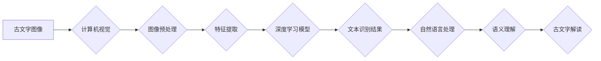

                 

## 人工智能在考古学中的应用：解读古文字

> 关键词：人工智能、古文字识别、自然语言处理、深度学习、计算机视觉、考古学、机器翻译、文化遗产

## 1. 背景介绍

考古学，作为人类文明探索的桥梁，致力于通过挖掘和研究古代遗迹，揭示历史的奥秘。然而，随着时间的推移，许多古代文字已经变得模糊不清，难以解读，这成为了考古学研究的一大瓶颈。传统的手工解读方法耗时费力，且容易受到主观因素的影响。

近年来，人工智能技术飞速发展，为考古学研究带来了新的机遇。人工智能算法能够从海量数据中提取特征，识别模式，并进行智能分析，为古文字的解读提供强大的支持。

## 2. 核心概念与联系

### 2.1 古文字识别

古文字识别是指利用计算机技术，将古代文字图像转换为可读文本的过程。它涉及到计算机视觉、图像处理、自然语言处理等多个领域。

### 2.2 自然语言处理

自然语言处理 (NLP) 是人工智能的一个分支，致力于使计算机能够理解、处理和生成人类语言。在古文字解读中，NLP技术可以用于分析文字结构、语法、语义等方面，帮助理解文字的含义。

### 2.3 深度学习

深度学习是一种机器学习的子领域，它利用多层神经网络来模拟人类大脑的学习过程。深度学习算法能够从海量数据中自动学习特征，并进行复杂的任务处理，在古文字识别和理解方面展现出强大的潜力。

**核心概念与联系流程图**



## 3. 核心算法原理 & 具体操作步骤

### 3.1 算法原理概述

古文字识别和理解通常采用以下核心算法：

* **卷积神经网络 (CNN)**：用于图像特征提取，能够识别文字的形状、结构和特征。
* **循环神经网络 (RNN)**：用于序列数据处理，能够捕捉文字的上下文信息和语法结构。
* **长短期记忆网络 (LSTM)**：一种改进的RNN，能够更好地处理长序列数据，例如古文字句子。
* **注意力机制**: 用于突出重要信息，提高模型对关键文字的关注度。

### 3.2 算法步骤详解

1. **数据准备**: 收集大量的古文字图像数据，并进行标注，形成训练数据集。
2. **图像预处理**: 对图像进行尺寸调整、灰度化、去噪等处理，提高图像质量。
3. **特征提取**: 使用CNN提取图像特征，例如文字的形状、轮廓、纹理等。
4. **文本识别**: 将提取的特征输入RNN或LSTM模型，进行文本识别，将图像转换为文本序列。
5. **语义理解**: 使用NLP技术对识别出的文本进行分析，例如词性标注、依存句法分析、语义角色标注等，理解文字的含义。
6. **古文字解读**: 基于语义理解结果，结合历史背景和文化知识，进行古文字的解读和翻译。

### 3.3 算法优缺点

**优点**:

* 自动化程度高，效率显著提高。
* 能够处理大量数据，发现隐藏的模式。
* 减少主观因素的影响，提高解读的准确性。

**缺点**:

* 需要大量的训练数据，数据质量直接影响模型性能。
* 对于复杂、模糊的古文字，识别和理解仍然存在挑战。
* 需要结合历史文化知识，才能进行更深入的解读。

### 3.4 算法应用领域

* 古文字识别和翻译
* 文物保护和修复
* 文物数字化展示
* 历史研究和文化传承

## 4. 数学模型和公式 & 详细讲解 & 举例说明

### 4.1 数学模型构建

古文字识别和理解通常使用深度学习模型，例如CNN和RNN。这些模型的构建基于以下数学原理：

* **激活函数**: 用于引入非线性，使模型能够学习复杂的映射关系。常见的激活函数包括ReLU、Sigmoid和Tanh。
* **损失函数**: 用于衡量模型预测结果与真实值的差异。常见的损失函数包括交叉熵损失和均方误差损失。
* **优化算法**: 用于更新模型参数，使模型的损失函数最小化。常见的优化算法包括梯度下降、Adam和RMSprop。

### 4.2 公式推导过程

由于篇幅限制，此处不再详细推导数学公式。

### 4.3 案例分析与讲解

例如，在古文字识别任务中，可以使用CNN提取图像特征，然后使用RNN进行文本序列预测。损失函数可以是交叉熵损失，用于衡量预测文本序列与真实文本序列之间的差异。优化算法可以是Adam，用于更新模型参数。

## 5. 项目实践：代码实例和详细解释说明

### 5.1 开发环境搭建

* Python 3.x
* TensorFlow 或 PyTorch 深度学习框架
* OpenCV 图像处理库
* NLTK 自然语言处理库

### 5.2 源代码详细实现

```python
# 使用 TensorFlow 构建 CNN 模型
model = tf.keras.models.Sequential([
    tf.keras.layers.Conv2D(32, (3, 3), activation='relu', input_shape=(img_height, img_width, 1)),
    tf.keras.layers.MaxPooling2D((2, 2)),
    tf.keras.layers.Conv2D(64, (3, 3), activation='relu'),
    tf.keras.layers.MaxPooling2D((2, 2)),
    tf.keras.layers.Flatten(),
    tf.keras.layers.Dense(num_classes, activation='softmax')
])

# 编译模型
model.compile(optimizer='adam',
              loss='sparse_categorical_crossentropy',
              metrics=['accuracy'])

# 训练模型
model.fit(train_images, train_labels, epochs=10)

# 使用模型进行预测
predictions = model.predict(test_images)
```

### 5.3 代码解读与分析

* 代码首先定义了 CNN 模型的结构，包括卷积层、池化层和全连接层。
* 然后，模型被编译，指定了优化算法、损失函数和评价指标。
* 接着，模型被训练，使用训练数据进行参数更新。
* 最后，训练好的模型可以用于预测测试数据。

### 5.4 运行结果展示

运行结果包括模型的训练精度和测试精度，以及预测结果的准确率。

## 6. 实际应用场景

### 6.1 文物保护和修复

人工智能可以帮助识别文物上的文字，了解其历史背景和文化价值，从而更好地进行文物保护和修复。

### 6.2 文物数字化展示

人工智能可以将古文字图像数字化，并进行翻译和解读，使文物更加生动形象地展示给公众。

### 6.3 历史研究和文化传承

人工智能可以帮助研究人员分析大量的古文字数据，发现历史规律和文化内涵，从而更好地传承和弘扬中华文化。

### 6.4 未来应用展望

随着人工智能技术的不断发展，其在考古学中的应用将更加广泛和深入。例如，可以利用人工智能技术进行虚拟考古，模拟古代遗址的场景，帮助人们更好地了解历史。

## 7. 工具和资源推荐

### 7.1 学习资源推荐

* **书籍**:
    * 《深度学习》
    * 《自然语言处理》
    * 《计算机视觉》
* **在线课程**:
    * Coursera
    * edX
    * Udacity

### 7.2 开发工具推荐

* **TensorFlow**: https://www.tensorflow.org/
* **PyTorch**: https://pytorch.org/
* **OpenCV**: https://opencv.org/

### 7.3 相关论文推荐

* **《Attention Is All You Need》**: https://arxiv.org/abs/1706.03762
* **《BERT: Pre-training of Deep Bidirectional Transformers for Language Understanding》**: https://arxiv.org/abs/1810.04805

## 8. 总结：未来发展趋势与挑战

### 8.1 研究成果总结

人工智能技术在古文字识别和理解方面取得了显著进展，为考古学研究提供了新的工具和方法。

### 8.2 未来发展趋势

* **模型精度提升**: 继续探索更深、更复杂的深度学习模型，提高古文字识别的精度和准确率。
* **跨语言理解**: 研究跨语言古文字识别和理解技术，促进不同文化之间的交流和理解。
* **场景化应用**: 将人工智能技术应用于更具体的考古场景，例如虚拟考古、文物修复等。

### 8.3 面临的挑战

* **数据标注**: 古文字数据标注工作量大，成本高，需要开发更有效的标注方法。
* **模型解释性**: 深度学习模型的内部机制复杂，难以解释其决策过程，需要提高模型的解释性。
* **伦理问题**: 人工智能技术应用需要考虑伦理问题，例如数据隐私、知识产权等。

### 8.4 研究展望

未来，人工智能技术将继续推动考古学研究的进步，帮助我们更好地了解人类文明的起源和发展。


## 9. 附录：常见问题与解答

* **Q1: 人工智能能否完全替代人工解读古文字？**

* **A1**: 目前，人工智能技术在古文字解读方面取得了很大进展，但仍无法完全替代人工解读。人工解读需要结合历史背景、文化知识和逻辑推理，而人工智能技术目前还难以完全模拟这些能力。

* **Q2: 如何获取古文字数据集？**

* **A2**: 可以从以下渠道获取古文字数据集：
    * 博物馆和图书馆
    * 学术研究机构
    * 在线数据库

* **Q3: 如何评估人工智能古文字解读的准确性？**

* **A3**: 可以使用以下指标评估人工智能古文字解读的准确性：
    * 识别率
    * 准确率
    * F1-score

作者：禅与计算机程序设计艺术 / Zen and the Art of Computer Programming 


<end_of_turn>

