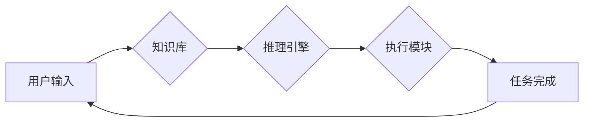

                 

## 人机协作：通向未来的智能之路

> 关键词： 人机协作、人工智能、协同智能、机器学习、自然语言处理、深度学习、未来技术

### 1. 背景介绍

人类文明的发展离不开对工具的不断革新和利用。从石器时代到信息时代，工具的演变始终推动着人类社会进步。如今，人工智能（AI）正以其强大的计算能力和学习能力，成为新一代的工具，并正在深刻地改变着我们生活和工作的方式。

然而，AI技术本身还无法完全替代人类，因为人类拥有独特的创造力、批判性思维和情感智能。因此，人机协作成为未来智能发展的重要方向。人机协作是指人类和人工智能系统共同完成任务，发挥各自优势，实现协同增效的模式。

### 2. 核心概念与联系

**2.1 人机协作的本质**

人机协作的核心在于将人类的智慧和机器的效率有机结合，形成一个高效、灵活、创新的智能系统。

**2.2 人机协作的类型**

人机协作可以分为不同的类型，例如：

* **监督式协作:** 人类在整个过程中扮演主导角色，指导机器完成任务。
* **辅助式协作:** 机器辅助人类完成任务，例如提供信息、分析数据、自动执行重复性操作。
* **协同式协作:** 人类和机器共同参与任务，相互补充，共同完成目标。

**2.3 人机协作的架构**

人机协作系统通常由以下几个部分组成：

* **用户界面:** 用于人类与系统交互的界面，例如图形界面、语音界面等。
* **知识库:** 存储系统所需知识和信息的数据库。
* **推理引擎:** 用于处理用户输入、分析数据、做出决策的模块。
* **执行模块:** 用于执行系统决策，控制机器完成任务的模块。

**2.4 Mermaid 流程图**



### 3. 核心算法原理 & 具体操作步骤

**3.1 算法原理概述**

人机协作的核心算法通常涉及机器学习、自然语言处理、强化学习等领域。

* **机器学习:** 算法通过学习数据，发现其中的规律，并根据这些规律进行预测或决策。
* **自然语言处理:** 算法能够理解和处理人类语言，例如文本分析、语音识别、机器翻译等。
* **强化学习:** 算法通过与环境交互，学习如何做出最优决策，以获得最大奖励。

**3.2 算法步骤详解**

具体算法步骤取决于具体的应用场景，但一般包括以下几个步骤：

1. **数据收集和预处理:** 收集相关数据，并进行清洗、格式化等预处理工作。
2. **模型选择和训练:** 选择合适的算法模型，并根据训练数据进行模型训练。
3. **模型评估和优化:** 对训练好的模型进行评估，并根据评估结果进行模型优化。
4. **模型部署和应用:** 将训练好的模型部署到实际应用场景中，并进行持续监控和维护。

**3.3 算法优缺点**

不同的算法具有不同的优缺点，需要根据具体应用场景进行选择。

* **优点:** 能够自动学习和适应数据变化，提高效率和准确性。
* **缺点:** 需要大量数据进行训练，训练过程可能耗时和耗能。

**3.4 算法应用领域**

人机协作算法广泛应用于各个领域，例如：

* **医疗保健:** 辅助医生诊断疾病、制定治疗方案。
* **金融服务:** 识别欺诈交易、提供个性化金融服务。
* **教育:** 提供个性化学习辅导、自动批改作业。
* **制造业:** 自动化生产流程、优化生产效率。

### 4. 数学模型和公式 & 详细讲解 & 举例说明

**4.1 数学模型构建**

人机协作系统可以抽象为一个数学模型，其中包括人类和机器的决策过程、信息交互过程、任务分配过程等。

**4.2 公式推导过程**

例如，可以利用马尔可夫决策过程（MDP）模型来描述人机协作系统的决策过程。

MDP模型包含以下几个要素：

* 状态空间：系统可能存在的各种状态。
* 动作空间：系统可以执行的各种动作。
* 状态转移概率：从一个状态到另一个状态的概率。
* 奖励函数：系统在某个状态执行某个动作后获得的奖励。

**4.3 案例分析与讲解**

例如，在人机协作的自动驾驶系统中，可以利用MDP模型来描述驾驶员和自动驾驶系统的决策过程。

驾驶员可以执行的动作包括加速、减速、转向等，自动驾驶系统可以执行的动作包括控制油门、刹车、转向等。

系统状态可以包括车辆速度、车辆位置、道路状况等。

奖励函数可以根据车辆行驶的安全性和效率来定义。

通过训练MDP模型，可以学习到驾驶员和自动驾驶系统如何协同决策，以实现安全、高效的驾驶。

### 5. 项目实践：代码实例和详细解释说明

**5.1 开发环境搭建**

人机协作项目开发通常需要使用以下工具和技术：

* **编程语言:** Python、Java、C++等。
* **机器学习框架:** TensorFlow、PyTorch、Scikit-learn等。
* **自然语言处理库:** NLTK、spaCy、HuggingFace等。
* **云计算平台:** AWS、Azure、GCP等。

**5.2 源代码详细实现**

以下是一个简单的基于Python的自然语言处理人机协作项目代码示例：

```python
import nltk
from nltk.chat.util import Chat, reflections

pairs = [
    [
        r"我的名字是什么？",
        ["你的名字是什么？"],
    ],
    [
        r"你好",
        ["你好！", "嗨！"],
    ],
    [
        r"再见",
        ["再见！", "祝你今天愉快！"],
    ],
]

chat = Chat(pairs, reflections)
chat.converse()
```

**5.3 代码解读与分析**

这段代码实现了一个简单的聊天机器人，它可以根据用户输入进行相应的回复。

* `nltk` 是一个自然语言处理工具包。
* `Chat` 类用于创建聊天机器人。
* `pairs` 是一个列表，其中包含了聊天机器人可以理解的指令和相应的回复。
* `reflections` 是一个字典，用于处理用户输入中的代词，例如“我”，“你”等。
* `chat.converse()` 方法启动聊天机器人，并等待用户输入。

**5.4 运行结果展示**

运行这段代码后，用户可以与聊天机器人进行对话。例如：

```
用户: 你好
聊天机器人: 嗨！
用户: 我的名字是什么？
聊天机器人: 你的名字是什么？
```

### 6. 实际应用场景

**6.1 医疗保健**

* **辅助诊断:** 人工智能系统可以分析患者的病历、影像数据等，辅助医生进行诊断。
* **个性化治疗:** 人工智能系统可以根据患者的基因信息、生活习惯等，制定个性化的治疗方案。
* **远程医疗:** 人工智能系统可以帮助医生进行远程诊断和治疗，提高医疗服务的可及性。

**6.2 金融服务**

* **欺诈检测:** 人工智能系统可以分析交易数据，识别异常交易，防止欺诈行为。
* **风险管理:** 人工智能系统可以评估投资风险，帮助投资者做出更明智的决策。
* **个性化金融服务:** 人工智能系统可以根据用户的财务状况、投资目标等，提供个性化的金融建议和服务。

**6.3 教育**

* **个性化学习辅导:** 人工智能系统可以根据学生的学习进度和能力，提供个性化的学习辅导。
* **自动批改作业:** 人工智能系统可以自动批改学生的作业，节省教师的时间和精力。
* **智能问答系统:** 人工智能系统可以回答学生的疑问，帮助他们更好地理解知识。

**6.4 未来应用展望**

人机协作技术将继续在各个领域得到广泛应用，例如：

* **自动驾驶:** 人机协作的自动驾驶系统将更加安全、高效。
* **机器人技术:** 人机协作的机器人将更加智能、灵活，能够更好地完成复杂的任务。
* **虚拟现实/增强现实:** 人机协作的虚拟现实/增强现实系统将更加沉浸式、交互式。

### 7. 工具和资源推荐

**7.1 学习资源推荐**

* **书籍:**
    * 人工智能：一种现代方法
    * 深度学习
    * 人机协作：理论与实践
* **在线课程:**
    * Coursera 人工智能课程
    * edX 深度学习课程
    * Udacity 人机协作课程

**7.2 开发工具推荐**

* **编程语言:** Python、Java、C++
* **机器学习框架:** TensorFlow、PyTorch、Scikit-learn
* **自然语言处理库:** NLTK、spaCy、HuggingFace
* **云计算平台:** AWS、Azure、GCP

**7.3 相关论文推荐**

* 人机协作中的信任和解释性
* 人机协作中的公平性和伦理
* 人机协作的未来发展趋势

### 8. 总结：未来发展趋势与挑战

**8.1 研究成果总结**

近年来，人机协作技术取得了显著进展，在各个领域得到了广泛应用。

**8.2 未来发展趋势**

未来，人机协作技术将朝着以下几个方向发展：

* **更加智能化:** 人工智能系统将更加智能，能够更好地理解人类意图，并提供更精准的帮助。
* **更加个性化:** 人机协作系统将更加个性化，能够根据用户的需求和喜好进行定制。
* **更加协同化:** 人机协作系统将更加协同，能够更好地与人类团队合作，完成复杂的任务。

**8.3 面临的挑战**

人机协作技术也面临着一些挑战，例如：

* **数据安全和隐私保护:** 人机协作系统需要处理大量用户数据，因此数据安全和隐私保护是一个重要的挑战。
* **算法透明度和可解释性:** 人工智能算法的决策过程往往是复杂的，难以理解，因此提高算法透明度和可解释性是一个重要的研究方向。
* **人机信任和交互:** 人类需要信任人工智能系统，并能够与之有效地交互，因此建立人机信任和良好交互机制是一个重要的挑战。

**8.4 研究展望**

未来，我们需要继续加强对人机协作技术的研发和应用，并积极应对其带来的挑战，以实现人机协作的真正价值，推动人类社会进步。

### 9. 附录：常见问题与解答

**9.1 如何选择合适的算法模型？**

选择合适的算法模型需要根据具体的应用场景和数据特点进行考虑。例如，对于文本分类任务，可以考虑使用支持向量机（SVM）、随机森林（RF）等算法模型。

**9.2 如何提高算法的准确性？**

提高算法的准确性可以通过以下几个方面进行：

* 提高训练数据的质量和数量。
* 优化算法模型的超参数。
* 使用更先进的算法模型。

**9.3 如何解决数据安全和隐私保护问题？**

数据安全和隐私保护可以通过以下几个方面进行解决：

* 使用加密技术保护数据。
* 采用匿名化技术处理敏感数据。
* 建立完善的数据安全管理制度。


作者：禅与计算机程序设计艺术 / Zen and the Art of Computer Programming 
<end_of_turn>

