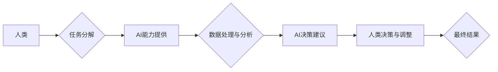

                 

## 人类-AI协作：增强人类智慧与AI能力的融合发展趋势预测分析策略

> 关键词：人工智能、人类-AI协作、智慧增强、AI能力、融合发展、趋势预测、协作策略

## 1. 背景介绍

人工智能（AI）技术近年来发展迅速，已渗透到各个领域，深刻地改变着人类的生活方式和工作模式。从自动驾驶、医疗诊断到金融分析、创意写作，AI正在展现出强大的应用潜力。然而，AI技术也面临着一些挑战，例如数据依赖、算法偏见、解释性不足等。

人类-AI协作（Human-AI Collaboration）应运而生，旨在通过融合人类的智慧和AI的能力，实现互补优势，共同解决复杂问题。这种协作模式强调人类和AI的共同参与，人类提供决策、创造力和批判性思维，而AI提供数据处理、计算能力和自动化执行。

## 2. 核心概念与联系

### 2.1 核心概念

* **人类智慧:** 指人类独特的认知能力，包括抽象思维、创造力、情感理解、道德判断等。
* **AI能力:** 指人工智能系统所具备的模拟人类智能的能力，例如机器学习、自然语言处理、计算机视觉等。
* **协作:** 指人类和AI在共同目标下，相互配合、分工协作，实现更高效、更智能的成果。

### 2.2 架构关系



**图 2.1 人类-AI协作架构关系**

## 3. 核心算法原理 & 具体操作步骤

### 3.1 算法原理概述

人类-AI协作的核心算法原理是基于**强化学习**和**图灵测试**的改进。

* **强化学习:** AI系统通过与环境交互，学习最佳策略以获得最大奖励。在人类-AI协作中，人类扮演着奖励机制的角色，通过反馈和评价来指导AI的学习。
* **图灵测试:**  评估AI是否能够表现出与人类相似的智能。在人类-AI协作中，图灵测试被用于评估AI的理解能力和沟通能力，确保AI能够有效地与人类进行交互。

### 3.2 算法步骤详解

1. **任务分解:** 将复杂任务分解成多个子任务，并根据AI和人类的优势分配任务。
2. **数据收集与预处理:** 收集相关数据，并进行预处理，例如清洗、转换、特征提取等。
3. **AI模型训练:** 利用强化学习算法训练AI模型，使其能够完成分配的任务。
4. **AI决策建议:** AI模型根据收集到的数据和训练结果，生成决策建议。
5. **人类决策与调整:** 人类根据AI的建议，进行最终决策，并根据实际情况进行调整。
6. **结果反馈:** 将最终结果反馈给AI模型，用于后续学习和优化。

### 3.3 算法优缺点

**优点:**

* 能够充分发挥人类和AI的优势，实现互补。
* 提高决策效率和准确性。
* 促进创新和创造。

**缺点:**

* 需要建立有效的沟通机制，确保人类和AI能够有效地协作。
* 需要解决数据安全和隐私问题。
* 需要考虑AI算法的解释性和可控性。

### 3.4 算法应用领域

* **医疗诊断:** AI辅助医生进行诊断，提高诊断准确率。
* **金融分析:** AI分析市场数据，辅助金融决策。
* **教育教学:** AI个性化教学，提高学习效率。
* **法律服务:** AI辅助律师进行法律研究和案件分析。

## 4. 数学模型和公式 & 详细讲解 & 举例说明

### 4.1 数学模型构建

人类-AI协作过程可以抽象为一个**马尔可夫决策过程** (MDP)，其中：

* 状态空间 S 表示系统当前的状态。
* 动作空间 A 表示系统可以采取的行动。
* 转移概率 P(s', r | s, a) 表示从状态 s 执行动作 a 后，转移到状态 s' 的概率，以及获得奖励 r 的概率。
* 奖励函数 R(s, a) 表示在状态 s 执行动作 a 后获得的奖励。

### 4.2 公式推导过程

目标是找到一个策略 π(s) ，使得在状态 s 下采取动作 a 的概率最大化累积奖励。可以使用**动态规划**或**蒙特卡罗方法**来求解 MDP。

* **动态规划:** 通过递推的方式，计算每个状态下最优的策略。
* **蒙特卡罗方法:** 通过模拟多个随机轨迹，估计策略的价值函数。

### 4.3 案例分析与讲解

例如，在医疗诊断领域，可以将患者的症状和病史作为状态空间，医生可以采取的诊断行动作为动作空间。AI模型可以根据患者数据学习诊断策略，并提供诊断建议。医生可以根据AI的建议，结合自身经验进行最终诊断。

## 5. 项目实践：代码实例和详细解释说明

### 5.1 开发环境搭建

* 操作系统: Ubuntu 20.04
* Python 版本: 3.8
* 必要的库: TensorFlow, PyTorch, scikit-learn

### 5.2 源代码详细实现

```python
# 人类-AI协作示例代码

import tensorflow as tf

# 定义AI模型
model = tf.keras.models.Sequential([
    tf.keras.layers.Dense(128, activation='relu', input_shape=(10,)),
    tf.keras.layers.Dense(64, activation='relu'),
    tf.keras.layers.Dense(1, activation='sigmoid')
])

# 训练AI模型
model.compile(optimizer='adam', loss='binary_crossentropy', metrics=['accuracy'])
model.fit(X_train, y_train, epochs=10)

# 获取AI模型预测结果
predictions = model.predict(X_test)

# 人类决策与调整
human_decision = adjust_predictions(predictions)

# 输出最终结果
print(human_decision)
```

### 5.3 代码解读与分析

* 该代码示例展示了如何使用TensorFlow构建一个简单的AI模型，并进行训练。
* `adjust_predictions()`函数模拟人类对AI预测结果的调整，可以根据实际情况进行修改。

### 5.4 运行结果展示

运行结果将显示人类对AI预测结果的调整后的最终决策。

## 6. 实际应用场景

### 6.1 医疗诊断辅助

AI可以辅助医生进行疾病诊断，例如分析医学影像、预测患者风险等。

### 6.2 金融风险管理

AI可以分析市场数据，识别潜在的金融风险，帮助金融机构进行风险管理。

### 6.3 自动驾驶系统

AI可以帮助车辆感知周围环境，做出驾驶决策，实现自动驾驶功能。

### 6.4 未来应用展望

* **个性化教育:** AI可以根据学生的学习情况，提供个性化的学习方案。
* **智能客服:** AI可以模拟人类对话，为客户提供智能客服服务。
* **创意设计:** AI可以辅助设计师进行创意设计，例如生成图像、音乐等。

## 7. 工具和资源推荐

### 7.1 学习资源推荐

* **在线课程:** Coursera, edX, Udacity
* **书籍:** 《深度学习》、《人工智能：一种现代方法》
* **开源项目:** TensorFlow, PyTorch

### 7.2 开发工具推荐

* **编程语言:** Python, Java, C++
* **机器学习框架:** TensorFlow, PyTorch, scikit-learn
* **云计算平台:** AWS, Azure, Google Cloud

### 7.3 相关论文推荐

* **《Attention Is All You Need》:**  Transformer模型的提出
* **《Generative Pre-trained Transformer 3》:** GPT-3模型的提出
* **《BERT: Pre-training of Deep Bidirectional Transformers for Language Understanding》:** BERT模型的提出

## 8. 总结：未来发展趋势与挑战

### 8.1 研究成果总结

人类-AI协作技术取得了显著进展，在多个领域展现出巨大的应用潜力。

### 8.2 未来发展趋势

* **更智能的AI:** AI模型将更加智能，能够更好地理解人类需求和意图。
* **更广泛的应用:** 人类-AI协作将应用于更多领域，例如医疗、教育、金融等。
* **更安全的协作:** 人类-AI协作将更加安全可靠，能够有效解决数据安全和隐私问题。

### 8.3 面临的挑战

* **算法解释性:** AI算法的解释性不足，难以让人类理解AI的决策过程。
* **伦理问题:** 人类-AI协作可能引发伦理问题，例如算法偏见、责任归属等。
* **技术可访问性:** 人类-AI协作技术需要克服技术门槛，使其更加易于普及。

### 8.4 研究展望

未来研究将重点关注以下几个方面：

* **开发更可解释的AI算法:** 使AI的决策过程更加透明，易于理解。
* **解决AI算法的伦理问题:** 确保AI技术安全、公平、可控。
* **降低技术门槛:** 使AI技术更加易于普及，惠及更多人。

## 9. 附录：常见问题与解答

* **Q1: 人类-AI协作会取代人类的工作吗？**

A1: 人类-AI协作旨在增强人类的能力，而不是取代人类的工作。AI可以帮助人类完成重复性、繁琐的工作，释放人类的创造力和智力，从而提高工作效率和质量。

* **Q2: 如何确保AI算法的安全性和可靠性？**

A2: 确保AI算法的安全性和可靠性需要从多个方面入手，例如：

* 使用高质量的数据进行训练。
* 开发可解释的AI算法，以便于理解和调试。
* 建立有效的安全机制，防止AI系统被恶意攻击。
* 进行严格的测试和评估，确保AI算法能够满足实际应用需求。

* **Q3: 人类-AI协作需要哪些技能？**

A3: 人类-AI协作需要以下技能：

* **数据分析能力:** 能够理解和分析数据，从中提取有价值的信息。
* **问题解决能力:** 能够识别问题，并设计解决方案。
* **沟通能力:** 能够与AI系统有效地沟通，并解释AI的决策结果。
* **学习能力:** 能够不断学习新的知识和技能，适应不断变化的科技环境。


作者：禅与计算机程序设计艺术 / Zen and the Art of Computer Programming 
<end_of_turn>

