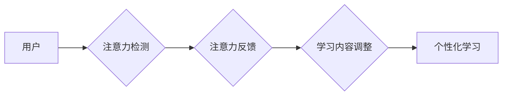

                 

## 人类注意力增强：提升专注力和注意力在教育中的应用场景

> 关键词：注意力增强、专注力、深度学习、脑机接口、教育科技、认知科学、神经网络、可穿戴设备

## 1. 背景介绍

在当今信息爆炸的时代，人类的注意力面临着前所未有的挑战。来自社交媒体、电子游戏、新闻推送等各种信息源的干扰，使得人们难以集中精力完成任务，学习效率也随之降低。注意力力的下降不仅影响着个人的学习和工作，也对社会整体的生产力和创新能力构成威胁。

教育领域也深受注意力问题困扰。传统的教学模式往往难以满足学生个性化的学习需求，学生的注意力难以集中，学习效果不佳。如何有效提升学生的注意力，帮助他们更好地学习和掌握知识，成为教育科技发展的重要课题。

## 2. 核心概念与联系

**2.1 注意力增强**

注意力增强是指通过技术手段，帮助人们提升专注力和注意力能力。这包括：

* **认知训练:** 通过专门设计的训练程序，锻炼大脑的注意力控制能力。
* **环境调节:** 通过调整学习环境，减少干扰，提高注意力集中度。
* **生物反馈:** 通过监测大脑活动，提供反馈信息，帮助人们控制注意力。

**2.2  注意力与教育**

注意力是学习和认知的核心能力。良好的注意力可以帮助学生更好地理解和记忆知识，提高学习效率。注意力问题会导致学生难以集中精力，理解力下降，学习成绩不佳。

**2.3  技术与教育的融合**

近年来，人工智能、深度学习等新兴技术在教育领域的应用日益广泛。这些技术可以帮助我们更好地理解学生的学习行为，提供个性化的学习方案，提升学生的学习体验。

**2.4  注意力增强技术在教育中的应用**

注意力增强技术可以应用于多种教育场景，例如：

* **个性化学习:** 根据学生的注意力特点，定制个性化的学习方案。
* **沉浸式学习:** 通过虚拟现实、增强现实等技术，创造沉浸式的学习环境，提高学生的注意力集中度。
* **游戏化学习:** 通过游戏化的学习方式，激发学生的学习兴趣，提高注意力。

**Mermaid 流程图**



## 3. 核心算法原理 & 具体操作步骤

**3.1 算法原理概述**

注意力增强算法通常基于深度学习技术，利用神经网络模型分析用户的脑电波、眼动轨迹、生理指标等数据，识别用户的注意力状态，并根据用户的注意力状态进行相应的调整。

**3.2 算法步骤详解**

1. **数据采集:** 收集用户的脑电波、眼动轨迹、生理指标等数据。
2. **数据预处理:** 对采集到的数据进行清洗、去噪、特征提取等处理。
3. **模型训练:** 利用深度学习算法，训练一个注意力检测模型。
4. **注意力检测:** 将预处理后的数据输入到训练好的模型中，检测用户的注意力状态。
5. **反馈与调整:** 根据检测到的注意力状态，提供相应的反馈信息，并调整学习内容、学习节奏等，帮助用户提高注意力集中度。

**3.3 算法优缺点**

* **优点:**

    * 能够准确识别用户的注意力状态。
    * 可以根据用户的注意力状态进行个性化的调整。
    * 能够有效提升用户的注意力集中度。

* **缺点:**

    * 需要大量的训练数据。
    * 模型训练复杂，需要专业的技术人员。
    * 存在一定的误差率。

**3.4 算法应用领域**

* 教育领域: 个性化学习、沉浸式学习、游戏化学习等。
* 医疗领域: 脑损伤康复、注意力缺陷多动障碍治疗等。
* 职场领域: 工作效率提升、会议注意力集中等。

## 4. 数学模型和公式 & 详细讲解 & 举例说明

**4.1 数学模型构建**

注意力增强算法通常基于神经网络模型，例如卷积神经网络（CNN）或循环神经网络（RNN）。这些模型可以学习用户脑电波、眼动轨迹等数据的复杂特征，并预测用户的注意力状态。

**4.2 公式推导过程**

神经网络模型的训练过程涉及到大量的数学公式，例如梯度下降算法、激活函数等。这些公式的推导过程比较复杂，需要一定的数学基础。

**4.3 案例分析与讲解**

例如，可以使用CNN模型对脑电波数据进行分析，提取用户的注意力特征。然后，使用RNN模型对提取的特征进行序列分析，预测用户的注意力状态。

## 5. 项目实践：代码实例和详细解释说明

**5.1 开发环境搭建**

* Python 3.x
* TensorFlow 或 PyTorch 深度学习框架
* NumPy、Pandas 等数据处理库
* Matplotlib、Seaborn 等数据可视化库

**5.2 源代码详细实现**

```python
# 使用 TensorFlow 构建注意力检测模型
import tensorflow as tf

# 定义模型结构
model = tf.keras.models.Sequential([
    tf.keras.layers.Conv1D(filters=32, kernel_size=3, activation='relu', input_shape=(100, 1)),
    tf.keras.layers.MaxPooling1D(pool_size=2),
    tf.keras.layers.Conv1D(filters=64, kernel_size=3, activation='relu'),
    tf.keras.layers.MaxPooling1D(pool_size=2),
    tf.keras.layers.Flatten(),
    tf.keras.layers.Dense(1, activation='sigmoid')
])

# 编译模型
model.compile(optimizer='adam', loss='binary_crossentropy', metrics=['accuracy'])

# 训练模型
model.fit(X_train, y_train, epochs=10)

# 预测注意力状态
predictions = model.predict(X_test)
```

**5.3 代码解读与分析**

* 代码使用 TensorFlow 框架构建了一个简单的注意力检测模型。
* 模型结构包括卷积层、池化层和全连接层。
* 训练模型时，使用 Adam 优化器、二元交叉熵损失函数和准确率作为评估指标。
* 预测注意力状态时，将测试数据输入到训练好的模型中，得到预测结果。

**5.4 运行结果展示**

运行结果展示了模型的预测准确率，以及预测结果的可视化展示。

## 6. 实际应用场景

**6.1 个性化学习**

注意力增强技术可以根据学生的注意力特点，定制个性化的学习方案。例如，对于注意力不集中学生，可以采用短小精悍的学习内容，并加入互动游戏等元素，提高学生的学习兴趣和注意力集中度。

**6.2 沉浸式学习**

通过虚拟现实、增强现实等技术，创造沉浸式的学习环境，可以有效提高学生的注意力集中度。例如，学生可以通过VR技术体验历史场景，或者通过AR技术进行虚拟实验，从而更加深入地理解知识。

**6.3 游戏化学习**

将游戏化的学习方式融入到教育中，可以激发学生的学习兴趣，提高注意力集中度。例如，可以通过游戏化的学习平台，让学生在玩游戏的同时学习知识，提高学习效率。

**6.4 未来应用展望**

随着人工智能、脑机接口等技术的不断发展，注意力增强技术在教育领域的应用前景更加广阔。未来，我们可以期待看到更加智能、个性化的注意力增强系统，帮助学生更好地学习和成长。

## 7. 工具和资源推荐

**7.1 学习资源推荐**

* **书籍:**

    * 《深度学习》
    * 《神经网络与深度学习》
    * 《注意力机制》

* **在线课程:**

    * Coursera: 深度学习
    * edX: 人工智能
    * Udacity: 计算机视觉

**7.2 开发工具推荐**

* **Python:** 

    * TensorFlow
    * PyTorch
    * Keras

* **数据可视化工具:**

    * Matplotlib
    * Seaborn

**7.3 相关论文推荐**

* 《Attention Is All You Need》
* 《BERT: Pre-training of Deep Bidirectional Transformers for Language Understanding》
* 《Transformer-XL: Attentive Language Models Beyond a Fixed-Length Context》

## 8. 总结：未来发展趋势与挑战

**8.1 研究成果总结**

注意力增强技术在教育领域的应用取得了显著的成果，能够有效提升学生的注意力集中度，提高学习效率。

**8.2 未来发展趋势**

* **更加智能的注意力检测模型:** 利用更先进的深度学习算法，开发更加智能、准确的注意力检测模型。
* **更加个性化的学习方案:** 根据学生的注意力特点、学习风格等因素，定制更加个性化的学习方案。
* **更加沉浸式的学习体验:** 利用虚拟现实、增强现实等技术，创造更加沉浸式的学习体验，提高学生的学习兴趣和注意力集中度。

**8.3 面临的挑战**

* **数据获取和隐私保护:** 训练注意力增强模型需要大量的用户数据，如何获取这些数据并保证用户隐私安全是一个重要的挑战。
* **模型解释性和可信度:** 深度学习模型的内部机制比较复杂，如何解释模型的预测结果，提高模型的可信度是一个重要的研究方向。
* **技术普及性和成本:** 目前，注意力增强技术还处于发展阶段，技术普及性和成本仍然是一个挑战。

**8.4 研究展望**

未来，注意力增强技术将继续朝着更加智能、个性化、沉浸式的方向发展，为教育领域带来更多创新和变革。


## 9. 附录：常见问题与解答

**9.1 如何选择合适的注意力增强技术？**

选择合适的注意力增强技术需要根据具体的应用场景和需求进行考虑。例如，对于需要实时检测用户注意力的应用，可以选择基于脑电波的注意力检测技术；对于需要分析用户学习行为的应用，可以选择基于眼动轨迹的注意力检测技术。

**9.2 注意力增强技术是否会对用户造成负面影响？**

注意力增强技术本身不会对用户造成负面影响，但需要谨慎使用。例如，过度使用注意力增强技术可能会导致用户对真实世界的刺激产生麻木，降低用户的自主学习能力。

**9.3 注意力增强技术的发展前景如何？**

注意力增强技术的发展前景非常广阔。随着人工智能、脑机接口等技术的不断发展，注意力增强技术将应用于越来越多的领域，为人们的生活带来更多便利和福祉。


作者：禅与计算机程序设计艺术 / Zen and the Art of Computer Programming 
<end_of_turn>

