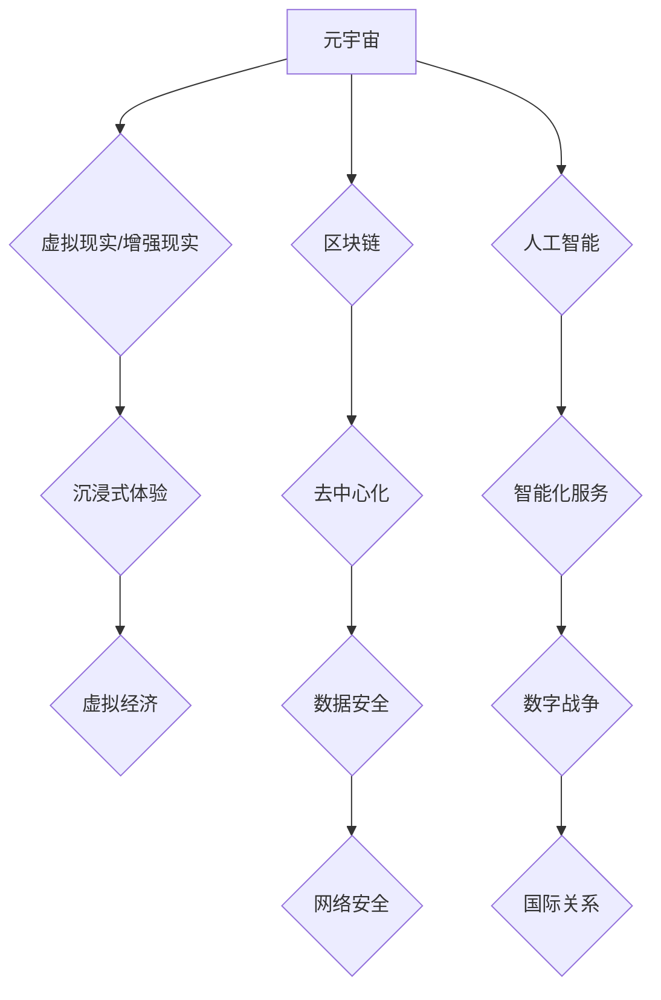

                 

## 元宇宙军备竞赛:数字化战争中的国际关系新态势

> 关键词：元宇宙、军备竞赛、国际关系、数字战争、虚拟现实、人工智能、网络安全、数据vereignty

## 1. 背景介绍

21世纪，科技发展日新月异，互联网已深入人们生活的方方面面。元宇宙概念的提出，将虚拟现实、增强现实、区块链、人工智能等前沿技术融合在一起，构建一个沉浸式、交互式的虚拟世界。元宇宙的出现，不仅为人们提供了全新的娱乐、社交、工作方式，也为国家安全、国际竞争带来了新的挑战。

当前，世界各国都在积极布局元宇宙，争夺在虚拟世界中的主导地位。这引发了“元宇宙军备竞赛”的担忧，即各国在元宇宙领域进行技术竞争、资源争夺，甚至可能演变成新的军事冲突。

## 2. 核心概念与联系

### 2.1 元宇宙

元宇宙是一个由虚拟现实、增强现实、区块链、人工智能等技术构建的沉浸式、交互式的虚拟世界。它拥有以下核心特征：

* **沉浸式体验:**  用户可以通过VR/AR设备进入元宇宙，体验身临其境的虚拟环境。
* **持久性:** 元宇宙是一个永不关闭的虚拟世界，用户可以随时随地进入，并保留其虚拟资产和身份。
* **去中心化:** 元宇宙由多个节点组成，没有单一控制中心，用户拥有更大的自主权。
* **经济系统:** 元宇宙拥有自己的虚拟经济体系，用户可以通过交易虚拟资产获得收益。

### 2.2 数字战争

数字战争是指在网络空间、虚拟空间等领域进行的军事行动。它利用网络攻击、信息战、网络间谍活动等手段，对敌方进行破坏、瘫痪、控制等行动。

### 2.3 元宇宙军备竞赛

元宇宙军备竞赛是指各国在元宇宙领域进行技术竞争、资源争夺，甚至可能演变成新的军事冲突。

**元宇宙与数字战争的联系:**

元宇宙为数字战争提供了新的平台和手段。

* **虚拟战场:** 元宇宙可以作为虚拟战场，进行模拟训练、演习，甚至进行真实的军事行动。
* **网络攻击:** 元宇宙的网络基础设施也可能成为网络攻击的目标，攻击者可以利用漏洞窃取数据、瘫痪系统。
* **信息战:** 元宇宙可以成为信息战的战场，攻击者可以传播虚假信息、煽动情绪，影响舆论。

**元宇宙军备竞赛的潜在风险:**

* **技术失衡:** 实力差距导致技术落后，可能被其他国家利用。
* **安全漏洞:** 元宇宙的安全性存在漏洞，可能被攻击者利用进行恶意活动。
* **国际冲突:** 元宇宙军备竞赛可能引发新的国际冲突，甚至可能演变成现实世界的战争。

**Mermaid 流程图:**



## 3. 核心算法原理 & 具体操作步骤

### 3.1 算法原理概述

元宇宙军备竞赛涉及到多种核心算法，例如：

* **虚拟环境渲染算法:** 用于构建逼真的虚拟环境，包括3D建模、纹理映射、光照计算等。
* **人工智能算法:** 用于模拟虚拟角色的行为、决策，以及进行智能化服务。
* **网络安全算法:** 用于保护元宇宙的网络基础设施，防止攻击和数据泄露。

### 3.2 算法步骤详解

以虚拟环境渲染算法为例，其具体操作步骤如下：

1. **3D建模:** 使用3D建模软件创建虚拟场景的模型，包括建筑、地形、人物等。
2. **纹理映射:** 为模型添加纹理，使其更加逼真。
3. **光照计算:** 计算光线在虚拟场景中的传播路径，模拟光影效果。
4. **渲染:** 将3D模型、纹理和光照信息组合在一起，生成最终的图像。

### 3.3 算法优缺点

**优点:**

* **沉浸式体验:** 能够构建逼真的虚拟环境，为用户提供身临其境的体验。
* **交互性强:** 用户可以与虚拟环境进行交互，例如移动、操作物体、与虚拟角色对话等。
* **可扩展性强:** 可以根据需要添加新的内容和功能。

**缺点:**

* **计算资源消耗大:** 渲染逼真的虚拟环境需要大量的计算资源。
* **技术门槛高:** 需要专业的3D建模、纹理映射、光照计算等技术。
* **硬件限制:** 需要配备高性能的VR/AR设备才能体验到最佳效果。

### 3.4 算法应用领域

* **游戏:** 构建沉浸式的游戏世界。
* **教育:** 提供虚拟的学习环境，例如模拟实验室、历史场景等。
* **医疗:** 进行虚拟手术模拟、远程医疗等。
* **设计:** 进行虚拟产品设计、建筑模型展示等。

## 4. 数学模型和公式 & 详细讲解 & 举例说明

### 4.1 数学模型构建

元宇宙军备竞赛可以抽象为一个博弈模型，其中参与者是各国，目标是获取在元宇宙中的优势地位。

**博弈模型:**

* **参与者:** 国家A、国家B
* **策略:** 国家A可以选择投入元宇宙技术研发，或者不投入；国家B可以选择投入元宇宙技术研发，或者不投入。
* **收益:** 每个国家根据其投入策略和对手的策略获得收益。

**收益矩阵:**

|             | 国家B投入 | 国家B不投入 |
|-------------|------------|--------------|
| 国家A投入 | (a, a)      | (b, c)        |
| 国家A不投入 | (c, b)      | (d, d)        |

其中，a、b、c、d代表不同策略组合下的收益值。

### 4.2 公式推导过程

根据博弈模型和收益矩阵，可以推导国家A和国家B的最佳策略。

**Nash均衡:**

Nash均衡是指在博弈中，每个参与者都选择其最优策略，并且没有参与者可以单方面改变策略而获得更高的收益。

**最佳策略:**

* 如果a > b，则国家A选择投入元宇宙技术研发。
* 如果a < b，则国家A选择不投入元宇宙技术研发。

### 4.3 案例分析与讲解

假设国家A和国家B都投入元宇宙技术研发，收益矩阵如下：

|             | 国家B投入 | 国家B不投入 |
|-------------|------------|--------------|
| 国家A投入 | (5, 5)      | (2, 8)        |
| 国家A不投入 | (8, 2)      | (3, 3)        |

在这种情况下，(5, 5)是Nash均衡，因为无论国家A或国家B选择什么策略，他们都无法通过单方面改变策略而获得更高的收益。

## 5. 项目实践：代码实例和详细解释说明

### 5.1 开发环境搭建

* 操作系统: Ubuntu 20.04
* 编程语言: Python 3.8
* 开发工具: PyCharm

### 5.2 源代码详细实现

```python
# 虚拟环境渲染算法示例代码

import numpy as np
from PIL import Image

def render_scene(scene):
    # 渲染场景
    # ...
    return image

# 场景数据结构
class Scene:
    def __init__(self):
        # 初始化场景数据
        # ...

# 创建场景
scene = Scene()

# 渲染场景
image = render_scene(scene)

# 显示图像
image.show()
```

### 5.3 代码解读与分析

* `render_scene()`函数负责渲染场景，并返回渲染结果的图像。
* `Scene`类定义了场景数据结构，包括模型、纹理、光照等信息。
* 代码示例展示了如何创建场景对象，并调用`render_scene()`函数渲染场景。

### 5.4 运行结果展示

运行代码后，将显示一个渲染的虚拟场景图像。

## 6. 实际应用场景

### 6.1 军事训练

元宇宙可以用于模拟各种军事场景，例如城市战、丛林战、海战等，进行虚拟训练和演习。

### 6.2 信息战

元宇宙可以作为信息战的平台，进行虚假信息传播、舆论引导等活动。

### 6.3 网络安全

元宇宙的网络基础设施需要加强安全防护，防止攻击和数据泄露。

### 6.4 未来应用展望

* **虚拟外交:** 元宇宙可以作为虚拟外交平台，促进各国之间的沟通和合作。
* **虚拟经济:** 元宇宙可以发展虚拟经济，创造新的商业模式和就业机会。
* **虚拟文化:** 元宇宙可以丰富虚拟文化，促进文化交流和融合。

## 7. 工具和资源推荐

### 7.1 学习资源推荐

* **书籍:**
    * 《元宇宙：虚拟世界的新纪元》
    * 《元宇宙技术与应用》
* **在线课程:**
    * Coursera: 元宇宙技术
    * edX: 元宇宙与未来

### 7.2 开发工具推荐

* **Unity:** 游戏引擎，用于构建虚拟环境。
* **Unreal Engine:** 游戏引擎，用于构建虚拟环境。
* **Blender:** 3D建模软件，用于创建虚拟场景模型。

### 7.3 相关论文推荐

* **The Metaverse: A New Era of Virtual Worlds**
* **The Metaverse and the Future of Work**
* **The Metaverse and the Future of Education**

## 8. 总结：未来发展趋势与挑战

### 8.1 研究成果总结

元宇宙军备竞赛是一个新兴的领域，涉及到多个学科的交叉融合。研究成果表明，元宇宙技术发展迅速，并对国际关系、国家安全、军事战略等方面产生了重大影响。

### 8.2 未来发展趋势

* **技术进步:** 元宇宙技术将继续发展，例如虚拟现实、增强现实、人工智能等技术将更加成熟和完善。
* **应用拓展:** 元宇宙的应用领域将不断拓展，例如军事训练、信息战、网络安全等领域将更加广泛地应用元宇宙技术。
* **国际合作:** 各国将加强元宇宙领域的合作，共同制定元宇宙发展规范和规则。

### 8.3 面临的挑战

* **技术安全:** 元宇宙技术存在安全漏洞，需要加强安全防护，防止攻击和数据泄露。
* **伦理问题:** 元宇宙的发展可能引发伦理问题，例如虚拟身份、虚拟财产、虚拟战争等问题需要得到解决。
* **国际合作:** 元宇宙军备竞赛可能加剧国际紧张局势，需要加强国际合作，避免冲突升级。

### 8.4 研究展望

未来，元宇宙军备竞赛的研究将更加深入，包括：

* **元宇宙博弈模型:** 建立更加完善的元宇宙博弈模型，预测元宇宙军备竞赛的发展趋势。
* **元宇宙安全技术:** 研究元宇宙安全技术，防止攻击和数据泄露。
* **元宇宙伦理规范:** 制定元宇宙伦理规范，引导元宇宙的健康发展。

## 9. 附录：常见问题与解答

**Q1: 元宇宙军备竞赛会引发新的战争吗？**

A1: 元宇宙军备竞赛可能会加剧国际紧张局势，但并不能直接导致新的战争。战争的发生需要多种因素的共同作用，元宇宙只是其中一个因素。

**Q2: 如何应对元宇宙军备竞赛带来的风险？**

A2: 应对元宇宙军备竞赛带来的风险需要多方面努力，包括：

* 加强国际合作，共同制定元宇宙发展规范和规则。
* 加强元宇宙安全技术研究，防止攻击和数据泄露。
* 制定元宇宙伦理规范，引导元宇宙的健康发展。

**Q3: 元宇宙军备竞赛对普通人有什么影响？**

A3: 元宇宙军备竞赛可能会影响到普通人的生活，例如：

* 可能会导致元宇宙服务价格上涨。
* 可能会导致元宇宙平台更加封闭，用户隐私受到侵犯。
* 可能会导致元宇宙环境更加不安全，用户更容易受到攻击。


作者：禅与计算机程序设计艺术 / Zen and the Art of Computer Programming 
<end_of_turn>

