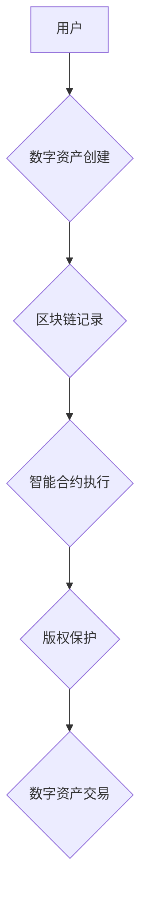

                 

## 元宇宙版权保护:数字版权的智能管理

> 关键词：元宇宙、版权保护、数字资产、区块链、智能合约、NFT、去中心化身份、数据隐私

## 1. 背景介绍

元宇宙概念的兴起，为数字世界带来了前所未有的机遇和挑战。虚拟世界中的数字资产，包括虚拟物品、数字艺术、游戏角色等，日益成为人们关注的焦点。然而，元宇宙的开放性和去中心化特性也为数字版权保护带来了新的难题。传统版权保护机制在元宇宙环境下难以有效实施，需要探索新的技术手段和模式来保障数字资产的合法权益。

元宇宙的本质是构建一个虚拟世界，用户可以在其中创造、分享和交易数字资产。这些数字资产具有独特的属性，例如可拥有性、可交易性和可组合性。然而，由于元宇宙的去中心化特性，数字资产的来源、所有权和使用权难以追踪和管理，这使得数字版权保护面临着前所未有的挑战。

## 2. 核心概念与联系

**2.1 元宇宙与数字版权**

元宇宙是一个由虚拟现实、增强现实和互联网技术融合而成的沉浸式数字世界。在这个世界中，用户可以创建、拥有和交易数字资产，例如虚拟物品、数字艺术、游戏角色等。数字版权是指对这些数字资产的合法权益，包括著作权、专利权和商标权等。

**2.2 数字版权保护的挑战**

元宇宙的去中心化特性使得数字版权保护面临着以下挑战：

* **资产来源难以追踪:** 元宇宙中的数字资产通常由用户自主创建，其来源难以追踪和验证。
* **所有权难以确定:** 元宇宙中的数字资产可以被复制和传播，因此确定其所有权变得更加复杂。
* **使用权难以管理:** 元宇宙中的数字资产可以被用户以各种方式使用，例如交易、租赁和授权，这使得管理其使用权变得更加困难。

**2.3 技术解决方案**

为了解决元宇宙中的数字版权保护问题，需要采用新的技术解决方案，例如：

* **区块链技术:** 区块链可以用于记录和追踪数字资产的来源、所有权和使用权，确保其不可篡改和透明。
* **智能合约:** 智能合约可以自动执行版权协议，例如授权使用、支付版权费用等，减少人为干预和争议。
* **NFT (不可替代代币):** NFT 可以用于表示数字资产的唯一所有权，并将其与区块链上的记录绑定，确保其不可复制和不可伪造。

**2.4 架构图**



## 3. 核心算法原理 & 具体操作步骤

**3.1 算法原理概述**

元宇宙版权保护的核心算法原理是基于区块链技术的去中心化数据存储和管理，结合智能合约的自动执行功能，实现对数字资产的完整生命周期管理。

**3.2 算法步骤详解**

1. **数字资产注册:** 用户将数字资产上传到元宇宙平台，并通过智能合约将其与区块链上的唯一标识符绑定。
2. **版权信息记录:** 用户在注册过程中需提供版权信息，例如作者、创作时间、版权类型等，这些信息将被记录在区块链上。
3. **智能合约执行:** 当用户进行数字资产交易或使用时，智能合约会自动执行相应的协议，例如支付版权费用、授权使用权等。
4. **数据溯源:** 任何人都可以通过区块链上的记录查询数字资产的来源、所有权和使用权等信息，确保其合法性和可信度。

**3.3 算法优缺点**

**优点:**

* **去中心化:** 数据存储和管理在多个节点上进行，避免单点故障和数据篡改风险。
* **透明度:** 所有交易和操作记录都存储在区块链上，公开透明，可供任何人查询。
* **安全性:** 区块链技术的加密算法确保数据安全性和不可篡改性。

**缺点:**

* **技术复杂性:** 实现元宇宙版权保护需要对区块链技术、智能合约等技术有深入了解。
* **成本高昂:** 区块链交易需要支付手续费，这可能会增加数字资产交易成本。
* **法律法规不完善:** 目前针对元宇宙数字版权保护的法律法规尚不完善，需要进一步完善和规范。

**3.4 算法应用领域**

* **数字艺术:** 保护数字艺术作品的版权，防止盗版和侵权。
* **游戏虚拟物品:** 保护游戏虚拟物品的合法所有权和交易权。
* **虚拟地产:** 保护虚拟地产的产权和使用权。
* **元宇宙内容创作:** 保护元宇宙内容创作者的版权和收益。

## 4. 数学模型和公式 & 详细讲解 & 举例说明

**4.1 数学模型构建**

元宇宙版权保护的数学模型可以基于图论和概率论构建。

* **图论:** 可以用图来表示元宇宙中的数字资产和用户之间的关系，其中节点代表数字资产或用户，边代表资产所有权、使用权或交易关系。
* **概率论:** 可以用概率论来评估数字资产被盗版或侵权的风险，并根据风险等级制定相应的保护措施。

**4.2 公式推导过程**

* **资产所有权概率:**  假设一个数字资产被创建后，其被盗版或侵权的概率为p，则其合法所有权的概率为(1-p)。

* **交易风险评估:**  可以根据用户历史交易记录、资产价值等因素，计算用户进行数字资产交易的风险等级。

**4.3 案例分析与讲解**

假设一个数字艺术家在元宇宙平台上创作了一幅数字艺术作品，并将其注册到区块链上。

* **图论分析:**  可以构建一个图，其中节点代表艺术家、作品、交易平台等，边代表所有权、交易等关系。
* **概率论分析:**  根据艺术家作品的价值、知名度等因素，可以评估作品被盗版或侵权的概率。

## 5. 项目实践：代码实例和详细解释说明

**5.1 开发环境搭建**

* **编程语言:** Solidity (用于开发智能合约)
* **区块链平台:** Ethereum (以太坊)
* **开发工具:** Remix IDE (智能合约开发环境)

**5.2 源代码详细实现**

```solidity
pragma solidity ^0.8.0;

contract DigitalAsset {
    address public owner;
    string public name;
    string public description;

    constructor(string memory _name, string memory _description) {
        owner = msg.sender;
        name = _name;
        description = _description;
    }

    function transferOwnership(address newOwner) public {
        require(msg.sender == owner, "Only the owner can transfer ownership");
        owner = newOwner;
    }
}
```

**5.3 代码解读与分析**

* **pragma solidity ^0.8.0;:** 指定合约使用的 Solidity 版本。
* **contract DigitalAsset { ... }:** 定义一个名为 DigitalAsset 的智能合约。
* **address public owner;:** 定义一个存储合约所有者的地址变量。
* **string public name;:** 定义一个存储合约名称的字符串变量。
* **string public description;:** 定义一个存储合约描述的字符串变量。
* **constructor(string memory _name, string memory _description) { ... }:** 合约构造函数，用于初始化合约名称和描述。
* **function transferOwnership(address newOwner) public { ... }:** 定义一个函数，用于转移合约所有权。

**5.4 运行结果展示**

部署合约后，可以调用合约函数进行操作，例如设置合约名称、描述、转移所有权等。

## 6. 实际应用场景

**6.1 数字艺术作品保护:**

艺术家可以通过智能合约将数字艺术作品的版权信息绑定到区块链上，确保其作品的唯一性和合法性。

**6.2 游戏虚拟物品交易:**

游戏玩家可以通过NFT来拥有和交易游戏虚拟物品，并通过智能合约来管理物品的交易和使用权。

**6.3 元宇宙虚拟地产租赁:**

元宇宙平台可以利用智能合约来管理虚拟地产的租赁和使用权，确保租金支付和使用规则的执行。

**6.4 未来应用展望:**

随着元宇宙的发展，数字版权保护将变得越来越重要。未来，我们可以期待看到更多基于区块链技术的数字版权保护解决方案，例如：

* **去中心化版权管理平台:** 用户可以自主管理自己的数字资产版权，并与其他用户进行版权交易。
* **数字版权认证系统:** 利用区块链技术来验证数字资产的版权信息，防止盗版和侵权。
* **元宇宙版权法規完善:** 政府和行业组织将制定更加完善的法律法规，规范元宇宙中的数字版权保护。

## 7. 工具和资源推荐

**7.1 学习资源推荐:**

* **区块链技术入门书籍:** 《区块链：颠覆世界的分布式账本技术》
* **智能合约开发教程:** Solidity 官方文档
* **元宇宙相关研究论文:** arXiv.org

**7.2 开发工具推荐:**

* **Remix IDE:** 智能合约开发环境
* **Truffle Suite:** 智能合约测试和部署工具
* **MetaMask:** 以太坊钱包

**7.3 相关论文推荐:**

* **"Blockchain for Copyright Management in the Metaverse"**
* **"NFTs and the Future of Digital Ownership"**
* **"Decentralized Identity and Data Privacy in the Metaverse"**

## 8. 总结：未来发展趋势与挑战

**8.1 研究成果总结:**

元宇宙版权保护是一个新兴领域，目前已经取得了一些成果，例如基于区块链技术的数字资产管理和智能合约的版权协议执行。

**8.2 未来发展趋势:**

未来，元宇宙版权保护将朝着以下方向发展:

* **更加完善的法律法规:** 政府和行业组织将制定更加完善的法律法规，规范元宇宙中的数字版权保护。
* **更强大的技术解决方案:** 研究人员将开发更加强大的技术解决方案，例如去中心化版权管理平台和数字版权认证系统。
* **更广泛的应用场景:** 元宇宙版权保护将应用于越来越广泛的场景，例如数字艺术、游戏、虚拟地产等。

**8.3 面临的挑战:**

元宇宙版权保护仍然面临一些挑战:

* **技术复杂性:** 实现元宇宙版权保护需要对区块链技术、智能合约等技术有深入了解。
* **成本高昂:** 区块链交易需要支付手续费，这可能会增加数字资产交易成本。
* **法律法规不完善:** 目前针对元宇宙数字版权保护的法律法规尚不完善，需要进一步完善和规范。

**8.4 研究展望:**

未来，我们需要继续深入研究元宇宙版权保护的理论和实践，探索更加有效的技术解决方案，并推动相关法律法规的完善，为元宇宙的健康发展提供保障。

## 9. 附录：常见问题与解答

**9.1 如何保护我的数字艺术作品在元宇宙中的版权?**

您可以通过将您的数字艺术作品注册到区块链上，并使用智能合约来管理其版权信息，例如授权使用、支付版权费用等。

**9.2 如何在元宇宙中交易虚拟物品?**

您可以使用NFT来拥有和交易虚拟物品，并通过智能合约来管理物品的交易和使用权。

**9.3 元宇宙中的数字版权保护是否安全可靠?**

元宇宙中的数字版权保护基于区块链技术的去中心化存储和管理，具有较高的安全性，但仍需谨慎操作，并注意保护自己的私钥和账户安全。


作者：禅与计算机程序设计艺术 / Zen and the Art of Computer Programming 
<end_of_turn>

