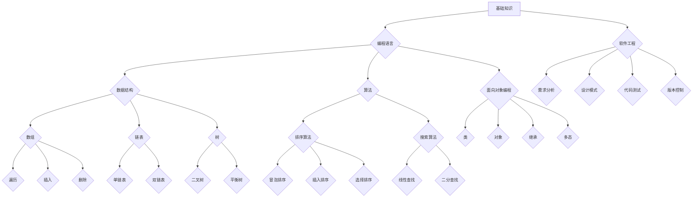

                 

## 如何打造高完成率的程序员知识课程

> 关键词：程序员培训、知识课程、学习效果、实践项目、教学方法、编程技能、职业发展

### 1. 背景介绍

在当今科技飞速发展的时代，程序员的需求量持续增长，而高质量的程序员人才却显得愈发稀缺。传统的程序员培训模式往往存在着理论与实践脱节、学习效果不佳、知识沉淀不足等问题，难以满足行业对程序员人才的快速发展需求。因此，打造高完成率的程序员知识课程，成为提升程序员技能水平、促进行业发展的重要课题。

### 2. 核心概念与联系

**2.1 课程设计理念**

高完成率的程序员知识课程应遵循以下核心设计理念：

* **以实践为导向:** 课程内容应紧密结合实际项目需求，注重实践操作，让学员在动手实践中学习和掌握编程技能。
* **循序渐进:** 课程内容应按照一定的逻辑顺序和难度递增的原则设计，从基础知识到高级技术，逐步深入，帮助学员建立扎实的编程基础。
* **知识沉淀:** 课程应注重知识的系统化和沉淀，通过案例分析、代码解读等方式，帮助学员理解编程背后的原理和逻辑，形成自己的知识体系。
* **个性化定制:** 课程应根据学员的学习进度、兴趣和职业目标进行个性化定制，提供多元化的学习路径和资源，满足不同学员的需求。

**2.2 课程架构**

高完成率的程序员知识课程通常包含以下几个模块：



* **基础知识:** 包括计算机组成原理、操作系统、网络基础等，为学习编程语言打下基础。
* **编程语言:** 讲解一门或多门主流编程语言的语法、语义和应用，例如Python、Java、C++等。
* **数据结构:** 介绍常用的数据结构，例如数组、链表、树等，以及它们各自的优缺点和应用场景。
* **算法:** 讲解常用的算法，例如排序算法、搜索算法等，以及它们的时间复杂度和空间复杂度分析。
* **面向对象编程:** 介绍面向对象编程的思想和概念，例如类、对象、继承、多态等，以及它们在软件开发中的应用。
* **软件工程:** 讲解软件开发的各个阶段，例如需求分析、设计、编码、测试、部署等，以及软件开发的最佳实践。

### 3. 核心算法原理 & 具体操作步骤

**3.1 算法原理概述**

算法是解决特定问题的一系列步骤或规则，是计算机程序的核心。高效的算法可以显著提高程序的运行速度和资源利用率。常见的算法包括排序算法、搜索算法、图算法等。

**3.2 算法步骤详解**

以冒泡排序为例，详细讲解其算法步骤：

1. 比较相邻的两个元素，如果顺序错误，则交换它们的位置。
2. 重复步骤1，直到整个数组排序完成。

**3.3 算法优缺点**

冒泡排序是一种简单易懂的排序算法，但其时间复杂度较高，在处理大量数据时效率较低。

**3.4 算法应用领域**

冒泡排序常用于教育场景，帮助理解排序算法的基本原理。

### 4. 数学模型和公式 & 详细讲解 & 举例说明

**4.1 数学模型构建**

算法的时间复杂度可以用数学模型来表示，例如冒泡排序的时间复杂度为O(n^2)，其中n为数组长度。

**4.2 公式推导过程**

时间复杂度表示算法运行时间随输入数据规模变化的趋势。冒泡排序的每个元素都需要与其他元素进行比较，因此其时间复杂度为O(n^2)。

**4.3 案例分析与讲解**

当数组长度为10时，冒泡排序需要进行约100次比较，当数组长度为100时，需要进行约10000次比较。可见，随着数组长度的增加，冒泡排序的运行时间呈指数级增长。

### 5. 项目实践：代码实例和详细解释说明

**5.1 开发环境搭建**

使用Python语言为例，需要安装Python解释器和相关库。

**5.2 源代码详细实现**

```python
def bubble_sort(arr):
    n = len(arr)
    for i in range(n):
        for j in range(0, n-i-1):
            if arr[j] > arr[j+1]:
                arr[j], arr[j+1] = arr[j+1], arr[j]
    return arr

# 测试代码
arr = [64, 34, 25, 12, 22, 11, 90]
sorted_arr = bubble_sort(arr)
print("排序后的数组:", sorted_arr)
```

**5.3 代码解读与分析**

代码实现了一个冒泡排序算法，其核心逻辑是通过两层循环比较相邻元素，并将它们交换位置，直到整个数组排序完成。

**5.4 运行结果展示**

运行代码后，输出结果为：

```
排序后的数组: [11, 12, 22, 25, 34, 64, 90]
```

### 6. 实际应用场景

**6.1 数据排序**

冒泡排序可以用于对数据进行排序，例如对学生成绩进行升序或降序排序。

**6.2 数据分析**

在数据分析中，排序可以帮助快速查找特定数据或区间数据。

**6.3 游戏开发**

在游戏开发中，排序可以用于对游戏对象进行排序，例如根据距离玩家排序。

**6.4 未来应用展望**

随着人工智能和机器学习的发展，算法在各个领域的应用将更加广泛，例如推荐系统、图像识别、自然语言处理等。

### 7. 工具和资源推荐

**7.1 学习资源推荐**

* **在线课程:** Coursera、edX、Udemy等平台提供丰富的编程课程。
* **书籍:** 《编程之美》、《算法导论》等书籍是学习算法的经典教材。
* **网站:** GeeksforGeeks、LeetCode等网站提供算法练习题和学习资源。

**7.2 开发工具推荐**

* **集成开发环境 (IDE):** VS Code、Eclipse、IntelliJ IDEA等IDE提供代码编辑、调试、版本控制等功能。
* **版本控制系统 (VCS):** Git、GitHub等VCS帮助管理代码版本和协同开发。

**7.3 相关论文推荐**

* **算法导论:** Thomas H. Cormen, Charles E. Leiserson, Ronald L. Rivest, Clifford Stein
* **编程之美:** Robert Sedgewick

### 8. 总结：未来发展趋势与挑战

**8.1 研究成果总结**

高完成率的程序员知识课程已取得显著成果，例如提高了学员的编程技能水平、提升了就业竞争力、促进了软件开发行业的发展。

**8.2 未来发展趋势**

未来，程序员知识课程将更加注重以下方面：

* **个性化定制:** 更加注重学员的个性化需求，提供更加定制化的学习路径和资源。
* **人工智能技术:** 利用人工智能技术，例如智能推荐、个性化辅导等，提升课程的学习效果。
* **虚拟现实 (VR) 和增强现实 (AR):** 利用VR和AR技术，打造更加沉浸式的学习体验。

**8.3 面临的挑战**

高完成率的程序员知识课程也面临着一些挑战：

* **课程内容更新:** 随着科技发展，编程语言和技术不断更新，课程内容需要及时更新和迭代。
* **教学方法创新:** 需要不断探索新的教学方法，例如游戏化学习、项目驱动学习等，提升学员的学习兴趣和效果。
* **资源投入:** 开发高质量的程序员知识课程需要投入大量的资源，例如研发、教学、运营等。

**8.4 研究展望**

未来，我们将继续致力于打造高完成率的程序员知识课程，探索新的教学方法和技术，为程序员人才培养做出更大的贡献。

### 9. 附录：常见问题与解答

**9.1 如何选择适合自己的程序员知识课程？**

选择程序员知识课程时，应考虑以下因素：

* **学习目标:** 明确自己的学习目标，例如想学习哪种编程语言、掌握哪些技能等。
* **学习进度:** 选择适合自己学习进度和时间安排的课程。
* **课程内容:** 了解课程内容是否符合自己的需求，是否包含自己感兴趣的领域。
* **教学方式:** 选择自己喜欢的教学方式，例如视频课程、在线练习、项目实践等。

**9.2 如何提高学习编程的效率？**

提高学习编程效率的建议：

* **制定学习计划:** 制定合理的学习计划，并坚持执行。
* **动手实践:** 编程学习应注重实践操作，多动手写代码，解决实际问题。
* **寻求帮助:** 当遇到问题时，及时寻求帮助，例如向老师、同学、在线社区等寻求解答。
* **保持兴趣:** 保持学习编程的兴趣，不断探索新的知识和技术。


作者：禅与计算机程序设计艺术 / Zen and the Art of Computer Programming 
<end_of_turn>

