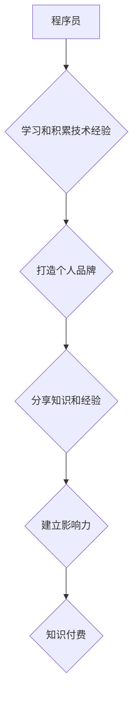

                 

## 如何打造高影响力的程序员知识付费个人品牌

> 关键词：程序员、知识付费、个人品牌、影响力、技术博客、内容创作、社区运营、线上课程、付费会员

### 1. 背景介绍

在当今数字化时代，技术人才需求日益增长，程序员作为科技发展的重要力量，拥有着巨大的职业发展潜力。然而，随着编程技术的不断发展和更新迭代，程序员需要不断学习和提升自身技能，才能保持竞争力。知识付费作为一种新型的教育模式，为程序员提供了便捷高效的学习途径。同时，随着互联网平台的普及，程序员可以通过打造个人品牌，分享自己的技术经验和见解，获得更大的影响力，并实现知识付费的商业化。

### 2. 核心概念与联系

**2.1 知识付费**

知识付费是指通过线上平台，将个人积累的知识、技能、经验等转化为付费产品或服务，并向用户提供学习和提升的机会。

**2.2 个人品牌**

个人品牌是指个人在特定领域或行业内建立的独特形象和声誉，它包含个人价值观、技能特长、专业领域、个人故事等多个方面。

**2.3 程序员个人品牌**

程序员个人品牌是指程序员在技术领域内建立的独特形象和声誉，它包含程序员的技术能力、项目经验、学习态度、沟通能力、个人风格等多个方面。

**2.4 影响力**

影响力是指个人在特定领域或群体中能够左右他人观点、行为和决策的能力。

**2.5 核心关系**

知识付费、个人品牌和影响力之间存在着相互促进的关系：

* **知识付费**可以帮助程序员建立个人品牌，通过分享知识和经验，提升个人知名度和专业度。
* **个人品牌**可以增强程序员的知识付费能力，拥有良好的个人品牌可以更容易地吸引用户，并获得更高的付费转化率。
* **影响力**可以提升知识付费的价值，拥有高影响力的程序员分享的知识和经验更具参考价值和指导意义，更容易获得用户的认可和付费。

**Mermaid 流程图**



### 3. 核心算法原理 & 具体操作步骤

**3.1 算法原理概述**

打造高影响力的程序员知识付费个人品牌，本质上是一个系统工程，需要结合多种算法和策略进行优化。

* **内容算法**: 

    * **用户需求分析**: 通过分析用户的学习需求、兴趣偏好和痛点，创作符合用户需求的优质内容。
    * **内容分发算法**: 利用平台的算法规则，将内容精准推送给目标用户，提高内容曝光率和用户粘性。
    * **内容推荐算法**: 根据用户的阅读历史、点赞记录和评论行为，推荐相关内容，引导用户持续学习和付费。

* **品牌算法**: 

    * **个人定位算法**: 确定自身的技术优势和个人特长，打造独特的个人品牌定位，吸引目标用户。
    * **内容风格算法**: 形成独特的个人风格和表达方式，增强内容的辨识度和吸引力。
    * **互动算法**: 积极参与社区讨论，回复用户评论，建立良好的用户关系，提升个人影响力。

* **商业算法**: 

    * **付费策略算法**: 根据用户付费意愿和市场需求，制定合理的付费策略，例如按课程、按会员、按小时等。
    * **推广算法**: 利用多种线上线下推广渠道，扩大个人品牌影响力，吸引更多用户付费。
    * **运营算法**: 持续优化内容、品牌和商业策略，提升用户体验和付费转化率。

**3.2 算法步骤详解**

1. **用户需求分析**: 通过调研、问卷调查、数据分析等方式，了解用户的学习需求、兴趣偏好和痛点。
2. **内容规划**: 根据用户需求分析结果，制定内容规划，确定内容主题、方向、形式和发布频率。
3. **内容创作**: 创作高质量、有价值、易于理解的内容，例如技术博客文章、视频教程、在线课程等。
4. **内容分发**: 利用平台的算法规则，将内容精准推送给目标用户，提高内容曝光率和用户粘性。
5. **品牌建设**: 确定个人品牌定位，打造独特的个人风格和表达方式，提升个人辨识度和影响力。
6. **社区运营**: 积极参与社区讨论，回复用户评论，建立良好的用户关系，提升个人影响力。
7. **付费策略制定**: 根据用户付费意愿和市场需求，制定合理的付费策略，例如按课程、按会员、按小时等。
8. **推广运营**: 利用多种线上线下推广渠道，扩大个人品牌影响力，吸引更多用户付费。
9. **数据分析与优化**: 持续分析用户数据，优化内容、品牌和商业策略，提升用户体验和付费转化率。

**3.3 算法优缺点**

* **优点**: 

    * **精准**: 通过算法分析用户需求，精准推送内容，提高用户体验。
    * **高效**: 自动化内容分发和推荐，提高运营效率。
    * **可持续**: 持续优化算法，不断提升用户体验和付费转化率。

* **缺点**: 

    * **依赖数据**: 算法需要大量数据支持，数据质量直接影响算法效果。
    * **算法黑箱**: 某些算法过于复杂，难以理解其运作机制，导致缺乏可解释性。
    * **伦理风险**: 算法可能存在偏见和歧视，需要谨慎设计和使用。

**3.4 算法应用领域**

* **内容推荐**: 推荐用户感兴趣的内容，例如新闻、视频、音乐等。
* **广告投放**: 根据用户兴趣和行为，精准投放广告，提高广告效果。
* **搜索引擎**: 根据用户搜索关键词，精准返回相关结果。
* **社交网络**: 推荐用户关注的人和内容，增强用户粘性。
* **电商平台**: 推荐用户可能感兴趣的商品，提高销售转化率。

### 4. 数学模型和公式 & 详细讲解 & 举例说明

**4.1 数学模型构建**

打造高影响力的程序员知识付费个人品牌，可以构建一个数学模型来衡量个人品牌的影响力和价值。

* **影响力模型**: 

    * **影响力 = 曝光度 * 参与度 * 信任度**

    * 曝光度: 指个人品牌在目标用户群体中的可见度，例如网站流量、社交媒体粉丝数等。
    * 参与度: 指用户与个人品牌互动程度，例如评论数量、点赞数、分享数等。
    * 信任度: 指用户对个人品牌的信任度，例如用户评价、口碑传播等。

* **价值模型**: 

    * **价值 = 影响力 * 内容价值 * 付费意愿**

    * 内容价值: 指个人品牌提供的知识和服务的价值，例如学习效果、实用性、独特性等。
    * 付费意愿: 指用户愿意为个人品牌提供的知识和服务支付的金额。

**4.2 公式推导过程**

影响力模型和价值模型的推导过程基于以下假设:

* 用户对具有高曝光度、高参与度和高信任度的个人品牌更感兴趣。
* 用户对价值高、符合自身需求的知识和服务更愿意付费。

**4.3 案例分析与讲解**

例如，一位程序员拥有大量的技术博客文章，文章质量高，用户参与度高，并且在技术社区中拥有良好的声誉，其影响力较高。如果这位程序员开发了一套高质量的编程课程，并且针对用户需求进行优化，那么其价值也会较高。

### 5. 项目实践：代码实例和详细解释说明

**5.1 开发环境搭建**

* **操作系统**: Windows/macOS/Linux
* **编程语言**: Python/JavaScript/Java等
* **开发工具**: VS Code/Atom/Sublime Text等
* **数据库**: MySQL/MongoDB等
* **云平台**: AWS/Azure/GCP等

**5.2 源代码详细实现**

以下是一个简单的 Python 代码实例，用于构建一个简单的博客网站：

```python
from flask import Flask, render_template

app = Flask(__name__)

@app.route('/')
def index():
    return render_template('index.html')

if __name__ == '__main__':
    app.run(debug=True)
```

**5.3 代码解读与分析**

* **Flask**: 一个轻量级的 Python Web 框架，用于构建 Web 应用程序。
* **render_template()**: 用于渲染 HTML 模板。
* **index.html**: 博客网站的首页模板文件。

**5.4 运行结果展示**

运行上述代码后，可以在浏览器中访问 http://127.0.0.1:5000/，查看博客网站的首页。

### 6. 实际应用场景

**6.1 技术博客**

程序员可以通过技术博客分享自己的技术经验、项目案例、学习心得等，建立个人品牌，吸引读者关注，并获得知识付费收入。

**6.2 在线课程**

程序员可以录制视频课程，教授编程语言、框架、工具等知识，通过在线平台销售课程，获得知识付费收入。

**6.3 付费会员**

程序员可以提供付费会员服务，为会员提供独家内容、技术支持、社区交流等，获得稳定的知识付费收入。

**6.4 咨询服务**

程序员可以提供技术咨询服务，帮助用户解决编程问题、优化代码、设计系统架构等，获得知识付费收入。

**6.5 书籍出版**

程序员可以将自己的技术经验和见解撰写成书籍，通过出版社或自出版平台出版，获得知识付费收入。

**6.6 未来应用展望**

随着人工智能、虚拟现实、增强现实等技术的不断发展，程序员知识付费的应用场景将更加丰富多样。例如，可以利用人工智能技术自动生成个性化学习内容，利用虚拟现实技术打造沉浸式学习体验，利用增强现实技术将学习内容与现实世界结合。

### 7. 工具和资源推荐

**7.1 学习资源推荐**

* **在线学习平台**: Coursera、Udemy、edX、Udacity等
* **技术博客**: Hacker News、Medium、GitHub Blog等
* **技术论坛**: Stack Overflow、Reddit、知乎等

**7.2 开发工具推荐**

* **代码编辑器**: VS Code、Atom、Sublime Text等
* **版本控制系统**: Git、GitHub等
* **云平台**: AWS、Azure、GCP等

**7.3 相关论文推荐**

* **程序员知识付费的商业模式研究**
* **程序员个人品牌建设的策略分析**
* **人工智能技术在程序员知识付费中的应用**

### 8. 总结：未来发展趋势与挑战

**8.1 研究成果总结**

打造高影响力的程序员知识付费个人品牌，需要结合算法、品牌建设、商业运营等多方面因素进行优化。通过数据分析、内容创作、社区运营、付费策略制定等手段，程序员可以建立个人品牌，分享知识经验，并获得知识付费收入。

**8.2 未来发展趋势**

* **个性化学习**: 利用人工智能技术，为用户提供个性化学习内容和学习路径。
* **沉浸式体验**: 利用虚拟现实、增强现实等技术，打造沉浸式学习体验。
* **社区化学习**: 构建更加活跃的学习社区，促进用户之间的交流和互动。
* **跨平台融合**: 将知识付费服务整合到多个平台，例如社交媒体、电商平台等。

**8.3 面临的挑战**

* **内容质量**: 需要持续创作高质量、有价值的内容，才能吸引用户关注和付费。
* **用户粘性**: 需要不断优化用户体验，提高用户粘性，才能实现知识付费的商业化。
* **平台竞争**: 需要与其他知识付费平台竞争，才能获得更大的市场份额。
* **知识产权保护**: 需要加强知识产权保护，防止知识被盗用和侵权。

**8.4 研究展望**

未来，将继续研究程序员知识付费的商业模式、技术应用、用户行为等方面，探索更有效的知识付费模式，为程序员提供更优质的学习和发展平台。

### 9. 附录：常见问题与解答

**9.1 如何打造个人品牌？**

* 确定个人定位，明确自己的技术优势和个人特长。
* 创作高质量、有价值的内容，例如技术博客文章、视频教程、在线课程等。
* 积极参与社区讨论，回复用户评论，建立良好的用户关系。
* 利用社交媒体平台推广个人品牌，扩大影响力。

**9.2 如何制定付费策略？**

* 分析用户付费意愿和市场需求。
* 选择合适的付费模式，例如按课程、按会员、按小时等。
* 制定合理的收费标准，确保收益和用户体验的平衡。

**9.3 如何提升用户体验？**

* 提供高质量、易于理解的内容。
* 设计简洁易用的用户界面。
* 提供良好的用户支持和售后服务。
* 持续优化用户体验，根据用户反馈进行改进。


作者：禅与计算机程序设计艺术 / Zen and the Art of Computer Programming 
<end_of_turn>

