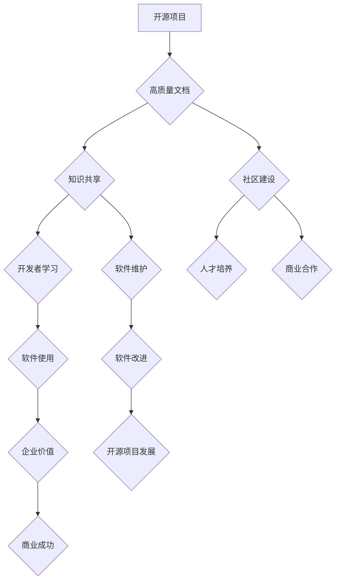

                 

## 开源项目文档的商业价值：策略与实施

> 关键词：开源项目、文档价值、商业策略、实施方案、知识共享、社区建设、品牌影响力、技术支持、人才培养

## 1. 背景介绍

开源软件已经成为现代软件开发不可或缺的一部分，其灵活、可定制和成本效益等优势吸引了越来越多的开发者和企业。然而，开源项目的成功不仅取决于其代码质量，更依赖于完善的文档体系。高质量的开源项目文档不仅能帮助开发者理解和使用软件，还能为企业带来显著的商业价值。

随着开源软件生态系统的蓬勃发展，开源项目文档的重要性日益凸显。企业越来越认识到，高质量的开源项目文档不仅能提升软件的易用性和可维护性，还能增强品牌形象、吸引人才和促进商业合作。

## 2. 核心概念与联系

开源项目文档的核心价值在于知识共享和社区建设。

**2.1  知识共享**

开源项目文档通过公开透明的方式分享软件的知识，包括功能说明、使用指南、API文档、开发指南等。这不仅方便开发者学习和使用软件，还能促进软件的共同维护和改进。

**2.2  社区建设**

高质量的开源项目文档能吸引更多开发者参与到项目中，形成一个活跃的社区。社区成员可以互相帮助、共同解决问题，并为项目贡献代码和文档。

**2.3  商业价值**

开源项目文档为企业带来以下商业价值：

* **提升品牌形象:**  高质量的文档体现了企业的技术实力和对用户体验的重视，从而提升品牌形象和信誉度。
* **吸引人才:**  完善的文档体系能吸引优秀人才加入企业，为企业发展提供人才保障。
* **促进商业合作:**  开源项目文档能帮助企业与其他开发者和企业建立合作关系，共同开发和推广软件。
* **降低开发成本:**  开源项目文档可以帮助企业节省开发成本，因为企业可以利用现有的开源代码和文档进行二次开发。

**Mermaid 流程图**



## 3. 核心算法原理 & 具体操作步骤

开源项目文档的构建并非简单的文字描述，它需要遵循一定的算法原理和操作步骤，才能保证文档的质量和可读性。

### 3.1  算法原理概述

开源项目文档的构建可以看作是一个信息组织和传递的过程。其核心算法原理包括：

* **分层结构:**  将文档按照主题和层次进行组织，方便开发者查找和理解信息。
* **清晰简洁:**  使用简洁明了的语言描述软件的功能和使用方法，避免使用过于专业的术语。
* **示例驱动:**  通过大量的代码示例和使用场景，帮助开发者理解软件的应用方法。
* **交互式体验:**  利用在线工具和平台，提供交互式的文档体验，例如在线代码演示、在线问答等。

### 3.2  算法步骤详解

开源项目文档的构建步骤可以概括为以下几个阶段：

1. **需求分析:**  首先需要对目标用户进行分析，了解他们的技术背景、需求和学习习惯。
2. **内容规划:**  根据需求分析结果，规划文档的主题、结构和内容。
3. **内容创作:**  编写文档内容，并使用清晰简洁的语言和丰富的示例。
4. **版本控制:**  使用版本控制工具管理文档的修改历史，方便版本回滚和协同开发。
5. **测试和发布:**  对文档进行测试和完善，并发布到线上平台。
6. **维护和更新:**  定期维护和更新文档，确保其内容的准确性和时效性。

### 3.3  算法优缺点

开源项目文档的构建算法具有以下优点：

* **可扩展性强:**  文档的结构和内容可以根据需要进行扩展和修改。
* **易于维护:**  使用版本控制工具可以方便地管理文档的修改历史。
* **可重复利用:**  文档的内容可以被其他项目和开发者所使用。

但也存在一些缺点：

* **需要投入时间和精力:**  构建高质量的文档需要投入大量的時間和精力。
* **需要专业技能:**  文档的创作和维护需要一定的专业技能，例如写作、技术文档编写等。
* **难以保证文档的准确性:**  文档的内容可能会随着软件的更新而变得过时。

### 3.4  算法应用领域

开源项目文档的构建算法广泛应用于以下领域：

* **软件开发:**  帮助开发者理解和使用开源软件。
* **教育培训:**  作为教学材料，帮助学生学习软件开发知识。
* **技术文档编写:**  为企业内部的软件和系统编写技术文档。
* **知识管理:**  将企业内部的知识和经验进行文档化，方便知识共享和传承。

## 4. 数学模型和公式 & 详细讲解 & 举例说明

开源项目文档的构建可以抽象为一个信息传递模型，其中文档内容作为信息载体，开发者作为信息接收者。

### 4.1  数学模型构建

我们可以用以下数学模型来描述开源项目文档的构建过程：

```
D = f(U, C, T)
```

其中：

* D 代表文档内容
* U 代表目标用户
* C 代表文档创作团队
* T 代表文档创作工具

### 4.2  公式推导过程

这个模型可以进一步分解为以下几个子模型：

* **用户需求模型:**  

```
U = {N, K, L}
```

其中：

* N 代表用户的技术背景
* K 代表用户的学习习惯
* L 代表用户的具体需求

* **文档创作模型:**

```
C = {W, E, T}
```

其中：

* W 代表文档创作团队的专业技能
* E 代表文档创作团队的经验积累
* T 代表文档创作团队的协作能力

* **文档创作工具模型:**

```
T = {S, P, V}
```

其中：

* S 代表文档创作工具的软件功能
* P 代表文档创作工具的平台特性
* V 代表文档创作工具的版本更新

### 4.3  案例分析与讲解

例如，一个开源项目文档的构建过程可以描述为：

* 目标用户：初学者，技术背景有限，学习习惯偏向于图文并茂的学习方式，需要了解软件的基本功能和使用方法。
* 文档创作团队：由经验丰富的软件工程师和技术文档编写人员组成，具备良好的沟通和协作能力。
* 文档创作工具：使用在线文档平台，支持 Markdown 语法和代码高亮，并提供版本控制和协同编辑功能。

通过以上模型和案例分析，我们可以看到开源项目文档的构建是一个复杂的过程，需要多方面的因素共同作用才能保证文档的质量和可读性。

## 5. 项目实践：代码实例和详细解释说明

为了更好地理解开源项目文档的构建过程，我们以一个简单的开源项目为例，展示其文档的构建过程和代码实现。

### 5.1  开发环境搭建

该项目使用 Python 语言开发，并使用 Sphinx 工具生成文档。

* 安装 Python 环境
* 安装 Sphinx 工具：`pip install sphinx`

### 5.2  源代码详细实现

```python
def greet(name):
  """
  This function greets the person passed in as a parameter.

  Args:
    name: The name of the person to greet.

  Returns:
    A greeting message.
  """
  return f"Hello, {name}!"

if __name__ == "__main__":
  name = input("Enter your name: ")
  print(greet(name))
```

### 5.3  代码解读与分析

这段代码定义了一个名为 `greet` 的函数，该函数接受一个参数 `name`，并返回一个包含该参数的问候语。

* `def greet(name):` 定义了一个名为 `greet` 的函数，并指定了函数的参数 `name`。
* `"""..."""` 是文档字符串，用于描述函数的功能、参数和返回值。
* `return f"Hello, {name}!"` 返回一个包含 `name` 的问候语。
* `if __name__ == "__main__":` 是一个 Python 特定的语句，用于判断脚本是否被直接执行。
* `name = input("Enter your name: ")` 从用户那里获取输入，并将其存储在 `name` 变量中。
* `print(greet(name))` 调用 `greet` 函数，并将用户输入作为参数传递，并打印返回的结果。

### 5.4  运行结果展示

当用户运行这段代码并输入他们的名字时，程序会输出一个包含用户名字的问候语。例如，如果用户输入 "Zen"，程序会输出 "Hello, Zen!"。

## 6. 实际应用场景

开源项目文档在实际应用场景中具有广泛的应用价值。

### 6.1  开源软件社区

开源软件社区是开源项目文档的重要应用场景。高质量的文档可以帮助开发者理解和使用开源软件，并促进社区的活跃度和发展。例如，Linux 内核的文档体系非常完善，为开发者提供了丰富的学习资源和技术支持。

### 6.2  企业内部开发

企业内部开发也需要高质量的文档来支持软件的开发、维护和使用。开源项目文档可以为企业内部开发提供参考和借鉴，帮助企业构建自己的文档体系。

### 6.3  教育培训

开源项目文档可以作为教育培训的教学材料，帮助学生学习软件开发知识和技术文档编写技能。

### 6.4  未来应用展望

随着开源软件生态系统的不断发展，开源项目文档的应用场景将会更加广泛。未来，开源项目文档可能将与人工智能技术结合，提供更智能化的文档搜索、理解和生成功能。

## 7. 工具和资源推荐

### 7.1  学习资源推荐

* **Sphinx 文档生成工具:** https://www.sphinx-doc.org/
* **Read the Docs 在线文档平台:** https://readthedocs.org/
* **GitHub 协同开发平台:** https://github.com/

### 7.2  开发工具推荐

* **Markdown 文档编辑器:** Typora, Obsidian
* **版本控制工具:** Git

### 7.3  相关论文推荐

* **The Importance of Documentation in Open Source Software Projects**
* **A Study on the Impact of Documentation Quality on Open Source Software Adoption**

## 8. 总结：未来发展趋势与挑战

开源项目文档的构建是一个不断发展和完善的过程。

### 8.1  研究成果总结

开源项目文档的构建已经取得了显著的成果，例如 Sphinx 工具的出现和 Read the Docs 平台的搭建，为开源项目文档的创作和发布提供了强大的支持。

### 8.2  未来发展趋势

未来，开源项目文档的发展趋势包括：

* **智能化:**  利用人工智能技术，实现文档的智能搜索、理解和生成。
* **个性化:**  根据用户的需求和学习习惯，提供个性化的文档体验。
* **多语言:**  支持多种语言的文档创作和发布，促进全球开源社区的建设。

### 8.3  面临的挑战

开源项目文档的构建也面临着一些挑战：

* **文档质量:**  保证文档的准确性、完整性和易读性是一个持续的挑战。
* **文档维护:**  随着软件的更新和迭代，文档也需要及时更新和维护。
* **社区参与:**  需要鼓励更多开发者参与到文档的创作和维护中来。

### 8.4  研究展望

未来，我们需要继续研究开源项目文档的构建方法和技术，探索如何利用人工智能技术提升文档的质量和效率，并促进开源社区的建设和发展。

## 9. 附录：常见问题与解答

### 9.1  如何选择合适的文档工具？

选择文档工具需要根据项目的具体需求和团队的习惯进行选择。一些常用的文档工具包括 Sphinx, MkDocs, Read the Docs 等。

### 9.2  如何保证文档的质量？

保证文档质量需要多方面的努力，包括：

* **明确文档目标:**  明确文档的目标读者和目的，并制定相应的文档标准。
* **使用清晰简洁的语言:**  避免使用过于专业的术语，并使用简洁明了的语言描述软件的功能和使用方法。
* **提供丰富的示例:**  通过大量的代码示例和使用场景，帮助开发者理解软件的应用方法。
* **进行文档测试:**  在发布文档之前，需要进行测试和完善，确保文档的准确性和完整性。

### 9.3  如何鼓励开发者参与文档创作？

鼓励开发者参与文档创作需要营造良好的社区氛围，并提供相应的激励机制。例如，可以设立文档贡献奖，并定期举办文档写作比赛等活动。


作者：禅与计算机程序设计艺术 / Zen and the Art of Computer Programming 
<end_of_turn>

