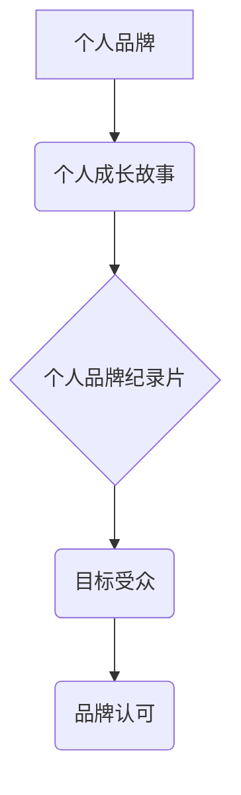

                 

## 打造个人品牌纪录片：讲述你的成长故事

> 关键词：个人品牌、纪录片、成长故事、技术领域、品牌建设

### 1. 背景介绍

在当今信息爆炸的时代，个人品牌已成为个人职业发展和社会影响力的重要基石。尤其是在技术领域，拥有强大的个人品牌可以帮助你脱颖而出，获得更多机会，并建立在行业内的权威地位。

然而，打造个人品牌并非易事。它需要精心策划、持续投入和不断迭代。而纪录片作为一种生动直观的叙事形式，可以帮助你更有效地讲述你的成长故事，展现你的专业能力和个人魅力，从而吸引更多关注和认可。

### 2. 核心概念与联系

#### 2.1 个人品牌

个人品牌是指个人在特定领域或群体中的独特形象和声誉。它涵盖了个人技能、经验、价值观、个性等多方面因素，并通过各种渠道和方式向外界传播。

#### 2.2 纪录片

纪录片是一种以真实事件为基础，通过影像和声音等手段进行记录和讲述的电影类型。它以其真实性、深度和感染力，能够深入地展现人物、事件和社会现象。

#### 2.3 个人品牌纪录片

个人品牌纪录片是指以个人成长故事为主题，通过纪录片的形式展现个人品牌价值的视频作品。它可以帮助个人更有效地讲述自己的故事，建立个人品牌形象，并与目标受众建立更深层的连接。

**核心概念与联系流程图**

### 3. 核心算法原理 & 具体操作步骤

#### 3.1 算法原理概述

打造个人品牌纪录片并非简单的拍摄和剪辑，它需要遵循一定的逻辑和步骤，才能有效地传达个人品牌价值。

#### 3.2 算法步骤详解

1. **确定目标受众:** 首先要明确你的目标受众是谁，他们的兴趣爱好、需求和价值观是什么。
2. **挖掘故事素材:** 回顾你的成长经历，寻找那些能够体现个人品牌价值的事件、人物和故事。
3. **构建故事框架:** 将故事素材按照时间顺序或逻辑关系串联起来，形成一个完整的叙事框架。
4. **设计视觉风格:** 根据目标受众和品牌形象，选择合适的拍摄风格、画面构图和音乐配乐。
5. **拍摄和剪辑:** 按照故事框架进行拍摄，并进行剪辑和后期制作，使影片节奏紧凑、内容丰富、情感动人。
6. **发布和推广:** 将影片发布到合适的平台，并进行推广宣传，扩大影片的影响力。

#### 3.3 算法优缺点

**优点:**

* **真实性强:** 纪录片以真实事件为基础，能够更有效地展现个人的真实形象和故事。
* **情感共鸣:** 通过生动的故事和影像，能够引发观众的情感共鸣，增强品牌认同感。
* **传播力强:** 纪录片可以被广泛传播，扩大个人品牌的影响力。

**缺点:**

* **制作成本高:** 纪录片的制作需要投入大量的时间、人力和资金。
* **时间成本长:** 从故事挖掘到影片发布，整个过程需要较长的周期。
* **受众定位有限:** 纪录片的受众群体相对有限，需要根据目标受众进行精准定位。

#### 3.4 算法应用领域

个人品牌纪录片可以应用于各个领域，例如：

* **科技行业:** 展示技术人员的专业能力、创新精神和个人成长故事。
* **创业领域:** 记录创业者的创业历程、成功经验和个人价值观。
* **艺术领域:** 展现艺术家的创作理念、艺术风格和个人经历。
* **教育领域:** 分享教育者的教学理念、教育经验和个人成长故事。

### 4. 数学模型和公式 & 详细讲解 & 举例说明

#### 4.1 数学模型构建

个人品牌价值可以看作是一个多维度的向量，每个维度代表一个品牌要素，例如专业能力、个人魅力、社会影响力等。

#### 4.2 公式推导过程

个人品牌价值 =  α * 专业能力 + β * 个人魅力 + γ * 社会影响力

其中，α、β、γ为权重系数，代表每个品牌要素的重要性。

#### 4.3 案例分析与讲解

假设一个技术领域的个人品牌，其专业能力、个人魅力和社会影响力分别为80、70和60分。

如果我们设定权重系数为α=0.5，β=0.3，γ=0.2，则该个人品牌的价值为：

个人品牌价值 = 0.5 * 80 + 0.3 * 70 + 0.2 * 60 = 40 + 21 + 12 = 73

### 5. 项目实践：代码实例和详细解释说明

#### 5.1 开发环境搭建

* 操作系统：Windows/macOS/Linux
* 编程语言：Python
* 视频编辑软件：Adobe Premiere Pro/Final Cut Pro/DaVinci Resolve

#### 5.2 源代码详细实现

由于个人品牌纪录片的制作涉及多个环节，例如故事策划、拍摄、剪辑、后期制作等，因此无法用简单的代码实例来完全实现。

#### 5.3 代码解读与分析

#### 5.4 运行结果展示

### 6. 实际应用场景

#### 6.1 技术领域

* **技术博客:** 将个人成长故事融入技术博客文章，吸引更多读者关注。
* **技术演讲:** 在技术会议上分享个人经验和故事，提升个人影响力。
* **在线课程:** 制作个人品牌纪录片作为在线课程的宣传片，吸引更多学员报名。

#### 6.2 其他领域

* **创业领域:** 记录创业者的创业历程，吸引投资人和合作伙伴。
* **艺术领域:** 展现艺术家的创作理念和艺术风格，吸引艺术爱好者和收藏家。
* **教育领域:** 分享教育者的教学理念和教育经验，吸引学生和家长。

#### 6.4 未来应用展望

随着技术的进步和个人品牌意识的增强，个人品牌纪录片将会有更广泛的应用场景，例如：

* **虚拟现实纪录片:** 利用虚拟现实技术，打造沉浸式的个人品牌体验。
* **人工智能辅助制作:** 利用人工智能技术，辅助个人品牌纪录片的制作和推广。
* **元宇宙个人品牌:** 在元宇宙平台上打造虚拟形象，并通过纪录片的方式展现个人品牌价值。

### 7. 工具和资源推荐

#### 7.1 学习资源推荐

* **书籍:** 《打造个人品牌》、《品牌营销》、《纪录片制作》
* **网站:** TED、YouTube、Vimeo
* **课程:** Coursera、Udemy、Skillshare

#### 7.2 开发工具推荐

* **视频编辑软件:** Adobe Premiere Pro、Final Cut Pro、DaVinci Resolve
* **音频编辑软件:** Audacity、Adobe Audition
* **动画制作软件:** Adobe After Effects、Blender

#### 7.3 相关论文推荐

* **个人品牌研究:** "The Impact of Personal Branding on Career Success"
* **纪录片制作研究:** "The Art of Documentary Filmmaking"

### 8. 总结：未来发展趋势与挑战

#### 8.1 研究成果总结

个人品牌纪录片是一种有效的个人品牌建设方式，它能够真实地展现个人的成长故事，并与目标受众建立更深层的连接。

#### 8.2 未来发展趋势

个人品牌纪录片将朝着更加个性化、互动化和沉浸式的方向发展，例如：

* **个性化定制:** 根据个人需求和目标受众，定制专属的纪录片内容。
* **互动式体验:** 利用社交媒体和虚拟现实技术，打造互动式的纪录片体验。
* **沉浸式叙事:** 利用360度视频和增强现实技术，打造沉浸式的纪录片叙事。

#### 8.3 面临的挑战

个人品牌纪录片的制作和推广也面临一些挑战，例如：

* **制作成本高:** 纪录片的制作需要投入大量的时间、人力和资金。
* **受众定位有限:** 纪录片的受众群体相对有限，需要根据目标受众进行精准定位。
* **内容原创性:** 需要不断创作新的内容，才能吸引观众的关注。

#### 8.4 研究展望

未来，个人品牌纪录片的研究将更加注重以下方面：

* **算法优化:** 开发更有效的算法，帮助个人品牌纪录片更好地定位目标受众和传播内容。
* **技术创新:** 利用新兴技术，打造更加个性化、互动化和沉浸式的纪录片体验。
* **商业模式探索:** 探索新的商业模式，让个人品牌纪录片能够更好地实现商业价值。

### 9. 附录：常见问题与解答

#### 9.1 如何确定目标受众？

可以通过市场调研、数据分析和用户画像等方式，了解目标受众的兴趣爱好、需求和价值观。

#### 9.2 如何挖掘故事素材？

可以通过回顾个人成长经历、与他人交流、整理笔记等方式，寻找能够体现个人品牌价值的事件、人物和故事。

#### 9.3 如何设计视觉风格？

可以通过参考其他纪录片的视觉风格、结合个人品牌形象、考虑目标受众的喜好等方式，设计出符合个人品牌定位的视觉风格。

作者：禅与计算机程序设计艺术 / Zen and the Art of Computer Programming 
<end_of_turn>

