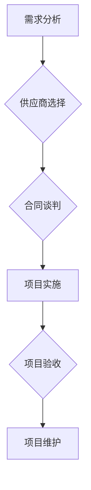

                 

## 技术外包：从接单到建立团队

> 关键词：技术外包、团队建设、项目管理、软件开发、沟通技巧、风险控制、质量保证

### 1. 背景介绍

在当今快速发展的科技时代，技术外包已成为许多企业获取专业技能和加速项目交付的重要方式。无论是初创公司还是大型企业，都可能需要借助外部力量来完成特定的技术任务。技术外包可以帮助企业节省成本、提高效率、专注于核心业务，并获得更广泛的技术资源。

然而，技术外包并非一帆风顺。成功的技术外包项目需要精心策划、有效的沟通和严格的项目管理。从接单到建立高效的团队，每一个环节都至关重要。本文将深入探讨技术外包的各个方面，从接单到团队建设，提供实用建议和经验分享，帮助企业更好地理解和实施技术外包项目。

### 2. 核心概念与联系

**2.1 技术外包的概念**

技术外包是指企业将部分或全部的技术工作委托给专业的第三方公司或个人完成。这可以包括软件开发、网站设计、数据分析、云计算等各种技术领域。

**2.2 技术外包的类型**

技术外包可以分为多种类型，包括：

* **项目外包:** 企业将一个特定的技术项目委托给第三方完成，例如开发一个新的应用程序或网站。
* **时间外包:** 企业根据需要，聘请第三方人员提供特定时间段的技术服务，例如临时开发人员或顾问。
* **资源外包:** 企业租赁第三方公司的技术资源，例如服务器、数据库或软件平台。

**2.3 技术外包的优势和挑战**

**优势:**

* **降低成本:** 通过外包，企业可以避免招聘、培训和管理内部技术人员的成本。
* **提高效率:** 外包公司通常拥有专业的技术团队和成熟的开发流程，可以更快地完成项目。
* **获得专业技能:** 企业可以获得特定领域的技术专家，弥补自身的技术短板。
* **专注核心业务:** 企业可以将精力集中在核心业务上，而不是分散在技术开发上。

**挑战:**

* **沟通障碍:** 跨文化和语言的差异可能导致沟通障碍。
* **质量控制:** 需要确保外包公司能够提供高质量的成果。
* **知识产权保护:** 需要明确保护企业的知识产权。
* **风险控制:** 需要评估和控制技术外包带来的风险。

**2.4 技术外包的流程**

技术外包的流程通常包括以下几个步骤：

1. **需求分析:** 明确项目需求和目标。
2. **供应商选择:** 选择合适的第三方公司或个人。
3. **合同谈判:** 确定项目范围、价格、时间节点和责任划分。
4. **项目实施:** 外包公司根据合同进行项目开发和交付。
5. **项目验收:** 企业对项目成果进行验收和评估。
6. **项目维护:** 项目完成后，可能需要进行后续维护和支持。

**2.5 Mermaid 流程图**

### 3. 核心算法原理 & 具体操作步骤

**3.1 算法原理概述**

技术外包项目管理的核心算法是基于项目管理方法论，例如敏捷开发、瀑布模型等。这些方法论提供了一套规范的流程和工具，帮助项目经理有效地规划、执行和控制项目。

**3.2 算法步骤详解**

1. **项目计划:** 确定项目目标、范围、时间节点、资源需求和风险评估。
2. **团队组建:** 根据项目需求，组建专业的技术团队，包括开发人员、测试人员、项目经理等。
3. **任务分配:** 将项目分解成多个子任务，并分配给不同的团队成员。
4. **进度跟踪:** 定期跟踪项目进度，并及时调整计划和资源分配。
5. **沟通协调:** 建立有效的沟通机制，确保项目团队成员之间、以及与客户之间的信息畅通。
6. **质量控制:** 实施严格的质量控制流程，确保项目成果符合客户需求和质量标准。
7. **风险管理:** 识别和评估项目风险，并制定相应的应对措施。

**3.3 算法优缺点**

**优点:**

* **提高项目效率:** 提供了规范的流程和工具，可以有效地管理项目进度和资源。
* **降低项目风险:** 通过风险评估和控制，可以降低项目失败的可能性。
* **提高项目质量:** 通过质量控制流程，可以确保项目成果符合客户需求和质量标准。

**缺点:**

* **流程僵化:** 一些项目管理方法论过于僵化，难以适应快速变化的项目环境。
* **沟通成本:** 项目管理需要大量的沟通和协调，可能会增加沟通成本。
* **团队依赖:** 项目管理依赖于团队成员的配合和执行力，如果团队成员缺乏经验或动力，可能会影响项目进度和质量。

**3.4 算法应用领域**

项目管理算法广泛应用于各种技术外包项目，例如软件开发、网站设计、数据分析、云计算等。

### 4. 数学模型和公式 & 详细讲解 & 举例说明

**4.1 数学模型构建**

技术外包项目管理可以利用数学模型来分析和预测项目进度、成本和风险。例如，可以使用甘特图来表示项目进度，并利用PERT网络分析法来评估项目关键路径和风险。

**4.2 公式推导过程**

PERT网络分析法中常用的公式包括：

* **期望时间:**  Te = Σ(Ti * Pi)
* **标准差:** σ = √(Σ(Ti - Te)^2 * Pi)

其中，Ti表示活动i的估计时间，Pi表示活动i发生的概率。

**4.3 案例分析与讲解**

假设一个技术外包项目包含三个活动，分别为需求分析、系统开发和测试。每个活动的期望时间和概率如下：

* 活动1（需求分析）：Te1 = 10天，Pi1 = 0.8
* 活动2（系统开发）：Te2 = 20天，Pi2 = 0.7
* 活动3（测试）：Te3 = 5天，Pi3 = 0.9

可以使用上述公式计算项目的期望时间和标准差。

### 5. 项目实践：代码实例和详细解释说明

**5.1 开发环境搭建**

技术外包项目需要搭建合适的开发环境，包括硬件、软件和网络环境。

**5.2 源代码详细实现**

具体代码实现取决于项目的具体需求和技术栈。

**5.3 代码解读与分析**

代码解读需要分析代码结构、逻辑流程和算法实现。

**5.4 运行结果展示**

运行结果展示需要验证代码的功能性和性能。

### 6. 实际应用场景

技术外包广泛应用于各种行业和领域，例如：

* **软件开发:** 企业可以外包软件开发任务，例如开发移动应用程序、网站或企业内部系统。
* **网站设计:** 企业可以外包网站设计和开发任务，例如创建电子商务网站、博客网站或企业宣传网站。
* **数据分析:** 企业可以外包数据分析任务，例如分析用户行为、市场趋势或财务数据。
* **云计算:** 企业可以外包云计算服务，例如虚拟服务器、存储服务或数据库服务。

**6.4 未来应用展望**

随着人工智能、大数据和云计算技术的不断发展，技术外包的应用场景将更加广泛。例如，企业可以利用人工智能技术进行代码自动生成、测试和部署，提高开发效率和降低成本。

### 7. 工具和资源推荐

**7.1 学习资源推荐**

* **书籍:** 《敏捷软件开发》、《项目管理实战》、《技术外包指南》
* **在线课程:** Coursera、Udemy、edX等平台提供各种项目管理和技术外包相关的在线课程。

**7.2 开发工具推荐**

* **版本控制系统:** Git、SVN
* **项目管理工具:** Jira、Trello、Asana
* **代码编辑器:** Visual Studio Code、Sublime Text、Atom

**7.3 相关论文推荐**

* **项目管理方法论:** 《敏捷软件开发宣言》、《项目管理知识体系》
* **技术外包风险管理:** 《技术外包风险评估与控制》、《技术外包合同管理》

### 8. 总结：未来发展趋势与挑战

**8.1 研究成果总结**

技术外包已成为一种成熟的商业模式，并取得了显著的成果。项目管理方法论和工具不断完善，技术外包的效率和质量不断提高。

**8.2 未来发展趋势**

* **人工智能驱动的技术外包:** 人工智能技术将被广泛应用于技术外包领域，例如代码自动生成、测试和部署。
* **云计算平台化技术外包:** 云计算平台将提供更加灵活和便捷的技术外包服务。
* **全球化技术外包:** 技术外包将更加全球化，企业可以从全球范围内的优秀人才库中选择合适的合作伙伴。

**8.3 面临的挑战**

* **人才短缺:** 技术外包行业面临着人才短缺的挑战，需要不断培养和吸引优秀人才。
* **知识产权保护:** 需要加强知识产权保护机制，确保企业的知识产权安全。
* **跨文化沟通:** 需要克服跨文化和语言的障碍，建立有效的沟通机制。

**8.4 研究展望**

未来研究方向包括：

* **人工智能技术在技术外包中的应用研究**
* **技术外包风险管理和控制机制研究**
* **技术外包合同管理和法律规范研究**

### 9. 附录：常见问题与解答

**9.1 如何选择合适的技术外包公司？**

选择技术外包公司需要考虑以下因素：

* 公司的经验和实力
* 技术团队的专业水平
* 项目管理能力
* 沟通和合作方式
* 价格和服务条款

**9.2 如何确保技术外包项目的质量？**

确保技术外包项目的质量需要采取以下措施：

* 明确项目需求和质量标准
* 建立有效的沟通机制
* 实施严格的质量控制流程
* 定期跟踪项目进度和质量

**9.3 如何控制技术外包项目的风险？**

控制技术外包项目的风险需要采取以下措施：

* 识别和评估项目风险
* 制定相应的风险应对措施
* 建立有效的风险监控机制

**9.4 如何与技术外包公司建立良好的合作关系？**

建立良好的合作关系需要：

* 坦诚沟通
* 互相尊重
* 共同目标
* 持续改进

作者：禅与计算机程序设计艺术 / Zen and the Art of Computer Programming 

<end_of_turn>

