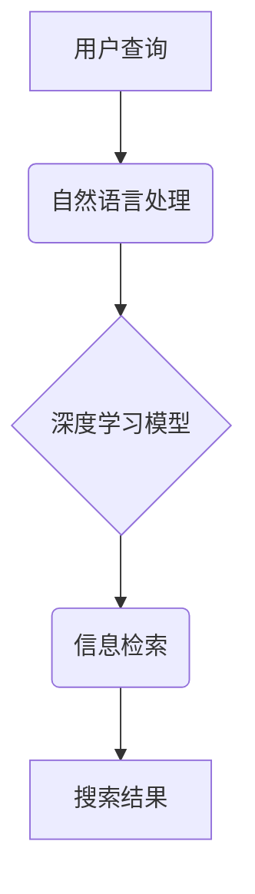

                 

## 搜索引擎的深度学习算法优化

> 关键词：深度学习、搜索引擎、自然语言处理、BERT、Transformer、信息检索、推荐系统

## 1. 背景介绍

搜索引擎是互联网时代最重要的信息获取工具之一，其核心功能是根据用户查询关键词，从海量网页中找到最相关、最权威的信息并进行排序展示。传统的搜索引擎主要依赖于基于关键词的匹配算法，例如TF-IDF和PageRank，但随着互联网信息的爆炸式增长和用户搜索行为的复杂化，这些算法逐渐难以满足用户的需求。

深度学习技术的兴起为搜索引擎的算法优化带来了新的机遇。深度学习模型能够学习到更复杂的语义关系和用户意图，从而提高搜索结果的准确性和相关性。近年来，深度学习在搜索引擎领域取得了显著的进展，例如Google的BERT、微软的Turing、百度的神一言等模型，这些模型在信息检索、推荐系统等多个方面都展现出了强大的能力。

## 2. 核心概念与联系

**2.1 核心概念**

* **信息检索 (Information Retrieval):**  是指从一个集合中找到与用户查询相关的文档的过程。
* **自然语言处理 (Natural Language Processing):**  是指让计算机能够理解、处理和生成人类语言的过程。
* **深度学习 (Deep Learning):**  是一种机器学习的子领域，利用多层神经网络来学习数据的复杂特征。

**2.2 架构关系**



**2.3 联系解释**

用户输入的查询首先经过自然语言处理，将文本转换为计算机可理解的格式。然后，深度学习模型会对处理后的查询进行分析，学习到查询的语义和意图。最后，模型会根据学习到的知识，从海量网页中检索出与查询最相关的文档，并将其排序展示给用户。

## 3. 核心算法原理 & 具体操作步骤

**3.1 算法原理概述**

深度学习在搜索引擎领域主要应用于以下几个方面：

* **查询理解:**  利用深度学习模型学习用户查询的语义和意图，例如识别关键词、理解上下文关系、识别用户搜索的类型等。
* **文档表示:**  将文档转换为向量表示，以便于模型进行语义比较和排序。
* **排序优化:**  利用深度学习模型学习用户点击行为和反馈信息，优化搜索结果的排序策略。

**3.2 算法步骤详解**

以BERT模型为例，其在搜索引擎中的应用步骤如下：

1. **预训练:**  BERT模型在大量的文本数据上进行预训练，学习到语言的语法和语义知识。
2. **微调:**  将预训练好的BERT模型微调到特定的搜索任务上，例如信息检索、问答系统等。
3. **查询编码:**  将用户查询转换为BERT模型可理解的格式，并将其编码为一个向量表示。
4. **文档编码:**  将搜索结果中的文档也编码为向量表示。
5. **相似度计算:**  计算查询向量和文档向量的相似度，例如使用余弦相似度。
6. **排序:**  根据相似度排序搜索结果，并将排序结果展示给用户。

**3.3 算法优缺点**

**优点:**

* **语义理解能力强:**  深度学习模型能够学习到更复杂的语义关系，提高搜索结果的准确性和相关性。
* **可扩展性强:**  深度学习模型可以很容易地扩展到更大的数据集和更复杂的搜索任务。
* **个性化推荐:**  深度学习模型可以根据用户的历史搜索行为和偏好进行个性化推荐。

**缺点:**

* **训练成本高:**  深度学习模型的训练需要大量的计算资源和时间。
* **数据依赖性强:**  深度学习模型的性能取决于训练数据的质量和数量。
* **可解释性差:**  深度学习模型的决策过程比较复杂，难以解释其背后的逻辑。

**3.4 算法应用领域**

* **信息检索:**  搜索引擎、问答系统、知识图谱构建等。
* **推荐系统:**  商品推荐、内容推荐、用户画像等。
* **自然语言理解:**  文本分类、情感分析、机器翻译等。

## 4. 数学模型和公式 & 详细讲解 & 举例说明

**4.1 数学模型构建**

深度学习模型通常采用多层神经网络结构，每个神经元接收多个输入，并通过激活函数进行处理，最终输出一个结果。

**4.2 公式推导过程**

深度学习模型的训练过程是通过反向传播算法来进行的。反向传播算法的核心思想是通过计算损失函数的梯度，来更新模型的参数，使得模型的预测结果与真实结果之间的误差最小化。

**损失函数 (Loss Function):**  用于衡量模型预测结果与真实结果之间的误差。常见的损失函数包括均方误差 (MSE)、交叉熵损失 (Cross-Entropy Loss) 等。

**梯度 (Gradient):**  表示损失函数对模型参数的偏导数，用于指示模型参数需要调整的方向和幅度。

**更新规则 (Update Rule):**  用于更新模型参数，常用的更新规则包括梯度下降法 (Gradient Descent)、动量法 (Momentum) 等。

**4.3 案例分析与讲解**

以BERT模型为例，其损失函数主要包括以下两部分：

* **Masked Language Modeling (MLM) Loss:**  用于训练模型预测被掩盖的单词。
* **Next Sentence Prediction (NSP) Loss:**  用于训练模型预测两个句子是否相邻。

通过训练这两个任务，BERT模型能够学习到语言的语法和语义知识。

## 5. 项目实践：代码实例和详细解释说明

**5.1 开发环境搭建**

* Python 3.6+
* TensorFlow/PyTorch
* CUDA Toolkit (可选)

**5.2 源代码详细实现**

由于篇幅限制，这里只提供一个简单的BERT模型的代码示例，完整的代码实现可以参考HuggingFace Transformers库。

```python
from transformers import BertModel, BertTokenizer

# 加载预训练模型和词典
model_name = "bert-base-uncased"
tokenizer = BertTokenizer.from_pretrained(model_name)
model = BertModel.from_pretrained(model_name)

# 对文本进行编码
text = "This is a sample text."
encoded_input = tokenizer(text, return_tensors="pt")

# 将编码后的文本输入模型
outputs = model(**encoded_input)

# 获取模型输出
last_hidden_states = outputs.last_hidden_state
```

**5.3 代码解读与分析**

* 首先，我们加载预训练好的BERT模型和词典。
* 然后，我们对输入文本进行编码，将文本转换为模型可理解的格式。
* 最后，我们将编码后的文本输入模型，并获取模型输出。

**5.4 运行结果展示**

模型输出包含了每个词的隐藏状态，这些隐藏状态包含了词的语义信息。我们可以使用这些隐藏状态来进行后续的分析和处理，例如文本分类、情感分析等。

## 6. 实际应用场景

**6.1 搜索引擎优化**

深度学习模型可以用于优化搜索引擎的查询理解、文档表示和排序算法，从而提高搜索结果的准确性和相关性。例如，BERT模型可以帮助搜索引擎更好地理解用户的查询意图，并找到更相关的搜索结果。

**6.2 个性化推荐系统**

深度学习模型可以根据用户的历史搜索行为和偏好进行个性化推荐，例如推荐用户可能感兴趣的商品、内容或服务。

**6.3 问答系统**

深度学习模型可以用于构建问答系统，例如回答用户提出的问题，并提供相关的信息。

**6.4 未来应用展望**

随着深度学习技术的不断发展，其在搜索引擎领域的应用将会更加广泛和深入。例如，未来可能出现以下应用场景：

* **多模态搜索:**  支持图像、音频、视频等多种类型的搜索。
* **实时搜索:**  能够实时更新搜索结果，并提供最新的信息。
* **对话式搜索:**  支持用户与搜索引擎进行自然语言对话，并获取更精准的搜索结果。

## 7. 工具和资源推荐

**7.1 学习资源推荐**

* **书籍:**  《深度学习》 (Ian Goodfellow, Yoshua Bengio, Aaron Courville)
* **课程:**  Stanford CS224N: Natural Language Processing with Deep Learning
* **在线平台:**  Coursera, edX, Udacity

**7.2 开发工具推荐**

* **TensorFlow:**  开源深度学习框架
* **PyTorch:**  开源深度学习框架
* **HuggingFace Transformers:**  预训练模型库

**7.3 相关论文推荐**

* BERT: Pre-training of Deep Bidirectional Transformers for Language Understanding (Devlin et al., 2018)
* Transformer: Attention Is All You Need (Vaswani et al., 2017)

## 8. 总结：未来发展趋势与挑战

**8.1 研究成果总结**

深度学习在搜索引擎领域取得了显著的进展，例如BERT、Turing等模型在信息检索、推荐系统等多个方面都展现出了强大的能力。

**8.2 未来发展趋势**

* **多模态搜索:**  支持图像、音频、视频等多种类型的搜索。
* **实时搜索:**  能够实时更新搜索结果，并提供最新的信息。
* **对话式搜索:**  支持用户与搜索引擎进行自然语言对话，并获取更精准的搜索结果。

**8.3 面临的挑战**

* **数据依赖性强:**  深度学习模型的性能取决于训练数据的质量和数量。
* **可解释性差:**  深度学习模型的决策过程比较复杂，难以解释其背后的逻辑。
* **计算资源需求高:**  深度学习模型的训练需要大量的计算资源和时间。

**8.4 研究展望**

未来研究方向包括：

* 开发更有效的深度学习算法，提高模型的性能和效率。
* 探索新的数据来源和训练方法，缓解数据依赖性问题。
* 研究深度学习模型的可解释性，使其决策过程更加透明。


## 9. 附录：常见问题与解答

**9.1 如何选择合适的深度学习模型？**

选择合适的深度学习模型取决于具体的应用场景和数据特点。例如，对于文本分类任务，BERT模型通常是一个不错的选择；对于图像识别任务，CNN模型通常是一个更好的选择。

**9.2 如何训练深度学习模型？**

训练深度学习模型需要准备训练数据、选择合适的模型架构、设置训练参数、训练模型并评估模型性能。

**9.3 如何评估深度学习模型的性能？**

常用的评估指标包括准确率、召回率、F1-score等。


作者：禅与计算机程序设计艺术 / Zen and the Art of Computer Programming 
<end_of_turn>

