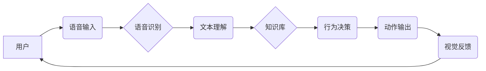

                 

## 智能宠物陪伴机器人创业：科技宠物的新定义

> 关键词：智能宠物、陪伴机器人、人工智能、自然语言处理、计算机视觉、情感计算、机器学习、创业

### 1. 背景介绍

近年来，随着人工智能、物联网等技术的快速发展，智能宠物陪伴机器人逐渐成为一个备受关注的领域。人们对陪伴的需求日益增长，而传统宠物的养护成本高、时间成本大等问题也越来越受到重视。智能宠物陪伴机器人凭借其智能化、个性化、可定制化的特点，为人们提供了一种全新的陪伴方式，成为未来宠物行业发展的重要趋势。

**1.1 市场现状与发展趋势**

全球智能宠物市场规模正在快速增长，预计未来几年将持续保持高增长态势。主要原因包括：

* **人口老龄化:**  随着全球人口老龄化，老年人对陪伴的需求日益强烈，智能宠物可以有效缓解老年人孤独感和寂寞感。
* **都市化进程:**  都市生活节奏快，人们的时间越来越碎片化，智能宠物可以作为一种低维护的陪伴方式，满足人们对陪伴的需求。
* **科技进步:**  人工智能、物联网等技术的快速发展，为智能宠物的研发提供了强大的技术支撑。

**1.2 智能宠物的优势**

智能宠物陪伴机器人相比传统宠物具有以下优势：

* **可定制化:**  用户可以根据自己的喜好定制智能宠物的外观、性格、功能等。
* **低维护成本:**  智能宠物不需要喂食、散步、打扫卫生等日常维护，成本低廉。
* **安全可靠:**  智能宠物不会生病、咬人、破坏家具等，安全性高。
* **情感陪伴:**  智能宠物可以通过语音、表情、动作等方式与用户进行互动，提供情感陪伴。

### 2. 核心概念与联系

智能宠物陪伴机器人是一个复杂的系统，涉及多个核心概念和技术，包括人工智能、自然语言处理、计算机视觉、情感计算等。

**2.1 核心概念**

* **人工智能 (AI):**  人工智能是使机器能够像人类一样学习、推理和解决问题的能力。智能宠物的核心功能，如语音识别、图像识别、情感识别等，都依赖于人工智能技术。
* **自然语言处理 (NLP):**  自然语言处理是让计算机能够理解和处理人类语言的技术。智能宠物可以通过NLP技术理解用户的语音指令，并进行相应的回应。
* **计算机视觉 (CV):**  计算机视觉是让计算机能够“看”和理解图像的技术。智能宠物可以通过CV技术识别用户的表情、动作等，并做出相应的反应。
* **情感计算 (EC):**  情感计算是让计算机能够识别和理解人类情感的技术。智能宠物可以通过EC技术识别用户的语气、表情等，并根据用户的感受调整自己的行为。

**2.2 架构图**



### 3. 核心算法原理 & 具体操作步骤

**3.1 算法原理概述**

智能宠物陪伴机器人的核心算法包括语音识别、文本理解、知识库构建、行为决策和动作输出等。这些算法的目的是让智能宠物能够理解用户的需求，并做出相应的回应。

**3.2 算法步骤详解**

* **语音识别:**  利用深度学习算法将语音信号转换为文本。
* **文本理解:**  利用自然语言处理技术分析文本内容，识别用户的意图和需求。
* **知识库构建:**  构建一个包含宠物知识、对话模板、情感模型等信息的知识库。
* **行为决策:**  根据文本理解结果和知识库信息，做出相应的行为决策。
* **动作输出:**  将行为决策转换为具体的动作，例如语音合成、表情变化、动作模拟等。

**3.3 算法优缺点**

* **优点:**  智能化程度高，能够理解和回应用户的复杂指令。
* **缺点:**  算法复杂，需要大量的训练数据和计算资源。

**3.4 算法应用领域**

* **智能宠物陪伴机器人:**  提供情感陪伴、互动娱乐等功能。
* **教育机器人:**  辅助教学、提高学习兴趣。
* **医疗机器人:**  陪伴病人、提供心理支持。

### 4. 数学模型和公式 & 详细讲解 & 举例说明

**4.1 数学模型构建**

智能宠物的交互行为可以建模为一个马尔可夫决策过程 (MDP)。

* 状态空间: 智能宠物的当前状态，包括其位置、表情、动作等。
* 动作空间: 智能宠物可以执行的动作，例如说话、移动、改变表情等。
* 转移概率: 从一个状态到另一个状态的概率，取决于智能宠物执行的动作和环境因素。
* 奖励函数:  评估智能宠物行为的好坏，例如用户满意度、任务完成度等。

**4.2 公式推导过程**

MDP的目标是找到一个策略，使得智能宠物在长期交互过程中获得最大的总奖励。可以使用动态规划算法或强化学习算法来求解MDP问题。

**4.3 案例分析与讲解**

假设智能宠物需要学习如何与用户进行对话。可以将对话过程建模为一个MDP，其中状态空间是对话的当前内容，动作空间是智能宠物可以回复的句子。通过训练，智能宠物可以学习到一个策略，使得其回复的句子能够最大化用户的满意度。

### 5. 项目实践：代码实例和详细解释说明

**5.1 开发环境搭建**

* 操作系统: Ubuntu 20.04
* 编程语言: Python 3.8
* 深度学习框架: TensorFlow 2.0
* 自然语言处理库: NLTK, spaCy

**5.2 源代码详细实现**

```python
# 语音识别模块
import speech_recognition as sr

def recognize_speech():
    r = sr.Recognizer()
    with sr.Microphone() as source:
        print("请说话:")
        audio = r.listen(source)
    try:
        text = r.recognize_google(audio)
        print("您说的是:", text)
        return text
    except sr.UnknownValueError:
        print("无法识别语音")
    except sr.RequestError as e:
        print("无法连接到语音识别服务; {0}".format(e))

# 文本理解模块
import nltk

def understand_text(text):
    # 使用NLTK进行文本分析，识别用户意图
    # ...

# 行为决策模块
def decide_action(intent):
    # 根据用户意图，选择相应的行为
    # ...

# 动作输出模块
def execute_action(action):
    # 执行相应的动作，例如语音合成、表情变化
    # ...

# 主程序
if __name__ == "__main__":
    while True:
        text = recognize_speech()
        if text:
            intent = understand_text(text)
            action = decide_action(intent)
            execute_action(action)
```

**5.3 代码解读与分析**

* 语音识别模块使用`speech_recognition`库进行语音识别。
* 文本理解模块使用`nltk`库进行文本分析，识别用户意图。
* 行为决策模块根据用户意图选择相应的行为。
* 动作输出模块执行相应的动作，例如语音合成、表情变化。

**5.4 运行结果展示**

当用户对着智能宠物说话时，智能宠物会识别用户的语音，理解用户的意图，并做出相应的回应。例如，如果用户说“你好”，智能宠物会说“你好，请问有什么可以帮你的吗？”。

### 6. 实际应用场景

**6.1 家庭陪伴:**

智能宠物可以陪伴老人、儿童、单身人士等，提供情感支持和互动娱乐。

**6.2 教育辅助:**

智能宠物可以作为教育工具，帮助儿童学习语言、数学、科学等知识。

**6.3 医疗康复:**

智能宠物可以陪伴病人，帮助他们缓解压力、提高情绪，促进康复。

**6.4 未来应用展望**

随着人工智能技术的不断发展，智能宠物陪伴机器人将拥有更强大的功能和更智能的交互能力。未来，智能宠物将能够：

* 更准确地理解用户的意图和情感。
* 提供更个性化的陪伴和服务。
* 与其他智能设备进行协同工作，构建更智能的家庭生态系统。

### 7. 工具和资源推荐

**7.1 学习资源推荐**

* **书籍:**
    * 《深度学习》
    * 《自然语言处理与情感分析》
    * 《机器人学原理》
* **在线课程:**
    * Coursera: 深度学习、自然语言处理
    * edX: 机器人学、人工智能

**7.2 开发工具推荐**

* **编程语言:** Python
* **深度学习框架:** TensorFlow, PyTorch
* **自然语言处理库:** NLTK, spaCy
* **机器人平台:** ROS

**7.3 相关论文推荐**

* **情感计算:**
    * Towards a Computational Theory of Emotion
    * A Survey of Emotion Recognition Methods:
* **机器人交互:**
    * Socially Intelligent Robots: A Survey
    * Human-Robot Interaction: A Survey

### 8. 总结：未来发展趋势与挑战

**8.1 研究成果总结**

智能宠物陪伴机器人是一个充满潜力的领域，近年来取得了显著的进展。人工智能、自然语言处理、计算机视觉等技术的不断发展，为智能宠物的研发提供了强大的技术支撑。

**8.2 未来发展趋势**

未来，智能宠物陪伴机器人将朝着以下方向发展：

* **更智能的交互:**  智能宠物将能够更准确地理解用户的意图和情感，提供更个性化的陪伴和服务。
* **更丰富的功能:**  智能宠物将拥有更多功能，例如游戏、教育、医疗等。
* **更广泛的应用场景:**  智能宠物将应用于更多领域，例如家庭、教育、医疗、娱乐等。

**8.3 面临的挑战**

智能宠物陪伴机器人还面临一些挑战：

* **算法复杂性:**  智能宠物的交互行为需要复杂的算法模型，训练和部署这些模型需要大量的计算资源和数据。
* **伦理问题:**  智能宠物的开发和应用需要考虑伦理问题，例如隐私保护、数据安全、人机关系等。
* **成本问题:**  目前，智能宠物的成本较高，需要进一步降低成本才能普及。

**8.4 研究展望**

未来，我们需要继续研究智能宠物陪伴机器人的核心技术，例如人工智能、自然语言处理、计算机视觉等，并解决其面临的挑战，推动智能宠物陪伴机器人产业的健康发展。


### 9. 附录：常见问题与解答

**9.1 智能宠物可以理解我的所有语言吗？**

目前，智能宠物主要支持英语和中文，其他语言的支持有限。

**9.2 智能宠物会泄露我的隐私吗？**

我们非常重视用户隐私保护，智能宠物不会泄露用户的个人信息。

**9.3 如何与智能宠物进行互动？**

您可以通过语音、表情、动作等方式与智能宠物进行互动。

**9.4 智能宠物需要充电吗？**

是的，智能宠物需要定期充电。

**9.5 智能宠物可以学习新的技能吗？**

是的，智能宠物可以通过训练学习新的技能。


作者：禅与计算机程序设计艺术 / Zen and the Art of Computer Programming 
<end_of_turn>

